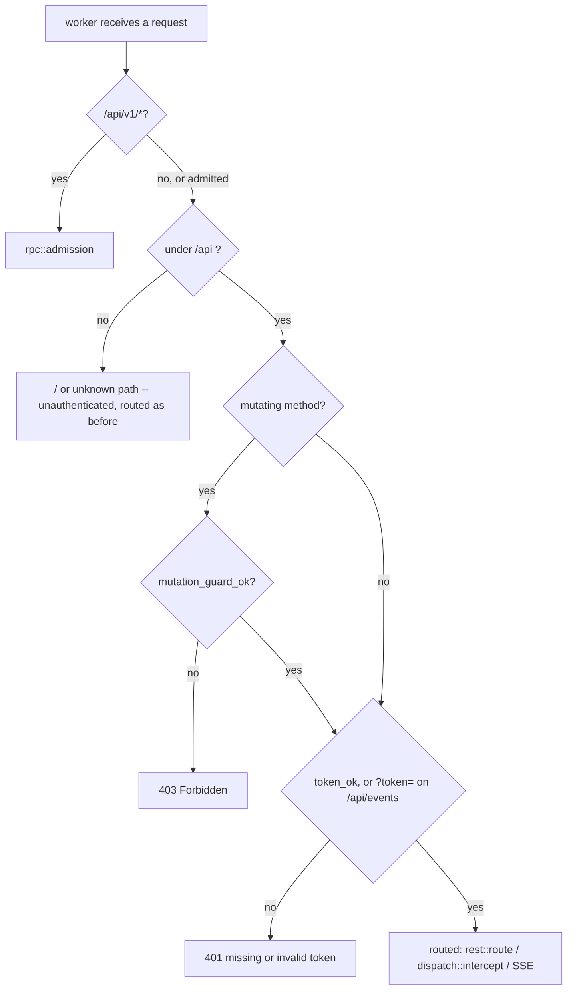

# Dashboard authorization: the daemon token, dashboard-wide

Design of record for **SH-187** (child of epic **SH-112**), the follow-up SH-50's own
authorization review filed rather than fixed (finding F1,
[`dashboard-dispatch.md`](dashboard-dispatch.md#the-authorization-review-ac3)). Written
after implementation, the same reason `dashboard-dispatch.md` gives for the same choice:
sharper against the actual code than against a proposal for it.

## Context: the gap F1 named

`mutation_guard_ok` (`src/api/http.rs`) was, before this story, the only thing standing
between a request and every dashboard mutation. It checks two things:

1. An `X-Storyhook` header is present — defeats a plain cross-origin `fetch`/`<form>`,
   since a custom header forces a CORS preflight this server never answers with
   `Access-Control-Allow-*`.
2. `Host` resolves to loopback or an entry in `trusted_hosts` (the bound tailnet
   IP/MagicDNS FQDN, `src/daemon/tailnet.rs`) — defeats DNS rebinding.

Neither is authentication. Both defend against a *browser* being tricked into sending a
request on a victim's behalf. Anything that can set two headers directly —
`curl -H 'X-Storyhook: 1' -H 'Host: <trusted-host>' ...` from any peer the tailnet lets
reach the dashboard's bound IP — passes both with no credential at all. The dashboard
binds the machine's Tailscale IP as well as loopback, so the reachable set was every
tailnet peer, not "this machine's own browser."

Read routes had no gate of any kind. `GET /api/repos/{id}/data` returns every story in
a project; `GET /api/events` streams every live change.

`/api/v1/*` already had the answer: loopback-only *and* token-authenticated
(`src/api/rpc.rs`). SH-50 generalized the token half to a second, tailnet-reachable
endpoint — `.../dispatch`, since a browser-reachable process-spawning endpoint could
not ship behind the ordinary guard alone — and filed the wider question as this story
rather than deciding it as a side effect of dispatch's own scope.

## The decision

Three shapes were weighed:

| Option | Verdict |
|---|---|
| Token on the whole write surface, both listeners (dispatch's own shape, generalized) | **Taken.** Still stands for writes; **superseded for reads on loopback by SH-250** — see "As built — SH-250" below |
| Token off-loopback only, writes stay free on loopback | Rejected — a `STORYHOOK_WEB_TRUSTED_HOSTS` reverse proxy connects *over loopback*, so a proxied caller would be exempt from the one thing standing between it and every mutation. **Still rejected after SH-250**, which exempts loopback *reads* only and for a second reason recorded below |
| Loopback-only writes, tailnet strictly read-only | Rejected — contradicts SH-50's shipped decision that dispatch from the phone over Tailscale stays possible; two contradictory policies for one dashboard |
| Accept the gap, close it as decided-not-fixed | Rejected — SH-188 shows a browser-reachable mutation already reaches `sh -c` through event hooks; the real blast radius is process execution, not field edits, and that is not a risk profile "editing some tracked stories" describes |

**Reads were brought into scope too**, beyond what F1's own text asked about: a tailnet
peer reading every story in every project, or subscribing to the live-change feed, is a
real disclosure and the review found no principled reason a read deserves less
protection than a write on the same surface. Accepted cost, stated plainly: the
dashboard now asks for `story daemon token` on first load in every new browser tab, and
again after every daemon restart (the token rotates then). `localStorage` — which would
survive a restart and remove the re-prompt — was considered and rejected on the same
disclosure grounds SH-50's F5 already established for the dispatch-only token: no new
stored-credential surface beyond what already existed for any other data the dashboard
renders.

## The design

### One gate, ahead of routing

`src/api/admission.rs`, modeled on `rpc::admission`, called from `worker()`
(`src/daemon/serve.rs`) immediately after it — before the SSE branch, before
`dispatch::intercept`, and before a single byte of the request body is read. Same
reasoning `rpc::admission` documents for the identical placement (SH-172): an
unauthenticated peer must never reach even a read, let alone make the daemon wait on a
body it has no right to send.



| Condition | Result |
|---|---|
| not under `/api` (i.e. `GET /`) | admitted — the SPA shell bootstraps the token prompt |
| `/api/v1/*` | left to `rpc::admission`, unchanged |
| mutating method, guard fails | **403** |
| token missing or wrong (header, or `?token=` on `/api/events` only) | **401** |
| otherwise | admitted |

**Guard before token, on a mutation** — matching `dispatch::intercept`'s own order,
established when that endpoint was the only one that needed a token at all. The guard
is a cheap, publicly documented requirement (this repo's `README.md` names both
headers); checking it first means a naive drive-by browser request — which cannot set
either header to begin with — never reaches the constant-time token comparison. A
caller sophisticated enough to set both headers correctly still needs the actual
secret. A read carries no guard requirement (none ever gated reads — the confusion
attacks the guard defeats need a mutating request to matter), so a read is admitted on
the token alone.

**`GET /api/events` accepts `?token=`, and only that route does.** `EventSource` cannot
set headers, so without a query-parameter path the live-update feed could never
authenticate at all. Confining it to one route bounds the exposure a URL-borne
credential carries (proxy logs, browser history) to the one caller with no
alternative; the daemon itself never logs a request URL or path (`serve.rs`'s only
`eprintln!`s are startup banners and a panic notice), and its log file is 0600
regardless.

**`dispatch::intercept` keeps its own copy of both checks**, unchanged, rather than
being simplified to rely on the gate above. Deliberate: the two checks now run twice
for a dispatch request (harmless — string comparisons, one of them constant-time and
cheap regardless), and `dispatch.rs`'s own extensive test suite — including unit tests
that call `intercept` directly, bypassing `worker()` entirely — keeps exercising real
logic instead of a path `admission.rs` had already made unreachable.

### Fail closed on an unconfigured token

`rpc::token_ok` now refuses an empty `expected` unconditionally, even against an
equally-empty offered header — `constant_time_eq("", "")` alone would call that a
match. Every real caller passes a token `lifecycle::mint_token`/`bind_and_serve` minted,
which is never empty, so an empty `expected` only ever means "unconfigured," and an
unconfigured token must never accidentally authenticate anything now that this function
gates the whole surface rather than one endpoint.

This is what makes the test seam safe to flip: `bind_and_serve`
(`#[cfg(feature = "test-seam")]`, the harness's own entry point — never production,
which goes through `daemon::lifecycle::run`) used to pass an empty token, correct only
because nothing it served checked one. It now mints a real one per server and reports
it to its caller alongside the bound address, so every test fixture that talks to a
harness-started dashboard carries a genuine, per-server credential.

### The client

`src/web_dashboard.html`'s token handling generalizes from dispatch-only
(`storyhookDispatchToken`) to dashboard-wide (`storyhookDaemonToken`), still
`sessionStorage` — gone when the tab closes, per SH-50's F5. `api()` attaches the token
to every request and, on a 401, clears it, opens the modal, and — if the user saves a
fresh one — transparently retries the exact same request once, so a stale token costs
a caller latency, not a bespoke error path. The app's own bootstrap sequence is held
back until a token is on hand, prompting once at load rather than firing a guaranteed-
to-fail first request.

## Residuals, named rather than silently inherited

- ~~**`STORYHOOK_WEB_TRUSTED_HOSTS` (the reverse-proxy allowlist) is exercised by no test
  anywhere**, before this story or after it.~~ **Closed by SH-250**, which made the
  variable load-bearing and gave it `tests/proxy_trusted_hosts.rs` — the first test
  anywhere to assert it changes any outcome at all.
- **The token is not per-user.** One value, minted per daemon lifetime, shared by every
  browser tab and every machine on the tailnet that has it. Multi-user attribution was
  never a goal of this design and remains out of scope.
- **A tailnet peer who has the token can still do everything a legitimate browser
  tab can.** This story closes "no credential at all," not "the credential is scoped
  too broadly" — the latter would need per-session or per-user tokens, a materially
  larger design this story does not attempt.

## Verification

`make test` is the gate. Coverage, by layer:

- **Unit** (`src/api/admission.rs`): the guard-before-token ordering on a mutation, a
  read admitted on the token alone, the query-token path scoped to `/api/events` only,
  a wrong token, and an unconfigured (empty) token admitting nothing even against an
  equally-empty offered header. `src/api/rpc.rs` gains a dedicated regression test for
  the `token_ok` hardening.
- **Integration** (`tests/web_test.rs`): a tokenless read and a tokenless mutation
  (each paired with a positive control, proving the rejection means what it claims to
  mean), the root path staying reachable with no token, the SSE stream's header and
  query-token paths, and a tailnet-listener member of the existing tailnet-dual-bind
  family. `tests/tailnet_rebind.rs`'s late-bind mutation now carries the token.
- **End-to-end** (`e2e/specs/dispatch.spec.ts`, and a shared `e2e/specs/support.ts`
  every other spec now uses): the token modal now gates the app's bootstrap, not just
  a Dispatch click — proven by letting one spec drive it for real and seeding it via
  `page.addInitScript` in every other spec, the same way an already-authenticated
  browser tab would carry it in.

## Follow-up

None filed. The residuals above are accepted trade-offs, not deferred work with a
concrete next step — a future story revisiting per-user tokens or the reverse-proxy
path would need its own design, not a continuation of this one.

## As built — SH-188 resolved as a side effect, one gap in coverage closed

SH-50's authorization review filed two findings out of the same investigation: **F1**
("the guard is not authentication," this story) and **F2** ("event hooks already let a
browser-reachable mutation run `sh -c`," SH-188 — `dashboard-dispatch.md`'s own
authorization review section). Landing this story's admission gate closes F2 too:
`POST /api/repos/{id}/story/{id}/move` cannot reach `Ctx::fire_hook` → `sh -c` without
clearing `admission::admission` first, on every listener, same as any other mutation.

That closure was a side effect, not a design goal of this story, and the gap it left is
narrow but real: this story's own test suite (`tests/web_test.rs`'s `served()`/`seed()`
fixture) suppresses event hooks entirely (`Ctx::no_hooks(true)`) to keep fixtures fast
and hermetic, and `tests/event_hooks.rs` never drives a request through the daemon's
HTTP/admission layer at all. So while the *mechanism* that closes F2 is fully covered by
this story's tests, the *specific reachability chain* F2 named — a hook actually
configured, actually reachable from a browser mutation, actually blocked without a
credential — had never been exercised end to end. SH-188 added exactly that:
`tests/web_test.rs::a_tokenless_move_cannot_reach_the_projects_event_hook`, configuring
a real `[hooks.on_state_change]` hook that writes a sentinel file, asserting a tokenless
`POST .../move` is refused (401) *and* the sentinel never appears, and that the same
request with the token both succeeds and fires the hook. No new mechanism, no new
route — one test closing one specific coverage gap this story's own scope didn't reach.

SH-188's second, unrelated question — whether `fire_hook`'s timeout should kill the
hook's whole process group instead of just the `sh` leader — is untouched by this story
and was declined on its own terms; see `dashboard-dispatch.md`'s F2 entry.

## As built — SH-250 supersedes the both-listeners decision, for reads only

SH-250 revisited the first row of "The decision" above. **A loopback *read* no longer
requires the token.** Everything else in this document stands: every mutation, every
dispatch, and the whole tailnet listener are unchanged, and `/api/v1/*` was never in
scope.

| Option | Verdict |
|---|---|
| Token on the whole write surface, both listeners | **Stands.** A mutation needs the token on every listener, loopback included |
| Token on the whole *read* surface, both listeners | **Superseded by SH-250** — a loopback read is admitted with no token when all six conjuncts below hold |
| Token off-loopback only, *writes* stay free on loopback | **Still rejected**, and for a sharper reason than this document first gave — see "Why reads and not writes" |

### The rule: six conjuncts, and one governing principle

A request is admitted without a token only when **all** of these hold. Any one failing
means the token is required exactly as before.

1. It arrived on the **loopback listener** — the bind-time flag, the one signal in this
   list that no caller supplies.
2. The method is affirmatively **`Get | Head`**. Not `!mutating(method)`: `Put`,
   `Options` and `Other(_)` all parse (`daemon::http1::Method`) and none of them are
   `mutating` (`api::rest::mutating`), so a future `PUT` route would have inherited the
   exemption silently.
3. **`Host` is a loopback literal**, via `host_is_loopback` — a *new* predicate that
   never consults the allowlist. `host_is_trusted` also matches `trusted_hosts`, and a
   configured proxy hostname answering "is this caller local?" is precisely the hazard.
4. **No** `X-Forwarded-For`, `X-Forwarded-Host`, `X-Forwarded-Proto`, `Forwarded` or
   `X-Real-IP`.
5. **No reverse-proxy allowlist is configured** — `TrustedHosts::behind_a_proxy()`.
6. The path is neither `/api/v1/*` nor `.../dispatch`.

**The governing principle, which is what keeps this rule safe to edit:** *an
attacker-supplied header may only withhold trust, never confer it.* The single
affirmative grant is conjunct 1. Conjuncts 3, 4 and 5 can only turn the exemption **off**,
so forging one of those headers refuses nobody but the forger. Any future change that
turns a request-supplied input into a *granting* condition breaks the rule, however
reasonable it looks in isolation.

### Why reads and not writes

This document's original rejection of "writes stay free on loopback" gave one reason — the
reverse-proxy-over-loopback hazard. SH-250's review found a second and larger one by
enumerating what the write surface actually reaches:

- `POST /api/repos` registers an **arbitrary caller-named filesystem path** as a project.
- `DELETE /api/repos/{id}` destroys a project, taking its own `confirm` in-band.
- `POST .../story/{id}/move` reaches `Command::new("sh").args(["-c", …])` through a
  configured event hook — the SH-188/F2 chain this document's own "As built" section
  records.

No rule expressible at the HTTP layer can be certain a loopback connection is local (see
the residual below). So the question is not "will the rule ever be wrong" but "what does
being wrong cost." Reads-only caps that at disclosure; reads-and-writes would cap it at
process execution.

### Why the allowlist needed a type

Conjunct 5 cannot be answered from the flat `Vec<String>` this daemon used to carry.
`trusted_hosts` merged two provenances — hosts earned by a *bind* (the tailnet IPv4 and
MagicDNS FQDN) and hosts named by `STORYHOOK_WEB_TRUSTED_HOSTS` — and kept no record of
which was which. A `trusted_hosts.is_empty()` test of conjunct 5 would therefore be wrong
twice: it would withhold the exemption from **every Tailscale machine**, where the vector
is non-empty with zero proxies configured; and it would **change answer mid-daemon-life**,
because the late tailnet rebind (SH-146) extends that same vector at runtime.

`TrustedHosts { bound, proxy }` (`src/api/http.rs`) splits them, with private fields, one
environment-reading constructor (`for_daemon`) that both the production daemon and the
test seam call, and an `add_bound` that reaches the `bound` half only — so
`behind_a_proxy()` is immutable for the daemon's whole life *by construction*. Same shape
and same reason as `TailnetBind`: the value is the evidence.

It also removed a duplicated merge. `serve()` and `lifecycle::run` each wrote the same two
lines, and forgetting them used to cost only proxy trust. After SH-250 the same omission
would silently **grant** the exemption, so the merge now happens once, inside `serve()`.

### Why `dispatch::intercept` was not told

`worker` runs `admission::admission` and then `dispatch::intercept`, sequentially, and
each independently returns a refusal or falls through. The composition is therefore an
**AND**, and a laxer upstream gate can never loosen a stricter downstream one — monotone
by construction, not by discipline. So the exemption is threaded into `admission` only and
`intercept` keeps its unconditional `token_ok`. Conjunct 6 is belt-and-braces on top of
that: it stops `admission` from *admitting* something `intercept` will then refuse, which
would be merely confusing today and load-bearing the day someone acts on this document's
earlier note that `intercept`'s duplicate checks look redundant.

### The client

`web_dashboard.html` stopped prompting proactively. Its bootstrap used to read

```js
if (getDaemonToken()) { startApp(); } else { openTokenModal(startApp); }
```

which was right while *every* route required a credential — one prompt beat a
guaranteed-to-fail round trip. It is wrong now: on loopback the first request succeeds, so
the modal was the only thing still standing between a fresh tab and a rendered dashboard.
`startApp()` now runs unconditionally and the prompt is purely reactive, through the 401
handling `api()` and `fetchData()` already had. Stated cost: on the tailnet listener the
user pays one failed round trip before the modal appears.

### Residual, accepted rather than overlooked

**A bare `nginx proxy_pass http://127.0.0.1:PORT` defeats conjuncts 3, 4 and 5 at once.**
nginx's default `proxy_set_header Host $proxy_host` rewrites `Host` to the upstream
address — a loopback literal — it adds no forwarding headers unless told to, and its
operator has no reason to set `STORYHOOK_WEB_TRUSTED_HOSTS`, because `host_is_trusted`
already passes loopback literals unconditionally. Such a deployment exposes the read
surface to whoever can reach the proxy.

Nothing at the HTTP layer can distinguish that proxy from a local client. This is recorded
as **unclosable at this layer, not as an oversight**: it is bounded to disclosure by the
reads-only rule, announced in the daemon's startup banner, and stated in the README's
reverse-proxy section — where `STORYHOOK_WEB_TRUSTED_HOSTS` is now described as
security-load-bearing rather than a convenience. An operator who sets it, as that section
now instructs, is fully protected.

The previously-recorded residual that **`STORYHOOK_WEB_TRUSTED_HOSTS` is exercised by no
test anywhere** is closed by `tests/proxy_trusted_hosts.rs`, which is also the first test
anywhere to assert the variable changes any outcome at all.

### Filed, not fixed

- **SH-251** — hand the dashboard its token from `story web open`, so nothing ever
  prompts. Two of the three reviewers argued that if this ships, the read exemption may no
  longer earn its keep; that reassessment belongs to that story.
- **SH-253** — `loopback` is a label on a listener, not a fact about the peer. It is
  stamped beside a hardcoded `127.0.0.1` bind, while `STORYHOOK_DAEMON_ADDR` already
  parses a full `SocketAddr` whose IP is silently discarded. Conjunct 1 is the affirmative
  grant this whole rule rests on, so that label becoming wrong is now a security failure
  rather than a curiosity.
