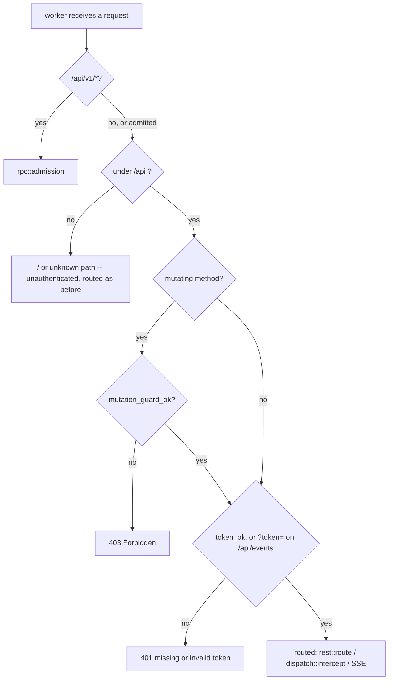

# Dashboard authorization: the daemon token, dashboard-wide

Design of record for **SH-187** (child of epic **SH-112**), the follow-up SH-50's own
authorization review filed rather than fixed (finding F1,
[`dashboard-dispatch.md`](dashboard-dispatch.md#the-authorization-review-ac3)). Written
after implementation, the same reason `dashboard-dispatch.md` gives for the same choice:
sharper against the actual code than against a proposal for it.

## Context: the gap F1 named

`mutation_guard_ok` (`src/api/http.rs`) was, before this story, the only thing standing
between a request and every dashboard mutation. It checks two things:

1. An `X-Storyhook` header is present — defeats a plain cross-origin `fetch`/`<form>`,
   since a custom header forces a CORS preflight this server never answers with
   `Access-Control-Allow-*`.
2. `Host` resolves to loopback or an entry in `trusted_hosts` (the bound tailnet
   IP/MagicDNS FQDN, `src/daemon/tailnet.rs`) — defeats DNS rebinding.

Neither is authentication. Both defend against a *browser* being tricked into sending a
request on a victim's behalf. Anything that can set two headers directly —
`curl -H 'X-Storyhook: 1' -H 'Host: <trusted-host>' ...` from any peer the tailnet lets
reach the dashboard's bound IP — passes both with no credential at all. The dashboard
binds the machine's Tailscale IP as well as loopback, so the reachable set was every
tailnet peer, not "this machine's own browser."

Read routes had no gate of any kind. `GET /api/repos/{id}/data` returns every story in
a project; `GET /api/events` streams every live change.

`/api/v1/*` already had the answer: loopback-only *and* token-authenticated
(`src/api/rpc.rs`). SH-50 generalized the token half to a second, tailnet-reachable
endpoint — `.../dispatch`, since a browser-reachable process-spawning endpoint could
not ship behind the ordinary guard alone — and filed the wider question as this story
rather than deciding it as a side effect of dispatch's own scope.

## The decision

Three shapes were weighed:

| Option | Verdict |
|---|---|
| Token on the whole write surface, both listeners (dispatch's own shape, generalized) | **Taken** |
| Token off-loopback only, writes stay free on loopback | Rejected — a `STORYHOOK_WEB_TRUSTED_HOSTS` reverse proxy connects *over loopback*, so a proxied caller would be exempt from the one thing standing between it and every mutation |
| Loopback-only writes, tailnet strictly read-only | Rejected — contradicts SH-50's shipped decision that dispatch from the phone over Tailscale stays possible; two contradictory policies for one dashboard |
| Accept the gap, close it as decided-not-fixed | Rejected — SH-188 shows a browser-reachable mutation already reaches `sh -c` through event hooks; the real blast radius is process execution, not field edits, and that is not a risk profile "editing some tracked stories" describes |

**Reads were brought into scope too**, beyond what F1's own text asked about: a tailnet
peer reading every story in every project, or subscribing to the live-change feed, is a
real disclosure and the review found no principled reason a read deserves less
protection than a write on the same surface. Accepted cost, stated plainly: the
dashboard now asks for `story daemon token` on first load in every new browser tab, and
again after every daemon restart (the token rotates then). `localStorage` — which would
survive a restart and remove the re-prompt — was considered and rejected on the same
disclosure grounds SH-50's F5 already established for the dispatch-only token: no new
stored-credential surface beyond what already existed for any other data the dashboard
renders.

## The design

### One gate, ahead of routing

`src/api/admission.rs`, modeled on `rpc::admission`, called from `worker()`
(`src/daemon/serve.rs`) immediately after it — before the SSE branch, before
`dispatch::intercept`, and before a single byte of the request body is read. Same
reasoning `rpc::admission` documents for the identical placement (SH-172): an
unauthenticated peer must never reach even a read, let alone make the daemon wait on a
body it has no right to send.

| Condition | Result |
|---|---|
| not under `/api` (i.e. `GET /`) | admitted — the SPA shell bootstraps the token prompt |
| `/api/v1/*` | left to `rpc::admission`, unchanged |
| mutating method, guard fails | **403** |
| token missing or wrong (header, or `?token=` on `/api/events` only) | **401** |
| otherwise | admitted |

**Guard before token, on a mutation** — matching `dispatch::intercept`'s own order,
established when that endpoint was the only one that needed a token at all. The guard
is a cheap, publicly documented requirement (this repo's `README.md` names both
headers); checking it first means a naive drive-by browser request — which cannot set
either header to begin with — never reaches the constant-time token comparison. A
caller sophisticated enough to set both headers correctly still needs the actual
secret. A read carries no guard requirement (none ever gated reads — the confusion
attacks the guard defeats need a mutating request to matter), so a read is admitted on
the token alone.

**`GET /api/events` accepts `?token=`, and only that route does.** `EventSource` cannot
set headers, so without a query-parameter path the live-update feed could never
authenticate at all. Confining it to one route bounds the exposure a URL-borne
credential carries (proxy logs, browser history) to the one caller with no
alternative; the daemon itself never logs a request URL or path (`serve.rs`'s only
`eprintln!`s are startup banners and a panic notice), and its log file is 0600
regardless.

**`dispatch::intercept` keeps its own copy of both checks**, unchanged, rather than
being simplified to rely on the gate above. Deliberate: the two checks now run twice
for a dispatch request (harmless — string comparisons, one of them constant-time and
cheap regardless), and `dispatch.rs`'s own extensive test suite — including unit tests
that call `intercept` directly, bypassing `worker()` entirely — keeps exercising real
logic instead of a path `admission.rs` had already made unreachable.

### Fail closed on an unconfigured token

`rpc::token_ok` now refuses an empty `expected` unconditionally, even against an
equally-empty offered header — `constant_time_eq("", "")` alone would call that a
match. Every real caller passes a token `lifecycle::mint_token`/`bind_and_serve` minted,
which is never empty, so an empty `expected` only ever means "unconfigured," and an
unconfigured token must never accidentally authenticate anything now that this function
gates the whole surface rather than one endpoint.

This is what makes the test seam safe to flip: `bind_and_serve`
(`#[cfg(feature = "test-seam")]`, the harness's own entry point — never production,
which goes through `daemon::lifecycle::run`) used to pass an empty token, correct only
because nothing it served checked one. It now mints a real one per server and reports
it to its caller alongside the bound address, so every test fixture that talks to a
harness-started dashboard carries a genuine, per-server credential.

### The client

`src/web_dashboard.html`'s token handling generalizes from dispatch-only
(`storyhookDispatchToken`) to dashboard-wide (`storyhookDaemonToken`), still
`sessionStorage` — gone when the tab closes, per SH-50's F5. `api()` attaches the token
to every request and, on a 401, clears it, opens the modal, and — if the user saves a
fresh one — transparently retries the exact same request once, so a stale token costs
a caller latency, not a bespoke error path. The app's own bootstrap sequence is held
back until a token is on hand, prompting once at load rather than firing a guaranteed-
to-fail first request.

## Residuals, named rather than silently inherited

- **`STORYHOOK_WEB_TRUSTED_HOSTS` (the reverse-proxy allowlist) is exercised by no test
  anywhere**, before this story or after it. A proxied caller must now forward the
  token like any other caller — this story does not make that path worse, but does not
  add coverage for it either.
- **The token is not per-user.** One value, minted per daemon lifetime, shared by every
  browser tab and every machine on the tailnet that has it. Multi-user attribution was
  never a goal of this design and remains out of scope.
- **A tailnet peer who has the token can still do everything a legitimate browser
  tab can.** This story closes "no credential at all," not "the credential is scoped
  too broadly" — the latter would need per-session or per-user tokens, a materially
  larger design this story does not attempt.

## Verification

`make test` is the gate. Coverage, by layer:

- **Unit** (`src/api/admission.rs`): the guard-before-token ordering on a mutation, a
  read admitted on the token alone, the query-token path scoped to `/api/events` only,
  a wrong token, and an unconfigured (empty) token admitting nothing even against an
  equally-empty offered header. `src/api/rpc.rs` gains a dedicated regression test for
  the `token_ok` hardening.
- **Integration** (`tests/web_test.rs`): a tokenless read and a tokenless mutation
  (each paired with a positive control, proving the rejection means what it claims to
  mean), the root path staying reachable with no token, the SSE stream's header and
  query-token paths, and a tailnet-listener member of the existing tailnet-dual-bind
  family. `tests/tailnet_rebind.rs`'s late-bind mutation now carries the token.
- **End-to-end** (`e2e/specs/dispatch.spec.ts`, and a shared `e2e/specs/support.ts`
  every other spec now uses): the token modal now gates the app's bootstrap, not just
  a Dispatch click — proven by letting one spec drive it for real and seeding it via
  `page.addInitScript` in every other spec, the same way an already-authenticated
  browser tab would carry it in.

## Follow-up

None filed. The residuals above are accepted trade-offs, not deferred work with a
concrete next step — a future story revisiting per-user tokens or the reverse-proxy
path would need its own design, not a continuation of this one.
