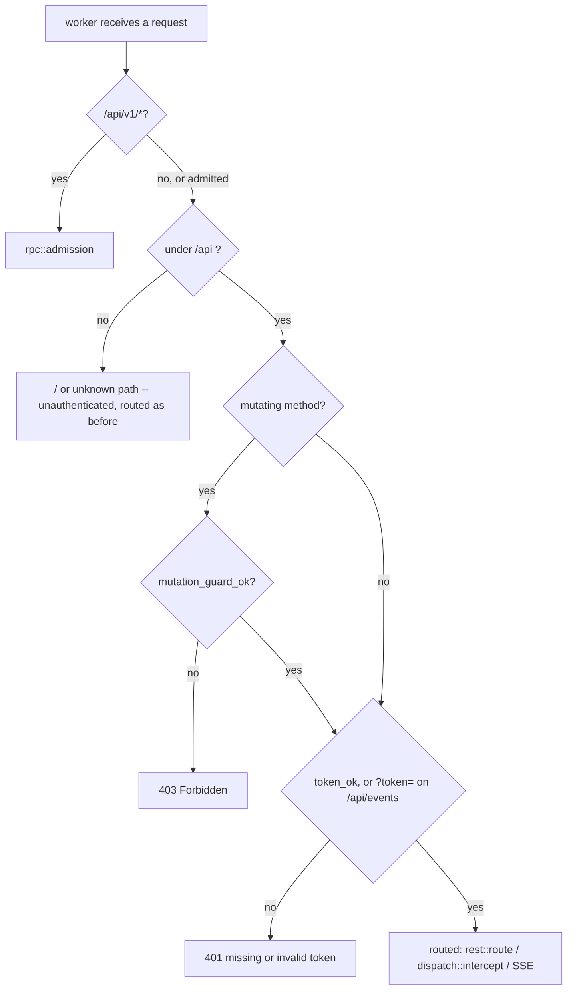

# Dashboard authorization: the daemon token, dashboard-wide

Design of record for **SH-187** (child of epic **SH-112**), the follow-up SH-50's own
authorization review filed rather than fixed (finding F1,
[`dashboard-dispatch.md`](dashboard-dispatch.md#the-authorization-review-ac3)). Written
after implementation, the same reason `dashboard-dispatch.md` gives for the same choice:
sharper against the actual code than against a proposal for it.

## Context: the gap F1 named

`mutation_guard_ok` (`src/api/http.rs`) was, before this story, the only thing standing
between a request and every dashboard mutation. It checks two things:

1. An `X-Storyhook` header is present — defeats a plain cross-origin `fetch`/`<form>`,
   since a custom header forces a CORS preflight this server never answers with
   `Access-Control-Allow-*`.
2. `Host` resolves to loopback or an entry in `trusted_hosts` (the bound tailnet
   IP/MagicDNS FQDN, `src/daemon/tailnet.rs`) — defeats DNS rebinding.

Neither is authentication. Both defend against a *browser* being tricked into sending a
request on a victim's behalf. Anything that can set two headers directly —
`curl -H 'X-Storyhook: 1' -H 'Host: <trusted-host>' ...` from any peer the tailnet lets
reach the dashboard's bound IP — passes both with no credential at all. The dashboard
binds the machine's Tailscale IP as well as loopback, so the reachable set was every
tailnet peer, not "this machine's own browser."

Read routes had no gate of any kind. `GET /api/repos/{id}/data` returns every story in
a project; `GET /api/events` streams every live change.

`/api/v1/*` already had the answer: loopback-only *and* token-authenticated
(`src/api/rpc.rs`). SH-50 generalized the token half to a second, tailnet-reachable
endpoint — `.../dispatch`, since a browser-reachable process-spawning endpoint could
not ship behind the ordinary guard alone — and filed the wider question as this story
rather than deciding it as a side effect of dispatch's own scope.

## The decision

Three shapes were weighed:

| Option | Verdict |
|---|---|
| Token on the whole write surface, both listeners (dispatch's own shape, generalized) | **Taken.** Still stands for writes; **superseded for reads on loopback by SH-250** — see "As built — SH-250" below |
| Token off-loopback only, writes stay free on loopback | Rejected — a `STORYHOOK_WEB_TRUSTED_HOSTS` reverse proxy connects *over loopback*, so a proxied caller would be exempt from the one thing standing between it and every mutation. **Still rejected after SH-250**, which exempts loopback *reads* only and for a second reason recorded below |
| Loopback-only writes, tailnet strictly read-only | Rejected — contradicts SH-50's shipped decision that dispatch from the phone over Tailscale stays possible; two contradictory policies for one dashboard |
| Accept the gap, close it as decided-not-fixed | Rejected — SH-188 shows a browser-reachable mutation already reaches `sh -c` through event hooks; the real blast radius is process execution, not field edits, and that is not a risk profile "editing some tracked stories" describes |

**Reads were brought into scope too**, beyond what F1's own text asked about: a tailnet
peer reading every story in every project, or subscribing to the live-change feed, is a
real disclosure and the review found no principled reason a read deserves less
protection than a write on the same surface. Accepted cost, stated plainly: the
dashboard now asks for `story daemon token` on first load in every new browser tab, and
again after every daemon restart (the token rotates then). `localStorage` — which would
survive a restart and remove the re-prompt — was considered and rejected on the same
disclosure grounds SH-50's F5 already established for the dispatch-only token: no new
stored-credential surface beyond what already existed for any other data the dashboard
renders.

## The design

### One gate, ahead of routing

`src/api/admission.rs`, modeled on `rpc::admission`, called from `worker()`
(`src/daemon/serve.rs`) immediately after it — before the SSE branch, before
`dispatch::intercept`, and before a single byte of the request body is read. Same
reasoning `rpc::admission` documents for the identical placement (SH-172): an
unauthenticated peer must never reach even a read, let alone make the daemon wait on a
body it has no right to send.



| Condition | Result |
|---|---|
| not under `/api` (i.e. `GET /`) | admitted — the SPA shell bootstraps the token prompt |
| `/api/v1/*` | left to `rpc::admission`, unchanged |
| mutating method, guard fails | **403** |
| token missing or wrong (header, or `?token=` on `/api/events` only) | **401** |
| otherwise | admitted |

**Guard before token, on a mutation** — matching `dispatch::intercept`'s own order,
established when that endpoint was the only one that needed a token at all. The guard
is a cheap, publicly documented requirement (this repo's `README.md` names both
headers); checking it first means a naive drive-by browser request — which cannot set
either header to begin with — never reaches the constant-time token comparison. A
caller sophisticated enough to set both headers correctly still needs the actual
secret. A read carries no guard requirement (none ever gated reads — the confusion
attacks the guard defeats need a mutating request to matter), so a read is admitted on
the token alone.

**`GET /api/events` accepts `?token=`, and only that route does.** `EventSource` cannot
set headers, so without a query-parameter path the live-update feed could never
authenticate at all. Confining it to one route bounds the exposure a URL-borne
credential carries (proxy logs, browser history) to the one caller with no
alternative; the daemon itself never logs a request URL or path (`serve.rs`'s only
`eprintln!`s are startup banners and a panic notice), and its log file is 0600
regardless.

**`dispatch::intercept` keeps its own copy of both checks**, unchanged, rather than
being simplified to rely on the gate above. Deliberate: the two checks now run twice
for a dispatch request (harmless — string comparisons, one of them constant-time and
cheap regardless), and `dispatch.rs`'s own extensive test suite — including unit tests
that call `intercept` directly, bypassing `worker()` entirely — keeps exercising real
logic instead of a path `admission.rs` had already made unreachable.

### Fail closed on an unconfigured token

`rpc::token_ok` now refuses an empty `expected` unconditionally, even against an
equally-empty offered header — `constant_time_eq("", "")` alone would call that a
match. Every real caller passes a token `lifecycle::mint_token`/`bind_and_serve` minted,
which is never empty, so an empty `expected` only ever means "unconfigured," and an
unconfigured token must never accidentally authenticate anything now that this function
gates the whole surface rather than one endpoint.

This is what makes the test seam safe to flip: `bind_and_serve`
(`#[cfg(feature = "test-seam")]`, the harness's own entry point — never production,
which goes through `daemon::lifecycle::run`) used to pass an empty token, correct only
because nothing it served checked one. It now mints a real one per server and reports
it to its caller alongside the bound address, so every test fixture that talks to a
harness-started dashboard carries a genuine, per-server credential.

### The client

`src/web_dashboard.html`'s token handling generalizes from dispatch-only
(`storyhookDispatchToken`) to dashboard-wide (`storyhookDaemonToken`), still
`sessionStorage` — gone when the tab closes, per SH-50's F5. `api()` attaches the token
to every request and, on a 401, clears it, opens the modal, and — if the user saves a
fresh one — transparently retries the exact same request once, so a stale token costs
a caller latency, not a bespoke error path. The app's own bootstrap sequence is held
back until a token is on hand, prompting once at load rather than firing a guaranteed-
to-fail first request.

## Residuals, named rather than silently inherited

- ~~**`STORYHOOK_WEB_TRUSTED_HOSTS` (the reverse-proxy allowlist) is exercised by no test
  anywhere**, before this story or after it.~~ **Closed by SH-250**, which made the
  variable load-bearing and gave it `tests/proxy_trusted_hosts.rs` — the first test
  anywhere to assert it changes any outcome at all.
- **The token is not per-user.** One value, minted per daemon lifetime, shared by every
  browser tab and every machine on the tailnet that has it. Multi-user attribution was
  never a goal of this design and remains out of scope.
- **A tailnet peer who has the token can still do everything a legitimate browser
  tab can.** This story closes "no credential at all," not "the credential is scoped
  too broadly" — the latter would need per-session or per-user tokens, a materially
  larger design this story does not attempt.

## Verification

`make test` is the gate. Coverage, by layer:

- **Unit** (`src/api/admission.rs`): the guard-before-token ordering on a mutation, a
  read admitted on the token alone, the query-token path scoped to `/api/events` only,
  a wrong token, and an unconfigured (empty) token admitting nothing even against an
  equally-empty offered header. `src/api/rpc.rs` gains a dedicated regression test for
  the `token_ok` hardening.
- **Integration** (`tests/web_test.rs`): a tokenless read and a tokenless mutation
  (each paired with a positive control, proving the rejection means what it claims to
  mean), the root path staying reachable with no token, the SSE stream's header and
  query-token paths, and a tailnet-listener member of the existing tailnet-dual-bind
  family. `tests/tailnet_rebind.rs`'s late-bind mutation now carries the token.
- **End-to-end** (`e2e/specs/dispatch.spec.ts`, and a shared `e2e/specs/support.ts`
  every other spec now uses): the token modal now gates the app's bootstrap, not just
  a Dispatch click — proven by letting one spec drive it for real and seeding it via
  `page.addInitScript` in every other spec, the same way an already-authenticated
  browser tab would carry it in.

## Follow-up

None filed. The residuals above are accepted trade-offs, not deferred work with a
concrete next step — a future story revisiting per-user tokens or the reverse-proxy
path would need its own design, not a continuation of this one.

## As built — SH-188 resolved as a side effect, one gap in coverage closed

SH-50's authorization review filed two findings out of the same investigation: **F1**
("the guard is not authentication," this story) and **F2** ("event hooks already let a
browser-reachable mutation run `sh -c`," SH-188 — `dashboard-dispatch.md`'s own
authorization review section). Landing this story's admission gate closes F2 too:
`POST /api/repos/{id}/story/{id}/move` cannot reach `Ctx::fire_hook` → `sh -c` without
clearing `admission::admission` first, on every listener, same as any other mutation.

That closure was a side effect, not a design goal of this story, and the gap it left is
narrow but real: this story's own test suite (`tests/web_test.rs`'s `served()`/`seed()`
fixture) suppresses event hooks entirely (`Ctx::no_hooks(true)`) to keep fixtures fast
and hermetic, and `tests/event_hooks.rs` never drives a request through the daemon's
HTTP/admission layer at all. So while the *mechanism* that closes F2 is fully covered by
this story's tests, the *specific reachability chain* F2 named — a hook actually
configured, actually reachable from a browser mutation, actually blocked without a
credential — had never been exercised end to end. SH-188 added exactly that:
`tests/web_test.rs::a_tokenless_move_cannot_reach_the_projects_event_hook`, configuring
a real `[hooks.on_state_change]` hook that writes a sentinel file, asserting a tokenless
`POST .../move` is refused (401) *and* the sentinel never appears, and that the same
request with the token both succeeds and fires the hook. No new mechanism, no new
route — one test closing one specific coverage gap this story's own scope didn't reach.

SH-188's second, unrelated question — whether `fire_hook`'s timeout should kill the
hook's whole process group instead of just the `sh` leader — is untouched by this story
and was declined on its own terms; see `dashboard-dispatch.md`'s F2 entry.

## As built — SH-250 supersedes the both-listeners decision, for reads only

SH-250 revisited the first row of "The decision" above. **A loopback *read* no longer
requires the token.** Everything else in this document stands: every mutation, every
dispatch, and the whole tailnet listener are unchanged, and `/api/v1/*` was never in
scope.

| Option | Verdict |
|---|---|
| Token on the whole write surface, both listeners | **Stands.** A mutation needs the token on every listener, loopback included |
| Token on the whole *read* surface, both listeners | **Superseded by SH-250** — a loopback read is admitted with no token when all six conjuncts below hold |
| Token off-loopback only, *writes* stay free on loopback | **Still rejected**, and for a sharper reason than this document first gave — see "Why reads and not writes" |

### The rule: six conjuncts, and one governing principle

A request is admitted without a token only when **all** of these hold. Any one failing
means the token is required exactly as before.

1. It arrived on the **loopback listener** — the bind-time flag, the one signal in this
   list that no caller supplies.
2. The method is affirmatively **`Get | Head`**. Not `!mutating(method)`: `Put`,
   `Options` and `Other(_)` all parse (`daemon::http1::Method`) and none of them are
   `mutating` (`api::rest::mutating`), so a future `PUT` route would have inherited the
   exemption silently.
3. **`Host` is a loopback literal**, via `host_is_loopback` — a *new* predicate that
   never consults the allowlist. `host_is_trusted` also matches `trusted_hosts`, and a
   configured proxy hostname answering "is this caller local?" is precisely the hazard.
4. **No** `X-Forwarded-For`, `X-Forwarded-Host`, `X-Forwarded-Proto`, `Forwarded` or
   `X-Real-IP`.
5. **No reverse-proxy allowlist is configured** — `TrustedHosts::behind_a_proxy()`.
6. The path is neither `/api/v1/*` nor `.../dispatch`.

**The governing principle, which is what keeps this rule safe to edit:** *an
attacker-supplied header may only withhold trust, never confer it.* The single
affirmative grant is conjunct 1. Conjuncts 3, 4 and 5 can only turn the exemption **off**,
so forging one of those headers refuses nobody but the forger. Any future change that
turns a request-supplied input into a *granting* condition breaks the rule, however
reasonable it looks in isolation.

### Why reads and not writes

This document's original rejection of "writes stay free on loopback" gave one reason — the
reverse-proxy-over-loopback hazard. SH-250's review found a second and larger one by
enumerating what the write surface actually reaches:

- `POST /api/repos` registers an **arbitrary caller-named filesystem path** as a project.
- `DELETE /api/repos/{id}` destroys a project, taking its own `confirm` in-band.
- `POST .../story/{id}/move` reaches `Command::new("sh").args(["-c", …])` through a
  configured event hook — the SH-188/F2 chain this document's own "As built" section
  records.

No rule expressible at the HTTP layer can be certain a loopback connection is local (see
the residual below). So the question is not "will the rule ever be wrong" but "what does
being wrong cost." Reads-only caps that at disclosure; reads-and-writes would cap it at
process execution.

### Why the allowlist needed a type

Conjunct 5 cannot be answered from the flat `Vec<String>` this daemon used to carry.
`trusted_hosts` merged two provenances — hosts earned by a *bind* (the tailnet IPv4 and
MagicDNS FQDN) and hosts named by `STORYHOOK_WEB_TRUSTED_HOSTS` — and kept no record of
which was which. A `trusted_hosts.is_empty()` test of conjunct 5 would therefore be wrong
twice: it would withhold the exemption from **every Tailscale machine**, where the vector
is non-empty with zero proxies configured; and it would **change answer mid-daemon-life**,
because the late tailnet rebind (SH-146) extends that same vector at runtime.

`TrustedHosts { bound, proxy }` (`src/api/http.rs`) splits them, with private fields, one
environment-reading constructor (`for_daemon`) that both the production daemon and the
test seam call, and an `add_bound` that reaches the `bound` half only — so
`behind_a_proxy()` is immutable for the daemon's whole life *by construction*. Same shape
and same reason as `TailnetBind`: the value is the evidence.

It also removed a duplicated merge. `serve()` and `lifecycle::run` each wrote the same two
lines, and forgetting them used to cost only proxy trust. After SH-250 the same omission
would silently **grant** the exemption, so the merge now happens once, inside `serve()`.

### Why `dispatch::intercept` was not told

`worker` runs `admission::admission` and then `dispatch::intercept`, sequentially, and
each independently returns a refusal or falls through. The composition is therefore an
**AND**, and a laxer upstream gate can never loosen a stricter downstream one — monotone
by construction, not by discipline. So the exemption is threaded into `admission` only and
`intercept` keeps its unconditional `token_ok`. Conjunct 6 is belt-and-braces on top of
that: it stops `admission` from *admitting* something `intercept` will then refuse, which
would be merely confusing today and load-bearing the day someone acts on this document's
earlier note that `intercept`'s duplicate checks look redundant.

### The client

`web_dashboard.html` stopped prompting proactively. Its bootstrap used to read

```js
if (getDaemonToken()) { startApp(); } else { openTokenModal(startApp); }
```

which was right while *every* route required a credential — one prompt beat a
guaranteed-to-fail round trip. It is wrong now: on loopback the first request succeeds, so
the modal was the only thing still standing between a fresh tab and a rendered dashboard.
`startApp()` now runs unconditionally and the prompt is purely reactive, through the 401
handling `api()` and `fetchData()` already had. Stated cost: on the tailnet listener the
user pays one failed round trip before the modal appears.

### Residual, accepted rather than overlooked

**A bare `nginx proxy_pass http://127.0.0.1:PORT` defeats conjuncts 3, 4 and 5 at once.**
nginx's default `proxy_set_header Host $proxy_host` rewrites `Host` to the upstream
address — a loopback literal — it adds no forwarding headers unless told to, and its
operator has no reason to set `STORYHOOK_WEB_TRUSTED_HOSTS`, because `host_is_trusted`
already passes loopback literals unconditionally. Such a deployment exposes the read
surface to whoever can reach the proxy.

Nothing at the HTTP layer can distinguish that proxy from a local client. This is recorded
as **unclosable at this layer, not as an oversight**: it is bounded to disclosure by the
reads-only rule, announced in the daemon's startup banner, and stated in the README's
reverse-proxy section — where `STORYHOOK_WEB_TRUSTED_HOSTS` is now described as
security-load-bearing rather than a convenience. An operator who sets it, as that section
now instructs, is fully protected.

The previously-recorded residual that **`STORYHOOK_WEB_TRUSTED_HOSTS` is exercised by no
test anywhere** is closed by `tests/proxy_trusted_hosts.rs`, which is also the first test
anywhere to assert the variable changes any outcome at all.

### Filed, not fixed

- **SH-251** — hand the dashboard its token from `story web open`, so nothing ever
  prompts. Two of the three reviewers argued that if this ships, the read exemption may no
  longer earn its keep; that reassessment belongs to that story. **Shipped** — see the
  next section, which also carries the reassessment forward as SH-255.

### Conjunct 1 is now derived rather than asserted — SH-253, fixed

SH-253 was filed here as "`loopback` is a label on a listener, not a fact about the peer":
the flag conjunct 1 rests on was *stamped* `true` beside a hardcoded `127.0.0.1` bind,
while `STORYHOOK_DAEMON_ADDR` parsed a full `SocketAddr` whose IP was silently discarded.
It has since been closed, and what closed it changes how this rule should be read.

`serve::Listener` no longer has a `loopback` field. It holds the `SocketAddr` it bound —
read back off the socket by its one constructor — and `is_loopback()` computes the answer
from it, so the label cannot disagree with the bind because there is nothing left to
disagree with. `src/daemon/serve.rs`'s
`the_tokenless_read_exemption_follows_the_bind_rather_than_a_constant` binds a real
wildcard socket, derives the flag from it, and asserts this module's own `admission`
refuses a tokenless read on the result — the test that fails the day conjunct 1 stops
following the bind.

The variable's IP is refused rather than discarded: exactly `127.0.0.1`, not any loopback
address, because `127.0.0.2` and `::1` are distinct sockets the daemon never binds and
`host_is_loopback` accepts `::1` as a `Host`. `Environment` then carries a `u16` port and
no address at all, which is what makes "bind whatever the variable said" unwritable rather
than merely refused.

Honouring the IP — a real option, and the one that would have made conjunct 1 load-bearing
in a new way — was rejected on the merits by a three-seat council
(`.council/sh-253-daemon-addr-ip-meaning/`, unanimous): `/api/v1/*` 404s off-loopback and
since SH-114 that is the only way a `story` command reaches the store, so an honoured
`0.0.0.0` yields a daemon its own CLI cannot talk to, while exposing the dashboard. The
tailnet listener already answers the need a wider bind would be reached for.

## As built — SH-251: the handoff coupon, and the experiment that chose it

SH-250 removed the modal from a *read*. SH-251 removes it from everything, without
relaxing anything further: `story web open` arms a one-shot coupon, the browser spends it
for the token, and the token requirement is exactly where SH-187 left it on every route
and every listener.

Decided by a three-seat council over two rounds plus a runoff
(`.council/sh-251-web-open-token-handoff/`, unanimous on the runoff, including from the
two seats whose own proposals it beat). The verdict is also a comment on SH-251, written
to be implementable on its own, since `.council/` is gitignored.

### The experiment, and why it inverted the panel

The story proposed `http://127.0.0.1:PORT/#t=<token>`: a fragment is never sent to a
server, and `history.replaceState` scrubs it from the address bar before the first
request. Every seat flagged the same unverified premise — *does `replaceState` actually
remove the pre-replacement URL from a browser's on-disk history?* — and then reasoned past
it, forming a 2–1 majority on it.

The chair ran it. Real Chrome, isolated profile, a page loaded at `…/page.html#t=<secret>`
calling `replaceState(null, "", location.pathname + location.search)`:

```text
sqlite> select id, url from urls;
1|http://127.0.0.1:8791/page.html#t=deadbeefcafe0000deadbeefcafe0001
2|http://127.0.0.1:8791/page.html
```

**`replaceState` does not scrub the row. It adds a second one**, and the first keeps the
secret on disk indefinitely while `location.href` reads clean. So `#t=<token>` writes the
*master* token — valid until the daemon restarts, weeks for a `RunAtLoad` agent, and
spendable for **writes from any tailnet peer**, because `mutation_guard_ok` accepts a bound
tailnet `Host` — into a durable, well-known, same-uid-readable file. Both of that shape's
advocates withdrew it themselves, and the majority inverted.

Every URL-borne handoff persists. The experiment separates the candidates not on *whether*
something is written but on **what the written thing is worth**.

### What ships

| Piece | Where |
|---|---|
| `POST /api/v1/handoff` — arm, 32-hex coupon, `TTL` 120s, `MAX_LIVE` 8 | `src/api/handoff.rs` |
| `POST /handoff` — redeem, **outside `/api`** | `src/api/handoff.rs` |
| `LocalRequest` witness + `local_request()` | `src/api/http.rs` |
| `Reply::no_store()` beside `no_cache()` | `src/api/http.rs` |
| `arm_handoff(info)` beside the `hello` client | `src/daemon/lifecycle.rs` |
| `consumeHandoff()` / `redeemHandoff()` | `src/web_dashboard.html` |

**Why redemption sits outside `/api`.** `admission()` matches `["api", ..]` and falls
through on everything else, so `/handoff` stands on its own gate rather than inheriting
the read exemption above — **and the verb becomes a free choice rather than a consequence
of conjunct 2.** The design's first draft was a side-effecting `GET`, chosen only because
the exemption admitted nothing else; a seat called that "a design defect wearing a scope
waiver", and the topology deletes it. `tests/handoff_endpoint.rs` fails if the route is
moved under `/api` "for consistency".

**Why the witness is a type.** Deleting the locality check has to be a *compile error*,
not a failed test — *"a test is what gets deleted alongside the check."* `LocalRequest` has
a private field and one constructor, so nothing outside `http.rs` can mint one; the four
locality conjuncts moved there in their own behaviour-free commit, with this document's
own six-conjunct truth table byte-unmodified and green either side of it.
`tests/handoff_endpoint.rs::locality_is_derived_in_exactly_two_places` pins the caller set
at two — the read exemption and the redemption gate — so a third is a decision somebody
takes rather than a line that slips in.

**Why the clock is a parameter.** Neither `arm` nor `redeem` reads one. Expiry is the
load-bearing half of the security argument, so it is asserted against an injected clock
rather than inferred from a sleep — a deliberate divergence from `DispatchRegistry`, which
reads `Instant::now()` inline and is not clock-testable as a result.

**One refusal, for every reason.** Absent, malformed, expired, wrong, already spent, wrong
verb, not local — all one byte-identical reply, asserted as **equality of `Reply`s** rather
than agreement of status codes, so the route cannot become an oracle for live coupons.

### Deviation from the verdict as written

The coupon travels in a request **header** (`X-Storyhook-Handoff`) rather than a body. The
verdict specified the route, the gate and the reply but not where the coupon rides; a
header keeps the whole module deciding from the request *head*, which is what lets
`intercept` answer before the daemon waits on a body byte — the property `rpc::admission`
and `dispatch::intercept` already rely on. A query parameter was not considered: a query
string lands in logs, which is the exact failure this design exists to bound.

### Residuals, stated plainly

The panel was explicit that a residue section which understates these is worse than none.

- **The coupon still lands in Chrome's on-disk history**, verified above, and
  `replaceState` will not remove it. What lands is worth nothing 120 seconds later. *"A
  durable record of a dead value is a durable record of nothing."*
- **The coupon crosses `open(1)`/`$BROWSER` argv**, cross-uid-readable via
  `/proc/PID/cmdline` on Linux for its lifetime. Narrowed from permanent to
  racing-and-loud; not closed.
- **The browser still receives the master token** on redemption — the full write surface,
  on both listeners, spendable from any tailnet peer, alive for the daemon's run. This is
  transport done correctly, **not least privilege**. SH-254.
- **Safari, Firefox, and history sync are unmeasured.** One browser was tested, and it was
  sufficient to condemn the token-in-fragment shape. The dissent stands on the record: the
  panel treated one browser as the population *in the direction that suited it*. Any future
  claim about a browser's durable stores must be re-run by hand against a real browser and
  **never inferred from a green suite**.

### What no test here can prove

**Playwright's bundled chromium writes no History database**, so no spec in this
repository can observe the residue the experiment found. `e2e/specs/handoff.spec.ts` is
corroboration of *ordering* only — that the fragment was gone before any request was
constructed — and it carries a harness guard that fails when its shim captures nothing, so
a vacuous pass reads as red. The worthlessness claim lives in `src/api/handoff.rs`'s unit
tests, against an injected clock.

That spec also never asserts on `location.hash` after load. `syncUrl()`
(`web_dashboard.html`) rebuilds the URL from `pathname + search` and discards the fragment
regardless, so that spelling passes **with the whole feature deleted**. Any spec written
that way is rejected in review.

### Deliberately rejected, so they do not return as improvements

- **A `hashchange` listener.** `replaceState` does not fire it and nothing internal drives
  one.
- **An opt-out environment knob.** A knob nobody sets protects nobody.
- **A scoped session credential** — `<expiry>.<hmac(master, expiry)>` in the fragment,
  verified statelessly, admissible on loopback under `/api/repos/{id}/…` with 4+ segments.
  The runner-up, beaten on its merits by a panel including its author. Its scope claim was
  false: it excluded `POST /api/repos` for reaching `sh -c`, but the routes it *kept* reach
  `sh -c` too, through project event hooks (`rest.rs:176-184` → `service/mod.rs:316-330` →
  `event_hooks.rs:519-521`, verified by the chair). Scope by arity also reproduces the exact
  defect this document's conjunct 2 is spelled affirmatively to forbid. Its analysis is
  inherited by SH-254, which is explicitly **not** that design.

### Filed as merge gates, not follow-ups

- **SH-254** — a server-issued scoped capability, so the browser stops holding the master
  token. `POST /handoff`'s redemption handler is the seam; revocation and
  construction-enforced scope are requirements.
- **SH-255** — reassess SH-250's read exemption now that a handoff exists. The six
  conjuncts now buy only bookmarks and hand-typed URLs, while the permanently-widened read
  surface and the unclosable bare-nginx residual remain.

## As built — SH-254: the browser stops holding the master token

SH-251 shipped transport, done correctly, and said so in its own module doc: *"it is not
least privilege."* After it, a tab opened by `story web open` held the **master token** —
the whole write surface, on both listeners, spendable from any tailnet peer, alive for the
daemon's entire run. The architecture seat's dissent named the consequence exactly: *"a
dashboard tab can delete every project on the machine."* It could also reach
`POST /api/v1/invoke`, which runs every verb the CLI has, `story project delete` and
`story daemon stop` included.

What redemption issues now is a **capability**: an opaque 32-hex value from a registry the
daemon holds in memory, presented in its own header, refused from anywhere but this
machine, and endable without restarting anything.

Design of record for the decision: `.council/sh-254-scoped-dashboard-capability/` (local
only; the full verdict is a comment on SH-254). The panel was unanimous on first preference
in the runoff, after a round of deliberation moved all three seats.

### What the capability reaches, and what it does not

| Surface | Authority | Why |
|---|---|---|
| Every read the dashboard makes | `Public` | SH-250's exemption already admits these on loopback with no credential at all. The table records that rather than duplicating it. |
| Stories: create, edit, move, comment, label, block, relate, delete | `Session` | The board's own work. This is what the dashboard is *for*. |
| A project's states: add, edit, reorder, remove, archive | `Session` | Same. |
| `POST /api/repos` | `MasterToken` | Registers a project at a **caller-named filesystem path**. |
| `DELETE /api/repos/{id}` | `MasterToken` | Destroys a project and every story recorded against it. |
| `POST .../story/{id}/dispatch` and its poll | `MasterToken` | Spawns an autonomous agent — the highest-consequence primitive this machine has, and after SH-226 the least defensible in a browser tab. |
| Everything `/api/v1/*` | out by **topology** | `admission()` returns at `["api", "v1", ..]` before a capability is consulted, and `rpc.rs`/`dispatch.rs` are never handed the registry. Not a rule that could be edited — a shape. |
| Any route this daemon does not have | `MasterToken` | Fails closed, so a capability holder cannot map the surface by the difference between a 403 and a 404. |

### It reaches `sh -c`, and that is stated rather than glossed

**Every mutation this capability authorizes fires the project's configured event hooks, and
a hook is a shell command.** It cannot choose or change what runs — hook commands come from
the checkout's `.storyhook.toml` (or the legacy `.storyhook/hooks.toml`), no route it
reaches can edit either, and none can repoint a checkout — but on a project with hooks
configured, a holder triggers the command that project's owner wrote, with a storyhook
payload on its stdin.

The boundary drawn here is **not** "cannot execute code". It is: *cannot execute code the
project's owner did not already configure, cannot create or destroy projects, cannot spawn
an agent, cannot reach the CLI, and cannot be spent from another machine.*

That is not a caveat added out of caution. It is a tested fact:
`tests/session_capability.rs::a_capability_authorized_move_fires_the_projects_shell_hook`
configures a real hook, moves a story with nothing but a capability, and asserts the shell
ran. If a later change narrows the scope so it stops being true, that test goes red and
this paragraph gets corrected — which is the outcome prose alone could never force. The
story that filed this work put the standard plainly: *"Shipping a false security claim is
worse than shipping a narrow one."*

### Scope is enforced by construction

`src/api/routes.rs` names every route once. `classify(segments, method)` turns a request
head into a `Route`, and **two exhaustive matches with no wildcard arm** consume it: the
router in `rest.rs`, which answers it, and `authority(&Route)`, which says what credential
it needs. A route added to the dashboard's API does not compile until somebody has answered
both "what does this do?" and "who may do it?".

The module imports `daemon::http1::Method` and **nothing else**. That is the load-bearing
part rather than a style preference: `serve.rs::worker` decides admission *before it reads a
request body*, so the classifier the gate consults has to be answerable from the head alone
— and a module that cannot reach a store or a body makes that a fact about the dependency
graph instead of a rule somebody has to remember.

This is deliberately **not** the shape SH-251's council rejected: `matches!(segments,
["api", "repos", _, _, ..])`, scope by arity, which reproduces the defect this document's
own conjunct 2 is spelled affirmatively to forbid.

Four guards, because an exhaustive `match` has three holes it cannot see:

- `tests/route_authority.rs::the_authority_table_has_no_wildcard_arm` reads the source and
  fails on `_ =>` inside either authority function. `_ => Authority::Session` compiles,
  reads as tidying up, and silently re-opens everything; an exhaustive match cannot catch
  its own widening.
- `…::the_authority_table_names_every_route_it_classifies` is its positive half — a scan for
  what is absent passes if the function is deleted outright.
- `…::every_declared_route_is_reachable_through_classify` parses the variant names out of
  the enum's own source and requires a real path to produce each one. **Derived, not
  counted**: CLAUDE.md already records what a hand-maintained inventory does here (SH-136,
  "drifted three times before it stopped being trusted").
- `…::public_means_exactly_what_the_loopback_read_exemption_admits` asks the real gate, so
  `Authority::Public` cannot drift from the byte-frozen `token_exempt` it describes.

Both source-scanning guards were mutation-checked during implementation: a wildcard arm and
an unprobed variant each turn them red.

**The guarantee holds at enum granularity only.** Widening an *existing* variant's pattern —
routing a new path onto `ProjectRoute::StoryAction`, say — still grants the new path whatever
the old variant had, with nothing going red. That is stated here rather than claimed away.

### Why there is no expiry

Every other credential in this daemon that could expire, does. This one must not, and the
reason is the **client**, not the server.

The dashboard clears its stored credential and opens the master-token modal on a 401 and on
nothing else. A capability that quietly expired under a long-open tab would therefore end
with a user pasting **full authority** into that tab as a matter of routine — least
privilege undone by its own error handler, which is the sixth failure mode SH-251's security
seat named and the thing this whole story exists to avoid.

So the lifetime is the daemon's: bounded at 8 live (the same number as a handoff coupon, so
there is one figure to reason about), least-recently-used evicted, never written to disk,
and endable on purpose with `story web revoke`.

One pleasant consequence: there is no clock to get wrong. The entire failure class SH-251's
security seat catalogued around `Clock::Fixed`, a wall clock that runs backwards, and the
monotonic floor needed to defend against one, simply does not arise. `Instant` appears in
`session.rs` only to say how long a capability has sat idle, which is a diagnostic and
authorizes nothing.

### Two refusals, because one would escalate the tab

| Situation | Reply | What the dashboard does |
|---|---|---|
| A capability on a route it does not reach | **403** `{"code": "session_scope"}` | Clears nothing, opens nothing, shows the server's message — which names the `story` command that *can* do it. |
| A capability the daemon does not know (revoked, evicted, daemon restarted) | **401** `{"code": "session_unknown"}` | Clears **only** the session key, says the session ended and to run `story web open` again. Never the master-token modal. |
| No credential at all | **401**, byte-identical to before | Unchanged: clears the token, opens the modal. |

The three routes a capability cannot reach also render **disabled, with the CLI command in
their tooltip**, rather than hidden. A missing button teaches nothing and a button that
403s teaches it too late. This is an affordance only — the boundary is
`api::routes::authority`, and `tests/session_capability.rs` asserts every refusal at the
HTTP layer with no UI involved.

### The kill switch

`story web revoke` ends every live capability and says how many there were. `story web
status` reports how many are open and the longest idle time — **never a capability**, since
a status command prints into scrollback and a credential in scrollback is the durable copy
this whole design spends its effort avoiding.

Both speak to `GET`/`DELETE /api/v1/sessions` directly over loopback with the portfile's
token, exactly as `story web open` already arms a coupon — **not** through
`Invocation`/`/api/v1/invoke`, which builds a `StoreInvoker` with no handle to daemon
process state. Revocation lives on the control surface so a capability can never revoke its
siblings; a compromised tab must not be able to lock the owner out of their own dashboard.

### Residuals, stated plainly

- **A same-uid process gains nothing from this.** The portfile is mode 0600 and carries the
  master token, so any process running as this user already has everything. What SH-254
  mitigates is a compromised or hostile *tab*, and off-machine replay of a leaked
  credential — not local privilege.
- **`STORYHOOK_WEB_TRUSTED_HOSTS` disables the feature outright.** A configured proxy
  allowlist makes `TrustedHosts::behind_a_proxy` true, which withdraws `local_request` and
  SH-250's read exemption together. On such a machine a coupon cannot be redeemed, a
  capability cannot be presented, and the dashboard degrades to the master-token modal
  exactly as it did before SH-251. This is inherited from SH-250's conjunct 5 rather than
  introduced here, and it is recorded because nothing else says it.
- **SH-251's residuals are unchanged and now buy less.** The coupon still lands in Chrome's
  on-disk history and still crosses `open(1)` argv; what it buys is a capability rather than
  the master token, so the value of a stolen coupon fell with everything else.
- **The dashboard's CSP is `default-src 'self'; script-src 'unsafe-inline'`.** Tab
  compromise is a live threat model rather than a hypothetical one, which is the main reason
  the capability's scope is worth narrowing at all.
- **Browser storage behaviour is still unmeasured.** "The capability dies with the tab" is a
  claim about `sessionStorage`, which is a browser behaviour and not a security guarantee.
  SH-251's own record forbids inferring browser-storage claims from a green suite, and that
  prohibition applies here unchanged.

### Deviation from the verdict as decided

The council's third binding amendment asked `classify` to call
`dispatch::is_dispatch_path` so the two gates could not disagree about which route spawns
processes. It does not: importing `dispatch` would cost `routes.rs` the property the panel
ranked it first for — that it imports nothing but a `Method` and so structurally cannot
reach a store or a body. The verdict's own agreement test carries the guarantee instead, as
`routes.rs::tests::the_dispatch_route_is_spelled_the_same_here_as_in_the_gate_that_refuses_it`,
which asserts the two spellings claim exactly the same paths. Unifying them is left filed
rather than done, as the verdict itself proposed.

### Verification

- `tests/rest_routing.rs` — ~95 rows of (method, path, headers, body) → (status, change
  feed), written **before** the router moved and byte-unmodified across it. The proof the
  restructure was behaviour-preserving.
- `tests/route_authority.rs` — the four guards above.
- `src/api/routes.rs` unit tests — classification, the authority table, and the dispatch
  agreement.
- `src/api/session.rs` unit tests — the registry (no expiry, revocation, LRU eviction,
  constant-time comparison) and the gate's truth table.
- `tests/session_capability.rs` — the capability over a real socket: it runs the board, it
  is refused the three routes and the control surface, a scope refusal is never a 401 and
  never consumes the capability, a rebound `Host` is refused, revocation works and is
  distinguishable, the listing route never serves a capability — and the hook fires.
- `tests/handoff_endpoint.rs` — redemption answers with a capability and never the token.
- `e2e/specs/handoff.spec.ts` — a real Chrome tab holds a 32-hex session and not the token,
  writes without prompting, and meets a disabled control with an explanation.
