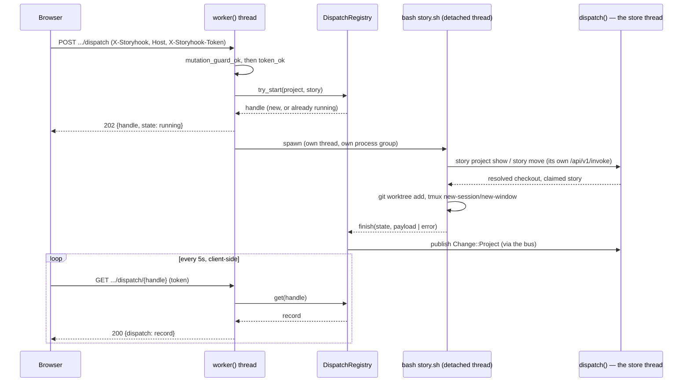

# Dashboard dispatch, and its authorization review

Design of record for **SH-50** (ninth child of epic **SH-112**, blocked on and unblocked
by **SH-120**). Written after implementation rather than before it, because the story's
own acceptance criteria require the review to exist *before the endpoint ships*, not
before it is built — and the review is sharper written against the actual code than
against a proposal for it.

## Context: why this exists

A Dispatch button in the dashboard's story detail drawer, which performs a real
storyhook dispatch — the same worktree, tmux window and agent handoff `/story do`
already produces — reachable from a browser instead of a terminal.

Two unknowns the epic settled before this story could be scoped precisely:

- **Which directory.** A project's checkout comes from `projects.checkout_path`
  (`story project link checkout`). The button is shown only for a project that has one.
- **Who does the work.** The daemon invokes `plugins/story/bin/story.sh dispatch`.
  The worktree/tmux mechanics stay in the shell script; the daemon only invokes it. This
  is deliberately not a reimplementation of dispatch inside the daemon.

The remaining, harder half is the reason this story carried its own authorization
review as an acceptance criterion: this makes a **browser-reachable endpoint that
spawns a terminal session running an agent**, on a daemon that binds the machine's
Tailscale IP as well as loopback.

## The design

### Route table

| Method | Path | Answers |
|---|---|---|
| POST | `/api/repos/{project}/story/{id}/dispatch` | 202, a handle, immediately |
| GET | `/api/repos/{project}/story/{id}/dispatch/{handle}` | 200, the record so far |

Both live in a new module, `src/api/dispatch.rs`, alongside `http`/`rest`/`rpc`/`wire`.

### Off the store thread — the deadlock the design has to avoid

`crate::daemon::serve::dispatch` runs on a fixed pool of `DISPATCHERS` threads that
own the store between them, fed by a rendezvous channel of capacity zero — every
request beyond that many queues behind whichever `rest::route`/`rpc::route` call is
in flight on the rest (SH-173). A dispatch takes 15–35 seconds even on the happy
path, and `story.sh` gets there by making several of its own `story` CLI calls, each
of which — since store isolation landed — reaches this **same** daemon over its own
`/api/v1/invoke` connection, at `hook_depth` 0. Answering a dispatch request on a pool
thread would risk deadlock: with `MAX_RUNNING` dispatches each occupying one pool
thread, their nested calls would have nowhere left to run — the same shape a hook
that calls `story` back into this daemon would hit if its nested call queued behind
the same pool its own parent occupies.

So `api::dispatch::intercept` is checked in `worker()`, before a `Job` is ever built —
the same place `GET /api/events` is already answered in full for the same reason, and
the same shape SH-173's hook-depth lane generalizes: a request whose envelope names
`hook_depth > 0` never queues behind the pool at all, because `hook_depth` caps
nesting at one and a request that cannot recurse cannot deadlock waiting on itself.
The dispatch subprocess runs on its own detached thread, tracked in a
`DispatchRegistry` (in-memory, forgotten on daemon restart) that a `GET` polls.
Nothing in this path ever touches `Serving::store`.

### The registry: async, capped, idempotent per story

A `POST` never blocks on the script. It reserves a slot, spawns, and returns a handle;
a client polls `GET` until `state` leaves `running`. Three properties, all enforced in
`DispatchRegistry` rather than by the HTTP layer:

- **Capped at 4 concurrent dispatches**, across all stories. Not a defense against an
  unauthenticated caller — the token gate already closes that door — but against a
  token holder's own accidents (several tabs, a retried click).
- **Idempotent per story while running.** A repeated `POST` for a story already
  dispatching returns the *same* handle rather than spawning a second script. Once
  finished, a fresh `POST` is a genuinely new attempt — the registry does not remember
  it as still claiming the story, since `story.sh`'s own already-in-progress guard is
  the authority on whether a redispatch is legitimate, not this registry.
- **Retained briefly, then forgotten.** A finished record is evicted once 32 newer
  ones exist, or once 30 minutes have passed, whichever comes first — a poll that
  arrives very late gets a 404, not a stale answer.

`story.sh`'s own JSON result is relayed **verbatim** as the record's `payload` —
`state: ok` for `"ok": true`, `state: refused` for a well-formed `"ok": false` (not
ready, already claimed, a worktree collision — a business outcome, not a defect).
`state: failed` is reserved for the script itself not answering: not found, killed for
overrunning its 180s budget, or exiting with nothing parseable on stdout. This mirrors
the codebase's own precedent (SH-120's council verdict: *"relay the CLI's own refusal
verbatim, never a competing list composed in bash"*) at the daemon/script boundary
instead.

### Session targeting

`story.sh` already supported dispatching outside tmux into a **named**
`STORY_TARGET_SESSION`, provided an operator had started it. The daemon has no tmux
session of its own to arrange ahead of time, so `story.sh` gained
`STORY_CREATE_SESSION`: if the named session doesn't exist, create it (detached)
before opening the dispatch window. The daemon targets one session per project
(`STORY_TARGET_SESSION=<project slug>`), so a project's dispatches accumulate in one
place rather than scattering across ad hoc session names.

### What the daemon does *not* do

- It does not resolve the project's checkout, and does not query the store on the
  request-handling path at all — `story.sh`'s own `story project show --project <slug>`
  (an ordinary nested CLI call) is the sole authority, exactly as the epic specified.
- ~~It does not expose `--auto`.~~ **Reversed by SH-208** (Dispatch Auto): `?auto=1`
  now reaches `story.sh`'s own `--auto`, unchanged below this endpoint. The one human
  interaction this bullet describes is still real and still unmoved — plan mode is not
  optional, and approving the plan still belongs to whoever is at the resulting tmux
  window — but past that approval, an autonomous dispatch now runs to closure and
  reclaims its own worktree with nobody watching. F3, below, is re-argued for this.
- It does not validate `bash`/`jq`/`git`/`tmux` are on `PATH` before spawning — those
  are the script's own dependencies, and its `set -euo pipefail` aborts loudly if one
  is missing, surfacing as a `failed` record with the stderr tail. Only the script's
  own *location* is checked eagerly (`resolve_dispatch_script`), because a script that
  can't be found describes a daemon misconfiguration — true of every future dispatch,
  not this one — and deserves an immediate answer rather than a poll round-trip.

## The authorization review (AC3)

**F1 — the ordinary mutation guard is not authentication.** `mutation_guard_ok`
(`src/api/http.rs:201-209`) checks an `X-Storyhook` header (defeats a plain
cross-origin request — no `Access-Control-Allow-*` answer, so the browser blocks it)
and a trusted `Host` (defeats DNS rebinding). Neither requires a credential. Anything
that can set two headers directly — `curl -H 'X-Storyhook: 1' -H 'Host: <trusted>'`
from any peer the tailnet lets reach the bound IP — passes both with nothing to prove
who it is. **Decision:** dispatch requires the daemon's bearer token
(`X-Storyhook-Token`, `rpc::token_ok`'s own constant-time check) in addition, on both
listeners including loopback — one code path, one test matrix, rather than a loopback
exemption that would need its own justification. **Pre-existing, wider than this
story: filed as [SH-187](#follow-up-stories-filed).**
>
> **Resolved by SH-187.** The token requirement this story built for `.../dispatch`
> alone is now dashboard-wide — every `/api/**` route, reads included, on both
> listeners. Design of record: [`dashboard-authorization.md`](dashboard-authorization.md).

**F2 — process execution reachable from a browser mutation already existed.** A story
*move* already reaches `sh -c` through event hooks (`event_hooks.rs:384-391` ←
`service/mod.rs:288-302`), gated only by the same guard F1 describes. The command text
comes from a file already committed in the checkout, not from the request — smaller
blast radius than dispatch's own attacker-reachable argv, but establishes that
dispatch is a new *kind* of process execution reachable from this surface, not the
first. **Pre-existing, wider than this story: filed as
[SH-188](#follow-up-stories-filed).**
>
> **Resolved by SH-187, as a side effect.** SH-187's dashboard-wide token gate
> (`src/api/admission.rs`) runs in `worker()` ahead of `rest::route`, so the mutation
> this finding named (`POST .../story/{id}/move`) cannot reach `fire_hook`/`sh -c`
> without both `mutation_guard_ok` and the daemon's bearer token — the same chain F1
> closed. SH-187's own suite never configured an event hook, so this story's remaining
> work was one regression test pinning that specific chain end to end (a tokenless
> mutation is refused *and* fires no hook; the same mutation with the token fires it —
> `tests/web_test.rs`), not a new mechanism. `fire_hook`'s process-group handling
> (killing only the `sh` leader on timeout, not its descendants) was raised alongside
> this finding and is **left unchanged, on purpose** — see `event_hooks.rs`'s own
> `ScratchFile` docstring and `tests/hook_bounds.rs`'s
> `a_hook_may_background_work_that_outlives_it`, which pin the SH-141 council's 3–0
> decision that a hook's descendants are left alone. Changing it now would reverse
> that decision and would not address this finding either way, since the hook still
> runs regardless of how its timeout is handled.

**F3 — the residual risk, given F1 and F2 as context.** A peer holding the token who
can *also* reach the ordinary write surface (F1) can `PATCH` a story's description and
then dispatch it, influencing some of what an agent's prompt contains — the prompt
template is fixed (`plugins/story/bin/story.sh:97`/`:119`), but the story id and
title it interpolates are not. Mitigated by: the token gate (this story); plan mode
only — the launch command is identical in both modes (`LAUNCH_TPL`,
`claude --permission-mode plan`), so a human still approves before anything the agent
proposes executes, in attended and autonomous dispatch alike; and the prompt template
itself asking the agent to investigate and post a plan for approval, not to act
unilaterally.
>
> **Re-argued for SH-208 (Dispatch Auto).** The paragraph above no longer holds "never
> `--auto`" as a mitigation — `?auto=1` reaches it now. What survives unchanged: the
> plan-approval gate itself, since `--auto` swaps only the handoff *prompt*, never the
> *launch command* — a human still approves the plan before the agent's first tool
> call, autonomous or not. What is now larger: everything **past** that one approval
> is unilateral, where it previously stopped at "investigate and propose." An
> autonomous session merges its own PR (`gh pr merge --merge`), closes the story
> itself, and — the reason this needed a design decision rather than a one-line
> reversal — reclaims its own worktree, branch and tmux window as its last act
> (`story.sh reap`, this story). `reap`'s own preflight is the mitigation for *that*
> half: it refuses outright unless the story is closed and the worktree/branch are
> both safe to discard (dirty, locked, unmerged, protected all refuse the whole
> operation, nothing partial — see `story.sh`'s `cmd_reap` for the full guard list), so
> the worst a compromised or malicious auto-dispatch can do to the workspace itself is
> what an attended one already could: modify files inside a worktree a human is meant
> to review via the PR before it merges.
>
> **Re-argued for SH-511 (automatic plan approval).** The human plan-approval gate
> above is deliberately removed from `--auto` and is no longer a mitigation. Plan
> mode remains: the child must still produce and persist a plan before implementation,
> but Storyhook's provider-native posture approves it without a person. The surviving
> controls are the named dashboard token, the fixed autonomous charter, isolation in a
> disposable worktree, the explicit version/release/deploy prohibition, a pushed PR,
> the required full-suite green receipt before merge, and `reap`'s destructive-safety
> guards. Attended dispatch retains human plan approval unchanged.

**F4 — the token's scope and limits, stated plainly.** Minted once per daemon lifetime
(`lifecycle::mint_token`), not per-user, not rotated except by restart. Its
confidentiality on the tailnet leg rests entirely on Tailscale's own WireGuard
transport — this design adds no cryptography of its own, only a value an unprivileged
tailnet peer cannot read (it lives in a 0600 portfile) and cannot enumerate (401 before
any handle lookup — `intercept`'s guard order mirrors `rpc::admission`'s own reasoning
for the identical purpose). `story daemon token` is the sanctioned way to read it — it
refuses rather than starting a daemon, since this is a question about a daemon
presumably already serving the dashboard the token is for.

**F5 — the token in the browser.** Held in `sessionStorage`, not `localStorage` —
gone when the tab closes. The dashboard's own XSS surface: DOM is built through
`el()` (`web_dashboard.html:786`), which assigns props/children as properties and text
nodes and never writes `innerHTML` from content — the one place `.innerHTML` is even
read is `esc()` (`:777-782`), a round-trip through `textContent` used to *escape* text,
not to insert it — under a CSP of `default-src 'self'; script-src 'unsafe-inline';
style-src 'unsafe-inline'` (`http.rs:35`) that at least forbids loading a *remote*
script even if some injection vector were later found. Not a claim that no XSS is
possible — a claim that this design does not add a new stored-token *disclosure*
mechanism beyond what already existed for any other data the dashboard renders.

**F6 — no shell in the daemon.** `Command::new("bash").arg(script)...` with explicit,
individually-set arguments; no `sh -c` string built from request data anywhere in this
path. The project slug and story id are validated against `^[A-Za-z0-9][A-Za-z0-9_-]*$`
(`valid_segment`, matching `story.sh`'s own `valid_story_id`) before they ever reach an
argv, rejecting path traversal and whitespace at the one boundary where a URL segment
becomes a process argument.

**F7 — process hygiene, once spawned.** Stdio is unlinked `tempfile()` handles, not
pipes — the SH-141 idiom `event_hooks.rs` already established, so no descendant that
outlives the timeout can hold the daemon waiting on an end-of-file. The child gets its
own process group, killed whole (not just the leader) if it overruns 180 seconds, so an
abandoned `git fetch`/`tmux`/`claude` probe cannot survive a killed dispatch. Classified
`Kind::Waited` in `tests/spawn_inventory.rs`'s frozen inventory, on the same reasoning
as `event_hooks.rs`'s own entry.

### Decision, summarized

Ship the token gate as F1 requires it, on both listeners. Do not fix F1 or F2
themselves here — they are pre-existing, wider than one endpoint, and each carries a
real design trade-off (F1's fix costs tailnet write access without a token everywhere,
not just here; F2's fix is a deliberate feature — `cmd &` backgrounding — someone chose
on purpose). Both are filed and linked below rather than silently absorbed.

## Follow-up stories filed

Both live in the storyhook store (`story show <id>` is the source of truth). Both are
resolved, and both share the same design doc.

- **SH-187** — the dashboard's mutation guard is not authentication; any tailnet peer
  can write with two headers (F1). Child of SH-112, relates-to SH-50. **Resolved —
  [`dashboard-authorization.md`](dashboard-authorization.md).**
- **SH-188** — event hooks already let a browser-reachable story mutation run `sh -c`
  in the project checkout (F2). Child of SH-112, relates-to SH-50. **Resolved by
  SH-187's fix, above — [`dashboard-authorization.md`](dashboard-authorization.md).**

## As built — found only once real story.sh runs were driven end to end

**The daemon must never let the dispatch child inherit its own `cwd`.** Discovered by
this story's own e2e test, not by review: a daemon started from a directory that is
later deleted (a build's temp dir; in the failing case, an e2e harness's own scratch
directory) holds that `cwd` indefinitely, and `bash`'s own startup calls `getcwd()`
before the script's first line runs — failing loudly on stderr (`shell-init: error
retrieving current directory`) if it's gone, which this module's `classify()`
correctly reported as the dispatch's `failed` error, obscuring the real one underneath.
Fixed by pinning `Command::current_dir(env.home())` explicitly rather than inheriting
anything — `story.sh`'s own `enter_checkout` immediately `cd`s away regardless, so the
starting directory's only job is to always exist.

**The e2e seed fixtures needed to become real git repositories.** Nothing before this
story ever asked Alpha/Beta's seeded checkouts (`scripts/run-e2e.sh`) to be actual git
repositories — a checkout is only a recorded path until something reads it as one, and
`project-selector.spec.ts` never did. Dispatch's worktree creation does. Confirmed the
hard way: the first real dispatch attempt against the e2e fixtures refused with
`checkout ... is not a git repository`, `story.sh`'s own message, verbatim, exactly as
designed to relay.

## As built — SH-208 (Dispatch Auto and self-reap)

**`--auto` travels as a query parameter, not a JSON body field, because of where this
endpoint answers.** `crate::api::dispatch::intercept` runs in `daemon::serve::worker`
*before* the request body is ever read (SH-50's own deadlock-avoidance design, above) —
a flag that has to be known before the body exists cannot travel in one. `?auto=1`
(also accepting `true`; anything else present is a 400, never a silently-accepted
`false`) is parsed by `parse_auto`, after every guard, on the `POST` arm only.

**A closed story cannot be commented on — discovered implementing self-reap, not
during design.** *(Superseded by SH-261 — see the note below. Kept as written, because
what it got wrong is the useful part.)* The original plan for `reap`'s "durable record"
was a `story comment` posted after the destructive cleanup, mirroring `story.sh`'s own
claim-rollback notes. `resolve_open_story` (`src/service/mod.rs`) refuses any mutation —
comment included — against an archived story, unconditionally: `story `TST-1` is closed
and cannot be modified`. There is no flag or escape hatch, and none was added — a closed
story being immutable is a real invariant this codebase relies on elsewhere, not an
oversight to route around. `reap` was redesigned around it rather than through it: its
exit JSON is now its only record, the tmux window (the one thing that could still have
observed a comment) is killed *last* precisely because there is nothing left to report
past that point, and the autonomous charter itself was told plainly — a closed story
cannot be commented on again, so say everything worth recording *before* that move, not
after.

> **Superseded by SH-261 (2026-08-13): the ruling above was right about the code and
> wrong about the reason.** `story comment` now takes a closed story; only a
> *soft-deleted* one refuses. The sentence that did not survive review is "a closed
> story being immutable is a real invariant this codebase relies on elsewhere" — it is
> not one this codebase has. SH-43, which shipped *before* this ruling was written,
> already appends `StoryHidden`/`StoryUnhidden` to archived stories through
> `resolve_story`; `purge` appends relationship retractions onto closed claimants;
> `history::restore` appends compensating events to anything; and SH-207 deliberately
> let a closed story be a relation target. The archive was already an appendable log,
> and the one append it refused was the one made on a person's behalf.
>
> The invariant that *is* real, and that SH-261 kept, is narrower: **a closed story's
> state, scope and rollups cannot change.** That is the standard SH-207's council
> applied. A comment reaches nothing but the comment list and `updated_at`, so it clears
> it; `move`, `assign`, `label`, `set` and `relate`-as-`a` do not, and still refuse.
>
> Recorded here rather than only in SH-261 because this paragraph was, for four months,
> the reason anyone gave for the refusal — including the autonomous charter, which
> repeated it to every dispatched agent. A ruling reached under implementation pressure
> and written down as an invariant is the shape of mistake worth leaving visible.
>
> **What did not change:** `reap` still has no record step, and the charter still says
> to record everything before closing. Both were re-justified rather than reverted —
> `reap` because a step reporting on its own destruction has not been designed, the
> charter because `reap` closes the tmux window moments after the close.
>
> **A second write joined `story comment` on the append side (SH-279, 2026-08-13):**
> `commit-sync`'s commit link. Found by this very council, checking SH-261's own claim
> that "git commits may annotate the archive and people may not" — false in that
> direction: `record_commit` resolved through `resolve_open_story` too, so a merge
> commit naming a story its own PR had just closed recorded nothing, silently. Same
> argument as the comment: `StoryCommitLinked` reaches only `referenced_by_commits`
> and `updated_at`. It now resolves through `Intent::Append` and links every time,
> never moving a closed story — moving is still the edit SH-261 kept refused.

**Self-reap needed a deterministic verb, not prose.** The charter could have simply
told the agent to `git worktree remove` its own worktree, delete its branch, and kill
its own tmux window as three separate instructions. Rejected: `git worktree remove`
refuses a dirty tree (correct) but an agent might reach for `--force` under time
pressure (wrong — deletes the running agent's own cwd out from under it), and
`tmux kill-window` ends the session that is executing the instruction, so anything
after it in a hand-rolled sequence never runs. `story.sh reap <id>` collapses the whole
sequence into one call with a fixed, tested order — git work, then the window kill,
last — so there is no sequence for an agent to get subtly wrong under pressure.

## As built — SH-219 (a council-conditional autonomous charter)

**The charter used to name `/council-vote` unconditionally — on a machine with no council
plugin installed, that was an instruction the child could never carry out.** SH-219 asked for
the `--auto` charter to convene the council only when it is actually installed, and to
otherwise trust its own researched judgment even on a hard question. Both halves were real
gaps: nothing anywhere checked for the skill's presence, and the charter had no positive
instruction for the *easy*-question case at all — only an implicit absence of "ask the human."

**The check runs in `story.sh`, not in the child session, and not in this daemon.**
`council_vote_available` (`plugins/story/bin/story.sh`) probes for a real
`skills/council-vote/SKILL.md` — bare under `~/.claude/skills` or the dispatched project's own
`.claude/skills`, or shipped by an enabled entry in `installed_plugins.json` — before the
charter is ever rendered, and picks one of two composed templates accordingly. Rejected: asking
the *child* to judge its own skill roster and decide which charter to have followed, which
would have made the decision unverifiable and non-deterministic across otherwise-identical
dispatches. This daemon could have run the probe instead, but `story.sh` is what actually
resolves `$HOME`/`installed_plugins.json` for the identity that matters — the one the launched
`claude` process itself will read — and the daemon's own dispatch env allowlist
(`src/env/spawn_env.rs`) deliberately does not forward `CLAUDE_CONFIG_DIR`, so a probe run here
would silently answer for the wrong config directory on a dashboard-launched dispatch.

**Composed from a shared HEAD/TAIL plus one of two decision clauses, not two independent
charters.** `AUTO_PROMPT_TPL` and `AUTO_PROMPT_SOLO_TPL` differ only in the clause that
governs a genuinely hard decision (convene the council vs. research-and-decide-and-record);
every other obligation — plan-approval framing, `make test`, PR/merge conduct, closure against
acceptance criteria, `reap` as the final act, the hard-stop escape — is written once and shared.
Two independently-maintained ~2,000-character strings would have been a standing invitation for
the two paths to drift on an obligation neither charter should ever have had a choice about.

**I4 CHARTER-INERT now covers three rendered variants, not two**, and the daemon-side runtime
rider (`prompt_override_violation`, `src/api/dispatch.rs`) checks a dirty override of *either*
auto template on an `--auto` dispatch — it cannot know in advance which one
`council_vote_available` is about to pick, so it refuses on either rather than guessing.

**`STORY_COUNCIL` (`auto`/`on`/`off`) is the probe's own escape hatch and test seam** — the
same shape `READY_PROCESS_PATTERN` already established for a heuristic that needs one. An
explicit `STORY_AUTO_PROMPT` still overrides the entire charter outright, regardless of what
the probe finds: it has always been a wholesale-override seam, and a caller who sets it clearly
wants full control, not a probe result silently vetoing their text.

## As built — SH-196 (the version-skew diagnosis)

**The bug this closes was found live, not hypothesized.** Mikey dispatched SH-68 from
the dashboard on 2026-08-07; the installed `story@storyhook` plugin (0.4.0, cached
before SH-120/SH-121/SH-151's `--project` rearchitecture) rejected the daemon's own
`--project <slug> dispatch <id>` invocation with its generic top-level usage error.
That error is well-formed JSON with `"ok": false`, so `classify()` correctly reported
`DispatchState::Refused` — the daemon-side classification was never wrong — but a
refusal indistinguishable from "not ready" or "already claimed" carried no signal that
the *plugin version* was the actual problem. The immediate instance was fixed by hand
(a local marketplace + an explicit `claude plugin tag`); the class recurred within a
day, when SH-208 added `cmd_reap` to `story.sh` and the installed plugin cache did not
move.

**The fix is a one-line marker, checked as text, never executed.** `story.sh` declares
`DISPATCH_PROTOCOL=<n>` near its top — the daemon<->script argv contract it implements.
`resolve_dispatch_script_from` (`src/api/dispatch.rs`) reads that line out of whichever
candidate it resolves — override, installed plugin, or dev checkout alike, one rule, no
exemption — and refuses (`check_dispatch_protocol`) if it is older than
`REQUIRED_DISPATCH_PROTOCOL`, naming the script's path, both numbers, and the exact
remedy (`story plugin install claude` or `story plugin install codex`, matching the
active provider).
`declared >= required`, not `==`: a script *newer* than the daemon needs must keep
resolving, so a plugin release is never blocked on a daemon rebuild. Rejected: an exec
probe (`story.sh --dispatch-protocol`) — it would only echo the same constant at the
cost of a `bash` spawn on every resolution, and resolution deliberately runs before
anything about the script is trusted (see "What the daemon does *not* do", above, on
not pre-checking `bash`/`jq`/`git`/`tmux`). Also rejected: preferring a newer dev-repo
copy over a stale installed one — Mikey specifically asked (see SH-196's own resolution
comment) for a plugin release pinned by an explicit tag precisely so active repo edits
do not move the daemon out from under itself; silently falling through to the dev
checkout would undo that.

**The dashboard half was the other bug, uncovered doing this one.** `api()`
(`src/web_dashboard.html`) built its rejection message from a JSON `error` field only —
but every reply this module sends (`text_reply`) is plain text, so the new "out of
date" 500, the pre-existing script-not-found 500, and the 429/403 all collapsed to a
generic `xhr.statusText` ("Internal Server Error"). Fixing the daemon side alone would
have landed the new diagnosis in a channel nothing reads. `api()` now falls back to the
trimmed response body when the reply is not JSON. Separately: `refused` and `failed`
outcomes rendered as the identical red toast, distinguishable only by a 3px border
color — now prefixed `Dispatch refused —` / `Dispatch failed —`, `#toast-stack` gets
`role="status" aria-live="polite"`, and an error toast's lifetime is doubled (9s) since
a remedy sentence needs longer than a confirmation to read.

**Two drift pins, not one.** `tests/plugin_contract.rs` pins `story.sh`'s declared
`DISPATCH_PROTOCOL` against `REQUIRED_DISPATCH_PROTOCOL` (using
`declared_dispatch_protocol` itself, made `pub`, rather than a second parser that could
drift from the real one), and separately pins `plugin.json`'s version against
`marketplace.json`'s `story` entry — these drifted for real once (`3cbd08a` bumped one
and forgot the other), which is the literal reason `claude plugin update` answered
"already at the latest version" during this story's own investigation.

## As built — SH-197 (a second entry point: the story context menu)

**Dispatch is reachable from two places, sharing one gate.** SH-197 originally added
parallel Dispatch and Dispatch Auto actions; SH-436 consolidated their configuration into
one modal-backed Dispatch action in both the right-click context menu (`storyMenuModel`,
`src/web_dashboard.html`) and drawer footer (`renderDrawerFooter`/`dispatchButton`). Both
read the identical expression —
`stateSuperstate(st.state) === "CLOSED"` (or the equivalent `isClosed`) `||
!currentRepoHasCheckout()` — rather than each surface computing its own answer, so the
two can never disagree about whether a story is dispatchable. Both call the same
configuration modal and then `startDispatch(id, agent, auto)`, and disable while
`state.dispatches[id]` holds an entry,
matching `DispatchRegistry::try_start`'s per-story (not per-mode) dedupe on the daemon
side. The context menu HIDES the item rather than disabling it when the gate
fails — nothing a menu click can do lifts "closed" or "no checkout" — the same choice
the drawer footer already made by omitting the button outright.

## As built — SH-436/SH-510 (dispatch configuration and remembered defaults)

The dispatch modal opens with the last configuration the browser submitted. Client is a
UI-only select with one value, `localhost`; Model selects the canonical `claude` (shown as
Claude) or `codex` (shown as Codex) provider; Auto mode is a checkbox whose secondary copy
explains that it uses Council for questions, auto-merges PRs, and cleans up its workspace
without auto-approving the implementation plan. Model and Auto are stored together as a
validated, durable browser preference when Submit is pressed, so reloads and project changes
retain them while Cancel, backdrop dismissal, and Escape discard draft edits. Missing or
invalid stored fields fall back independently to Claude and Auto off. Submit sends
`?agent=claude|codex[&auto=1]`. Omitting `agent` remains a backwards-compatible Claude
request, while malformed, duplicated, and legacy `claude-code` query values are rejected.

The daemon persists the selected canonical agent in each `DispatchRecord` and passes it
to the shared helper as `--agent=claude|codex`; old records without the field deserialize
as Claude. `story.sh dispatch (<id>|--next) [--auto] [--agent=claude|codex]` accepts the
options in any order, rejects duplicates before side effects, lets the explicit flag
override `STORY_AGENT`, and otherwise defaults to Claude. The old
`STORY_AGENT=claude-code` environment value and `story plugin install|uninstall
claude-code` targets remain warned compatibility aliases because those were public before
SH-436. New argv and HTTP interfaces intentionally do not accept that alias.

Installed helper resolution is provider-specific. Claude reads Claude Code's installed
plugin registry; Codex asks `codex plugin list --json` for the authoritative enabled
`story@storyhook` version and resolves that exact cache directory, rather than guessing
among stale cached versions. The development-checkout fallback remains the shared
`plugins/story/bin/story.sh`, and the optional flag does not change dispatch protocol 1.

## As built — SH-304 (the notification contract: routing by outcome)

**SH-232's rule was right about the danger and wrong about the axis.** It sent every
`--auto` result to a durable bottom-right row and every attended one to a self-deleting
toast, reasoning that nobody necessarily watches the tab when an autonomous dispatch
finishes — which is true, and which SH-227's incident review is the reason anyone knew.
But "who started it" does not predict "can this be recovered if the notice is missed."
**Outcome does.** A *successful* dispatch is corroborated twice whether or not anyone saw
the notice: the story moves to in-progress on the board, and the tmux window exists. A
*refused* or *failed* one is corroborated nowhere — it leaves the story exactly as it
was, so a notice that clears itself takes the only report with it. That was as true of an
attended failure, which had a 9s toast until this story, as of an unattended one.

So routing is now by `DispatchState`, and SH-232's durability survives narrowed to the
outcomes it was actually protecting:

| Outcome | Attended | `--auto` |
|---|---|---|
| `ok` | toast, clears itself | toast, clears itself, headline says `(auto)` |
| `refused` / `failed` | toast, **durable**, dismiss button | `#dispatch-history` row, **durable** |

Geography is unchanged for failures — an attended one stays in the top-right stack where
the action that caused it was taken, an unattended one stays bottom-right where SH-232 put
it. Only success moved, and only because it stopped being durable.

**The paragraph in the screenshot was `story.sh` talking to an agent.** `display` is
authored for `story.sh`'s Claude *skill* consumer and relayed verbatim; a ~90-word
paragraph in a browser was the visible half of that. The headline is now composed
client-side from typed fields — `<id> <verb>` plus `(auto)`, where the verb is the
`DispatchState` itself — so it cannot regress when the script next changes what it says.
`display` is not discarded: on a durable notice it is the `.notice-detail` line beneath
the headline, with the typed `reason` on its own `.notice-reason` line. SH-196's
diagnosis-and-remedy requirement is met by keeping the text on screen indefinitely rather
than by timing how long a sentence takes to read.

**`TOAST_ERROR_LIFETIME_MS` is deleted rather than raised.** SH-196 doubled it to 9s so a
remedy could be read. The honest version of that fix is no deadline: every error notice is
durable now, on every call site, with a dismiss button sharing one CSS rule with the
history row's. `TOAST_LIFETIME_MS` is 3000ms, and the 1s fade is `--toast-fade`, a token
the script *reads* (`readMsToken`) rather than restating — two hand-kept copies would let a
node be removed mid-fade the first time one moved.

**The surviving timer holds its clock on pointer hover, on focus within the notice, and —
the perverse case a bare `setTimeout` gets wrong — while `document.hidden`**, since a
notice exists precisely because nobody may be watching and a background tab is the one
state where "three seconds of being visible" definitively did not happen. Pausing
preserves what is left rather than restarting it.

*Correction (SH-322, retrofitted here — the source doc comment and the e2e test comment
were corrected at the time, this paragraph was missed): this section originally claimed
the pause behavior above satisfies **SC 2.2.1 (Timing Adjustable)**. It does not, and SH-322
found two independent reasons why. First, SC 2.2.1's mechanisms are Turn off, Adjust and
Extend — pause is SC 2.2.2's word, not this criterion's, so satisfying it was never the
right target regardless of whether the mechanism worked. Second, the mechanism didn't work
in any case: the focus branch above could never fire, because a self-clearing notice (the
only kind this timer ever runs on) carries no focusable content by construction — durable
notices get the dismiss button, self-clearing ones don't, and the two are exact
complements. SH-322's actual SC 2.2.1 conformance route is `storyhook.keepNotices`, a
default-off Turn-off preference reachable from Settings before a notice is ever raised;
the dead focus-pause branch was deleted rather than repaired (`4007367`,
`refactor(dashboard): delete a focus-pause branch nothing could reach`).*

**A real pre-existing gap closed on the way past.** `.toast` and `.toast.leaving` sat
*outside* the `prefers-reduced-motion: no-preference` guard that `.card`'s equivalents have
always sat inside, so a reader who had asked for reduced motion got the slide-in and
slide-out anyway — from the one class of element that appears unbidden. The animations
moved inside the guard; the *dismissal* deliberately did not, because a reader who asked
for less movement did not ask for notices that never leave. Same split `.card` has drawn
since SH-203: information stays under reduced motion, decoration drops.

**Not done, deliberately:** SH-304's first example names an `<id> created` toast, which
SH-127's council unanimously *deleted* — the new card's own `entering` animation already
confirms creation in place. The example is read as format guidance for the headlines above,
not as a request to reverse that verdict.

Council: SH-304 (three seats, two rounds, IRV
after a 1-1-1 split). Its verdict records six binding constraints, including the
chair's correction of a seat's supporting claim: the daemon *does* persist finished
`DispatchRecord`s, but **no route exposes them, the dashboard never reads them, and they
evict after 30 minutes or 32 records** (`RETAIN_FOR`/`RETAIN_FINISHED`) — so "unattended
discoverability is solved server-side" is false, and the durable row is the record.

## As built — SH-333 (a kept notice stack re-announces every notice on every arrival)

**`role="status"`'s implicit `aria-atomic="true"` meant `#toast-stack` re-announced its
entire standing pile on every arrival**, not just the notice that was added — worsened by
SH-322's `keepNotices` preference, which makes notices durable and lets the pile grow
without bound. `#dispatch-history` had the same user-facing symptom by a wholly different
mechanism: `renderDispatchHistory()` clears and rebuilds the panel wholesale on every
render, so every row (not just the arriving one) is a fresh DOM addition into a live
region on every mutation, independent of atomicity.

**The two surfaces got two different fixes, because they turned out to be two different
defects wearing the same symptom.** `#toast-stack` inserts nodes incrementally
(`stack.insertBefore`), so `aria-atomic="false"` on the stack plus `aria-atomic="true"` on
each `.toast` is a clean, spec-native fit: a mutation now announces exactly the node that
changed, whole. `#dispatch-history` cannot be fixed by any live-region attribute
combination, atomic or not, because the wholesale rebuild manufactures N fresh additions
regardless — it lost `aria-live` entirely and gained a dedicated `sr-only role="status"`
announcer (`#dispatch-history-status`) fed directly by `addDispatchHistoryRow()`.

**Deliberate tech debt, named as such.** The dispatch-history announcer is a
hand-maintained side channel: every future call site that adds a row must remember to
also feed the announcer, which is exactly the class of drift this project has been burned
by before (SH-136). It is not a redesign because the actual flaw — the wholesale rebuild —
is already scoped as its own story, **SH-337** (`renderDispatchHistory` destroys focus on
every rebuild, including the arrival path). Once SH-337 lands and the panel starts
inserting incrementally, `#dispatch-history` becomes an `aria-atomic` candidate too, and
the side-channel announcer should retire rather than persist alongside a fix that no
longer needs it.

*Correction (SH-337, retrofitted here — the trigger this paragraph named has fired): the
panel now inserts one row at a time, `#dispatch-history` carries `aria-live="polite"
aria-atomic="false"` with `aria-atomic="true"` on each row, and `#dispatch-history-status`
plus `announceDispatchHistoryArrival()` are deleted. The debt is discharged, not re-filed —
see the As-built section below.*

**A second, dedicated announcer, deliberately not `#notice-dock-status`.** That element
(SH-326) also carries the armed-delete confirmation prompt the user must read and act on;
routing a background dispatch-history arrival through it would risk a notice silently
overwriting a live confirmation mid-read.

**What is claimed, and what isn't.** Both directly-assertable properties — which elements
carry which ARIA attributes, and what text a `role="status"` announcer holds — are pinned
by `e2e/specs/notice-announcement.spec.ts`. What a real assistive technology actually
*utters*, including whether its own speech queue coalesces two adjacent identical
announcements, is not: no AT is driven by this suite on any engine (SH-335 added a real
`webkit` project, but a second browser engine is not a screen reader), and this project's
own SH-322/SH-327 precedent is not to claim what wasn't checked. That residual is named
here rather than implied away.

**Mutation battery, run and recorded — all five reddened the pins meant to catch them,**
none survived:

| Mutation | Result |
|---|---|
| `aria-atomic="false"` removed from `#toast-stack` | 1 e2e pin + the Rust cheap-layer scan both red |
| `aria-atomic="true"` removed from `.toast` in `toast()` | same two, red |
| `announceDispatchHistoryArrival()` call dropped from `addDispatchHistoryRow()` | 4 e2e pins red |
| Dispatch-history arrivals routed into `#notice-dock-status` instead of their own announcer | the same 4, red — including the rider-1 clobber pin, which caught the dismissal message being overwritten mid-read |
| `setStatusText`'s clear-then-set idiom collapsed to a single assignment | the identical-arrivals pin red (3 DOM mutations expected across two announcements, 2 observed) — this is the one mutation whose outcome was not obvious in advance: `textContent` reassigned to its own existing value still fires a `childList` `MutationRecord` per the DOM spec, so the concern going in was that this pin might not discriminate at all. It does: the clear step measurably changes the mutation count, confirming rider 2 is load-bearing rather than a belt-and-braces no-op — *retargeted to `#notice-dock-status`'s dismissal announcements by SH-337, the surviving surface where this idiom is load-bearing; see below* |

Worth stating plainly, in this file's own established idiom: without the battery, the
"identical arrivals" pin's actual discriminating power was not obvious even to the person
who wrote it, and the empirical check is what settled it rather than DOM-spec reasoning
alone.

Council: SH-333 (three seats, unanimous on
the first ballot — both members who separately proposed a single blanket mechanism for
both surfaces switched their own vote to the split once the two surfaces' distinct failure
mechanisms were on the table). Its verdict records the full rationale and the three
riders (announcer ownership, duplicate-arrival distinguishability, and the SH-337 tie-back).

## As built — SH-337 (the panel that rebuilt itself under the reader's hands)

**`renderDispatchHistory()` was `clear(panel)` plus a full rebuild, reached from three call
sites.** One of them, `addDispatchHistoryRow()`, fires on the *arrival* path — a `--auto`
dispatch failing in the background, with no gesture from the reader involved at all. A
keyboard user resting on an existing row's `.dispatch-history-dismiss` had that button
destroyed under them by a notice they never interacted with, and landed on `<body>` — WCAG
SC 2.4.3. Never worked; the panel has had this shape since it existed.

**The repair is an insert, not a restore, and the distinction is the whole story.**
SH-326's council considered fixing this inside the render — capture the focused row's key
before `clear()`, re-focus the same row's button after — and converged on rejecting it: a
`.focus()` call per arrival is not free. It can cut short the polite announcement of the
row that just landed, and it scrolls the panel to keep the restored row visible while new
rows stack above it — both costs worst in exactly the burst case the fix exists to serve.
`addDispatchHistoryRow` already `unshift`s onto `state.dispatchHistory`, so the panel's DOM
order and the array's order are the same coordinate; `insertBefore(node,
panel.firstChild)` prepends one node with nothing else to keep true. `toast()` has inserted
this way since SH-323 and has never had this defect — SH-337 is the other surface adopting
a pattern already proven in this file, not a new invention.

**Why index-keyed restore is the naive-but-wrong shape, made concrete.** A restore that
captures the focused row's *index* before a rebuild and re-focuses whatever is now at that
index passes a two-row test (nothing else stands between "no fix" and "fixed" at that
scale) but fails the moment a new row displaces the old one from index 0 to index 1 — the
restore lands on the *arriving* row instead of the one the reader was actually on. This is
why the story's own pin insists on identity (the row's own text or key), never index, and
why the e2e suite proves it with an actual index-keyed mutant rather than only arguing it
in prose.

**The two dismissal call sites converged onto the same shape.** `dismissDispatchHistoryRow`
used to name its heir from `state.dispatchHistory` by key and re-find it by
`data-notice-key` after the rebuild — the array-keyed lookup SH-326 had to invent because
`clear(panel)` destroyed every node reference. With the rebuild gone, it converges onto
exactly `toast()`'s own dismiss handler: the click closure holds its own row node, reads
`adjacentNoticeControl(node, ".dispatch-history-dismiss")` as the heir before removing it,
then `node.remove()`. Verified behaviour-identical rather than only argued: rows are
`unshift`ed (array index *is* DOM order) and every history row carries an unconditional
dismiss button (no clocked rows to skip, unlike the toast stack), so "next sibling with a
dismiss control" collapses to exactly the array's `rows[at+1]`/`rows[at-1]` it replaces.
SH-326's three existing dismissal pins pass unmodified against the rewrite.
`renderDispatchHistory()` and the key-lookup helper `dispatchDismissForKey()` are deleted,
having lost every caller.

**SH-333's debt is discharged, not merely re-filed.** `#dispatch-history` now carries the
identical shape `#toast-stack` has had since SH-333 — `aria-live="polite"
aria-atomic="false"` on the region, `aria-atomic="true"` on each row, inserted one at a
time — because the condition SH-333's verdict attached to that shape (an incremental
insert, so "the node that changed" is exactly "the node that arrived") is now true here
too. `#dispatch-history-status` and `announceDispatchHistoryArrival()` are deleted rather
than left standing beside a fix that no longer needs them. Default `aria-relevant` is
`additions text`, so a removal (a dismissal, a bulk clear) still announces nothing from
this region — both keep their own `#notice-dock-status` announcement via
`announceNoticeDismissal`, unchanged.

**What is claimed, and what isn't — same boundary as SH-322/SH-327/SH-333, restated
because a second surface now depends on it.** Which elements carry which ARIA attributes,
and that an arriving row is the live region's one addition, whole, are pinned directly
(`tests/web_test.rs`'s cheap-layer scan; `e2e/specs/notice-announcement.spec.ts`'s
`MutationObserver`-based proof that exactly one node is added per arrival). What a real
assistive technology actually *utters* is not: no AT is driven by this suite (Chromium
only). The "identical arrivals don't collapse" pin retargeted to `#notice-dock-status`'s
dismissal announcements, the surviving surface where `setStatusText`'s clear-then-set
idiom is load-bearing — a dispatch-history arrival is now a distinct DOM node insertion
per notice, which cannot regress into a same-value-reassignment collapse the way a shared
text element can, so the risk that idiom guards against no longer exists on this path.

**Incidental, unspecified, and named rather than left to be discovered:** standing rows no
longer re-run the `toast-in` entrance animation on a sibling's arrival or dismissal, since
they are no longer destroyed and recreated by a rebuild — visible only under `prefers-
reduced-motion: no-preference` (the animation rule's own scope).

**Mutation battery, run and recorded:**

| Mutation | Result |
|---|---|
| Arrival calls `renderDispatchHistory()` again (revert to the prior defect) | the SH-337 focus pin red (`document.activeElement` is `body`) |
| Index-keyed restore-on-render: capture the focused row's index, rebuild, focus whatever is now at that index | the SH-337 focus pin red — lands on the *arriving* row's button instead of the resting row's, exactly the naive-but-wrong shape the story's Pin section calls out |
| `syncNoticeDock()` dropped from the arrival path | survived until a dedicated pin was written (nothing previously asserted on `#dispatch-history-bar`/`-count`); now red |
| `adjacentNoticeControl`'s direction reversed in the dismissal handler | the *existing* 2-row heir pin stays green (dismissing the top row leaves no previous sibling, so forward-first and reversed pick the same survivor) — survived until a 3-row, middle-row dismissal pin was written (the same reason the toast stack's own heir pin uses three notices); now red |
| `aria-live` removed from `#dispatch-history` / `aria-atomic="true"` removed from a row | the retargeted `web_test.rs` scan and e2e inventory pins, red |
| `#dispatch-history-status` resurrected and fed | the retargeted inventory pin red (set equality) |

Two survivors recorded rather than silently patched over: an *identity*-keyed restore-on-
render (capture the focused row's key, rebuild, re-focus by key) is functionally
indistinguishable from the insert this story ships, in a Chromium suite with no AT — the
costs SH-326's council named (a cut-short announcement, a scroll jump) are not observable
here. The mechanism is defended by the code comment and the council record, not by a test,
and this section says so rather than implying the pin covers it. And what a screen reader
actually utters remains, as throughout this file, a hand-check question rather than an
e2e claim.

Refers to SH-337, which relates to SH-326 (the dismissal-path sibling this story completes)
and SH-333 (whose named debt this story retires).

## As built — SH-339 (a held key walked the heir chain SH-326 built)

SH-326 gave a dismissed notice an heir: focus moves to the next notice's dismiss control.
That is the fix, it is correct, and it created this. A `<button>` runs its activation
behaviour on **keydown** for Enter, so a held Enter fires one click per OS auto-repeat —
harmless before SH-326, because the first click destroyed the button and the repeats fell
to `<body>`. With an heir the repeats have somewhere to land. Reproduced before the fix:
five durable **error** notices, one held Enter, **zero** left. A durable error notice is
the only record of its failure, which the `addDispatchHistoryRow` doc comment has said in
those words since SH-304.

**Why this shipped at all, having been filed as an accepted trade.** SH-326's council
looked for a mitigation and recorded that it "could find no mitigation that is not modality
sniffing," rejecting modality sniffing on grounds this file already endorses (`event.detail
=== 0` fires for AT-driven pointer users and not for real ones; WebKit focuses no `<button>`
on click). That premise was false, and the keydown sequence for a held Enter measures it:
`[false, true, true, …]`. `KeyboardEvent.repeat` asks nothing about who the user is — it is
a property of the key event, false on the deliberate press and true on every auto-repeat.
It is the SH-226 test in its strongest available form here, and the AT population the prior
council was protecting is untouched either way, because an AT activation arrives as a click
with no keydown at all. Council verdict, unanimous 3-0, recorded on SH-339.

**What shipped:** `refuseAutoRepeatActivation`, one delegated `keydown` listener bound on
`#notice-dock` — the single common ancestor of both regions and both "Dismiss all" bars —
cancelling `event.key === "Enter" && event.repeat` for any button beneath it. One rule in
one place rather than four handlers at four construction sites, so a dock button added later
cannot fall outside it; the drift a hand-maintained selector list produces is this project's
named failure class. Bubble phase, because the handler only cancels a default action and
nothing in the dock stops propagation.

**Enter specifically, and the narrowness is the whole design.** A bare `if (event.repeat)`
would also cancel held Arrow/Page scrolling from a focused dismiss button — the affordance
`syncNoticeDock`'s conditional `tabindex` on `#toast-scroll` exists to provide — and would
take it from exactly the people this story is written for. Space needs no guard: a button
activates on Space *keyup*, so its auto-repeat never activated anything.

**A suppressed repeat announces nothing, by decision.** The press that landed already spoke
through `announceNoticeDismissal`; an utterance per repeat would arrive at the OS repeat rate
and queue ahead of the real one in a polite live region, nagging precisely the reader who
holds a key a beat too long — who is who this exists for. Before it, that reader could not
reliably dismiss exactly one notice.

**Mutation battery, run and recorded:**

| Mutation | Result |
|---|---|
| Unbind the listener from `#notice-dock` | both held-Enter pins red (toast stack and dispatch history); the four over-reach pins stay green, which is correct |
| Drop the repeat check — `if (event.key !== "Enter") return` (Enter never activates) | the discrete-presses pin red, and both held-Enter pins red too, since with Enter inert the stack never loses its first notice either |
| Drop the Enter check — bare `if (!event.repeat) return` | **survived.** The ArrowDown pin asserted `scrollTop > 0`, and a bare guard cancels only the *repeats* — the deliberate first keydown still scrolls one step, so the assertion held and the over-reach went unreported. The pin now measures one discrete press and requires the held press to beat it; against the mutant it fails `Expected: > 40, Received: 40`, one arrow step exactly |
| Add Space to the predicate | **survived, and correctly** — an equivalent mutant. A button activates on Space keyup and the first Space keydown is never `repeat: true`, so the repeats it would newly cancel were doing nothing. The council reasoned that guarding Space "would risk cancelling the one activation a held Space legitimately produces on release"; on Blink, measured, it does not. The Enter-only scope rests on the ArrowDown result above, not on this one |

**Found while closing the first survivor:** Chromium **animates** keyboard scrolling, so a
`scrollTop` read in the same tick as the keypress reports the pre-animation value — measured
as exactly `0` for a single discrete ArrowDown. The pin waits for four consecutive equal
samples (`settledScrollTop`) and boxes the result, since `waitForFunction` reads a bare `0`
as "keep waiting" and `0` is a legitimate answer.

**What is NOT claimed, and it is more than usual here.** Five of `notice-autorepeat.
spec.ts`'s six pins, this mutation battery's own subject, are quarantined under `webkit`
for an unrelated harness gap (SH-374, a clipboard-default fixture issue, not an
auto-repeat one) — so this battery itself speaks to Blink. `modal-enter-autorepeat.
spec.ts` exercises the same `holdKey()` mechanism without that dependency and passes
clean under `webkit` (12/12), which is why the mechanism, as opposed to this particular
battery, is not believed to be Blink-specific. Nothing is said about Gecko either way.
And Playwright sets the `repeat` bit itself on a second `keyboard.down` — so what these
pins prove is Blink's half: that an un-prevented repeat keydown activates a button, and
that cancelling it stops that. That a *physically* held key sets the flag rests on the UI
Events spec and on a hand check, not on this suite; where an input stack does not set it,
the guard is inert, which is the pre-fix
behaviour and never worse. This is the SH-322/SH-327 precedent applied to an input event
rather than to an utterance.

**Deliberately out of scope, and filed rather than argued away.** The guard fixes the
*amplification*, not the *loss*: a durable error's content is still unrecoverable once
deliberately dismissed, and "Dismiss all" has cleared the pile in one sanctioned gesture
since SH-323. SH-361 carries that, split as the council required into the dispatch half (a
server-side copy exists in `src/api/dispatch.rs` with no route and no reader) and the
ordinary-durable-error half (which exists nowhere but the tab). The sibling sweep this
defect class requires found a hit outside the dock and it is SH-362: three modal inputs
(`#token-input`, `#drop-blocked-reason-input`, `#delete-confirmation`) submit on Enter with
neither a repeat guard nor an in-flight guard, and the delete path's extra `DELETE`s report
their failures into a modal the first success already closed — the SH-312 shape.

Refers to SH-339, which relates to SH-326 (whose heir policy this completes rather than
unpicks) and SH-338 (whose measured focus ring is on the heir control this keeps landing on).

## As built — SH-361 (the dispatch history finally gets a reader)

**The sentence this story deleted.** `addDispatchHistoryRow`'s doc comment used to
read: "no route exposes it, this page never reads it, and it evicts after 30 minutes
or 32 records. **This row is the record.**" Three other places in the tree said the
same thing — `refuseAutoRepeatActivation`, the SH-304 contract block, and
`notification-contract.spec.ts`'s header. That was the defect's own confession, and
all four are corrected here: leaving them standing would have meant the tree still
claimed the loss was closed.

**What shipped.** `GET /api/dispatch-log` and a "Dispatch log" section on the Settings
screen. The daemon has kept these records since the beginning and has persisted them
across its own restarts since SH-232; they simply had no route and no reader. Design
of record: SH-361's council verdict (unanimous 3-0), recorded on that story — which
is now the rule rather than one session's precaution (SH-363).

**Only the dispatch half, and the split is not cosmetic.** SH-339's council required
this story be split between *a record that already exists and needs plumbing* and *a
record that does not exist and must be created*. The finding that settled which half
lands here: **`finishDispatch` is the only `toast(...)` call site in
`src/web_dashboard.html` that passes a `detail` or a `reason`** — every other error
toast is a bare headline. So the story's own acceptance ("the failed dispatch's detail
and typed reason") is *not expressible at all* for an ordinary error, and that half's
real first question is whether such errors should carry a diagnosis in the first
place. Filed as **SH-367**, framed that way rather than as "add a second log".

**Reading the log evicts nothing, and that is a design decision with a named victim.**
The obvious implementation calls `evict()` before snapshotting so the list matches the
policy exactly. It was proposed, and rejected on its own author's motion, because
eviction is shared state: collecting a record there makes `GET .../dispatch/{handle}`
answer 404 for a handle that would still have resolved, and `pollDispatch`'s `.catch`
retries a 404 to `DISPATCH_MAX_POLLS` and then reports **"Lost track of the dispatch"**
— a client-side failure invented by somebody opening a Settings panel. The read path
filters instead, for an identical list and no cross-route side effect.
`an_expired_record_leaves_the_log_without_leaving_the_poll_route` pins both halves and
**kills in both directions**: remove the filter and an expired record leaks into the
log; add the eager evict and it vanishes from the poll route.

**That pin is also the first test `RETAIN_FOR` has ever had.** Nothing in the suite
exercised `evict`'s time-based branch before this story, so it could be deleted and
still ship green — and with it the whole `retention.seconds` half of the disclosure
the dashboard renders.

**The bound is disclosed as a rule, and only then as a floor.** `retention` carries
`RETAIN_FINISHED` and `RETAIN_FOR` as **data**, so the sentence the browser composes is
the binary's constants by construction rather than a second copy of them. `forgotten`
is rendered "at least N", never as a count: it resets on a daemon restart, **and** an
expired-but-uncollected record is filtered from the list without being counted, so it
under-reports for two independent reasons. An exact-sounding number would be a lie.
The rule sentence renders unconditionally, including on an empty list — empty is
exactly where a reader needs to know whether nothing ran or their result aged out.

**Daemon-scoped, not project-scoped**, because the retention bound is global: a
per-project projection of a globally-bounded set cannot describe its own truncation.
It also matches the dock, whose `state.dispatchHistory` is reset only by
`dismissAllDispatchHistory` and never by `selectRepo`, so rows already accumulate
across project switches.

**The glob hazard, found by two council seats independently before the route existed.**
Nine `page.route("**/dispatch**")` call sites across six spec files would have matched
`/api/dispatch-log` and answered it with a `DispatchEnvelope` the log reader cannot
parse. Narrowed to `**/story/*/dispatch**`, with `tests/dispatch_route_stubs.rs`
fencing the class — derived over `git ls-files`, with a positive control — rather than
renaming the route, which would have worked once and taught nobody anything.

**The typed-reason claim is layered, and no single test joins the layers.** The daemon
half (the record keeps `payload.display` and `reason`, the route serves them, the list
survives a restart) is Rust's; the client half (the page reads the route rather than
its own memory, renders both lines through the dock's own `noticeBody`, discloses the
bound) is `e2e/specs/dispatch-log.spec.ts`'s. The seam is forced, not chosen: the only
refusal a browser suite can provoke on demand in the shared e2e daemon is `fail()`-
shaped and carries **no** reason, so a "real" end-to-end reason assertion would pass
vacuously, and the deterministic alternatives are daemon-wide and would poison
`dispatch.spec.ts`. SH-322/SH-327's precedent: say what is checked and what is not.

**A pin whose comment was false, caught by mutation and kept as a lesson.** "The route
is real, and the page's sentence is the daemon's own numbers" claimed it would catch a
hard-coded `32`/`30 minutes` in the HTML. Measured: it does **not**. The real daemon's
values *are* 30 and 32, so the literal coincidentally matches what it is supposed to be
derived from, and the test stays green. The pin that kills that mutation is the
disclosure test, which rewrites `retention` to 7 and 120 — values no literal can match.
Worth generalising: **asserting against production's own value looks like a derivation
pin and is not one whenever production's value is the plausible literal.**

**Placement on the Settings screen was contested and is recorded.** Two seats argued
it. The log goes **last**, after the project registry, because it is the only
variable-length block on that screen and putting it above the registry pushes the
screen's primary interactive content arbitrarily far down, while heading navigation
reaches an `<h2>` in one hop either way. Fetched on entry and on its own Refresh
control, never on the 25s repo poll or an `/api/events` wake-up — that path would
rebuild the panel under a reading user, SH-337's defect on the screen whose sibling
table already carries the comment recording it.

**Only one announcement changed.** `dismissAllDispatchHistory` gains "They remain in
the Dispatch log under Settings." `dismissAllToasts` gains **nothing**, and that
omission is a decision: the toast pile *mixes* a server-backed dispatch failure with
copy, deep-link and mutation errors that have no record anywhere, so promising that
pile survives would be the comforting falsehood SH-312's rule forbids. The log itself
is not a live region — the reader navigated to it, and announcing up to 32 rows on
every Settings visit is SH-333's defect on a new surface.

Refers to SH-361, which relates to SH-339 (whose council required this filed and split)
and SH-367 (the half deliberately not shipped here).

## Verification

`make test` is the gate. Coverage, by layer:

- **Unit** (`src/api/dispatch.rs`): route matching (including the not-my-path fallback
  to ordinary REST/RPC), guard ordering (403 before 401 before 404/405, and 401 before
  a handle lookup), the registry's capacity/idempotency/eviction rules, and
  `classify()`'s three outcomes against canned stdout/stderr. SH-208 adds: `?auto=1`/
  `?auto=true` parsing and its 400 on anything else present, and the idempotency
  wrinkle — a second `try_start` for a running story with a *different* `auto`
  reuses the first attempt's handle and still reports the first attempt's mode. Also
  `src/api/http.rs`'s `request_query`, alongside its sibling `request_path`. SH-196
  adds: `declared_dispatch_protocol` against a line-start assignment, a marker-free
  script, a mention buried in a comment, and a nonexistent path; resolution order
  (override, installed plugin, dev checkout) each refusing on an under-protocol script
  and accepting an over-protocol one; and the installed-plugin branch's own first real
  coverage — a fabricated `installed_plugins.json` under an injected `home`, including
  last-record-wins and the missing-key/missing-script edge cases.
- **Integration** (`tests/dispatch_endpoint.rs`): a real daemon subprocess (for a real
  minted token) with `STORYHOOK_DISPATCH_SCRIPT` pointed at a small stub — every guard
  case, the full 202-then-poll round trip, a refusal relayed verbatim, a silent script
  reported as `failed`, and a repeated `POST` reusing one handle. SH-208 adds: `--auto`
  reaching the stub's argv verbatim, `auto` relayed in the record from the 202 through
  every poll, `auto=true` as the second recognized spelling, `auto=0` (or any other
  unrecognized value) as a 400, and the idempotency wrinkle against the real endpoint.
  SH-196 adds: an unmarked stub (the exact shape of the machine that produced this
  bug) driven through the real HTTP endpoint, confirming a 500 naming the diagnosis and
  remedy with no handle ever minted.
- **Plugin** (`plugins/story/tests/`): `test-dispatch-target-session.sh` (the
  pre-existing named-session path, which had zero coverage before this story) and
  `test-dispatch-create-session.sh` (absent → created; present → not recreated;
  creation failure → the same worktree/claim rollback a failed `new-window` already
  does). SH-208 adds `test-reap.sh` (every preflight refusal — not-closed, dirty,
  locked, unmerged, protected — leaves the worktree/branch untouched; `current` is
  *not* a veto; the happy path actually removes both and kills the resolved tmux
  window; dry-run previews without touching anything; reaping an already-clean story
  is a benign no-op) and extends `test-dispatch-auto.sh` with the exact `<reap>`
  command the auto charter's prompt carries, framed as the session's final action and
  explicitly forbidden past a hard stop.
- **End-to-end** (`e2e/specs/dispatch.spec.ts`): the real `story.sh` against the
  plugin's own fake tmux — button absent for a checkout-less project (AC1); present,
  clicked, token prompted for, polled to completion, and a real worktree left on disk
  (AC2); a saved token not re-prompted for on a second dispatch. SH-208 adds: both
  dispatch buttons absent for a checkout-less project, Dispatch at the drawer footer's
  leading edge (DOM order), and the modal sending a real `?agent=claude&auto=1` request,
  polling to completion, and leaving a real worktree on disk. Self-reap itself is not
  exercised here — no real `claude` binary stands behind the fixture's fake tmux, so no
  agent ever runs to call `reap` — that is `test-reap.sh` and `test-dispatch-auto.sh`'s
  job, at the layer where it is actually observable. SH-196 adds: AC2's own test
  re-clicks Dispatch on the story it just claimed, hitting `story.sh`'s real
  already-in-progress guard, and asserts the notice names the refusal with its reason —
  the one place this suite observes a genuine business refusal end to end. SH-304 turns
  that same click into the durability assertion too: the refusal outlives a 5s probe and
  is dismissed only by its own button.
- **The notification contract** (`e2e/specs/notification-contract.spec.ts`, SH-304): both
  halves of the outcome rule, over stubbed dispatches — attended and `--auto` success
  fading with a composed headline and no relayed paragraph; attended `refused` and
  `failed` durable past a 5.5s probe with their detail and typed reason on screen;
  `--auto` `refused` durable in the history panel. Stubbed rather than real because
  `refused`/`failed` under `--auto` are the outcomes a real `story.sh` run cannot be asked
  for on demand — `dispatch.spec.ts` owns the real end-to-end path. The three timer guards
  get their own tests: a hovered notice held past its full lifetime and released,
  `prefers-reduced-motion` proving the animation is gone *and* the dismissal is not, and a
  backgrounded tab (a second page brought to front) proving the clock does not burn down
  unseen. The reduced-motion and hidden-tab cases are the suite's first of either.
