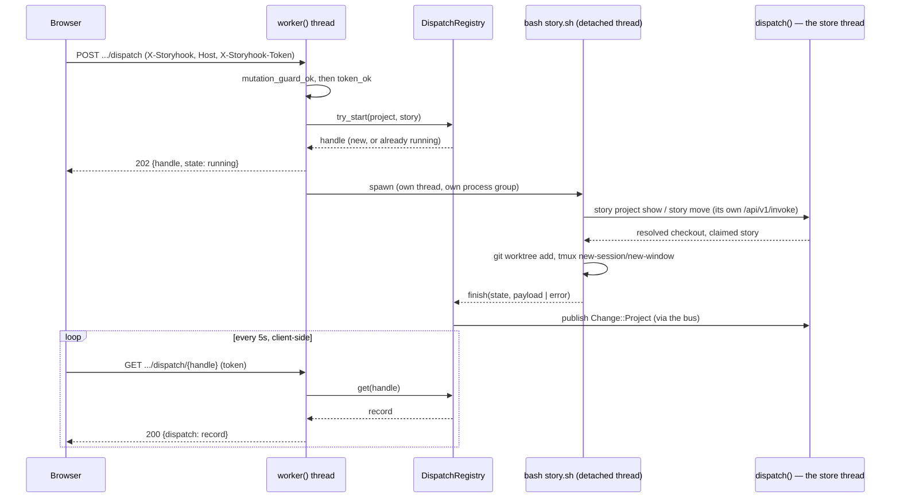

# Dashboard dispatch, and its authorization review

Design of record for **SH-50** (ninth child of epic **SH-112**, blocked on and unblocked
by **SH-120**). Written after implementation rather than before it, because the story's
own acceptance criteria require the review to exist *before the endpoint ships*, not
before it is built — and the review is sharper written against the actual code than
against a proposal for it.

## Context: why this exists

A Dispatch button in the dashboard's story detail drawer, which performs a real
storyhook dispatch — the same worktree, tmux window and agent handoff `/story do`
already produces — reachable from a browser instead of a terminal.

Two unknowns the epic settled before this story could be scoped precisely:

- **Which directory.** A project's checkout comes from `projects.checkout_path`
  (`story project link checkout`). The button is shown only for a project that has one.
- **Who does the work.** The daemon invokes `plugin/claude-code/bin/story.sh dispatch`.
  The worktree/tmux mechanics stay in the shell script; the daemon only invokes it. This
  is deliberately not a reimplementation of dispatch inside the daemon.

The remaining, harder half is the reason this story carried its own authorization
review as an acceptance criterion: this makes a **browser-reachable endpoint that
spawns a terminal session running an agent**, on a daemon that binds the machine's
Tailscale IP as well as loopback.

## The design

### Route table

| Method | Path | Answers |
|---|---|---|
| POST | `/api/repos/{project}/story/{id}/dispatch` | 202, a handle, immediately |
| GET | `/api/repos/{project}/story/{id}/dispatch/{handle}` | 200, the record so far |

Both live in a new module, `src/api/dispatch.rs`, alongside `http`/`rest`/`rpc`/`wire`.

### Off the store thread — the deadlock the design has to avoid

`crate::daemon::serve::dispatch` runs on a fixed pool of `DISPATCHERS` threads that
own the store between them, fed by a rendezvous channel of capacity zero — every
request beyond that many queues behind whichever `rest::route`/`rpc::route` call is
in flight on the rest (SH-173). A dispatch takes 15–35 seconds even on the happy
path, and `story.sh` gets there by making several of its own `story` CLI calls, each
of which — since store isolation landed — reaches this **same** daemon over its own
`/api/v1/invoke` connection, at `hook_depth` 0. Answering a dispatch request on a pool
thread would risk deadlock: with `MAX_RUNNING` dispatches each occupying one pool
thread, their nested calls would have nowhere left to run — the same shape a hook
that calls `story` back into this daemon would hit if its nested call queued behind
the same pool its own parent occupies.

So `api::dispatch::intercept` is checked in `worker()`, before a `Job` is ever built —
the same place `GET /api/events` is already answered in full for the same reason, and
the same shape SH-173's hook-depth lane generalizes: a request whose envelope names
`hook_depth > 0` never queues behind the pool at all, because `hook_depth` caps
nesting at one and a request that cannot recurse cannot deadlock waiting on itself.
The dispatch subprocess runs on its own detached thread, tracked in a
`DispatchRegistry` (in-memory, forgotten on daemon restart) that a `GET` polls.
Nothing in this path ever touches `Serving::store`.

### The registry: async, capped, idempotent per story

A `POST` never blocks on the script. It reserves a slot, spawns, and returns a handle;
a client polls `GET` until `state` leaves `running`. Three properties, all enforced in
`DispatchRegistry` rather than by the HTTP layer:

- **Capped at 4 concurrent dispatches**, across all stories. Not a defense against an
  unauthenticated caller — the token gate already closes that door — but against a
  token holder's own accidents (several tabs, a retried click).
- **Idempotent per story while running.** A repeated `POST` for a story already
  dispatching returns the *same* handle rather than spawning a second script. Once
  finished, a fresh `POST` is a genuinely new attempt — the registry does not remember
  it as still claiming the story, since `story.sh`'s own already-in-progress guard is
  the authority on whether a redispatch is legitimate, not this registry.
- **Retained briefly, then forgotten.** A finished record is evicted once 32 newer
  ones exist, or once 30 minutes have passed, whichever comes first — a poll that
  arrives very late gets a 404, not a stale answer.

`story.sh`'s own JSON result is relayed **verbatim** as the record's `payload` —
`state: ok` for `"ok": true`, `state: refused` for a well-formed `"ok": false` (not
ready, already claimed, a worktree collision — a business outcome, not a defect).
`state: failed` is reserved for the script itself not answering: not found, killed for
overrunning its 180s budget, or exiting with nothing parseable on stdout. This mirrors
the codebase's own precedent (SH-120's council verdict: *"relay the CLI's own refusal
verbatim, never a competing list composed in bash"*) at the daemon/script boundary
instead.

### Session targeting

`story.sh` already supported dispatching outside tmux into a **named**
`STORY_TARGET_SESSION`, provided an operator had started it. The daemon has no tmux
session of its own to arrange ahead of time, so `story.sh` gained
`STORY_CREATE_SESSION`: if the named session doesn't exist, create it (detached)
before opening the dispatch window. The daemon targets one session per project
(`STORY_TARGET_SESSION=<project slug>`), so a project's dispatches accumulate in one
place rather than scattering across ad hoc session names.

### What the daemon does *not* do

- It does not resolve the project's checkout, and does not query the store on the
  request-handling path at all — `story.sh`'s own `story project show --project <slug>`
  (an ordinary nested CLI call) is the sole authority, exactly as the epic specified.
- It does not expose `--auto`. Every dispatch runs in plan mode; the one human
  interaction (approving the plan) still belongs to whoever is at the resulting tmux
  window, not to the dashboard.
- It does not validate `bash`/`jq`/`git`/`tmux` are on `PATH` before spawning — those
  are the script's own dependencies, and its `set -euo pipefail` aborts loudly if one
  is missing, surfacing as a `failed` record with the stderr tail. Only the script's
  own *location* is checked eagerly (`resolve_dispatch_script`), because a script that
  can't be found describes a daemon misconfiguration — true of every future dispatch,
  not this one — and deserves an immediate answer rather than a poll round-trip.

## The authorization review (AC3)

**F1 — the ordinary mutation guard is not authentication.** `mutation_guard_ok`
(`src/api/http.rs:201-209`) checks an `X-Storyhook` header (defeats a plain
cross-origin request — no `Access-Control-Allow-*` answer, so the browser blocks it)
and a trusted `Host` (defeats DNS rebinding). Neither requires a credential. Anything
that can set two headers directly — `curl -H 'X-Storyhook: 1' -H 'Host: <trusted>'`
from any peer the tailnet lets reach the bound IP — passes both with nothing to prove
who it is. **Decision:** dispatch requires the daemon's bearer token
(`X-Storyhook-Token`, `rpc::token_ok`'s own constant-time check) in addition, on both
listeners including loopback — one code path, one test matrix, rather than a loopback
exemption that would need its own justification. **Pre-existing, wider than this
story: filed as [SH-187](#follow-up-stories-filed), left undecided.**

**F2 — process execution reachable from a browser mutation already existed.** A story
*move* already reaches `sh -c` through event hooks (`event_hooks.rs:350-357` ←
`service/mod.rs:258-269`), gated only by the same guard F1 describes. The command text
comes from a file already committed in the checkout, not from the request — smaller
blast radius than dispatch's own attacker-reachable argv, but establishes that
dispatch is a new *kind* of process execution reachable from this surface, not the
first. **Pre-existing, wider than this story: filed as
[SH-188](#follow-up-stories-filed), left undecided.**

**F3 — the residual risk, given F1 and F2 as context.** A peer holding the token who
can *also* reach the ordinary write surface (F1) can `PATCH` a story's description and
then dispatch it, influencing some of what an agent's prompt contains — the prompt
template is fixed (`plugin/claude-code/bin/story.sh:97`), but the story id and title
it interpolates are not. Mitigated by: the token gate (this story); plan mode only,
never `--auto` (a human still approves before anything the agent proposes executes);
and the prompt template itself asking the agent to investigate and post a plan for
approval, not to act unilaterally.

**F4 — the token's scope and limits, stated plainly.** Minted once per daemon lifetime
(`lifecycle::mint_token`), not per-user, not rotated except by restart. Its
confidentiality on the tailnet leg rests entirely on Tailscale's own WireGuard
transport — this design adds no cryptography of its own, only a value an unprivileged
tailnet peer cannot read (it lives in a 0600 portfile) and cannot enumerate (401 before
any handle lookup — `intercept`'s guard order mirrors `rpc::admission`'s own reasoning
for the identical purpose). `story daemon token` is the sanctioned way to read it — it
refuses rather than starting a daemon, since this is a question about a daemon
presumably already serving the dashboard the token is for.

**F5 — the token in the browser.** Held in `sessionStorage`, not `localStorage` —
gone when the tab closes. The dashboard's own XSS surface: DOM is built through
`el()` (`web_dashboard.html:786`), which assigns props/children as properties and text
nodes and never writes `innerHTML` from content — the one place `.innerHTML` is even
read is `esc()` (`:777-782`), a round-trip through `textContent` used to *escape* text,
not to insert it — under a CSP of `default-src 'self'; script-src 'unsafe-inline';
style-src 'unsafe-inline'` (`http.rs:35`) that at least forbids loading a *remote*
script even if some injection vector were later found. Not a claim that no XSS is
possible — a claim that this design does not add a new stored-token *disclosure*
mechanism beyond what already existed for any other data the dashboard renders.

**F6 — no shell in the daemon.** `Command::new("bash").arg(script)...` with explicit,
individually-set arguments; no `sh -c` string built from request data anywhere in this
path. The project slug and story id are validated against `^[A-Za-z0-9][A-Za-z0-9_-]*$`
(`valid_segment`, matching `story.sh`'s own `valid_story_id`) before they ever reach an
argv, rejecting path traversal and whitespace at the one boundary where a URL segment
becomes a process argument.

**F7 — process hygiene, once spawned.** Stdio is unlinked `tempfile()` handles, not
pipes — the SH-141 idiom `event_hooks.rs` already established, so no descendant that
outlives the timeout can hold the daemon waiting on an end-of-file. The child gets its
own process group, killed whole (not just the leader) if it overruns 180 seconds, so an
abandoned `git fetch`/`tmux`/`claude` probe cannot survive a killed dispatch. Classified
`Kind::Waited` in `tests/spawn_inventory.rs`'s frozen inventory, on the same reasoning
as `event_hooks.rs`'s own entry.

### Decision, summarized

Ship the token gate as F1 requires it, on both listeners. Do not fix F1 or F2
themselves here — they are pre-existing, wider than one endpoint, and each carries a
real design trade-off (F1's fix costs tailnet write access without a token everywhere,
not just here; F2's fix is a deliberate feature — `cmd &` backgrounding — someone chose
on purpose). Both are filed and linked below rather than silently absorbed.

## Follow-up stories filed

Both live in the storyhook store (`story show <id>` is the source of truth), not in
this repository's filesystem — there is nothing under `docs/` to link to.

- **SH-187** — the dashboard's mutation guard is not authentication; any tailnet peer
  can write with two headers (F1). Child of SH-112, relates-to SH-50.
- **SH-188** — event hooks already let a browser-reachable story mutation run `sh -c`
  in the project checkout (F2). Child of SH-112, relates-to SH-50.

## As built — found only once real story.sh runs were driven end to end

**The daemon must never let the dispatch child inherit its own `cwd`.** Discovered by
this story's own e2e test, not by review: a daemon started from a directory that is
later deleted (a build's temp dir; in the failing case, an e2e harness's own scratch
directory) holds that `cwd` indefinitely, and `bash`'s own startup calls `getcwd()`
before the script's first line runs — failing loudly on stderr (`shell-init: error
retrieving current directory`) if it's gone, which this module's `classify()`
correctly reported as the dispatch's `failed` error, obscuring the real one underneath.
Fixed by pinning `Command::current_dir(env.home())` explicitly rather than inheriting
anything — `story.sh`'s own `enter_checkout` immediately `cd`s away regardless, so the
starting directory's only job is to always exist.

**The e2e seed fixtures needed to become real git repositories.** Nothing before this
story ever asked Alpha/Beta's seeded checkouts (`scripts/run-e2e.sh`) to be actual git
repositories — a checkout is only a recorded path until something reads it as one, and
`project-selector.spec.ts` never did. Dispatch's worktree creation does. Confirmed the
hard way: the first real dispatch attempt against the e2e fixtures refused with
`checkout ... is not a git repository`, `story.sh`'s own message, verbatim, exactly as
designed to relay.

## Verification

`make test` is the gate. Coverage, by layer:

- **Unit** (`src/api/dispatch.rs`): route matching (including the not-my-path fallback
  to ordinary REST/RPC), guard ordering (403 before 401 before 404/405, and 401 before
  a handle lookup), the registry's capacity/idempotency/eviction rules, and
  `classify()`'s three outcomes against canned stdout/stderr.
- **Integration** (`tests/dispatch_endpoint.rs`): a real daemon subprocess (for a real
  minted token) with `STORYHOOK_DISPATCH_SCRIPT` pointed at a small stub — every guard
  case, the full 202-then-poll round trip, a refusal relayed verbatim, a silent script
  reported as `failed`, and a repeated `POST` reusing one handle.
- **Plugin** (`plugin/claude-code/tests/`): `test-dispatch-target-session.sh` (the
  pre-existing named-session path, which had zero coverage before this story) and
  `test-dispatch-create-session.sh` (absent → created; present → not recreated;
  creation failure → the same worktree/claim rollback a failed `new-window` already
  does).
- **End-to-end** (`e2e/specs/dispatch.spec.ts`): the real `story.sh` against the
  plugin's own fake tmux — button absent for a checkout-less project (AC1); present,
  clicked, token prompted for, polled to completion, and a real worktree left on disk
  (AC2); a saved token not re-prompted for on a second dispatch.
