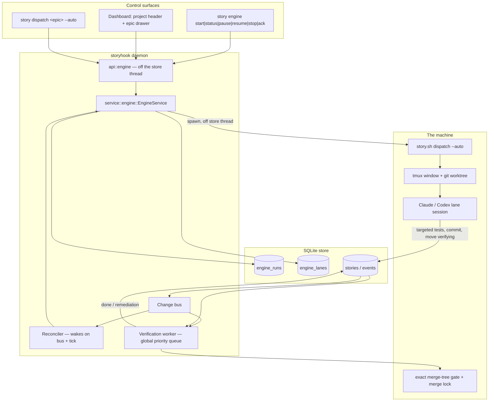
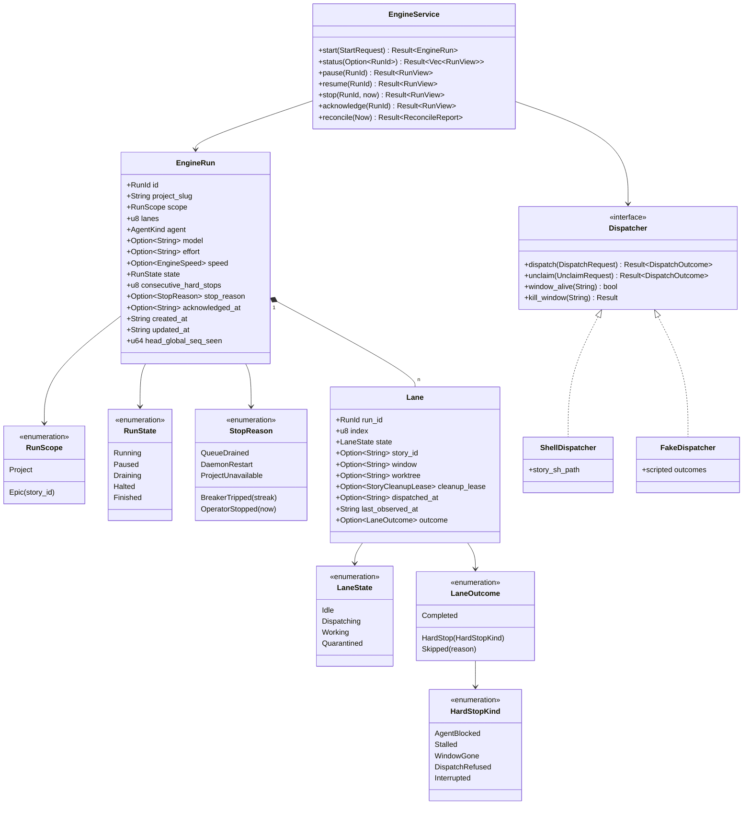
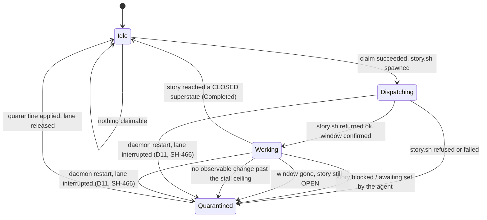
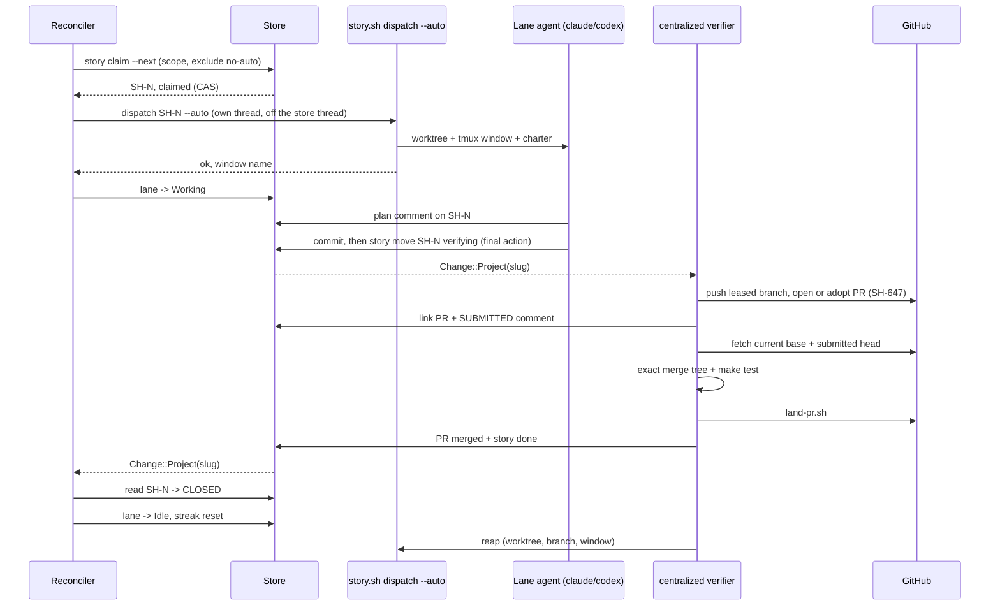

# Full Auto: the storyhook work engine

Design of record for the **Full Auto** epic. Storyhook gains an *engine*: a
daemon-owned supervisor that claims ready stories, dispatches each into its own
worktree + tmux window under the existing autonomous charter, watches them land,
and claims the next — one lane at a time by default, `--lanes <n>` in parallel.

Two entry points, one engine:

- **Project scope** — a control in the dashboard's project header, or
  `story engine start [--lanes <n>] [provider options]`. Works the project's
  ready backlog.
- **Epic scope** — `story dispatch <epic-id> --auto` (equivalently `/story do
  <epic> --auto`), or a control in the epic's drawer. Works that epic's
  descendant subtree.

Nothing here reimplements dispatch. `plugins/story/bin/story.sh dispatch
<id> --auto` remains the whole of the worktree/tmux/charter mechanics, exactly
as `api::dispatch` already invokes it (`docs/spec/dashboard-dispatch.md`). The
engine decides *which story, when, and what to do about the result*.

## Vocabulary

| Term | Meaning |
|---|---|
| **Run** | One engine execution, scoped to a project and optionally narrowed to an epic subtree. At most one live run per project. |
| **Lane** | A concurrency slot inside a run. Holds at most one story at a time. `--lanes <n>` sets how many a run has; default 1. |
| **Dispatch** | The existing `story.sh dispatch <id> --auto` side effects: CAS claim, fresh-base worktree, tmux window, agent launch, charter delivery. |
| **Hard stop** | A lane whose story did not reach a CLOSED superstate: blocked by the agent, stalled, or interrupted. |
| **Quarantine** | The engine's response to a hard stop: the story is blocked with a reason, and its worktree, branch, PR and window are left intact for forensics. |
| **Breaker** | The circuit breaker: three consecutive hard stops with no completion between them halts the run. |

## Decisions of record

Settled in interrogation on 2026-08-24, before any code. Where a decision had a
defensible alternative, the reason it lost is recorded — this project's standing
rule that a ceiling, a mechanism, or a scope derives from something rather than
being picked.

| # | Decision | Why, and what lost |
|---|---|---|
| D1 | **The daemon owns the engine.** Run and lane state live in the store; the reconcile loop runs in the daemon. | A shell poller in the `merge-watch.sh` mould was the cheaper build, but run state that dies with a terminal window cannot answer the dashboard, cannot survive a daemon restart, and gives the CLI and the web UI two different notions of "is a run live". |
| D2 | **A lane is a window + worktree per story**, created and reaped per story exactly as `--auto` does today. | Context reset is free: each story gets a new process. The alternative — one long-lived lane session freshen-cleared between stories — buys faster startup at the cost of switching a live session's worktree and cwd, and a wedged pane then strands the lane rather than one story. |
| D3 | **Completion is a store fact, not a rendered one.** A lane frees when its story leaves the OPEN superstate. Window liveness and a stall timeout detect a *dead* lane; they never declare success. | SH-226: a frame rule and a prompt glyph were read as "the agent is ready" and the charter was executed by zsh. A tmux window closing is evidence about a window. |
| D4 | **Lane agents run only new and directly impacted tests. One daemon verification worker serializes `make test` for stories in required OPEN state `verifying`.** | The expensive release gate is a machine concern, not per-agent work. A store-derived queue survives restarts, removes suite contention between lanes, and orders candidates by priority then age (SH-521). |
| D5 | **The verification worker owns submission, exact-merge-tree certification, `land-pr.sh`, the transition to `done`, and reap.** Agents commit and move the story to `verifying` from inside their worktree as their final action, and stop; the verifier pushes the leased branch and opens or adopts the PR before it verifies (SH-647). | Merge authority must not depend on a lane remembering policy. The daemon can serialize every project, retry infrastructure failures without blaming the author, and return conflict/red candidates to their exact provider-tagged pane (SH-521). |
| D6 | **Unattendedness is enforced by provider-scoped approval gates**, inert unless the lane's marker environment variable is set. `PreToolUse` allows Claude's plan tool and denies question tools; dispatch arms each provider's pane-lifetime exact watcher after Plan mode is confirmed and before submitting the charter. A watcher retries bounded transport/TUI races and completes only after its exact dialog leaves the original live pane. | Live probes proved neither Claude's `PreToolUse allow` nor Codex's `--approve-for-me` accepts the separate plan-review UI. Claude 2.1.261 also stopped emitting the `PermissionRequest` event used by the first implementation. Provider-specific exact strings and pane identity guard every keystroke. A changed UI fails closed instead of receiving input; tmux command success alone is not provider acknowledgement (SH-570). |
| D7 | **Both agents. Codex was verified first.** SH-459 measured Codex CLI 0.149.0 denying `request_user_input` through `PreToolUse`, returning the denial reason to the model, and failing open at the configured timeout. | A Codex lane that silently stalls on a question nobody will answer is the exact failure Full Auto exists to remove. The native denial surface exists, so both provider arms ship; the measured timeout hole remains covered by the stall ceiling and quarantine — a ceiling that, since SH-657, requires the lane's terminal to have gone silent too, not only its story. |
| D8 | **Epic semantics from SH-446 are absorbed into this program**, not merely depended on: epic state becomes computed from children, epic priority stays stored, and `story next` breaks priority ties on epic priority. | The epic entry point is meaningless without it, and "an epic with all finished children is finished" is the run's own termination condition. |
| D9 | **The queue is live and unbounded.** `story next` is re-asked every time a lane frees; a run ends when nothing is claimable. | An epic's children unblock each other as the run's own merges land; a snapshot taken at start would miss most of them. |
| D10 | **Quarantine and continue; halt on three consecutive hard stops**, reset by any completion. Below the threshold, durable evidence moves to the story and run while the lane returns to service. | One hard story never strands a run; a broken tree halts within three attempts, with the whole triggering series retained even when one lane produced it sequentially. |
| D11 | **On daemon restart or reboot, interrupted lanes are quarantined and reported, never resumed.** Worktree and branch are preserved. | A fresh agent inheriting uncommitted work it did not write is a hazard with no upside; the story is still there to be re-dispatched deliberately. Re-confirmed against a live alternative once `story reset` existed: the engine must never destroy a crashed agent's work unattended, so a human runs `reset` deliberately if they want the clean restart. |
| D12 | **Two reserved labels.** `no-auto`: still returned by `story next` and claimable by hand, but never dispatched by the engine — human-in-the-loop work. `human-only`: never returned by `story next` at all. Both render with an orange tint in the dashboard. | The engine skips `no-auto` rather than holding a lane open waiting for a person who is asleep; `human-only` is removed from the ready queue entirely because no agent should be offered it. |
| D13 | **Halt, drain and lane-failure fire an event hook and raise a non-dismissable dashboard modal that persists until acknowledged or a live run is abandoned.** Escape and backdrop presses do nothing; alerts queue newest first, one modal at a time. | A gate that goes silent must read as stale rather than as an all-clear (SH-306, SH-418). A push you might miss plus a modal that only a durable operator outcome can close is the pair that survives a missed notification. Allowing ordinary overlay dismissal would recreate the silence this decision forbids. |
| D14 | **Multiple runs, one per project, with independent per-run lane limits (SH-672).** | Each run honors its configured `--lanes`; other runs and manual sessions do not consume its capacity. HTTP request concurrency is a separate bound. |
| D15 | **Verification infrastructure failures are classified and bounded.** Permanent local failures halt the serialized queue immediately; retryable network failures get three attempts across one 60-second progress-freshness window. One durable incident drives an edited story comment, stalled queue status, a `verification_halted` hook and an acknowledgement banner. | An infrastructure result cannot prove later candidates are safe, so skipping would trade visible zero throughput for hidden partial certification. Exact-incident acknowledgement means “repair complete; retry,” and cannot clear a newer halt (SH-573). |
| D16 | **Provider configuration is explicit, durable run state that operators may revise while a run is running or paused.** Each claim snapshots the current selection transactionally; occupied lanes keep the selection they launched with and future claims use the revision. | Browser preferences and provider environment variables remain outside the run, so neither can silently change it. Explicit reconfiguration gives an operator one auditable control point without interrupting work already in flight. Open model and effort tokens preserve provider evolution; speed is a closed two-value policy because StoryHook itself translates it into launch behavior. |

**Superseded in part by SH-645 (2026-09-10).** The rows above are the record
of what was decided, with D14 revised by SH-672; `docs/spec/verification-workflow.md`
is now the design of record for everything from submission to reap, and three
rows read differently against it. D4's "priority then age": the age that ships
is story `created_at`, and SH-651 makes it the time the story entered
`verifying`. D5's "serialize every project": what shipped for a year was one
global worker over one queue spanning every project; since SH-648 the worker,
the queue, the incident halt and the conflict hold are per project. D14's
"the locks in D4/D5 are sized against" a machine-wide budget: the `gate` and
`merge` locks are keyed by project since SH-648, so two projects' suites may
overlap on one machine — a trade-off that spec states rather than this table.

**Historical amendment, superseded by SH-672 below: SH-655 (2026-09-10).** D14's "machine-wide lane budget" was
enforced over `engine_lanes` rows alone, so a session `/story do` opened by
hand — the same `cmd_dispatch`, worktree, window and cold workspace build —
counted for nothing, and the dashboard's own in-memory cap (`MAX_RUNNING`, a
bound on dispatches *in flight*, never on sessions) was a third counter over
one machine. Three producers, three counters. The budget is now measured by
every door against one census: the live agent windows on the tmux server —
`@storyhook-agent` set, pane not dead — which `story lane-budget` reports,
`cmd_dispatch` refuses past ahead of any claim (`--over-budget` says you meant
it), and the engine's fill counts alongside its own lanes. See the SH-655
As-built entry below.

## Assumptions recorded rather than asked

| # | Assumption |
|---|---|
| A1 | `human-only` is filtered in `ready_queue` — the `story next` path — and does **not** make a story `!is_ready`. A human can still progress it, so it must not read as blocked, and must not make its parent epic compute as blocked. |
| A2 | Run and lane state are **operational tables**, not story events. The append-only event log stays the fold `story doctor`'s `diff_rebuilt` compares against, and heartbeat-rate writes have no business in a log nothing compacts. What the run *did* to stories is already event-sourced on the stories themselves. |
| A3 | The engine invokes `story.sh dispatch`; the worktree/tmux/charter mechanics are not reimplemented in Rust. |
| A4 | Claims stay serial even at N lanes. `story claim --next` is the arbiter; a claim is milliseconds and the store is the only thing that can adjudicate a race. |
| A5 | A project with no `projects.checkout_path` is refused, with the same message the dashboard's Dispatch button already gives. |
| A6 | Lane charters keep the standing no-version-bump / no-deploy prohibition. Nothing about Full Auto relaxes it. |

## Architecture



The load-bearing shape: **the agent never reports to the engine.** It writes to
the store the same way any `story` caller does, and the engine reads the store.
There is no lane-to-engine channel to go stale, and no agent assertion of
completion to be wrong (D3).

**Daemon-owned non-retryable work drains before graceful replacement
(SH-556).** The centralized verifier and synchronous dashboard `stop --now`
cleanup both enter the daemon's shared lifecycle registry before they mutate
external state. Verification publishes
`verify:<project>:<story>:<generation>` and stays owned through outcome and
story-state recording. Immediate engine stop publishes
`engine-stop:<project>:<run>` and stays owned through lane termination,
unclaim, and final run-state recording. Ordinary engine controls and requests
rejected during validation never enter the registry. Graceful replacement
therefore waits for either operation; forced shutdown retains its existing
stale-ledger recovery behavior.

## Type-system proposal



`Dispatcher` is the seam that makes the engine testable without tmux, in the
same spirit as the `Invoker` seam W0b introduced. `ShellDispatcher` shells out
to `story.sh`; `FakeDispatcher` lets `tests/engine_reconcile.rs` script a
completion, a block, a stall and a refusal without spawning anything. The rule
that end-to-end tests may mock data but never behavior still holds: the browser
and shell suites exercise `ShellDispatcher`.

## Lane lifecycle



`Completed` resets the run's `consecutive_hard_stops` to zero. Every
`Quarantined` transition increments it; reaching three halts the run (D10).
A restart pass and paused or halted run retain the quarantined lane itself.
A steady running pass releases it after breaker accounting; draining releases
it before checking whether the run finished.

## One story through a lane



## The store

Two new tables, one migration. Neither is event-sourced (A2).

```sql
CREATE TABLE engine_runs (
  id                     TEXT PRIMARY KEY,
  project_slug           TEXT NOT NULL,
  scope_kind             TEXT NOT NULL CHECK (scope_kind IN ('project','epic')),
  scope_story_id         TEXT,
  lanes                  INTEGER NOT NULL CHECK (lanes >= 1),
  agent                  TEXT NOT NULL CHECK (agent IN ('claude','codex')),
  state                  TEXT NOT NULL CHECK (state IN ('running','paused','draining','halted','finished')),
  consecutive_hard_stops INTEGER NOT NULL DEFAULT 0,
  recent_quarantines_json TEXT NOT NULL DEFAULT '[]',
  stop_reason            TEXT,
  acknowledged_at        TEXT,
  created_at             TEXT NOT NULL,
  updated_at             TEXT NOT NULL,
  CHECK ((scope_kind = 'epic') = (scope_story_id IS NOT NULL))
);

-- One live run per project, enforced by the schema rather than by a read.
CREATE UNIQUE INDEX engine_runs_one_live_per_project
  ON engine_runs (project_slug)
  WHERE state IN ('running','paused','draining');

CREATE TABLE engine_lanes (
  run_id            TEXT NOT NULL REFERENCES engine_runs(id) ON DELETE CASCADE,
  lane_index        INTEGER NOT NULL,
  state             TEXT NOT NULL CHECK (state IN ('idle','dispatching','working','quarantined')),
  story_id          TEXT,
  pane_id           TEXT,
  window_name       TEXT,
  worktree_path     TEXT,
  dispatched_at     TEXT,
  last_observed_at  TEXT NOT NULL,
  outcome           TEXT,
  outcome_detail    TEXT,
  PRIMARY KEY (run_id, lane_index),
  CHECK ((state = 'idle') = (story_id IS NULL))
);
```

Three things the CHECKs buy, in this project's own idiom (SH-364: a column a
fixture can lie about needs a test; a column with a CHECK does not):

- A run's scope cannot be half-stated — epic scope without an epic id is
  unrepresentable.
- "One live run per project" (D14) is a partial unique index, so a race between
  two `start` calls is settled by SQLite, not by a read-then-write.
- A lane cannot be idle while holding a story, which is precisely the leak a
  reconcile bug would otherwise produce silently.

## The reconcile loop

The engine has no busy loop. `reconcile` runs when woken by
`crate::daemon::engine::poll_engine` (SH-466), on:

- `Change::Project(slug)` on the daemon's bus, for a slug some live run names —
  which is how a lane's own `story move` reaches the engine;
- a coarse liveness tick, whose period derives from the stall ceiling rather
  than being picked (SH-394's rule, one axis over from wall clocks);
- any control command (`start`, `pause`, `resume`, `stop`, `ack`), each of
  which already publishes `Change::Project` on success.

One pass, per live run:

1. **Observe.** For each non-idle lane, read its story's superstate and state,
   and probe dispatch's stable `%pane-id`. Pre-migration lanes fall back to an
   exact `=session:=window` target; bare tmux names are never script identity.
2. **Classify** each lane per the lifecycle diagram above.
3. **Quarantine** each hard stop: `story block <id> "<reason>"` naming the kind,
   the lane, the run, the window and the worktree; leave worktree, branch, PR
   and window intact. The reason is free text, not a `--on` edge, because the
   blocker is not a story — SH-398's rule is about blockers that *are* stories.
4. **Breaker.** Append the hard stop to the run's bounded recent series. Three
   consecutive hard stops → `state = halted`, `stop_reason = BreakerTripped`,
   fire the hook, raise the persistent modal alert. A completion zeroes the streak and series.
5. **Release** quarantined lanes only when the run remains running in a steady
   pass, or is draining. Halted, paused, and restart-pass lanes retain evidence.
6. **Fill** idle lanes while the run is `running` and its configured lane count
   allows: `story claim --next` scoped and label-filtered, then dispatch.
   A refusal is accounted immediately and ends that fill attempt; it cannot
   prove the queue drained until the next wake.
7. **Terminate.** Nothing claimable and every lane idle → `finished`,
   `stop_reason = QueueDrained`, hook + persistent modal alert.

`paused` is what `pause` produces: no new claims, existing lanes run to their
natural end, and `resume` returns the run to `running`. `draining` is the
irreversible state graceful and immediate stop produce; graceful stop becomes
`finished` when the last lane frees. `stop --now`
additionally kills lane windows and returns each claimed story to its prior
state, preserving worktrees and branches — plain `story unclaim`, which touches
no on-disk state by construction rather than by opting out of doing so.

### Where the dispatch subprocess runs

Exactly where `api::dispatch` already puts it: **not on a store-pool thread**.
`story.sh` makes its own `story` calls back into this daemon over
`/api/v1/invoke`, so answering from a pool thread risks the deadlock
`docs/spec/dashboard-dispatch.md` documents. The engine reuses that module's
detached-thread pattern and its `MAX_RUNNING` accounting rather than opening a
second, differently-behaved door onto the same script.

### The restart pass (D11, SH-466)

Before any run resumes claiming, one extra pass runs once per live run, over
every project the store knows about (`ReadOps::live_engine_runs`, deliberately
machine-wide for exactly this). It differs from the ordinary pass in only two
places:

- a dead window is `HardStop(Interrupted)`, never `WindowGone` — nobody
  watched it close, the daemon that would have watched just restarted;
- the stall clock is **re-seeded, never read**: a lane whose window survived
  a daemon-only restart has no observation from anywhere inside the outage,
  so an unmoved seq states nothing about whether it stalled during it
  (SH-372) rather than being misread as a stall the instant the daemon comes
  back.

Completion, the agent-blocked signal and the verifying handoff are tested
identically to the ordinary pass and in the same order — a story that closed,
was blocked, or reached `verifying` while the daemon was down is exactly what
it would have been had the daemon stayed up. The restart pass never fills an
idle lane and never terminates a run: `story.sh` calls back into this same
daemon over `/api/v1/invoke`, which is not yet answering this early in
startup, and "the run then continues with fresh lanes" (D11) is the *next*,
ordinary pass's job. The breaker still runs: three lanes interrupted by one
reboot is three consecutive hard stops and halts the run exactly as three
ordinary hard stops would, deliberately — a machine that just rebooted
mid-run deserves a human look before it starts merging again.

`crate::daemon::lifecycle::run` runs this pass synchronously before binding or
publishing the daemon's portfile. After server readiness,
`crate::daemon::engine::poll_engine` wakes the ordinary pass on a
project-change bus event or a coarse tick derived from
`STALL_CEILING_SECS` — the trigger this document originally assigned to "the
daemon wiring" without naming which story owned it. The startup ordering was
made an explicit admission barrier in SH-617; `EngineService::reconcile` had
zero production callers before SH-466. See the As-built section below.

## Enforcing unattendedness

`plugins/story/hooks/full-auto.sh`, wired as `PreToolUse` in the plugin's
existing `hooks.json` — the same file both Claude Code and Codex already
discover for `SessionStart`, `PostToolUse(Bash)` and `Stop`.

**Inert by default.** With both `STORYHOOK_AUTO` and `STORYHOOK_FULL_AUTO`
unset, the hook emits no decision and exits 0. An ordinary autonomous dispatch
sets the first marker; only an engine lane sets the second. This inertness is a
tested property, in the shape
`test-charter-inert.sh` already tests the charter's.

When active:

| Tool | Decision | Feedback to the agent |
|---|---|---|
| Claude plan tool (`PreToolUse: ExitPlanMode`) | allow | — |
| Codex-compatible `ExitPlanMode` event | no decision | Codex rejects a bare `allow`; its watcher owns approval. |
| Claude plan review (watcher armed by dispatch) | bounded exact-gated tmux Return | Selects the already-highlighted “Yes, and use auto mode” only while the original dispatched pane process remains live, and confirms the dialog leaves that process. |
| Codex plan review (watcher armed after confirmed Plan mode) | bounded exact-gated tmux Return | Selects the already-highlighted “Yes, implement this plan” only while the original dispatched pane process remains live, and confirms the dialog leaves that process. |
| Question-asking (Claude's `AskUserQuestion`; Codex's `request_user_input`) | **deny** | "This is an unattended Storyhook session; nobody can answer. If the question has one clear best answer, research and decide it. If two or more are defensible, convene `/council-vote`. Record the decision as a comment on `<story>` the moment you make it." |
| Everything else | no decision | — |

The permission *posture* is not the hook's job: the engine launches the lane
with the provider's built-in Auto command, or the dedicated
`STORY_FULL_AUTO_LAUNCH_CMD` override (Claude: plan mode plus an accept-edits
posture after approval). The daemon's general `STORY_LAUNCH_CMD` is never used
for an engine lane. The hook decides two things and annotates nothing else. A
hook that annotates must never decide, and one that decides must decide only
what it was built to (SH-355).

### Codex `PreToolUse` contract (SH-459)

Measured against the installed Codex CLI 0.149.0, then checked against OpenAI's
matching `rust-v0.149.0` source tag. A `PreToolUse` matcher named
`request_user_input` runs before the question UI opens. Its JSON stdin carries:

- `hook_event_name: "PreToolUse"`, `tool_name: "request_user_input"`, the
  complete `tool_input`, and `tool_use_id`;
- `session_id`, `turn_id`, `transcript_path`, `cwd`, `model`, and
  `permission_mode` (plus agent identity fields for a subagent).

`turn_id` is Codex's required extension and is absent from Claude's hook
contract. The shared hook uses its presence only to keep a Codex
`ExitPlanMode` event inert: Codex treats `permissionDecision: "allow"` without
an `updatedInput` rewrite as an unsupported hook result, and its exact-pane
watcher already owns plan approval. Claude retains the explicit `allow` its
plan tool requires.

The supported denial and feedback fields are nested under
`hookSpecificOutput`:

```json
{
  "hookSpecificOutput": {
    "hookEventName": "PreToolUse",
    "permissionDecision": "deny",
    "permissionDecisionReason": "This is an unattended lane; decide instead of asking."
  }
}
```

`permissionDecisionReason` is both the blocking reason and model feedback. In
the live probe Codex showed `PreToolUse hook (blocked)`, did not open the
question UI, and returned `Tool call blocked by PreToolUse hook: ... Tool:
request_user_input` to the model. This is a minimal standalone fixture:

```json
{
  "hooks": {
    "PreToolUse": [
      {
        "matcher": "request_user_input",
        "hooks": [
          {
            "type": "command",
            "command": "bash \".codex/deny-question.sh\"",
            "timeout": 3
          }
        ]
      }
    ]
  }
}
```

```bash
#!/usr/bin/env bash
printf '%s\n' '{"hookSpecificOutput":{"hookEventName":"PreToolUse","permissionDecision":"deny","permissionDecisionReason":"This is an unattended lane; decide instead of asking."}}'
exit 0
```

The source-of-truth schemas are
`codex-rs/hooks/schema/generated/pre-tool-use.command.input.schema.json` and
`pre-tool-use.command.output.schema.json`; execution is in
`hooks/src/events/pre_tool_use.rs`, `core/src/hook_runtime.rs`, and
`core/src/tools/registry.rs` at OpenAI Codex tag `rust-v0.149.0` (commit
`758ef40`).

**The known hole, stated rather than papered over.** `PreToolUse` fails *open*
at its timeout on both hosts. Claude's harness behavior was already measured in
SH-306. SH-459 configured the Codex matcher above with `timeout: 1` and made the
hook sleep for three seconds: Codex reported `hook timed out after 1s` and then
opened the question UI. If the question-deny hook times out, the agent asks a
question, nobody answers, and the lane stalls. That is caught by the stall
ceiling and quarantined with a reason naming it. Detected and reported, not
silent — which is the bar.

## Central verification and machine locks

`scripts/machine-lock.sh <name> -- <command...>`: a pid-checked, stale-tolerant
advisory lock, in the shape `browser-watch.sh`'s own lock already uses.
Three names are live — the two below and `release-observer`, taken by
`scripts/release-watch.sh` around one observer pass (`release-observer.md`) —
and lane agents acquire none of them themselves (SH-521). `gate` and `merge`
carry the project — the canonical git common dir, hashed into the key
(SH-648) — so every worktree of one clone shares one of each and a different
repository does not; `release-observer` stays machine-wide.
`verification-workflow.md`'s "The locks" section is the statement of record,
including the one invariant every verification depends on: `merge-watch.sh`'s
environment scrub must never strip `STORYHOOK_MACHINE_LOCKS`, or the inner
`gate` take inside `make test` waits on its own outer holder for ever.

- **`gate`** — the verification worker takes it once around the complete
  speculative `make test` run against the predicted merge tree. The two Rust
  batteries still take it inside `scripts/run-tests.sh`, where the acquisition
  is reentrant for centralized verification and continues to serialize every
  interactive or direct caller. Holding it across the complete centralized
  run prevents another verifier or developer suite from interleaving between
  batteries and consuming a second lock-wait window inside the outer timeout
  (SH-589).
- **`merge`** — taken by `scripts/land-pr.sh <pr>`, which runs
  `merge-preflight.sh` for the PR, merges with `gh pr merge --merge`, verifies
  the merge landed, and deletes the branch. The verification worker invokes it
  only after the exact tree has a gate/full receipt.

Waiting is reported, and every wait ceiling derives from the suite's own
measured budget rather than a bare literal (SH-394).

## Epics (SH-446, absorbed)

Epic-ness is structural: a story with at least one `parent-of` edge is an epic.

**State is computed, never stored.** Turning a story into an epic deletes its
stored state; losing its last child stamps it with the state it computed to at
that moment, as an explicit event, so nothing is invented and the transition is
auditable.

| Children | Epic computes to |
|---|---|
| All in the project's neutral open state | that state (`todo`) |
| Any child active (in-progress, verifying, or any `role: active` state) | the active state (`in-progress`) |
| Every incomplete child is blocked — reserved `blocked` state, `awaiting` set, an open `blocked-by`, or `obviated-by` | `blocked` |
| Every child CLOSED | `done`, unless every child shares one non-`done` CLOSED state, in which case that state |
| — | An epic is **never** `verifying` |

Edge cases the story asked to have filled in:

| Case | Resolution |
|---|---|
| Epic of epics | Recursive: a child epic's own computed state feeds its parent. |
| Draft children | A draft is incomplete but **not** blocked — a human can publish it — so it holds the epic at `todo` rather than making it `blocked`. |
| A child with `awaiting` set | Blocked, for the epic's purposes: nothing can proceed on it. |
| Mixed CLOSED states | See the table: unanimous non-`done` wins, otherwise `done`. |
| A story with several parents | Each parent computes independently from its own children. |
| Epic with no children | Not an epic. It keeps stored state. |

**Priority stays stored and independent** of children (SH-446's own words), and
`priority_assessed` semantics are unchanged.

**`story next` gains an epic-priority tie-break**, at the highest precedence
among tiebreakers: among ready stories of equal priority, the priority of the
nearest ancestor epic decides, then story number. A story with **no** parent
epic is ordered as if its parent's priority equalled its own — neither lifted
nor demoted, because its own priority is the only honest statement about it.
`ready_order` remains total: the story number still ends it.

**Epics are not actionable.** They already never surface in `story next`
(`!has_children`). Additionally: `story move` on an epic is refused (its state
is computed), `story dispatch <epic>` without `--auto` is refused with a pointer
to the engine, and the scaffolded guidance says an epic tracks children and
carries no steps of its own.

## The reserved labels

| Label | `story next` returns it | Engine dispatches it | Rendering |
|---|---|---|---|
| `no-auto` | yes | **no** — skipped, listed as needing a human | orange tint |
| `human-only` | **no** — filtered in `ready_queue` | no | orange tint |

`human-only` filters at the `next` path only (A1). It does not make a story
`!is_ready`, so the board's ready count is unchanged and an epic whose only
incomplete child is `human-only` is **not** blocked — a human can progress it.

The tint is `var(--warn)` on `var(--warn-soft)`, declared in all four of the
dashboard's palette blocks and applied by the single `.chip-reserved` rule
(SH-454). It is deliberately *not* red: red is already spoken for by the
blocked and danger signals, and a reserved label is not a fault.

The engine's claim is `story claim --next` narrowed by two new filters:
`--epic <id>` (the descendant subtree) and `--exclude-label <csv>`. Both are
ordinary query flags accepted on **both** doors onto the ready queue — `story
next`, which reads, and `story claim --next`, which reads and takes — rather
than engine-private behavior hidden inside a service. Filtering what the engine
*looks at* without filtering what it *takes* would leave the half that matters
unguarded.

Claiming is one verb, `story claim <id> | --next` (epic SH-475): both forms
mutating, exactly one required, so a dropped argument can never silently claim
whatever happened to be top-priority. SH-477 removed the claiming mode SH-344
had bolted onto `story next`, so `story next` is a pure read again. Releasing a claim is its inverse,
`story unclaim <id>` (SH-483, with its plugin half in SH-484) — the primitive
`stop --now` routes through rather than composing its own `story move`.
`unclaim` restores the claim's state and closes the lane's window; it does not
touch on-disk state at all. Its destructive sibling `story reset <id>` deletes
the worktree and branch for a clean restart, and **the engine never calls it**
— see the restart policy below.

As built (SH-484), both are `story.sh` verbs — `story.sh unclaim <id>` and
`story.sh reset <id> [--force]` — because the window and the worktree are tmux
and git mechanics, which is also why neither is reachable over MCP. Two details
of the plugin half bear on the engine. First, `story.sh unclaim` refuses when
the story is not in the active-role state (`unclaim-conflict`) and leaves the
window alone, so a lane whose story somebody else has already moved is reported
rather than torn down on a claim the engine no longer holds. Second, when the
caller's own pane is the lane's window, `unclaim` performs the release and
leaves that window open, naming the skip — it never refuses on that ground,
which is what lets a lane release itself. `reset` refuses that case instead
(`self-window`), and `--force` does not override it; since the engine never
calls `reset`, that refusal is a guard for a human, not a constraint on the
engine.

**`unclaim` restores the state a story was claimed from**, derived from the
story's own event log inside its own transaction — `StoryStateChanged` records
only the destination, so it is a short replay rather than a field read. The
engine therefore needs no `claimed_from` column, no explicit `story move`, and
no second release path: it calls `unclaim` and the store answers the question.
Where the replay cannot answer it falls back to `todo` and **says so** — in the
result and in the default comment. A silent substitution there would store a
wrong answer about where the work came from. As built (SH-483) there are three
such cases, each reported under its own `restore_fallback` code: a story created
directly into the active state (`no-prior-state`), a prior state since removed
from the vocabulary (`prior-state-removed`), and a prior state since
reclassified CLOSED (`prior-state-closed`) — the third was found during
implementation and matters most, because restoring a story to it would *close*
the story rather than release it.

## Control surfaces

### CLI

```
story engine start [--epic <id>] [--lanes <n>] [--agent claude|codex] [--model <id>] [--effort <id>] [--speed standard|fast]
story engine status [--run <id>] [--json]
story engine pause  [--run <id>]
story engine resume [--run <id>]
story engine stop   [--run <id>] [--now]
story engine ack    [--run <id>]
```

Every arm ends in `expect_no_more` — a word that lands nowhere is refused, not
dropped (SH-357).

Model and effort use the provider token grammar and remain open to new provider
vocabulary. Speed is `standard` or `fast`; explicit `standard` preserves the
legacy lane argv without a speed flag. The current selection appears in human
and JSON output and is snapshotted with each later lane claim. The CLI starts
new runs with configuration; live reconfiguration belongs to the HTTP and web
control surface.

### HTTP

| Method | Path | Answers |
|---|---|---|
| POST | `/api/repos/{project}/engine` | start a run with scope, lanes, agent, model, effort, and speed; 409 if one is live |
| PATCH | `/api/repos/{project}/engine` | replace a running or paused run's lane target and provider configuration; occupied lanes continue under their launch configuration |
| GET | `/api/repos/{project}/engine` | the run view: current configuration, state, lanes, streak, stop reason |
| POST | `/api/repos/{project}/engine/{action}` | `pause`, `resume`, `stop`, `ack` |

Answered off the store thread where a dispatch is spawned, per
`docs/spec/dashboard-dispatch.md`'s deadlock argument.

### Web UI

- **Project header**: one persistent button reports `Auto: Stopped`,
  `Auto: Paused`, or `Auto: Running`; transient request states use
  `Checking…`, `Starting…`, or `Unavailable`. Its modal starts a run or edits
  the current running/paused run's lane target, provider, model, effort, and
  speed, and contains pause/resume and stop actions. Live runs show their exact
  state, effective target, and current story per retained lane with elapsed
  time. A draining run reads `Auto: Stopped`; its modal preserves the precise
  draining state and stop-now action.
- **Epic drawer**: "Run Full Auto on this epic" opens the same modal and scopes
  the resulting run to the subtree.
- **Preferences**: Full Auto and attended Dispatch share submitted provider
  choices and the capability cache. Full Auto never changes Dispatch's
  separate attended Auto-mode preference. Cancel and Escape save nothing.
- **Modal alert**: on halt or drain, a non-dismissable modal persists until
  acknowledged; a live run can instead be immediately abandoned and then
  acknowledged. Multiple alerts appear newest first, one at a time (D13).
- **Labels**: `no-auto` and `human-only` render with an orange tint everywhere
  labels render — card, drawer, list.

Every mutating control obeys the in-flight guard and the ambiguity rule
`docs/spec/render-under-a-press.md` and SH-312 already established: a timeout is
reported as ambiguous, never as failure.

### `story dispatch <epic> --auto`

The entry point named in the request. Dispatching an epic with `--auto` starts
an engine run scoped to that epic rather than dispatching the epic itself.
Without `--auto`, it is refused with a message naming the engine.

## Notification

Run lifecycle raises event hooks through the existing `event_hooks` mechanism —
a new `HookEventType` for engine events, subject to the same
`HOOK_TIMEOUT_CEILING_SECS` ceiling as every other hook. Events: run started,
run halted (with the streak and the last three quarantine reasons), run drained,
lane quarantined. The transport is whatever the operator configures; storyhook
ships no notification stack of its own.

## Failure taxonomy

| Observation | Classification | Engine action |
|---|---|---|
| Story reaches a CLOSED superstate | Completed | free lane, zero the streak |
| Story `blocked` or `awaiting` set | HardStop(AgentBlocked) | quarantine, increment streak |
| Window gone, story still OPEN | HardStop(WindowGone) | quarantine, increment streak |
| No story event AND no terminal output past the stall ceiling (SH-657) | HardStop(Stalled) | quarantine, increment streak; the reason names both measurements |
| `story.sh` answered `ok:false` | HardStop(DispatchRefused) | quarantine; relay the script's own refusal verbatim (SH-120's verdict) |
| Daemon restart with a live lane | HardStop(Interrupted) | quarantine, report; never resume, never `reset` (D11) |
| Story carries `no-auto` | Skipped | never claimed; listed as needing a human |

## Testing

Each invariant gets a named home, in this project's own idiom — derived fences
over `git ls-files` rather than hand-kept lists, and mutation checks in both
directions.

| File | Pins |
|---|---|
| `tests/engine_run_model.rs` | run/lane state transitions, breaker arithmetic, the schema CHECKs |
| `tests/engine_reconcile.rs` | every row of the failure taxonomy, through `FakeDispatcher`; the four engine event hooks (SH-472), including both `EngineLaneQuarantined` producers and the `no_hooks` suppression |
| `tests/engine_restart.rs` | interrupted lanes quarantine on restart, worktrees preserved |
| `tests/daemon_engine.rs` | `poll_engine`'s own glue: run selection across every project, a real `ShellDispatcher`, the checkout fallback |
| `tests/engine_labels.rs` | `human-only` never in `next` or `claim --next`; `no-auto` still in `next` and never dispatched |
| `tests/epic_computed_state.rs` | every rule and edge case above, table-driven |
| `tests/epic_priority_tiebreak.rs` | `ready_order` with epic priority, including the no-parent rule; totality preserved |
| `tests/machine_lock.rs` | real processes, stale-pid recovery, mutation-checked (precedent: `tests/orphan_check.rs`) |
| `tests/land_pr.rs` | certification happens inside the lock and before the merge; a refusal blocks the merge |
| `plugins/story/tests/test-full-auto-hook.sh` | hook decisions against real payloads |
| `plugins/story/tests/test-full-auto-inert.sh` | the hook is inert with the marker unset |
| `e2e/specs/engine.spec.ts` | header control, lanes stepper, live lane panel, queued modal + acknowledge/abandon |
| `src/service/gate_progress.rs` (unit tests) | the SH-524 journal fold and render: attempt generation, current step, exact totals, truncated lines, unknown kinds, derived parent status, and the stale-gate header |
| `src/daemon/verification_progress.rs` (unit tests) | `PublishBackoff`'s exact 1→2→5→10 minute ladder, reset-on-any-move, and file-activity staleness for untimestamped case records |
| `tests/verification_queue.rs` | active ownership during the blocking actuator call and outcome writes; priority overtaking; release on result/error/unwind; generation isolation; running/queued `/data`; live checklist and queue comments |
| `tests/verification_shutdown_drain.rs` | accepted verification joins the daemon's durable drain set while a higher-priority arrival stays queued, then retracts ownership after outcome recording |
| `tests/web_test.rs`; `e2e/specs/verification-status.spec.ts` | queued wire status and omission elsewhere; running, queued, starting, accessible status, percentage, and deterministic one-second elapsed updates in Chromium and WebKit |
| `tests/store_isolation.rs` | every data-dir-isolating harness also neutralizes `$STORYHOOK_GATE_PROGRESS`, `scripts/run-e2e.sh` named as the one exception |
| `tests/invoker_seam.rs` | the `Intent::Append` set is exactly three, named |

The engine's own subprocess spawning stays outside the Rust suite the way
`merge-watch.sh`'s `gh` orchestration does: mocking `gh` or `tmux` validates the
mock. `ShellDispatcher` is exercised by the shell suite against the real script.

## Non-goals

- Cross-project runs. A run is one project's.
- Resuming a story whose lane died. Quarantine, then a deliberate re-dispatch.
- Replacing `browser-watch.sh`. The broad open-PR mode of `merge-watch.sh` is
  retired; only its private exact-tree execution primitive remains for the
  `verifying` queue.
- Any relaxation of the version-bump or deploy prohibitions.

## Waves

| Wave | Scope | Depends on |
|---|---|---|
| W1 | Epic semantics (SH-446 absorbed): computed state, stored priority, `next` tie-break, epics-not-actionable, the Show-Epics filter | — |
| W2 | Reserved labels: `human-only` filtering, `no-auto` reservation, orange tint | W1 (shares the `next` path) |
| W3 | `--epic` and `--exclude-label` on `story next` and `story claim --next` | W1, W2, SH-476 |
| W4 | Machine locks plus centralized `verifying` queue, verifier, and charter handoff | — |
| W5 | Codex hook-surface spike; the `PreToolUse` full-auto hook; lane launch posture | — |
| W6 | Store migration, `EngineService`, the `Dispatcher` seam, the reconcile loop, breaker, restart reconciliation | W3 |
| W7 | CLI verbs, HTTP API, `story dispatch <epic> --auto` entry point | W6 |
| W8 | Web UI: header control, lane panel, persistent modal + operator actions, epic drawer control | W7 |
| W9 | Engine event hooks, docs, the e2e leg | W8 |

W1–W5 are independent of each other and can run in parallel; W6 is the join.

## Stories

Epic **SH-452**. Children in wave order — story numbers encode the dependency
order, so `ready_order` hands them out in a workable sequence at equal priority.

| Wave | Story | Scope |
|---|---|---|
| W1 | SH-446 | Epic semantics, absorbed whole: computed state, stored priority, `next` tie-break, epics-not-actionable, the Show-Epics filter. Also carries a required correction to the shipped priority rubric (see below). |
| W2 | SH-453 | Reserve `no-auto` / `human-only`; filter `human-only` out of `story next` |
| W2 | SH-454 | Orange tint for both reserved labels in the dashboard |
| W3 | SH-455 | `--epic <id>` and `--exclude-label <csv>` on both `story next` and `story claim --next` |
| W4 | SH-456 | `scripts/machine-lock.sh` |
| W4 | SH-457 | Gate lock inside `scripts/run-tests.sh` |
| W4 | SH-458 | `scripts/land-pr.sh` — certify and merge under the merge lock |
| W4 | SH-521 | Required `verifying` state; daemon-owned priority queue, exact-tree gate, merge, remediation, completion, and reap |
| W5 | SH-459 | Spike: can a Codex hook deny a tool call with feedback? |
| W5 | SH-460 | The full-auto `PreToolUse` hook |
| W5 | SH-461 | Lane launch posture and the `STORYHOOK_FULL_AUTO` marker |
| W6 | SH-462 | Store: `engine_runs`, `engine_lanes`, migration, CHECKs |
| W6 | SH-463 | The `Dispatcher` seam |
| W6 | SH-464 | `EngineService` lifecycle |
| W6 | SH-465 | The reconcile loop |
| W6 | SH-466 | Restart reconciliation |
| W7 | SH-467 | CLI `story engine …` |
| W7 | SH-468 | HTTP `/api/repos/{project}/engine` |
| W7 | SH-469 | `story dispatch <epic> --auto` |
| W8 | SH-470 | Dashboard header + epic drawer control |
| W8 | SH-471 | Persistent halt/drain alert |
| W9 | SH-472 | Engine event hooks |
| W9 | SH-473 | Browser leg, operator docs, the As-built record |

Claiming and releasing are epic **SH-475**'s, not this one's: SH-476 (the claim
verb), SH-483/SH-484 (`story unclaim` and its teardown). SH-455, SH-464 and
SH-465 are `blocked-by` them.

### The claim primitive this engine depends on

Epic **SH-475** collapses claiming onto one verb, `story claim <id> | --next`,
and removes the claiming mode `story next` used to carry (SH-477). SH-455 and SH-465 are both
`blocked-by` SH-476, the verb itself. Nothing about the engine's design changes
— the claim is still atomic, still serial across lanes, and the store is still
the arbiter of a race. Only the spelling of the primitive moves.

### A correction SH-446 forces on the shipped priority rubric

`story help priority-rubric` currently states, under *Relationships never
inherit priority*: "parent-of: an epic's priority is the MAX of its children,
never the sum, and is reporting-only — story next never surfaces a story that
has children."

SH-446 contradicts that twice: epic priority becomes **stored and independent**
of children, and it stops being reporting-only because it becomes the
highest-precedence tie-breaker between equal-priority children. The rubric ships
in the binary and `tests/priority_rubric.rs` fails if `CLAUDE.md` starts
restating it, so the correction belongs in the rubric text itself and lands in
the same commit as the behavior — otherwise the tool documents the opposite of
what it does.

## As built

Deviations from this document get recorded here rather than in a second file.

### SH-453 — the reserved labels

**The `ready_queue` this document names is `service::query::execution_queue`.**
The filter is one line in that function's candidate gate, and that is the whole
of it, because `story next` and `story claim --next` are already one
implementation: `StoryService::claim_next` selects through
`QueryService::next` inside its own write transaction. The spec asks for both
doors to be filtered; no second edit was needed to get it.

Three consequences of that siting, none of them a deviation but all of them
worth having written down before somebody rediscovers one:

- **`report_data`'s `next_ids` loses the story too**, since it is the same
  function. That is the intended reading: `next_ids` is documented as the
  order `story next` would return, so leaving a `human-only` story in it would
  have made the dashboard disagree with the command. The card still renders
  and is still in `ready_ids` — it just ranks last under the board's "Next"
  sort (`nextRank`'s `Infinity`), the same place a claimed or cyclic story
  already sits.
- **A story `blocked-by` a `human-only` story stays unranked.** A predecessor
  outside the candidate set is never popped, which is `execution_queue`'s
  existing, deliberate behaviour for a claimed, epic or manually-blocked
  blocker. It is the right answer here rather than an accident: that work
  genuinely cannot start until a person does the human-only half.
- **`session::highest_priority` was filtered as well**, and its ready *count*
  was not. That function's own docstring promises it names "the story `story
  next` would offer first", so leaving it alone would have made the promise
  false at the one surface an agent reads before it runs any command. The
  exclusion sits inside the function so it cannot reach the caller's count,
  which A1 requires to keep counting the story.

`no-auto` ships as `domain::LABEL_NO_AUTO` plus documentation and no
behaviour, as the story specified. The constant exists now so `--exclude-label`
(SH-455) and the reconciler (SH-465) cannot disagree with this wave about the
spelling; `tests/engine_labels.rs` asserts it is still offered by `story next`,
which is what fails if the `human-only` filter is ever widened to cover both.

### SH-454 — the orange tint

**The tint reaches four render sites, not the three the story named.** The
dashboard builds a label chip on the board card, in List view, in the detail
drawer, and in the create/edit label combobox. The fourth is a chip a person
looks at while choosing labels, so it is exactly where the reservation is most
worth seeing; all four read one `labelChipClass()`.

**Cards reorder rather than only recolour.** A card shows three labels and
collapses the rest into `+N`, so a reserved label in that overflow would be
tinted nowhere and the card would read as ordinary work. Reserved names sort
to the front of the visible three (a stable sort, so ordinary labels keep
their given order). The card is the only site that elides; the other three
show every label and reorder nothing. Decided by the operator when the gap was
found mid-implementation, over tinting the `+N` chip itself, which signals that
something is hidden without saying what.

**`--warn-soft` is a new token, defined in four blocks rather than the three
the theme rule names.** The sheet restates the entire light palette under
`:root[data-theme="light"]` so that it beats the `prefers-color-scheme` block
on specificity, so bare `:root` plus the two dark blocks leaves the token
undefined for a reader who has explicitly chosen light. An undefined custom
property paints as nothing rather than erroring, so that gap is invisible
except to a measurement — which is why the browser leg asserts the reserved
chip paints *differently from an ordinary one*, not merely that it is
readable: a fully transparent chip inherits the card behind it and would pass
a contrast check on its own.

Measured contrast of `--warn` on `--warn-soft` is 4.54:1 light and 5.12:1
dark. The story asked for the bar the rest of the dashboard's chips meet;
that bar is 4.16:1 (`--fg-muted` on `--bg-sunken`, light), so WCAG AA's 4.5:1
is asserted instead as the stronger of the two claims.

### SH-456 — `scripts/machine-lock.sh`

**The lock root derives from `$HOME`, deliberately not from `$XDG_STATE_HOME`,
and that is the one decision in this story with a way to be silently wrong.**
`src/env/mod.rs` already resolves this project's state home as
`$XDG_STATE_HOME/storyhook`, else `~/.local/state/storyhook`, so reading the
variable is the obvious implementation and the path below matches the
convention either way. But `scripts/run-tests.sh` **exports `XDG_STATE_HOME`**
into a fresh per-run `mktemp -d` directory, and SH-457 takes the `gate` lock
*inside that script* — so a root read from the variable would be unique to
every run, every concurrent suite on the machine would take a different lock,
nothing would serialize, and the gate would pass having proved nothing. That is
the SH-364 shape: a harness that lies to the gate running under it.
`tests/machine_lock.rs` constructs the straddle rather than waiting for it
(SH-420's posture) — with no `STORYHOOK_LOCK_DIR` and a decoy `XDG_STATE_HOME`,
`--plan` must still resolve under `$HOME`.

**Holder identity is a pid *and* a start time**, where the story asked only for
"a pid that is actually checked". A bare pid is the SH-239 trap one axis over:
pids are reused, a `$HOME`-rooted lock survives a reboot, and a reused pid is
exactly how a live holder's lock gets stolen. `ps -o lstart=` is whole-second
granular, which is also where `LOCK_POLL_SECS = 1` comes from — the poll period
is the resolution of the observation, not a guess about speed.

**Three things the design of record did not name, added because the primitive
is unusable without them:**

- **`--max-wait <seconds>`, and no default ceiling.** Waiting is bounded by a
  fact — whether the recorded holder is alive — the way `browser-watch.sh`'s
  lock already decides staleness. A caller with a real budget passes the flag
  and states its own derivation at its own call site. `--max-wait 0` is a
  try-lock. Giving up is `75` (`EX_TEMPFAIL`) with a line saying the command did
  not run, because a timeout is not a failure of the command (SH-312).
- **Signal traps, which no other script in this repo carries.** `trap … EXIT`
  alone is not enough and looks like it is: bash defers a trap until the current
  *foreground* command returns, so a SIGTERM arriving during a fourteen-minute
  `make test` would not release the lock until that suite finished — the exact
  wedge this script exists to prevent. The command therefore runs in its own
  background process group under an explicit `wait`. External signals and the
  SH-536 progress watchdog send `SIGTERM` to that whole group, wait a grace
  derived from the lock's observation period, escalate survivors to `SIGKILL`,
  reap, and only then release the lock. Signalling only the immediate bash
  would leave cargo, test binaries or daemons active underneath the next gate
  holder.
- **A progress ceiling for `gate`, never a duration ceiling.** The SH-524
  append-only journal is the fact: each trusted growth event resets the full
  budget, so a progressing suite may run indefinitely. The default 1,746
  silent seconds is the measured 873-second contended gate maximum times a
  named twofold margin. The outer verifier adds its existing 30-second
  recovery window so the inner watchdog owns stall diagnostics and cleanup
  without racing its supervisor. Both are mechanically bound to the same
  measurement. Cargo output is observed through regular files; only
  recognized build, binary-start and completed-test milestones renew the
  journal. The daemon supplies a durable journal; an interactive gate gets a
  private one owned by its lock directory. Expiry reports the last record and
  complete descendant tree, performs the process-group cleanup above, and
  exits 124. Other lock names remain unbounded unless their caller gives
  `--max-idle` a positive derived budget.
- **Reentrancy, via `STORYHOOK_MACHINE_LOCKS` in the command's environment.**
  A caller who wraps a whole `make test` in `machine-lock.sh gate --` would
  otherwise wait forever on a lock its own process tree holds — provably alive,
  so no staleness check can ever free it.

**The identity files are written `started`, `meta`, then `pid` — pid last.**
`mkdir` is the atomic primitive (macOS ships no `flock(1)`), so a window exists
between taking the directory and describing it; writing the pid last means a
reader that sees a pid is guaranteed to see the start time beside it. A
directory with no pid is tolerated for `IDENTITY_GRACE_POLLS` and then
reclaimed, with the reclamation reported.

**Limits stated rather than glossed:** waiters are unordered (a `mkdir` lock has
no queue, and the reported wait duration is what would make starvation visible);
a pid reused *within the same second* across a reboot still defeats the identity
check; and forgery is not the threat model, the position `gate-receipt.sh`
already takes.

Mutation-checked in both directions, six mutations, **exactly one red each** —
`tests/machine_lock.rs`'s module doc carries the table. One of them is a finding
in its own right: with the start-time comparison deleted, an unbounded
reclamation case hangs `cargo test` forever instead of turning a test red, which
is why both reclamation cases pass a derived `--max-wait`.

### SH-457 — the `gate` lock is taken

`scripts/run-tests.sh` re-execs itself under
`machine-lock.sh gate --`, above its own isolated data root, so every caller
queues: both Rust batteries, `run-changed.sh`, and a bare
`bash scripts/run-tests.sh`. `STORYHOOK_GATE_LOCK=0` bypasses and says so on
stderr. Full detail — including what the lock does *not* cover — is in
`docs/spec/test-tiers.md`'s "One suite at a time on this machine (SH-457)"
section, next to the tiers it constrains; only the deviations from D4 are
recorded here.

**D4 says "`make test` serializes"; what ships is one `cargo test` at a time,
which is not the same claim.** `make test` reaches `run-tests.sh` **twice**,
once per disjoint Rust battery, so two concurrent runs interleave at the
battery boundary and their fmt/clippy/build/plugin legs still overlap. Wrapping
the whole recipe instead was considered and declined at plan time by operator
decision: it needs a recursive `$(MAKE)`, an `export E2E` so `test-full` keeps
working, and it moves the "postlude is the last recipe line" structure that
`tests/push_gate.rs` and `tests/selective_gate.rs` both pin into an inner
target — a large blast radius on the gate's own plumbing for a window the
existing primitive already closes on demand. Whole-run exclusivity is
`machine-lock.sh gate -- make test`, which is precisely the case SH-456's
reentrancy branch was built for and which the engine's lanes take.

**`scripts/run-e2e.sh` does not take this lock**, and the browser leg is the
single heaviest thing on this machine (1454s measured, SH-418). Outside D4's
wording; named here rather than left to be discovered.

**A second reentrancy guard was written in `run-tests.sh` and then deleted.**
It read `STORYHOOK_MACHINE_LOCKS` itself, which would have put that variable's
format in a second place (SH-136). Mutating it away changed **no observable at
all** — `machine-lock.sh` was answering anyway — which is the tell, and is why
it is gone rather than merely unused.

**What replaced it is not the same check twice.** The re-exec carries a
handshake variable, and the `else` branch carries a depth guard that refuses
by name on arriving a second time. The failure mode it prevents is not a hang:
`machine-lock.sh` runs its command in a background child, so a re-exec that
keeps coming back leaves a live process waiting on the next — measured at
roughly two hundred processes a second before the guard existed, on a machine
that routinely runs three or four other suites. The two halves sit at two
sites so breaking either is caught by the other (SH-365's shape), and
`tests/gate_lock.rs` provokes both.

`tests/gate_lock.rs` (9 tests) provokes the tracked script rather than
inspecting it — real contention, real signals, the script reached by symlink
from a disposable fixture root with `tracked-tree.sh` stubbed so no ledger
reaches the developer's `.git`. Mutation-checked six ways; that file's header
carries the table, including the one mutation that has no test and why.
### SH-458 — `scripts/land-pr.sh`

**The tested seam is certification followed by a command, not a fake
GitHub.** The public `land-pr.sh <pr>` path takes `machine-lock.sh merge` and
re-enters a private locked phase. That phase refreshes the PR refs, then calls
the private `--certified-run <base> <head> -- <command>` seam. The seam refuses
to run unless `STORYHOOK_MACHINE_LOCKS` proves the `merge` lock belongs to this
process tree; it runs the production `merge-preflight.sh`, exports the exact
certified tree, and only then executes the command. `tests/land_pr.rs` can
therefore use real repositories, real locks, and receipts from the production
writer while using a filesystem witness for "the merge command ran". It never
pretends a local `gh` double says anything about GitHub.

**The live path guards the head and verifies the result.** Metadata and refs
are refreshed inside the lock and must agree byte-for-byte before
certification. `gh pr merge --merge --match-head-commit` refuses a head that
changed after that point. A zero exit from `gh` is not accepted as proof: the
script asks for the PR again, requires state `MERGED`, fetches the reported
merge commit from the base, and compares its tree with the tree preflight
certified. Only that exact match permits deletion of the remote source branch;
the local branch remains for Storyhook's final worktree reap, because a linked
worktree cannot delete the branch it has checked out.

**The known base race remains SH-474.** GitHub's merge interface exposes an
expected-head guard but no expected-base guard. The machine lock serializes
Full Auto lanes on this machine; it cannot serialize a web merge or a merger
on another machine. If one advances the base after certification, the landed
tree comparison reports a hard failure instead of claiming success, but the
remote mutation has already happened. Preventing that platform-wide race is
the separately filed SH-474 rather than a hidden overclaim in this wrapper.

Mutation-checked in the two load-bearing directions: moving the command before
preflight makes the uncertified/conflict witnesses run, and deleting the lock
proof makes the direct private-mode refusal test fail. The module document in
`tests/land_pr.rs` carries the measured table.

### SH-460 / SH-511 — autonomous approval hooks

`plugins/story/hooks/full-auto.sh`, wired as three `PreToolUse` entries in the
plugin's existing `hooks.json`. It allows Claude's `ExitPlanMode` tool, leaves
Codex's compatibility event undecided, accepts Claude's separate plan-review
pane with one exact-gated Return, denies `AskUserQuestion` and
`request_user_input` with the feedback D6 specifies, and answers nothing else.

**`STORYHOOK_FULL_AUTO` carries an engine lane's story id, and any non-empty
value activates.** SH-511 later added `STORYHOOK_AUTO` for an ordinary
autonomous dispatch without weakening this engine-only identity. The hook
selects the Full Auto marker first when both are present, then the ordinary
Auto marker. Unset *and* set-but-empty markers are inert — a launcher that
computed the id and got nothing must not activate a session that does not
exist. A value that is not shaped like a story id still enforces; it just falls
back to generic wording rather than echoing a bogus id at the model, which is
`STORYHOOK_FULL_AUTO=1`'s case and is pinned as one.

**Four exact matchers across two events, not a regex alternation and not `*`.** SH-459 measured
Codex against a plain tool name; its matcher's regex semantics are *unmeasured*,
and this project does not ship on documentation where it can ship on a
measurement (SH-226, SH-306). Exact names are demonstrated on both hosts —
`hooks.json`'s existing `PostToolUse` → `Bash`. A wildcard would also pay a hook
process on every tool call a lane makes. The hook re-reads `tool_name` from the
payload anyway, so it stays correct under any matcher, and
`test-full-auto-hook.sh` fires a `Bash` payload through the `ExitPlanMode` door
to prove it decides on the payload rather than on having been invoked.

**No `set -e`, deliberately.** For hook events the exit status *is* a decision
channel — the host acts on a nonzero exit, and `2` blocks the call outright — so
a stray failing command must never get to decide one. Every path ends in an
explicit `exit 0` and the decision travels in the JSON. This is SH-355's rule one
host over: there it was git obeying `prepare-commit-msg`'s status, here it is the
agent host obeying this one.

**The `[plugin] enabled = false` kill switch is not consulted.** It turns off the
session hooks, which inject context and write handoffs; both are conveniences.
Unattendedness is not, and a second switch that could silently turn a lane back
into an attended one would re-open the exact failure this hook exists to close,
in the one configuration nobody would think to check. Pinned as a test, not left
as a comment.

**An unreadable payload decides nothing.** A hook that cannot tell which tool it
is must not decide. The consequence is the already-documented fail-open hole: the
lane asks, nobody answers, the stall ceiling quarantines it. Guessing `deny` at a
plan exit would be worse, and guessing `allow` would be worse still.

**The `--deadline` obligation was narrowed, not exempted.** Wiring a fourth hook
turned all four tests in `tests/hook_budgets.rs` red, three of them because
SH-182's rule is written as *every* declared hook must declare a `--deadline`
inside its manifest timeout. That rule is really "a hook that waits on the daemon
must bound that wait", and it was written when every hook did; `full-auto.sh`
makes no `story` call and has no wait to bound. The exemption is **derived**
(`invokes_story`, asking at a command position rather than searching for the
word, because the denial text names a story in English on a functional line) and
runs in both directions — a script that calls `story` must declare a deadline,
one that does not must declare none. A hand-listed exemption was rejected
outright: it is the shape SH-136/SH-198/SH-258/SH-260/276/SH-360/SH-364 have
already cost this project, and SH-343 had to un-hand-list this very file once
before. The predicate ships with a positive control over the three scripts that
really do call `story`, a negative over `full-auto.sh` itself, and one test
pinning its own known over-approximation (a `;` inside a quoted string starts a
new segment) — stated rather than claimed away, because the direction of that
error is safe: it demands a deadline nobody needs, loudly, where the opposite
would silently exempt a hook that really does wait.

**The Claude arm is measured against the live host.** SH-511's first Claude Code
2.1.251 TUI probe falsified the original assumption: `PreToolUse(ExitPlanMode)`
received `permissionDecision=allow`, yet Claude still stopped at a separate
“Ready to code?” review pane. A second probe showed that pane emits
`PermissionRequest(ExitPlanMode)`. The final isolated probe used that event to
schedule the bounded helper on its own `$TMUX_PANE`; after a 500ms provider-input
handoff, all three exact strings matched, one Return selected “Yes, and use auto
mode,” Claude switched to Auto, and the requested proof file was written without
a driver keystroke. SH-546 later measured Claude 2.1.261 emitting
`PreToolUse(ExitPlanMode)` and `PostToolUse(ExitPlanMode)` but no intervening
`PermissionRequest`; dispatch now arms the same exact-pane gate before prompt
submission and binds it to the original pane pid/liveness instead of relying on
that unstable event. `claude -p` is not a valid substitute for this measurement:
the same version explicitly disables `ExitPlanMode` in print mode.

### SH-511 — ordinary Auto plan approval

SH-511 makes the existing `dispatch --auto` contract fully unattended without
making it an engine lane. Every Auto child receives
`STORYHOOK_AUTO=<story-id>` through `tmux new-window -e`; attended children
receive no marker. The shared hook therefore allows Claude's `ExitPlanMode` and denies
both providers' question tools for ordinary Auto as well as Full Auto, while the
distinct variable keeps engine identity available to the reconcile loop. Dispatch
arms Claude's separate exact-pane plan-review watcher before submitting the charter.

The provider launch posture supplies what the hook does not. Claude keeps
`--permission-mode plan` and sets `permissions.defaultMode` to `acceptEdits`.
Codex keeps Storyhook's confirmed Shift+Tab transition into Plan mode and adds
`--approve-for-me` plus `--dangerously-bypass-hook-trust`. A pane-lifetime
watcher, armed after Plan confirmation and bound to the original pane PID,
checks once per second for the exact three-option “Implement this plan?” UI.
It makes at most three exact-gated Return attempts, recovers up to three
consecutive tmux observation failures, and finishes only after a settled capture
confirms that the dialog left the same live process. Codex 0.149.0 proved
`--approve-for-me` does not accept that separate UI; it handles later
workspace-write requests, while the trust flag prevents the packaged
unattendedness hook from stalling on its own prompt.

`STORY_LAUNCH_CMD` remains a wholesale compatibility escape hatch. An Auto
result with that override reports `launch_source: "STORY_LAUNCH_CMD"`,
`launch_overridden: true`, and a display warning that unattendedness may be
weakened. Built-in Auto reports `launch_source: "builtin"`; attended JSON and
commands remain unchanged. The dashboard and operator docs describe Auto as
zero-interaction rather than asking a person to approve the plan.

### SH-461 — engine dispatch identity and override isolation

`ShellDispatcher` is the only caller that adds `--full-auto`, and its exact
helper argv ends in `--auto --full-auto`. The modifier is accepted only once,
with `--auto` and a named story. In particular, `dispatch --next --auto
--full-auto` is invalid: the reconcile loop has already selected the story, so
an id-less helper claim would erase the identity the engine is responsible for
tracking. Validation happens before the story, tmux, checkout, or claim gates.
Dashboard dispatch, plugin adapters, skills, and direct ordinary Auto callers
continue to supply only `--auto`.

The tmux boundary exports a complete marker matrix on every new window:

| Dispatch kind | `STORYHOOK_AUTO` | `STORYHOOK_FULL_AUTO` |
|---|---|---|
| attended | empty | empty |
| ordinary `--auto` | story id | empty |
| engine `--auto --full-auto` | empty | story id |

Both values are `tmux new-window -e` arguments. A non-empty lane marker is
never installed into the tmux session environment, and explicit empties contain
a stale value inherited by a later non-lane window. Claude inherits the chosen
pair in its hook process. The Codex exact-pane watcher receives the same pair in
its `tmux run-shell` environment; SH-461 changes neither provider's approval
predicate nor its timing.

Full Auto deliberately reuses `DEFAULT_AUTO_LAUNCH_TPL`, the provider posture
landed and live-proven by SH-511. `STORY_FULL_AUTO_LAUNCH_CMD` is its only
override. A non-empty inherited `STORY_LAUNCH_CMD` is ignored and reported as
`ignored_general_override: "STORY_LAUNCH_CMD"`; Full Auto still reports its
selected `launch_source`, `launch_overridden`, and `full_auto: true`. Non-Full-
Auto JSON is unchanged except that both empty marker values now appear at the
tmux window boundary.

The blast radius is one edit-capable agent in one disposable worktree. Its
autonomous charter still prohibits version, release, and deployment actions,
and it may merge only through the certified path. The dedicated override can
widen that provider posture, so it is reported in JSON and display; a daemon's
general expert override cannot widen it accidentally.

### SH-465 — the reconcile pass

`EngineService::reconcile` runs one pass over one run: observe, classify,
quarantine, break, fill, terminate. Each phase is its own short transaction,
with dispatcher calls **between** them and never inside one — the shape
`stop_now` already uses, for the deadlock reason
`docs/spec/dashboard-dispatch.md` documents.

**Migration 26 adds `last_progress_seq` and `last_progress_at` to
`engine_lanes`, because `last_observed_at` could not answer the stall
question.** That column records when the reconciler *looked*, and it advances
on every pass — so a lane whose agent died an hour ago reads as freshly
observed forever. It answers "did we look", never "did it move".
`stories.head_global_seq` is the change-feed position of the event a row was
folded from, allocated inside the write transaction and therefore total, where
a one-second RFC3339 timestamp is blind to a burst of agent writes inside one
second (SH-336: a timestamp is not an ordering key). The seq answers *did it
move*; the timestamp answers *how long since it last did*. Neither alone is a
stall detector. Both are nullable and seeded on first observation rather than
read as a stall — absence states nothing (SH-372), and the other reading would
quarantine every lane alive at upgrade time and every lane on its first pass
forever.

**The classification order is the design, not an implementation detail.**
`Completed` is tested before `WindowGone` because completion is a *store* fact
while a closed window is only evidence about a window (D3, SH-226). Every
successful lane ends exactly that way — the agent finishes and its pane exits —
so reading the window first would report finished work as a failure, quarantine
it, and count it toward the breaker that halts the run. It is one `if` away
from being wrong in a way no other case would notice, so it carries its own
test on both the pure and the wired side.

**Historical derivations (SH-394); SH-672 removes the lane-budget derivation below.**
`ENGINE_LANE_BUDGET` **is** `api::dispatch::MAX_RUNNING` — a filled lane is
exactly one `story.sh dispatch` subprocess and that bound already exists, so a
second literal would be a second opinion about one machine (SH-136).
`STALL_CEILING_SECS` is the host's foreground tool-call ceiling times a named
margin — **SH-657 re-derived it; the original derivation is recorded there,
below, as the case that made the rule.** As first written, the ceiling was the
lane budget times the measured suite median times the margin, on the reasoning
that a lane's longest legitimate silence was its own `make test` run queuing on
the machine-wide `gate` lock; SH-521 then moved that run out of the lane and
kept the number as "a generous bound on a lane's much smaller test leg". Both
readings bounded a test leg. The clock never measured one: it measured time
between story events, which an autonomous agent does not write for the whole
of its planning phase and most of its implementation. See "SH-657" under
"As built".

Both derivation fences assert on the **source text**, not on the values, and
that distinction is the whole point: a runtime `assert_eq!(ENGINE_LANE_BUDGET,
MAX_RUNNING)` is vacuous, because re-typing the budget as the literal `4`
leaves the two equal and the test green while the derivation it protects is
already broken. Only the spelling distinguishes a derived constant from a copy
of its digits — the same reason `tests/machine_lock.rs` compares
`WAIT_REPORT_SECS=$GATE_MEDIAN_SECS` textually. What a spelling fence cannot
ask is whether the named factors bound the quantity the clock reads — SH-657's
own lesson, and why the ceiling's fence now also refuses the retired factors by
name.

**Two invariants live at compile time**, beside the constants rather than in a
test: a margin below 1 would put the ceiling under the worst legitimate silence
it derives from, and a tick of zero is the busy loop the design forbids. Both
were runtime assertions until clippy pointed out that an assertion over a
`const` folds and proves nothing. Verified by mutation: setting the margin to 0
now fails `cargo check` with its own message.

**Quarantine writes free text to `awaiting`, never a `blocked-by` edge.**
SH-398's rule is about blockers that *are* stories, and a dead window is not
one. The lane keeps its `window_name` and `worktree_path`, because D11
preserves a crashed agent's work for a human rather than reclaiming it.

**`HardStopKind::Interrupted` is declared here but produced only by SH-466**,
so that story adds a *producer* rather than widening a shipped enum every
reader already matches on. `ReconcileReport` is data rather than rendered text,
because SH-467's CLI and SH-468's HTTP both render it and neither should have
to parse a sentence back apart.

**What this deliberately does not do:** own its own trigger. There is no busy
loop; a caller wakes it on a project change, on a coarse tick derived from
`STALL_CEILING_SECS`, or on a control command. The daemon wiring is SH-468's,
and daemon-start reconciliation is SH-466's.

### The verifying handoff (SH-521, reconciled during SH-465's own merge)

SH-521 landed on `main` while this story's implementation sat unmerged in its
own worktree, and made `verifying` a required OPEN state and the agent's own
final action: the charter now ends a successful lane with `story move <n>
verifying`, then stops. Since SH-647 that is the *whole* of the handoff —
pushing the branch and opening the PR moved into the verifier's own first step,
so the agent no longer runs `git push`, `gh pr create`, or `story link-pr`. Left unhandled, that is a silent inversion of this
story's own load-bearing rule: `story_closed` reads `false` for an OPEN
handoff state, so every successful lane would fall through to `WindowGone`
(the pane is normally already dead — see below) or eventually `Stalled` (D4's
serial, machine-wide verification queue can legitimately outrun one lane's own
ceiling), quarantining every success and tripping the breaker after three of
them. Reconciled as part of this story rather than filed separately: it is
`classify`'s own precedence rule, applied to what completion now looks like,
and upstream's own scaffolded roadmap (`src/service/templates.rs`) already
named it as the very next work — "reconcile Full Auto lane accounting so
`verifying` is an intentional handoff, not a stall or dead-window failure."

**The lane is held, not freed, at the handoff.** A story in `verifying` still
owns a live worktree and tmux window; the verifier reaps only after merge
(`ShellVerificationActuator::reap`). Freeing the lane would let the engine
dispatch fresh work while the verification queue backs up, growing live
worktrees and windows past `ENGINE_LANE_BUDGET` — exactly what D14's budget
exists to bound. `LaneObservation` gained one more raw fact,
`story_verifying`; `LaneClassification` gained `Verifying`, tested ahead of
`WindowGone` and `Stalled` but behind `Completed` and `AgentBlocked` — a story
can sit in `verifying` with `awaiting` also set (`return_for_repair` falls
back to `set_awaiting` when it cannot reach the dispatched pane), and that
diagnosis must surface rather than be masked by the handoff. No new lane
state and no heavier migration: `engine_lanes.state` carries a schema `CHECK`,
so adding a variant would rebuild the table, and the lane legitimately stays
`working` — occupied by a story still in flight. `ReconcileReport` gained
`verifying: Vec<u32>` so SH-467's CLI and SH-468's HTTP can render *why* a
lane is held, additively (nothing on `main` consumes the report yet).
Termination needed no change: `finish_if_drained` already requires every lane
idle, so a run holding a verifying lane correctly does not drain.

**Measured, not assumed: the pane is normally already dead at the handoff,
the same as an ordinary completion.** `plugins/story/bin/story.sh` execs the
agent's launch command directly into the tmux pane rather than typing it into
a persistent shell, with `remain-on-exit on` — its own comment states the
consequence plainly: "nothing survives in that pane once claude's process
ends — crashed, refused, or simply finished without running `<reap>`." A
one-shot dispatch launch therefore leaves a dead pane the instant the agent's
process exits, `story move <n> verifying` included, which is exactly why
`Verifying` needs its own precedence ahead of `WindowGone` rather than the
window probe alone being sufficient. This also explains why centralized
verification's own `notify()` (`plugins/story/bin/story.sh cmd_notify`)
refuses whenever the pane it targets no longer holds the dispatched process —
the common case, once the pane is already dead. Until SH-650 that refusal
parked the story (`set_awaiting`) and this side needed no special case: it
reduced to `AgentBlocked` once `awaiting` was set. **SH-650 changed both
halves** — the refusal is `pane-dead`, not `pane-changed` (tmux freezes the
frozen pane's command, so only `#{pane_dead}` tells), and the verifier now
re-dispatches the story into the same window with the resume clause instead
of parking it; the reconciler's own part of that change is under "As built —
SH-650" below.

**Two conformance repairs, found while re-verifying the branch's own
committed work against the approved plan rather than newly discovered by the
merge.**

1. `quarantine_lane` used to *overwrite* the story's own `awaiting` with a
   generic lane/run/window sentence composed here, even when the story
   already carried one — the agent's own diagnosis from `story block <n>
   the-reason` (the charter's own instruction on a hard stop), or centralized
   verification's own remediation message. That is the SH-120 relay rule
   ("relayed verbatim... rather than replaced by a list composed here") for a
   dispatch refusal, applied nowhere to this sibling case. `LaneObservation`
   carries the pre-existing `awaiting` text as `awaiting_reason`, gathered at
   the same point every other raw fact is; `quarantine_lane` now appends its
   own lane/run/window provenance to that text rather than discarding it. By
   construction of `classify`'s own precedence, `existing_reason` is `Some`
   only for `AgentBlocked` — every other kind reaches quarantine with
   `awaiting` still `None`, since `AgentBlocked` is tested first.
2. `fill_idle_lanes` wrote the refused lane's own stored `outcome` as
   `"dispatch-refused"` but reported the kind on `ReconcileReport` as
   `HardStopKind::WindowGone` — two names for one event, and the report is the
   half a future CLI or HTTP surface renders. `HardStopKind::DispatchRefused`
   (`as_str() == "dispatch-refused"`) makes the two agree exactly. The
   branch's own deliberate, already-documented deviation from the approved
   plan — quarantining a dispatch refusal rather than freeing the lane,
   because the story is claimed and something has to say why — is unchanged;
   only its *label* was wrong.

**One mutation survived the first attempt and is recorded rather than quietly
fixed.** Deleting the breaker's reset changed no observable: the reset test ran
one pass with a hard stop and a completion and asserted the streak read 1 —
which is also what it reads with the reset gone, because the streak was already
0. It agreed with the code for the wrong reason and had nothing to reset, the
SH-364 shape, found by mutation where review had not. Rewritten to build a real
streak of two before completing anything; it now fails that mutation with
`left: 2, right: 0`.

### SH-472 — engine event hooks

Four new `HookEventType` variants, one `[hooks]` slot each — matching the
existing model (`on_create`/`on_state_change`/`on_close`/etc.) rather than one
combined "engine" variant, so an operator binds a different command per event
exactly as they already can for every other one:

| Variant | Config key | Fires from |
|---|---|---|
| `EngineRunStarted` | `on_engine_run_started` | `EngineService::start()`, after the run and its lanes commit |
| `EngineRunHalted` | `on_engine_run_halted` | `apply_breaker()`, only on the pass that flips `Running` → `Halted` |
| `EngineRunDrained` | `on_engine_run_drained` | `finish_if_drained()`, only when `stop_reason` is freshly set to [`QUEUE_DRAINED`] — never on an operator-initiated `stop()`, which already set its own reason |
| `EngineLaneQuarantined` | `on_engine_lane_quarantined` | `quarantine_lane()` **and** `fill_idle_lanes()`'s `DispatchRefused` branch |

`HookEventType::parse` accepts both spellings for all four, per the story's
own "two existing facts to respect."

**One shared helper for two producers.** `quarantine_lane()` handles the four
taxonomy-driven hard stops; `fill_idle_lanes()` writes a `DispatchRefused`
quarantine *inline*, without calling `quarantine_lane`, because the story is
freshly claimed there and has never been through `observe_lanes`. Both commit
their own store write and then call one new private
`fire_lane_quarantined_hook`, so the payload shape cannot drift between the
two call sites — and SH-466's still-open `Interrupted` producer inherits the
hook for free if it reuses `quarantine_lane`, which its own design description
already suggests it will. The `reason` field is the exact text written to the
story's `awaiting`, relayed rather than recomposed — the same SH-120 rule this
function already applies to the story's own `awaiting` field, now applied to
the hook payload too.

**No second deadline literal.** `Invocation::Engine { .. }` maps to the
generic `invocation_name` `"engine"`, which is neither `pr-check` nor the
`set-state`/`set-fields`/claim/unclaim pair, so `daemon::lifecycle::
served_deadline` already takes its general branch —
`event_hooks::max_configured_timeout(cwd)`. Adding the four new fields to
that function's existing slot array (and to `timeout_ceiling_violation`'s) is
the entire fix; `served_deadline`/`served_deadline_for` needed no change.

**`engine_run_halted`'s last three quarantine reasons are read back from the
store, not from the pass's own `ReconcileReport`.** The three hard stops the
breaker just counted may have accumulated one at a time across several
earlier passes — the report only carries what changed on *this* pass. The
sort mirrors the dashboard's own `lastEngineQuarantines`
(`src/web_dashboard.html`): most-recently-observed first, lane index as the
tiebreak for a simultaneous observation. Each line's format
(`quarantine_reason_line`) mirrors `buildEngineQuarantineItem`'s own
`detail !== story` check, so the hook payload and the dashboard alert never
disagree about when to show the extra detail.

**Two gaps found during this story's own research, neither fixed here:**

1. `api::engine::EngineController::context()` sets `.no_hooks(true)`
   unconditionally, so a dashboard-triggered `engine start` does not fire
   `engine_run_started` — pre-existing behavior (it already suppresses every
   ordinary hook the same way), left unchanged by this story.
2. **`EngineService::reconcile` has zero production callers.**
   `RECONCILE_TICK_SECS` exists and is unit-tested, but nothing in
   `daemon::serve` wakes it on a bus change, a tick, or a control command.
   SH-465's, SH-466's and SH-467's own As-built notes each point at SH-468 as
   the story that would wire the daemon side, but SH-468's actual approved
   scope was the HTTP control surface only
   (start/status/pause/resume/stop/ack) — nobody had yet built the automatic
   trigger described in this spec's own "The reconcile loop" section. This
   means `engine_run_halted`/`engine_run_drained`/`engine_lane_quarantined`
   are correctly wired and covered end to end by `tests/engine_reconcile.rs`,
   but will not fire in a running daemon until the trigger lands — and that
   same gap means Full Auto cannot currently run unattended at all.
   **Adopted by SH-466** rather than filed as a separate story: that story's
   own approved plan (recorded on SH-466, 2026-09-01) wires
   `RECONCILE_TICK_SECS` into a new `src/daemon/engine.rs` poller alongside
   its own `HardStopKind::Interrupted` producer, on the reasoning that a
   restart pass with nothing to hand off to afterward is D11 with no D1
   underneath it — the trigger belongs with the story that makes restart
   reconciliation meaningful. SH-466's own As-built section is the record for
   that work; this bullet is left in place as the finding that prompted it.

### SH-524 — the verification progress checklist

Between a story reaching `verifying` and the daemon's verdict landing, the
worker (`src/daemon/verification.rs`) wrote nothing at all: `verify()` is one
blocking `Command::output()` with no timeout, so a nine-minute-nominal gate,
a story queued behind higher-priority candidates, and a genuinely wedged run
were all indistinguishable from outside. This story adds a self-updating
`CENTRAL VERIFICATION PROGRESS —` comment, on every story presently in
`verifying`, rewritten in place rather than appended.

**The seam is a journal file, not a new RPC.** SH-521 deliberately sanitizes
the gate's own subprocess — `apply_verification_allowlist` never hands it
`STORYHOOK_STORE_PATH` — so the gate structurally cannot write progress to
the store, and must not be given a second way to reach it. Instead, the
daemon sets `$STORYHOOK_GATE_PROGRESS` to a path (`daemon::verification::
journal_path`, store-scoped via `Environment::daemon_state_dir`, SH-113) on
`scripts/verify-pr.sh`'s child; every gate script downstream
(`scripts/leg.sh`, `scripts/run-tests.sh`, `plugins/story/tests/run-tests.sh`,
`scripts/run-e2e.sh`, `e2e/gate-progress-reporter.ts`) appends one JSON line
per event when the variable is set, and is a byte-for-byte no-op — verified
by diffing stderr with and without it — when it is not. `src/service/
gate_progress.rs`'s own module doc has the wire shape and the fold's
tree-building rules; `docs/spec/test-tiers.md` does not need updating, since
nothing about which tier runs which leg changed.

**Containment is the hazard this design creates, and it is real, not
theoretical.** The gate runs storyhook's own suite, which contains tests
(`tests/gate_leg_reuse.rs` among them) that themselves shell into
`scripts/leg.sh` against disposable fixture repositories. Left alone, those
nested invocations would inherit the outer run's `$STORYHOOK_GATE_PROGRESS`
and interleave their own fixture's events into the real journal.
`scripts/run-tests.sh` strips it (`env -u`) from `cargo test`'s own
environment specifically, so every test binary and everything it shells out
to sees none of it; `scripts/capture-baseline.sh` and `scripts/coverage-
map.sh` (both of which invoke `make test` or a compiled test binary directly,
outside this repository's own gate) neutralize it the same unconditional way
SH-113 already established for `$STORYHOOK_STORE_PATH`.
`tests/store_isolation.rs::every_harness_that_isolates_the_data_dir_
neutralizes_the_gate_progress_journal` derives the harness set the same way
its `STORYHOOK_STORE_PATH` sibling does, over `git ls-files`, and names
`scripts/run-e2e.sh` as the one deliberate exception: its own child, the
Playwright reporter, is a declared producer, not a hazard, since it is meant
to read the variable and write its own case events. **The scan found a sixth
harness the CLAUDE.md prose enumerating five had not caught up to
(`scripts/coverage-map.sh`)** — the same drift shape SH-136 already named for
its own pair of variables, now repeating for a third one, which is the
argument for a derived fence over a maintained list rather than evidence the
fence is unnecessary.

**Two kinds of checklist leaf, plus non-checklist activity.** A leg like
`fmt`/`clippy`/`build`
never receives a `case` line — it is a single pass/fail unit. A suite like
`rust-suite`/`plugin`/an `e2e` project does, one per test.
`ProgressItem::contribution` treats both the same way: a leaf with no
recorded cases and no explicit total contributes `(1, 1)` once it reaches a
passing terminal status and `(0, 1)` otherwise, so a parent's rolled-up
fraction (`release gate`'s own "N/7 legs", the top-level header's overall
count) is a sum over whichever kind each child happens to be, and a parent
never explicitly named in the journal (`release gate` itself, most of the
time) derives its status from its children rather than needing its own
emission. An `activity` line names hidden work within a checklist path without
contributing another leaf: machine-lock acquisition, Rust test discovery, and
result-ledger recording use explicit running/passed/failed lifecycles. The
newest live activity becomes the current step until it terminates, then its
running parent resumes. This keeps those intervals visible without corrupting
the release-gate rollup (SH-589).

**Every suite denominator is exact before its first test starts.** Plugin and
Playwright producers count their selected files/cases synchronously. Each Rust
battery first asks the same Cargo/libtest commands it will execute to `--list`
their selected integration, library and doctest cases. Because default libtest
discovery includes `#[ignore]` cases that execution skips, an identical
ignored-only discovery is subtracted unless the caller explicitly selected
`--ignored` or `--include-ignored`. Totals from every command in the battery
are summed and emitted once before execution. Discovery failure refuses the
run rather than falling back to the former `N/~N` seen-so-far display: a
moving denominator made unfinished work look complete, defeating the progress
surface precisely when an operator was deciding whether a gate had wedged.
Dashboard test counts are scoped to that current test item. They are omitted
for activities and never aggregate cases from a previously completed battery;
otherwise a lock wait under `rust-contracts` can falsely display
`rust-suite`'s completed denominator beside it (SH-589).

**Queue order and active ownership are different facts (SH-549).** The
verification worker is serial, but its ordered store query is live: a newly
submitted higher-priority story can become the queue head while a lower-
priority actuator call is still blocking. The daemon therefore shares one
process-local `VerificationActivity` slot across the worker, progress
publisher, and dashboard route. An RAII guard acquires the exact `(project,
story, verifying-transition generation)` for the accepted verification
transaction and clears it after the outcome is recorded, on every return or
unwind. `VerificationQueue::ordered()` still defines waiting order, after
excluding that exact active generation; it never answers which attempt is
running. A story that leaves `verifying` simply disappears from both status
surfaces and its last progress comment remains frozen.

**Active verification is daemon work and drains before graceful replacement
(SH-556).** The worker shares the daemon's one `InFlight` registry with request
dispatch and shutdown. After candidate checkout and pull-request validation,
it publishes a `verify:<project>:<story>:<generation>` entry before acquiring
the process-local activity guard, then holds both guards through the actuator
and durable outcome/state transition. Thus “under test” implies both exact UI
ownership and membership in the set graceful shutdown waits to empty. Idle,
malformed, missing-checkout, and cleanup-only candidates never enter that set.
Forced shutdown and crashes remain different by design: the next daemon
ledgers and clears their stale entry, starts with an empty activity slot, and
reapplies live queue priority rather than honoring dead ownership.

**Journal detail belongs to one generation.** The actuator initializes each
journal with a `run` record naming the latest `verifying` transition. Current
step and exact test totals are consumed only when that generation matches the
active slot; an old attempt can never supply telemetry to a resubmission.
Before matching telemetry arrives, active ownership is still known and the
dashboard reports `Verifying · starting…`. Journal staleness follows file
modification time rather than embedded event timestamps because `case` records
intentionally omit `at` while still proving the gate is making progress.

**The cadence is a backoff, not a fixed interval, by binding operator
determination (2026-08-31).** Comments are append-only events and every
write re-folds a story's whole history; a strict once-a-minute rewrite on an
eight-hour wedge — the case this story's own title names — is on the order
of 480 rewrites on one story. `PublishBackoff` (`src/daemon/
verification_progress.rs`) publishes every 60 seconds while a tick actually
writes something, and stretches through 1→2→5→10 minutes across consecutive
ticks that write nothing, resetting to 60 seconds the instant one does. The
cap is asserted in its own test against the figure it derives from
(`scripts/gate-receipt.sh`'s own "nine minutes nominal"), never a bare `10`,
per this project's own SH-394 rule.

**`verifying_since` cannot be `updated_at`.** The obvious source for "how
long has this story been queued" is the story's own `updated_at` — except
the publisher's own rewrite bumps that field every time it runs, which would
make a story's queue wait reset itself every 60 seconds. `VerificationQueue::
ordered` instead reads the story's own `StoryStateChanged` history for the
most recent transition into `verifying`, a fact the progress comment cannot
disturb no matter how often it rewrites.

**A third `Intent::Append` grant, argued the same way the first two were.**
`StoryService::upsert_marked_comment` — the retract-and-add pair that makes
the rewrite possible at all, since comments carry no id and the only inverse
event is keyed by the exact `(comment_at, text)` pair — reaches nothing but
the comment list and `updated_at`, the identical argument SH-261 and SH-279
made for `story comment` and commit-sync's commit link. It must additionally
be permitted concurrently with the verifier itself moving the same story to
`done`, which an edit-refusing intent could not allow. `tests/
invoker_seam.rs::only_comment_commit_link_and_progress_publish_append_to_a_
closed_story` is the exact set, re-derived and renamed rather than widened
silently.

**What shipped narrower than first drafted, and why.** A rendered "note"
field per checklist item (e.g. "merge preflight — tree `abc1234` needs the
gate") was in the original design but is not wired: `scripts/gate-progress.
sh`'s extra `key=value` fields are bare JSON tokens (numerals, unquoted
words), with no string-escaping support, and a free-text note needs one. The
checklist ships with pass/fail/status words and elapsed time only; a quoted
note is a follow-up, not a defect, since nothing in the story's own
acceptance example required it.

### SH-545 — verifier observability (a tmux mirror, not a second execution path)

SH-524's checklist answers "how far along is this candidate," but not "what
is `make test` printing right now" — the one artifact that already grows
incrementally (`verify-pr.sh`'s own `>"$log" 2>&1` redirect around the gate
leg) had no reader until an operator went looking for the path by hand. A
`/council-vote` (three seats: software-architect, observability-engineer,
security-researcher; verdict recorded on the story, per this project's own
rule that a council's own working directory does not survive worktree
teardown) settled two questions this section states as decided rather than
open:

- **SH-545 left the verifier's own process boundary untouched.**
  At that point, `ShellVerificationActuator::verify`'s `Command::output()`
  call and its JSON-on-stdout contract were exactly as SH-521 left them;
  SH-547 subsequently bounded that process boundary as recorded below.
  Executing `verify-pr.sh` itself as a tmux pane's foreground process was
  considered and rejected: it would require reconstructing
  `apply_verification_allowlist`'s sanitized environment through a single
  tmux shell-command string — the exact quoting-hazard shape SH-493's
  `/Users/Ada Lovelace` incident already cost this project once — and would
  invent a new completion/timeout policy inside the observability change.
  That separate policy work was filed as SH-547.
- **The mirror is a fixed session on tmux's *default* server, never a
  candidate's own dispatch socket.** `VerificationCandidate.cleanup_lease`
  carries the exact tmux socket a story was dispatched on
  (`StoryCleanupLease.tmux.socket_path`), and addressing it directly was
  the council's own leading design for two rounds — until ranked-choice
  deliberation converged, unanimously, on the opposite: verification is
  strictly serial (D4), so a per-candidate socket relocates a human's
  attach point to a different tmux server every time verification advances
  to the next candidate, defeating the point of checking in on a possibly-
  hung run. A single fixed `storyhook-verifier` session/`verification`
  window, reused across every candidate and every project sharing one
  daemon, gives one stable place to look — and, structurally rather than
  by naming convention alone, keeps `plugins/story/bin/story.sh`'s leased
  `reap` (which kills any window named after the story id on *that*
  story's own socket) unable to reach it regardless of what the window is
  named.

**What shipped.** `scripts/verify-window.sh`, sourced by `verify-pr.sh` in
the identical source-if-present/no-op-fallback shape `gate-progress.sh`
already established, offers two entry points: `verifier_window_banner
<text>` (a static line, for phases that write no log — PR metadata,
preflight, land, and the preflight-*reused* cached-green path, which
streams nothing at all and says so explicitly rather than looking broken
on the fastest, most common runs) and `verifier_window_tail <log-path>`
(a genuine `tail -F` read of the gate's own log file once the release-gate
leg starts). Every path or text a caller supplies reaches tmux as its own
argv element — multi-word `respawn-pane`, or a literal `bash -c` script's
own `$1` positional parameter — never interpolated into a shell-command
string, verified empirically (not merely reasoned about) against tmux 3.7c
with a path containing a space and text containing an apostrophe, backtick,
and `$(...)` substitution. This is why the mirror needed no Rust-side
`Command::new` at all: every tmux call lives in shell, so
`tests/spawn_inventory.rs`'s classified inventory is unchanged. The kill
switch (`STORYHOOK_VERIFIER_MIRROR=0`) ships in
`storyhook::env::test_environment::TEST_ENVIRONMENT` alongside every other
variable that stops a storyhook process reaching a developer's own real
state, so every isolating harness gets it for free the same way it already
gets the rest of that table.

### SH-547 — bounded centralized verification

**As built after SH-592:** `ShellVerificationActuator::verify` bounds silence,
not total elapsed time. SH-547's original 1,746-second absolute deadline killed
SH-588 while plugin tests were still completing, after both Rust batteries
passed. Machine-lock waiting had consumed part of that same budget; unordered
waiters have no finite queue-time bound. Raising the multiplier cannot fix it.

The existing 1,746 seconds (twice the measured 873-second contended gate)
remains a conservative idle allowance for quiet compilation and network work.
Every append to the attempt's journal renews it. `machine-lock.sh` also appends
`lock-wait` evidence on each identity check, only after confirming the holder's
PID and recorded start time. Progressing work and a confirmed live lock wait
may continue indefinitely. The lock's own shorter gate-idle watchdog remains
responsible for a stalled gate holder; arbitrary stderr output renews neither
deadline. Notification and cleanup helpers retain their absolute deadlines.

Journal preparation is now required before spawning verification. Losing,
replacing, or truncating the observed journal fails as infrastructure with its
path and reason, using the same bounded process-group cleanup. The checklist
ignores lock-wait records, which claim liveness without claiming test success.
Regression coverage in `tests/verification_progress_timeout.rs` executes the
real shell actuator and production lock across shortened idle windows.

The subprocess owns a fresh process group and writes stdout/stderr to bounded
temporary files. At the deadline the actuator sends `SIGTERM` to the entire
group, then grants the same 30-second interval used by the infrastructure
recovery wake. That lets `merge-watch.sh`'s existing signal trap restore the
persistent verifier worktree and remove its private-object lease. A survivor
after that grace receives `SIGKILL`; the outcome is an infrastructure failure,
never a red classification of submitted code. It halts the incident for repair;
resubmission creates a fresh verification generation after the cause is fixed.

Forced termination cannot permanently poison the verifier worktree. A real-Git
regression strands that worktree on a commit whose private object directory is
then removed, reproducing `fatal: bad object HEAD`; the unchanged next
`--speculative-run` checkout moves directly onto its new private merge commit
and its existing cleanup restores the supplied base. An unconditional reset
was therefore rejected after the test passed without one: it discarded state
but added no recovery behavior.

The same audit found that the worker's agent-notification and leased-reap
helpers still used unbounded output pipes. They now use the shared file-backed
runner with the engine's existing 180-second dispatch-helper deadline and
immediate whole-group termination. These are short control operations, not a
release gate, so reusing that boundary avoids a second opinion about helper
patience. A stalled remediation or cleanup attempt now returns its contextual
error to the existing awaiting/retry paths instead of wedging the worker.

### SH-555 — legacy verifier worktree recovery

SH-552 keeps new speculative commits out of the persistent verifier's shared
Git administration, but worktrees created before that boundary can retain
HEAD and reflog entries whose private objects have already been deleted. Git's
fetch connectivity check walks those shared entries, so it can install every
requested remote object and still exit with `fatal: bad object`.

`verify-pr.sh` now establishes the verifier worktree before its first fetch.
A format marker distinguishes worktrees created under SH-552's private-Git-dir
contract. A markerless, mismatched, or unresolvable verifier is disposable:
the script removes it through `git worktree remove --force` and recreates it
detached at a known local commit, replacing its HEAD, reflog and index as one
Git-owned lifecycle operation. A healthy marked verifier is reused so its
build caches survive. The private `--ensure-verifier-worktree` seam lets a
real-Git regression reproduce the missing-object fetch failure and prove both
recovery and healthy reuse without imitating GitHub.

### SH-466 — restart reconciliation

**What shipped.** `HardStopKind::Interrupted` finally has a producer.
`classify` gained a `ReconcilePass` parameter (`Steady` | `Restart`) that
changes exactly two of its rows: a dead window is `Interrupted` rather than
`WindowGone` under `Restart`, and the stall check is skipped entirely —
`EngineService::record_progress` forces a reseed under `Restart` regardless of
whether the seq moved, because a lane whose window survived the outage has no
observation from anywhere inside it, and reading the pre-outage clock would
misreport an untouched, healthy lane as `Stalled` the instant the daemon came
back (SH-372: absence states nothing). Completion, the agent-blocked signal
and the verifying handoff are unchanged and tested in the same order under
both passes — none of D3, SH-120's relay rule, or SH-521's handoff needed to
know a restart happened. `EngineService::reconcile_after_restart` is the new
public entry point; `reconcile` itself is now a one-line call into a shared
private `reconcile_pass`, unchanged in every observable way. A restart pass
never fills an idle lane and never terminates the run — both early-returned
before those two phases — because `story.sh`'s callback door
(`/api/v1/invoke`) is not yet answering this early in startup, and D11's "the
run continues with fresh lanes" is the *next*, ordinary pass's job. The
breaker runs unchanged: three lanes interrupted by one reboot halts the run
exactly as three ordinary hard stops would, which is the story's own stated
intent, not an accident of sharing the counter.

**The scope widened before implementation, not after.** SH-465's own As-built
and this document both assigned "the daemon wiring" to SH-468; SH-468's
actual approved scope was the HTTP control surface only, and closed without
ever subscribing anything to `Change::Project` or a tick.
`EngineService::reconcile` had zero production callers on `origin/main` before
this story — a started run claimed nothing, ever, and a restart pass with
nothing to hand off to afterward would have been D11 with no D1 underneath
it. Adopted into SH-466 rather than filed separately, per this project's own
scope-adopt rubric, and recorded on the story before implementation began.
`src/daemon/engine.rs` is the result: `reconcile_tick`/`reconcile_restart_tick`
(`pub fn`, store-backed, directly testable — the same split
`daemon::verification::tick_with`/`poll_verification` and
`daemon::github_poll::tick`/`poll_github` already use) iterate
`ReadOps::live_engine_runs()` and, per run, resolve a `Ctx` and a real
`ShellDispatcher` the same way `api::engine::EngineController::context` and
`stop --now` already do — project-by-slug, its linked checkout or
`env.home()` as a fallback, `resolve_engine_dispatch_script(run.agent)`.
`lifecycle::run` runs the restart sweep synchronously before listener binding
and portfile publication. `serve` releases `poll_engine` only after readiness,
so the first steady pass cannot race the startup pass or claim work before
the successor is ready. This remains one sequential reconciliation path; two
threads never race the same lane rows. `poll_engine`'s wait is a computed
`Instant` deadline re-derived from the remaining time on every wake, not
`poll_verification`'s own "restart the budget on every `Ping`" idiom — correct
for that worker's bare 30-second constant, but wrong for a tick of minutes
(72 s when this was written; 300 s since SH-657) riding a 20-second heartbeat,
which would almost never land on schedule under that shape.
`RECONCILE_TICK_SECS`'s own doc comment and this document's "reconcile loop"
section are corrected to name SH-466 rather than SH-468.

**Two things this story deliberately does not do.** `StopReason::
DaemonRestart`, named in the original type-system proposal, stays
unproduced: a run halted after a restart was halted by the breaker, and it
reports `breaker-tripped` — a second reason would hide which mechanism
actually acted, and the story's own text calls the breaker halt "the correct
outcome" for this case, not a distinct one needing its own label.
`quarantine_lane` gained no `Interrupted`-specific prose: `HardStopKind::
as_str()` is the vocabulary, and the shared template it already writes —
naming the kind, the lane, the run, the window and the worktree, and
promising all three are preserved for inspection — is D11's whole message
regardless of which kind triggered it.

**Testing.** `tests/engine_restart.rs` is the file this document has named
since before this story existed — pure cases table-driven over `classify`
under both passes (the four precedence rows re-proven under `Restart`, the
stall-versus-reseed divergence proven in both directions so the test cannot
pass by coincidence), then the same two-mechanism shape wired through a real
store and `FakeDispatcher`: worktree and window survive quarantine and no
`Unclaim`/`KillWindow` call is ever made (D11's "never resume, never reset",
proven as an absence of destructive calls rather than argued), a surviving
lane's stall clock is provably re-seeded to the restart's own clock rather
than left at its pre-outage value, a restart pass never fills or terminates
even with ready work queued, the breaker trips at three and not two, and a
second restart pass over an already-quarantined lane is idempotent.
`tests/daemon_engine.rs` proves only the glue `reconcile_tick`/
`reconcile_restart_tick` add on top: a real dispatch script resolves and is
used, a project whose checkout was unlinked after its run started still
reconciles via the `env.home()` fallback, and one tick reconciles two live
runs on two independent real projects — proving `live_engine_runs()` is
actually iterated rather than one run being hard-coded. A resolution-failure
isolation test was considered and dropped: `create_engine_run` refuses a
`project_slug` naming no project, and `delete_project` cascades a project's
own engine runs away with it, so a live run whose project cannot resolve is
not a state the store's own writers can produce — fabricating one to test
against would be exactly the "the gate was right, the fixture lied to it"
shape this project has already paid for (SH-263, SH-345, SH-364), asking a
real question no production code path can ever raise.

**One environment hazard found and fenced, not worked around.**
`tests/daemon_engine.rs`'s first run resolved a real, stale Codex plugin
installed on the development machine (protocol 1) ahead of this checkout's
own dev `plugins/story/bin/story.sh` (protocol 2), failing every test on
`check_dispatch_protocol` — the exact ambiguity `resolve_dispatch_script`'s
own precedence order exists to have a rule for, just not one this file could
rely on holding on every machine that runs the suite. Every test in the file
pins `STORYHOOK_DISPATCH_SCRIPT`, the override every other source cannot
outrank, at a fixture script written fresh per call — serialized by an
in-file mutex around the necessarily-`unsafe` `std::env::set_var`/
`remove_var` pair (Rust 2024), since every test in the file wants the
identical value and the lock exists to make the get-set-run-restore sequence
atomic against another thread's own restore, not to arbitrate between
differing values. `daemon::engine`'s functions never execute the resolved
script — only `tmux` is spawned — so the fixture's content only has to pass
the protocol check, never run.

**A real, deterministic defect surfaced the moment the trigger went live, in
code this story never touched.** `finish_if_drained` (SH-465) treated
"nothing claimable" and "nothing left, ever" as one fact. A project whose
entire backlog was a single `no-auto` story had its run finish the instant
`story engine start` created it — `ChangeWatcher::notice` (SH-202) fires
synchronously inside the request that creates the run, before the CLI even
sees the response, so `poll_engine`'s wake routinely completed before the
operator's own next command reached the daemon. `tests/cli_grammar.rs`'s
own `engine_cli_runs_the_lifecycle_and_reports_no_auto_work` (SH-467) went
red under `make test`, reproducibly (3/3, not a flake) — confirmed by
timing the mechanism directly rather than assumed from the symptom. Put to
the user rather than fixed unilaterally, given the design implication
reaches past this story's own remit: should a run auto-finish out from
under `needs_human` work nobody has looked at yet? Decided: no.
`finish_if_drained` now checks the identical no-auto query `status()`
already uses for its own `needs_human` reporting — extracted into a shared
`needs_human_stories()` so the two can never disagree about what "needs a
human" means (SH-136) — and does not finish a `Running` run while any such
story remains in its scope. A `Draining` run is deliberately unaffected: an
operator's own graceful `stop` is an explicit decision to end the run once
its lanes clear, proven through reconcile's own draining branch rather than
through `stop` itself, which has a separate, unaffected finish check and
never calls `finish_if_drained` at all — the first version of this fix's own
regression test called `stop` directly and would have passed unchanged with
the guard deleted entirely, catching nothing; rewritten to occupy a lane,
stop gracefully into `draining`, then let reconcile observe the freed lane,
which is the only path that actually reaches this function in that state.

### SH-446 / SH-499 — typed epic identity

**Epic identity is type-based, not structural.** SH-446 originally made every
story with children behave as an epic. SH-499 deliberately superseded that
rule: only `story_type = 'epic'` creates a folder whose state is computed from
its descendants and which cannot be claimed directly. An ordinary story may
have children while retaining its own state and executable work. Epic
priority remains stored independently and participates in descendant queue
ordering; the dashboard hides typed epics by default behind Show Epics.

This correction also governs public guidance. Generated agent instructions
say that typed epics contain no executable steps, while relationship help no
longer teaches that adding a child silently changes a story's type.

### SH-455 — one filtered ready queue

`story next` and atomic `story claim --next` share the same queue filters.
`--epic` resolves a typed epic and includes its complete descendant subtree;
`--exclude-label` uses the same exact, case-sensitive CSV parsing as label
inclusion. Filtering happens before dependency traversal, so an open blocker
outside the selected subtree still blocks its selected descendant. Legacy
phase-only Rust service methods remain delegating wrappers rather than a
source-breaking API change.

### SH-459 — the Codex unattendedness experiment

Codex `PreToolUse` can deny `request_user_input` and return feedback the model
reads. The measured timeout behavior is fail-open, matching the risk already
recorded for Claude Code. That evidence removed the proposed Codex refusal:
both providers use the shared Full Auto hook policy, with the timeout caveat
made explicit rather than inferred from another host.

### SH-599 — provider-specific plan-exit decisions

Codex 0.149.0 through 0.153.4 accepts `deny` for blocking, but reports a bare
`permissionDecision: "allow"` without `updatedInput` as an unsupported hook
result. Storyhook had emitted that Claude decision for any `ExitPlanMode`
payload, including Codex's provider-shaped envelope. The hook now recognizes
Codex by its required `turn_id` extension and emits `{}` for that plan event;
the existing exact-pane watcher remains the sole Codex plan-approval mechanism.
Claude's explicit `allow` and both providers' question denials are unchanged.

### SH-462 — operational state outside the event fold

Migration 24 added `engine_runs` and `engine_lanes` as typed operational
tables. They are intentionally excluded from story event replay and
`doctor`'s rebuilt-store comparison: frequent lane observations are runtime
coordination, while every durable change to a story remains event-sourced on
that story. CHECK constraints prevent half-scoped runs and idle lanes holding
stories; a partial unique index lets SQLite arbitrate the one-live-run race.

### SH-463 — the dispatcher boundary

The engine reconciler depends on `Dispatcher`, with `ShellDispatcher` for
production and `FakeDispatcher` for unit tests. The shell implementation
relays the helper's structured success or refusal instead of inventing a
second error vocabulary. Tmux liveness uses pane process identity rather than
window names or `pane_current_command`, and bounded kill is the only window
destruction primitive exposed through the seam. Real browser and shell tests
stay on `ShellDispatcher`; fake behavior does not stand in for an end-to-end
flow.

### SH-464 — lifecycle controls preserve recovery evidence

`EngineService` owns start, status, pause, resume, stop, and acknowledge.
Pause is resumable; graceful stop is irreversible draining; stop-now kills
live windows and uses StoryHook's unclaim primitive to restore claimed
stories, but preserves their branches and worktrees. Each successful dispatch
stores the helper's versioned creation-time cleanup lease on its lane. Stop-now
must use that lease and accept success only after the helper echoes it and
proves that no exact-name story window remains on the leased tmux server. A
legacy lane without a lease is retained with an explicit error instead of
inventing cleanup identity from mutable checkout or provider settings. A
fresh dispatching lane is not legacy: stop-now first makes the run draining,
waits within the dispatch helper's existing bound for its validated lease, and
then performs the same exact cleanup. A reconcile already inside one dispatch
checks that the run is still `running` in the same write transaction that
selects and claims the next story **and** marks its lane `dispatching`. Stop
transitioning the run to `draining` therefore linearizes before any later
claim, while a claim that linearizes first is already visible to stop as an
occupied lane; neither a separate preflight read nor a later lane write can
authorize work after stop. A partially failed stop-now can be retried.
Quarantined lanes are already evidence and are cleared without unclaiming or
deleting that evidence.

### SH-467 — a singular operational CLI

The six `story engine` verbs expose the service without a parallel state
machine. Omitting `--run` selects the calling project's one live run; an
explicit id can inspect historical runs. Human output is a status table and
JSON is the typed run view, including lane outcomes and `needs_human` work.
Every grammar arm retains the repository's unknown-flag and trailing-argument
guards.

### SH-468 — HTTP control off the store pool

The engine routes are intercepted before ordinary REST jobs because dispatch
can call the same daemon through `/api/v1/invoke`; running that cycle on a
store worker would deadlock the pool. A persistent `EngineController` uses an
independent store handle and dispatcher work off-pool. Existing dashboard
token, Host/origin, and mutation-ticket checks apply unchanged, including to
stop and acknowledgement. Engine mutations publish project change notices so
the dashboard and daemon reconciler observe one state transition.

### SH-469 — epic Auto is an engine start

`story.sh dispatch <epic> --auto`, and therefore `/story do <epic> --auto`,
starts an epic-scoped engine run through the existing helper protocol. A bare
typed epic dispatch refuses because the folder has no executable steps.
Provider model, effort, and speed overrides refuse on this path rather than
being silently ignored; use `story engine start --epic` or the dashboard
modal when an epic-scoped run needs explicit provider configuration.

### SH-470 — one dashboard control surface

The project header starts and reports Full Auto; an epic drawer replaces
ordinary Dispatch with an epic-scoped Full Auto action. Both start actions open
the configuration modal described by SH-566. A live view names each lane's
current story and elapsed time. Mutations use the same in-flight and
ambiguous-outcome rules as other dashboard controls, and the press gate
prevents a data refresh from destroying a pointer target between down and up.

### SH-567 — live lifecycle controls

The live project-header control now exposes the server's complete operator
lifecycle surface. A running run offers **Pause new claims** and **Stop**;
paused offers **Resume** and **Stop**; draining retains a labelled Stop control
so the operator can escalate to an immediate stop without pretending another
graceful stop would do anything. Pause affects future claims only and leaves
all lane work untouched.

Stop opens one guarded confirmation with the two server meanings stated in
full. **Drain** posts `now: false`: no more stories are claimed, occupied lanes
finish, and the launch control returns only after the last lane lands. **Stop
now** posts `now: true`: active claims are released and their windows closed,
while branches and worktrees remain as recovery evidence. Once draining,
Drain is labelled unavailable and Stop now remains active. All four mutations
share one run-keyed in-flight claim, publish their pending label through the
live-control fingerprint, and reconcile an unconfirmed transport outcome with
a status read rather than reporting it as a failure.

### SH-471 — durable operator outcomes

Runs with a recorded stop reason remain visible in a persistent modal until
each run is acknowledged. Alerts are ordered newest first and shown one at a
time; each carries run id, state, stop reason, hard-stop streak, and the last
three quarantine records, and survives reloads. Escape and backdrop presses
cannot dismiss the modal. A live run additionally offers immediate Abandon,
which stops in-flight lane work before acknowledging the same alert.
Acknowledgement uses the normal mutation ticket and removes only the selected
run's notice; it is not coupled to the timed notice stack.

### SH-521 — verification is an intentional lane handoff

`verifying` is an OPEN state excluded from allocation but not treated as a
blocked story. An engine lane remains occupied while the daemon-owned,
machine-wide verifier orders submitted work, predicts the exact merge tree,
runs the release gate, validates its content-addressed receipt, and lands the
PR. Success moves the story to the completion state — the required `done`
(`domain::completion_state`, SH-652) — and reaps its
submitted workspace; the engine then observes that completion and frees the
lane. Conflicts and red gates preserve the PR and worktree and return precise
diagnostics to the recorded provider pane. Restart markers make the queue and
cleanup idempotent.

### SH-604 — landing refusals converge from refreshed authority

A green gate is not proof that the later landing attempt still targets the
same tree. `land-pr.sh` therefore remains fail-closed under the merge lock, and
`verify-pr.sh` treats its generic refusal as a prompt to refresh rather than as
a permanent verdict. The submitted PR number, base branch name, and head oid
must remain exact. If only the base tip advanced, the verifier recomputes the
merge tree and returns a retryable infrastructure result; the daemon's existing
three-attempt budget then runs or reuses the gate for that exact new tree.

A PR that became `MERGED` during the race is complete only when its reported
merge commit exists locally after fetching the refreshed base, is an ancestor
of that base, and its actual tree carries a `gate` or `full` receipt. Missing or
insufficient proof remains a permanent infrastructure failure. Closed-unmerged
or identity-changed submissions return for repair, textual conflicts retain
their conflict outcome, and unavailable GitHub or fetch remains retryable.
No diagnostic-text parsing participates in these decisions.

### SH-636 — the PR head is checked against the branch it mirrors

`refs/pull/N/head` and the API's `headRefOid` are both projections of a PR's
head branch, written by GitHub's asynchronous post-push pipeline; they lag
together, so `verify-pr.sh`'s original guard — fetched pull head equals
reported head — passed vacuously in the exact window a prompt resubmission
lands in. Measured on SH-630 / PR #737 from the daemon's activity journal and
the registered checkout's reflog: the verifier read both projections about
one second after the push, got the pre-push head from each, and reported
that head's conflict a second time; the pull ref caught up 16 seconds later
while `origin/dev` never moved.

`refresh_submission_refs` now also reads `refs/heads/<headRefName>` on
origin — the source the projections mirror, updated synchronously by the
push — with `ls-remote` rather than a fetch, so no remote-tracking ref for
the feature branch is written into the registered checkout. Three-way
agreement is the precondition for preflight. A disagreement is a
**retryable** infrastructure result naming all three oids and the branch,
never a conflict and never permanent: the daemon's existing bounded cadence
(D15's three attempts) re-asks, and a lag that outlasts it halts with the
oids in the detail — a halt that, per D15, stalls the whole serialized
verifier queue until that story's generation changes or the incident is
acknowledged, which is deliberate: the three occurrences SH-637 measured in
one session all lagged between 2 and 27 seconds, and a lag past a minute is
a GitHub incident an operator should see. The former permanent "moved while its refs were being
refreshed" verdict joins that class. A head branch absent from origin is an
invalid submission. GitHub's PR head stays the single identity through
landing — `land-pr.sh` still pins the merge to it — rather than preflighting
the branch tip directly, so no second notion of "the head" enters the
landing path. No in-script polling deadline was added: GitHub publishes no
propagation bound to derive one from, and the daemon already owns a derived
budget for "external infrastructure not ready".

`merge-preflight.sh`'s CONFLICT note now names the oid each ref resolved
to, so a stale reading is visible in the story comment itself rather than
inferred from blob ids.

### SH-637 — a verdict is confirmed against the head it names

SH-636 made the head current at the START of an attempt. Nothing made it
current at the END, and a verdict is a statement about a head: preflight is
quick, but the release gate runs for minutes, and a push that lands inside
either window turns a true CONFLICT or RED into a verdict about a commit
nobody can act on — the same stale-report shape, arriving through the other
door. Measured on SH-622 / PR #741 and SH-625 / PR #740 from the daemon's
activity journal: three such verdicts in one session (03:13:37Z, 03:21:16Z,
03:30:30Z), each from an attempt that STARTED after the resubmission — the
"queued attempt posting late" hypothesis the story filed is refuted by the
journal — and each costing a full implementer turn to prove nothing was
wrong.

`confirm_judged_head` runs immediately before the conflict verdict and
immediately before the red verdict. It re-reads GitHub, requires the same PR
number and base branch (anything else is an identity change and returns for
repair, as `reconcile_land_refusal` already rules), requires the PR to still
be OPEN (a PR merged or closed meanwhile is the next attempt's entry path to
classify, so that is a retry), asks `refresh_submission_refs` for the
converged head under SH-636's three-way rule, and requires it to be the head
that was judged. A moved head is a **retryable** infrastructure result
naming both heads and the verdict withheld, never a verdict: the daemon's
existing cadence re-verifies the new head, which is the only head a verdict
could be about. The red variant carries the superseded attempt's log path so
its evidence is not lost. The green path needs no recheck of its own —
`land-pr.sh` re-reads under the merge lock and `reconcile_land_refusal`
keeps SH-604's ruling for a head moved after a green gate. So that the
`--run-gate` seam's output stays byte-identical, `run_verification_gate`
now reports a completed red through its return status and
`emit_tests_failed` posts it; only the moment moved.

The public path — `verify-pr.sh <pr-url> -- <gate…>` since SH-649, `verify-pr.sh <pr-url>` then, above every private seam — was
untested, and the defect lived there. `tests/merge_gate.rs` now drives it
end to end against its local origin with a call-counting fake `gh` (a
`before-call-N` hook is the "head moves between fetch and verdict"
instrument; call 1 is the entry read, call 2 the recheck) and a fake `make`
for the gate, both reached only through `PATH` on the child. That is not a
GitHub model: the fake returns the same wire shape the seams take as an
argument, one door over, because the property under test is the *wiring*.
Making it reachable required `verify-pr.sh` to resolve `merge-preflight.sh`
and `land-pr.sh` through its own `$script_dir`, as its `reconcile_land_refusal`
path already did, rather than relative to the registered checkout's root.
The steady-head controls assert two reads of GitHub, so removing either
recheck fails them as well as the moved-head cases (mutation-checked in both
directions).

Three moved-head retries on one generation exhaust D15's budget and halt the
verifier queue until that story's generation changes — three pushes during
three successive gates without a resubmission, which is loud on purpose.

`land-pr.sh` is the GREEN direction's guard and had the same two-projection
compare. Under the merge lock it now also reads the tip of
`refs/heads/<headRefName>` on origin (`ls-remote`, no remote-tracking ref)
and `validate_refresh` requires it to equal the fetched pull head and the
API head, after its existing pull-vs-API check and keeping that check's
message so SH-604's reconcile path still recognises a moved head. Two stale
projections plus `--match-head-commit <stale>` would otherwise either merge
the recorded head — the new commit lost when the branch is deleted — or
merge the branch tip and hard-fail the landed-tree check on an already-merged
PR; the refusal is cheaper than either, and `verify-pr.sh`'s
`reconcile_land_refusal` already converges it to a retry while the verified
tree stays current. A head branch renamed between the two `gh pr view` reads
is refused too, since the branch that was read is then not the PR's.

### SH-473 — close-out coverage and operator contract

The browser harness gives every Playwright project invocation its own seed,
daemon, and fake-tmux state. A dedicated engine fixture drives the production
dashboard, HTTP controller, daemon reconciler, `ShellDispatcher`, and real
StoryHook helper in chromium, WebKit, and both mobile projects: start with two
lanes, observe the claimed story, stop now, observe the durable modal, and
acknowledge it. Mocked engine cases remain for deterministic races and error
surfaces; they do not substitute for this flow.

The README is the operator entry point for project and epic starts, states,
status and JSON diagnostics, stop modes, acknowledgement, and recovery of
preserved worktrees. Generated `AGENTS.md` is authoritative for reserved
labels and typed-epic ownership; generated `CLAUDE.md` stays a pointer rather
than a second policy copy. The program is not accepted by browser coverage
alone: SH-473 remains open until a deployed main-branch engine is recorded
claiming, dispatching, merging, and closing a real story without operator
keystrokes.

### SH-542 — exact pane identity and real quarantine continuation

Dispatch's `%pane-id` is the liveness authority; legacy rows use a fully
qualified session/window target. A hard stop is first written to the story and
the run's bounded three-record series, then its lane is reusable below the
breaker threshold. Dispatch refusals enter the same accounting immediately and
cannot masquerade as queue drain. Restart, pause, and halt retain live lane
evidence; drain releases stopped lanes so it can finish. Engine-status JSON and
the dashboard read the run history, so three sequential failures in one lane
still explain a breaker halt after reload.

### SH-539 — exact non-verification cleanup receipts

Dispatch protocol 4 returns the same `StoryCleanupLease` written into the
worktree's private Git marker. Migration 29 persists it with the occupied lane,
so daemon restart and later project checkout/provider changes cannot retarget
stop-now. Leased unclaim releases through the selected project store, addresses
only exact-name windows on the lease's tmux socket, and reports success only
when a typed receipt echoes the lease and proves those windows absent.

The same postcondition rule applies to operator cleanup verbs. `complete`,
`unclaim`, and `reset` return nonzero `ok:false` when tmux or Git cleanup fails;
dispatch rollback names any surviving marker, worktree, or branch instead of
claiming that rollback completed. Successful partial mutations stay reported
as such, so retry remains safe and diagnostics never erase what already
happened.

### SH-566 — initial provider configuration per run

Migration 32 adds nullable model, effort, and speed columns to engine runs.
Start requests accept the same provider-scoped model, effort, and speed choices
as attended dispatch. Model and effort share one bounded shell-safe token
grammar at CLI, HTTP, service, and store-read boundaries; speed is the stored
`standard|fast` enumeration. Reconciliation copies those immutable fields
into every `DispatchRequest`. Fast emits `--speed=fast`; standard and omission
preserve the historical helper argv.

The project header and epic drawer open one Full Auto modal backed by the
existing cached provider capability catalog. Submitted provider choices are
remembered with attended Dispatch, while its Auto checkbox remains unchanged;
dismissed drafts change neither. SH-618 extends that same modal into the sole
project-header lifecycle surface: it displays lane state, edits a running or
paused run through `PATCH /engine`, and owns pause/resume and stop. Downsizing
removes surplus idle lanes immediately, preserves surplus occupied lanes until
their stories settle, and prevents refill until occupancy falls below the new
target. The engine browser spec proves both scopes and configuration across
Chromium, WebKit, mobile Chromium, and mobile WebKit.

### SH-569 — lane membership on stories

The dashboard derives each occupied story's lane from the existing live engine
run response; `/data` and the server API gain no duplicate field. Board cards
and List-view rows both show `Full Auto: Lane N`, with the zero-based wire index
converted to the same one-based numbering as the project-header lane strip.
The chip is operational state, not a label: it uses its own purple palette and
sits outside label containers.

`running`, `paused`, and `draining` runs all keep the chip while a lane still
names the story. Pause stops new allocation but does not stop occupied work;
drain likewise waits for occupied work to finish. A successful engine refresh
repaints the current board or list through SH-401's press gate, and each
renderer's output-derived fingerprint notices lane assignment and release, so
the chip appears and clears without a page reload.

### SH-609 — progress through interacting queue and lane states

The execution queue uses typed-epic claimability rather than rejecting every
story with a child edge. An ordinary parent remains executable, including when
its own children depend on its completion. The earlier test named for `next`
actually invoked `list --ready`; it now exercises `next`, alongside atomic
`claim --next` and engine dispatch regressions.

Capacity is shared across project runs in the same store. Admission counts
`dispatching` and `working` lanes, including occupied lanes retained by halted
runs, inside the transaction that claims the next story and reserves its lane.
Idle and quarantined lanes consume no capacity. This uses existing store reads;
there is no schema change or cross-store scheduler. An idle run with ready work
waits when capacity is exhausted. Queue drain and ready `no-auto` waiting are
rechecked in the transaction that finishes the run, so an empty fill alone
cannot certify drain.

Lane observations are provisional until applied. Each applying write checks
both the exact lane record and the observed story sequence after the external
pane probe. Changed facts defer the observation to the next pass. Quarantine
appends its awaiting event and saves its lane evidence in one transaction.
Confirmed story deletion produces `story-missing` quarantine evidence without
writing to the deleted story; read or decoding failures remain errors. Existing
breaker, completion, restart, and artifact-preservation rules still apply.

A deleted or retyped scope halts a running or paused run with
`scope-unavailable`; it never widens to the project backlog. The existing halt
hook fires once and includes the stop reason and scope identity. Status remains
readable. Explicit draining remains independent of the scope, and `stop --now`
accepts halted runs through the same exact cleanup-lease requirement. No cleanup
identity is inferred and no automatic restart is introduced.

`engine_hardening` tests concurrent project admission, retained capacity,
missing stories, stale observations, corrupt reads, scope loss, notifications,
and recovery. `engine_graph_progress` drives real claims and completions through
nested scopes, dependency diamonds and cycles, outside blockers, priority changes,
multiple parents, age ties, and excluded high-priority work. These service tests
substitute the external dispatcher only; existing shell/browser suites retain
responsibility for real provider launch behavior. No provider UI changed here.

Validation uses new and directly impacted targets. The selector returned `ALL`
because the certified baseline had no coverage map; this work makes no full-suite
certification claim. The centralized verifier owns that gate on the proposed merge.

### SH-626 — a probe that could not run is not a window that closed

**What was filed.** `engine.spec.ts`'s one real-daemon case failed about one
run in five in the full desktop-chromium project: lane 0 quarantined
`window-gone` for EE-1 and the run drained, all within one second of `start`.
The story ruled out the tick, stalls and refusals, and asked the next person
to establish rather than guess whether the repair was a grace keyed on
`dispatched_at`, a dispatcher that confirms observability before reporting
success, or something in the fake.

**What it was.** None of those. Every tmux the daemon runs, it runs through
`apply_dispatch_allowlist`, which clears the environment and restores only
`PATH`/`HOME`/XDG/locale and `STORY_*`/`STORYHOOK_*` names. `scripts/run-e2e.sh`
had bridged the fake tmux's `FAKE_TMUX_*` knobs across that boundary since
SH-263 — for the dispatch child only, through the generated dispatch wrapper.
The reconciler's liveness probe never passes through story.sh; it reached a
`tmux` double whose `set -u` died on an unset `FAKE_TMUX_IMPLEMENTATION`, and an
exit status of 1 was read as "the window is gone" on every steady pass, one
change-poll interval after dispatch returned. The spec was green only when its
status read (which matched a lane by story id in *any* state, `dispatching`
included) and its stop-now beat that pass; under load the dashboard rendered
"Auto: Running" late and the pass won. Reproduced 3/3 in under two seconds
with the exact filed state once the spec waited for the daemon's own pass to
observe the lane — the positive fact is `working` with `last_progress_at` set,
which `record_progress` seeds on the first pass that finds a lane alive and
which the HTTP lane view now exposes, because a one-second `last_observed_at`
cannot be ordered against `dispatched_at` (SH-336).

A second mechanism existed on the day it was filed and is already gone: before
SH-633 every dispatch child started a second daemon on the fixture store, whose
overlapping `poll_engine` could observe lane 0 while still `dispatching` with
no pane id — `observe_lanes` reads that as not alive. One daemon per store
holds now (SH-113, SH-633), and the only thread that observes is the one
dispatching.

**The grace was refuted, not skipped.** Dispatch already gates on
`wait_ready_sentinel` before answering `ok:true`, so the window *is*
observable the instant dispatch returns; a grace keyed on `dispatched_at` would
only have delayed the same wrong verdict by the grace period while hiding
exactly this fixture class. **The dispatcher already confirms observability.**
**The fake was fine**; the harness bridged its knobs across one boundary and
not the other one the same daemon crosses. The harness now generates its
provider doubles from `scripts/e2e-provider-doubles.sh`, and the `tmux` double
is handed the runner's knob snapshot directory as data and exports what it
finds there before exec'ing the fake — both bridges read one snapshot. The
allowlist is a security boundary and was not widened (SH-263's verdict).
`tests/e2e_provider_doubles.rs` is the merge-gate half of the regression: it
builds the daemon's tmux command through the **real** allowlist and asks the
exact probe question with the exact `WINDOW_PROBE_FORMAT`, with a negative
control proving the environment is really stripped. A consequence closed in
the same change: the fake's placeholder pane self-expires after 30 s, which
never mattered while the probe could not reach it and would have quarantined
any lane alive longer once it could; the runner now states a lifetime derived
from the longest measured browser leg and reaps the placeholder at cleanup.

**Why nobody could see it, and the production change that followed.**
`window_alive` was a bool, so "tmux says the pane is dead" and "tmux could not
be asked" collapsed into one verdict named `window-gone`, and the probe's real
failure reached only the activity journal as `process finished: exit status:
1`. `Dispatcher::probe_window` now answers [`WindowProbe`] — `Alive`, `Gone`
with tmux's own words, or `Unanswered` with the reason tmux could not be asked
— and `quarantine_lane` writes the words into the story's block reason and the
quarantine record. Two facts about real tmux decide the `Gone` side and were
measured rather than assumed: `display-message -t` is `CMD_FIND_CANFAIL`, so a
target tmux cannot find answers three **empty fields at exit 0** (tmux 3.7c),
which the old bool read as false by accident and the probe now reads as `Gone`
by design; and the "error connecting to" line is printed for `EACCES` and a
socket tmux cannot stat as well as for a server that is gone, so only
`(No such file or directory)` and `(Connection refused)` read as `Gone` there.

**What a steady pass does with `Unanswered` was a council decision** — the
verdict is on the story (`story show SH-626`; SH-363, never the council's own
directory). Three seats (observability, architecture, skeptic) independently
proposed the same answer and converged after one deliberation round, ranked
2-1 on wording: an unanswered probe **contributes no evidence this pass**. It
is a fact about the machine, not the window, and reading it as `WindowGone`
would block a story whose agent is alive, strike the breaker, and hand the lane
back to the pool over a live occupant — the SH-626 shape again, merely better
labelled — while a 3s `TMUX_TIMEOUT` under load or a launchd daemon with no
tmux on its PATH would produce exactly that. The lane is judged by the store
fact D3 already makes primary, the stall clock: `record_progress` never
reseeds on an unmoved seq, so a genuinely dead lane behind an unanswerable
probe is still quarantined at `STALL_CEILING_SECS` with the last probe failure
appended to its `Stalled` reason, and a permanently broken tmux still trips the
breaker within three lanes, later and with an honest reason. SH-312 and SH-372
applied as written without breaching SH-306, because nothing is silent:
loudness is owed on two surfaces. The daemon activity journal hears about it
on the **edge** — entry to `Unanswered`, a changed reason, and the recovery —
never per pass, since a live run is reconciled roughly once a second and a
line per pass is the SH-263 self-noise shape (`probe_journal_edge` is the pure
decision, tested on its own in SH-365's split). And the status surfaces read
`engine_lanes.probe_detail` (migration 34, nullable, written every pass, a
diagnostic never a lifecycle input): the HTTP lane view, `story engine
status`, and the dashboard's lane strip, which marks such a lane "liveness
unanswered" with tmux's words in its title. `ReconcileReport.unanswered`
carries the same per pass. Option C — a new hard-stop kind after N unanswered
probes — was rejected by every seat as a second, redundant clock with a
bare-literal N (SH-394).

**A consequence stated rather than glossed.** `tests/daemon_engine.rs`'s four
wired cases now need a real tmux on PATH, as `dispatch_tmux_context.rs` already
did: with no tmux at all the probe is `Unanswered`, which the verdict
deliberately refuses to read as a dead window. **Filed, not fixed** (SH-642): a
live run reconciles itself at roughly 1 Hz for its whole life, because its own
lane writes move `data_version`, the change poller publishes `Change::Resync`,
and `poll_engine` wakes on any non-`Ping` change — the tick (72 s then, 300 s
since SH-657) is an idle floor, never a rate limit.

### SH-650 — a dead window on a story the verifier just returned is deferred

`return_for_repair` used to park a story with `awaiting` when `story.sh
notify` could not reach its pane, and this reconciler read that as
`AgentBlocked` → quarantine → a breaker strike for what is ordinary
remediation (decision D-E, `verification-workflow.md`). The verifier now
re-dispatches the story into its own window with `dispatch --resume --auto`
(as the lane it is, when a live lane holds it: the run's provider options and
`--full-auto`) and pastes the diagnosis afterwards. That exposed a race this
side owns: the return transition (`verifying` → `in-progress`, no `awaiting`)
wakes the reconciler, the pane is normally already dead, and the respawned
pane comes alive only after a readiness wait bounded by `DISPATCH_TIMEOUT` —
so a steady pass in that window read `WindowGone` and struck the breaker
anyway. The same gap existed for about a second before SH-650 and was closed
by `set_awaiting`, a classification this side tolerates.

`LaneObservation.returned_for_repair` is the store-derived fact that closes
it, read from the story's own state history (`service::verification::
returned_for_repair`: the latest `StoryStateChanged` is `RETURNED_STATE`, the
one before it `VERIFYING_STATE`, nothing since) rather than from a lane mark
the verifier would have to write. On a **steady** pass a `Gone` probe on such
a story contributes no evidence — SH-626's rule for an unanswered probe, one
cause over — and the lane is judged by the stall clock, with
`DISPATCH_TIMEOUT` pinned inside `STALL_CEILING_SECS` so a re-dispatch has
either shown a live pane or parked the story with `awaiting` (which still
outranks the deferral) before the clock can fire. A **restart** pass never
defers: a daemon that died mid-re-dispatch has nobody left to finish it. The
fact is read lazily, only when the probe says `Gone` on an open,
non-verifying, non-awaiting story, and the deferral is visible three ways:
`ReconcileReport.deferred`, `probe_detail` on the lane, and an INFO journal
line on the deferral's opening and closing edges (never per pass). Stated
limit: a re-dispatched agent that dies again before its next state change is
caught by the stall clock, not immediately.

### SH-646 — the verification workflow has its own design of record

**Everything from submission to reap now lives in
`docs/spec/verification-workflow.md`, and this document keeps the engine.**
SH-645's four-step workflow (storyhook submits; per-project serialization; a
per-project gate command; same-window remediation, then merge, done, reap)
exposed six stale statements across three specs and one script header, one
undocumented mechanism (the conflict queue-hold, `wait_for_reconciled_candidate`)
and one unwritten invariant (`merge-watch.sh` must not strip
`STORYHOOK_MACHINE_LOCKS`). The corrections here are the lock count in "Central
verification and machine locks" and the superseded-in-part note under
"Decisions of record"; the historical D4/D5/D14 rows are untouched, because a
decisions-of-record table is an audit trail. The verifying handoff section
above stays the authority on what the *engine* does with a story in
`verifying`; the new spec is the authority on what the *verifier* does with it.
The children SH-647..SH-653 record their As built entries there, not here.

### SH-657 — a lane is stalled only when its store AND its terminal are silent

Every stall verdict the engine had written was false — eight of eight, since
engine fills first worked on 2026-09-08 — each on an agent alive and working;
three of them halted run `a64495a6` on 2026-09-10. Full RCA:
`docs/rca/full-auto-stalls-working-lanes.md`. The detector read one channel,
the story's change-feed position, and its 288 s ceiling was derived from a
test leg's duration, which the clock never measured: an autonomous agent
writes nothing to the store between its dispatch comment and its plan comment
(267–616 s on this tracker's history) and little during implementation. A
store silence has no bounded legitimate span, so no ceiling over the store
alone can be derived from anything.

**The pane is the second channel.** tmux's `#{window_activity}` is its own
stamp of the last write to the window's pty — measured sub-second on every
working lane and hours old on every idle prompt. `WINDOW_PROBE_FORMAT` asks
for it as a fourth field; `WindowProbe::Alive { last_output_at }` carries it,
`None` when tmux answered it empty (absence states nothing, SH-372);
`LaneObservation.seconds_since_output` feeds `classify()`, which declares
`Stalled` only when **both** channels are silent past the ceiling. An unknown
pty channel leaves the store to judge alone, so SH-626's backstop for a
dead-but-unobservable lane stands. `record_progress` restarts the clock from
the pane's own stamp when the store did not move — the stamp is exact, the
tick is coarse — and never rewinds it; `last_progress_at` keeps its column and
widens its meaning to "last observed activity, store or terminal". This is
not SH-226's screen-scrape: the process is confirmed by pid and identity
first, and the stamp is a fact about bytes the confirmed process wrote, not
about what they drew.

**The ceiling derives from the deadline it disproves.** The longest a live
agent can be silent on both channels is one foreground tool call, which the
host bounds: `HOST_TOOL_CALL_CEILING_SECS = 600` (Claude Code's Bash tool,
`timeout … max 600000` ms), times `STALL_MARGIN = 2`, is 1200 s; the tick stays
a quarter of it. `GATE_MEDIAN_SECS` leaves the engine, and the spelling fence
now refuses `ENGINE_LANE_BUDGET` and `GATE_MEDIAN_SECS` by name. **The engine
makes the bound its own** rather than a cited host default: every Full Auto
dispatch carries `STORY_LANE_TOOL_CEILING_MS`, and `story.sh` pins it on the
lane's window as `BASH_MAX_TIMEOUT_MS` after the marker pair — one constant,
two consumers. Only an engine lane carries it, only when the daemon said a
number, and a non-numeric value is refused by name (SH-357).

**The number is shown before it is a verdict** (SH-418): `story engine
status` renders each lane's `quiet` time beside `elapsed`, the dashboard's
lane strip shows `quiet Ns` ticking with elapsed, and a stall reason names
both channels' measurements and the ceiling.

**Council** (`story show SH-657`; three seats, unanimous in round one): keep
the hard stop and widen its evidence. Advisory-only was rejected as trading a
bounded false positive for an unbounded livelock — idle lanes holding a run
forever, uncounted by the breaker, in the one product built to run
unattended. A process-tree activity signal now was rejected as premature
persisted state for an unmeasured case.

**Stated limits.** An agent whose turn ended waiting on a background task is
silent on both channels for the task's duration, which the host does not
bound; lanes may not run `make test` and their own legs are small, so no such
wait has been measured past 1200 s, and the process-tree signal is filed
separately, gated on that measurement. Codex CLI's render cadence during tool
execution is unmeasured; its arm relies on the pty channel on Claude's terms
until it is.

### SH-655 — one census for every door the lane budget guards

**Historical: SH-672 below supersedes the admission gates and budget coupling.
The census and compiler bound remain.**

**A lane is a live window, and every door counts the same windows.** D14
promised a machine-wide budget and enforced it over `engine_lanes` rows; a
manual dispatch was in no table, so seven of them were measured at load 33 on
ten cores while the engine would have opened four more. `src/lane_budget.rs`
is the census both doors now read: `tmux list-windows -a -F` for every window
whose `@storyhook-agent` option is set (every `cmd_dispatch` sets it, engine
or manual) and whose pane tmux does not report dead — `remain-on-exit on`
keeps a finished session's window around, which is why `pane_dead` is
load-bearing. Ask what a process is, never what it is spelled (SH-226/239); a
store-side lease was rejected because a manual session has no reconciler to
close it, while a window census is self-correcting. The budget number stays
`ENGINE_LANE_BUDGET` (= `api::dispatch::MAX_RUNNING`), one number in one
place, reached from shell through a new store-free, daemon-free verb rather
than copied.

**The manual door.** `story lane-budget [--json]` is answered client-side on
the `needs_no_store` path, because the census must come from the server the
caller's own `$TMUX` names — the daemon may be attached elsewhere — and must
never start a daemon to ask. `cmd_dispatch` calls it ahead of BOTH modes'
claim writes, exactly where the ready gate stands, so a refusal (`reason:
lane-budget`, the census carried as data) leaves no claim, no worktree and no
window. It applies only when the dispatch would *add* a session: a new window
is about to open (a `--resume` that found its pane reuses one) and the caller
is not the engine (`--full-auto` lanes are counted inside the engine's own
transaction; a second refusal here would read to it as a dispatch failure).
`--over-budget` dispatches past it and says so on stderr; the installed
plugin's hook admits the flag by name, the dashboard route types the reason,
and the router skill routes it without ever retrying on its own.

**The engine door.** `Dispatcher::census()` takes the same census through the
dispatcher's own tmux program on the server its lanes live on — once per
fill pass, outside the claim transaction (a subprocess inside a write
transaction would hold the store for as long as tmux takes to answer) — and
`fill_idle_lanes` requires `census_live + dispatched_this_pass <
ENGINE_LANE_BUDGET` beside the store's own count, the second term standing in
for the windows this pass has opened that the census cannot yet see. The fake
dispatcher answers it from a configurable field, never a scripted step,
because the census runs every pass.

**No evidence is not zero.** The census is three-valued (SH-626): counted, or
unanswered with the probe's own words. `story lane-budget --json` then carries
neither `live` nor `available`; `cmd_dispatch` proceeds and says so on stderr
— the same reading for an older binary that lacks the verb, so plugin/binary
skew turns the gate off loudly rather than into a refusal; the engine fills on
the store's count alone and the daemon journals the outage on its EDGE (ERROR
on entry and on a change of reason, INFO on recovery, never per pass) through
a process-wide marker rather than a store column — the census is a fact about
the machine, not a lane, and `EngineService` is rebuilt every sweep, so a
daemon restart journals it once more, the price of needing no migration.

**Limits, stated.** A window on another tmux socket is invisible to whichever
door is not attached there — the client verb sees `$TMUX`'s server, the daemon
sees the default socket — and they agree only when the operator's session is
on the default socket. An agent started outside `cmd_dispatch`, and a
worktree with no window, are outside the census. The dashboard's
`MAX_RUNNING` registry still bounds dispatches in flight, deliberately: that
is what it was for.

**Found on the way, fixed in the same commit.** Fourteen files in the plugin
shell suite dispatched — mostly dry-run — against the developer's *real* tmux
server, and every one turned load-dependent the day the gate landed: green on
a quiet machine, refused at the budget on this one — the very verdict SH-655
removes from the merge gate, manufactured inside the suite that tests it.
`plugins/story/tests/lib.sh` now puts the fake tmux on `PATH` for every test,
the way it already mints `FAKE_TMUX_STATE` for every test (SH-263), because a
fixture you can forget is one that will be forgotten again; those files had
already been leaking resume inventory's `list-panes -a` to the real server.
The compile bound that shipped alongside is in `docs/spec/test-tiers.md`,
"The compile bound". Council verdict, plan and decisions: `story show SH-655`.

### SH-672 — concurrency belongs to each run or to the operator

D14 now means one independent configured limit per engine run. The existing
`--lanes` value (1..=255, also configurable in the dashboard) is checked
against that run's Dispatching and Working lanes in the same transaction
that reserves the next story. Reconfiguration preserves occupied lanes and
prevents refill until occupancy falls below the revised target. Other
projects' runs, including paused or halted ones, consume no slots in this
run. No schema or new configuration knob is needed.

`MAX_RUNNING` remains the HTTP endpoint's in-flight request bound, sized
against the daemon thread pool. It does not measure agent sessions.
`ENGINE_LANE_BUDGET`, the global occupancy scan, and the census admission
checks are removed. The source fence that enforced their coupling now
rejects it; execution tests require six configured lanes to dispatch six
sessions, and concurrent runs to fill their own independent limits.

Outside the engine, concurrency is between the operator and agent.
`cmd_dispatch` does not consult a census, including named, next, forced,
resumed, and engine-issued dispatches. Legacy `--over-budget` is accepted
with a deprecation diagnostic and has no effect, including epic starts.

`story lane-budget` retains its name and store-free, daemon-free census.
JSON reports `probe`, `live`, and `windows` when counted, or `probe` and
`detail` when unanswered. The former `budget` and `available` fields are
removed. Human output reports the count and window addresses or the probe
failure. The engine still reports the census and journals outages/recovery,
but census results never determine admission. The probe's existing socket,
tagging, and pane-liveness limits remain.

The compile bound from SH-655 remains separate and unchanged: concurrent
rustc processes still acquire the machine's shared compiler slots.
