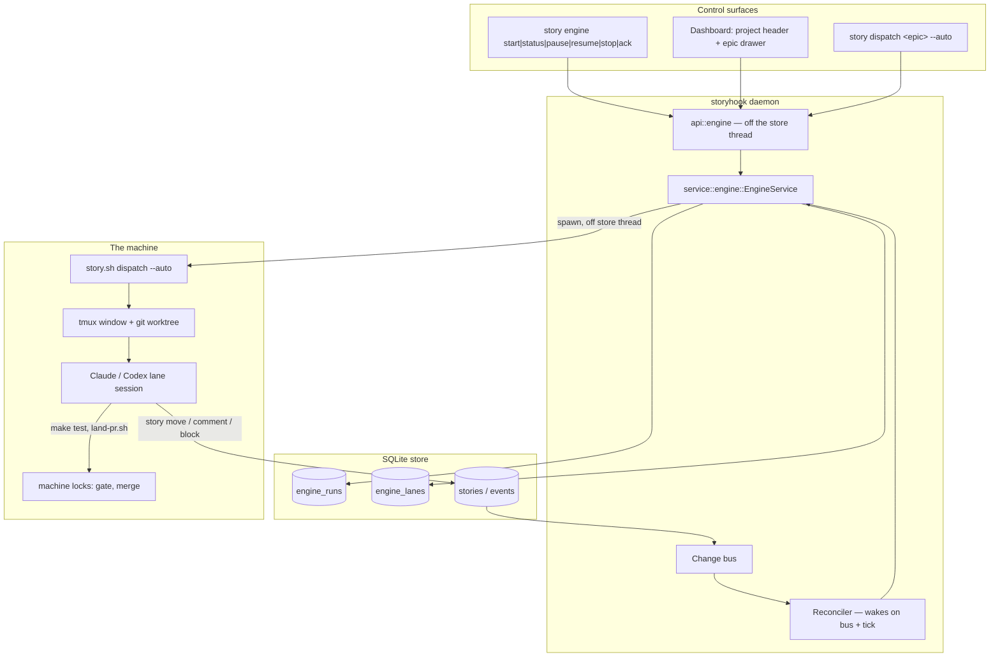
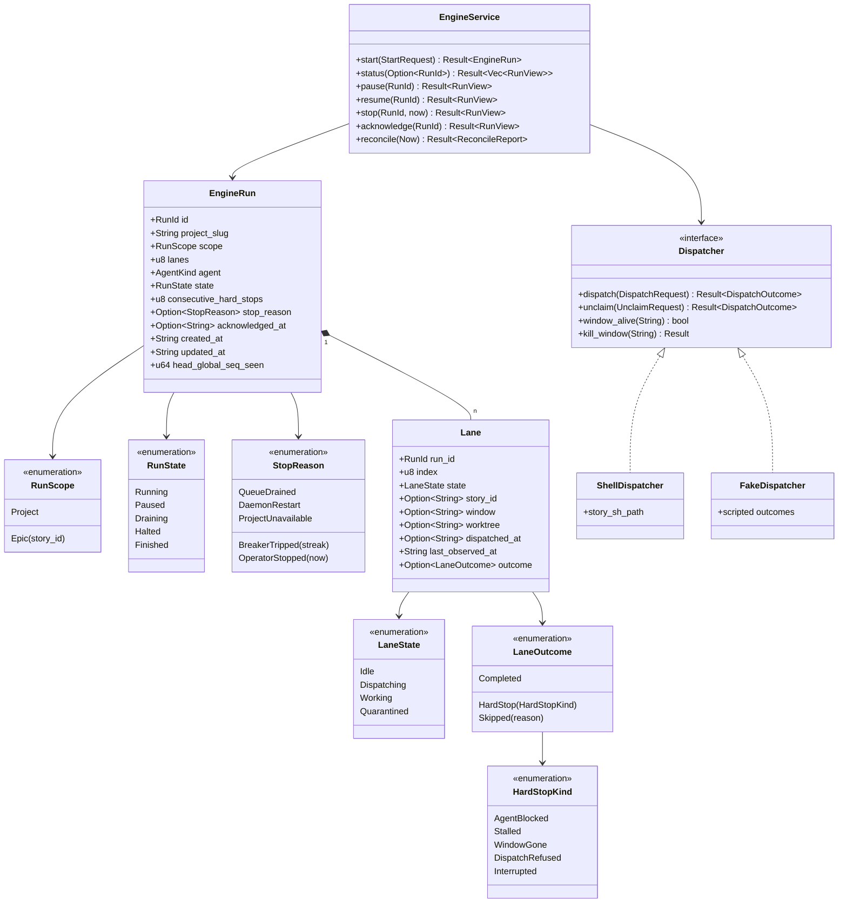
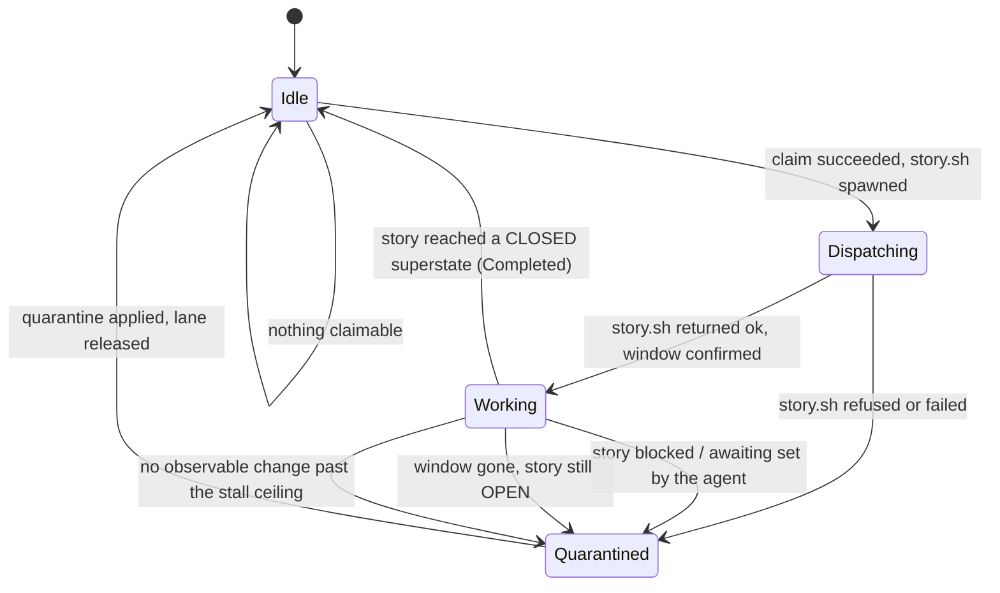
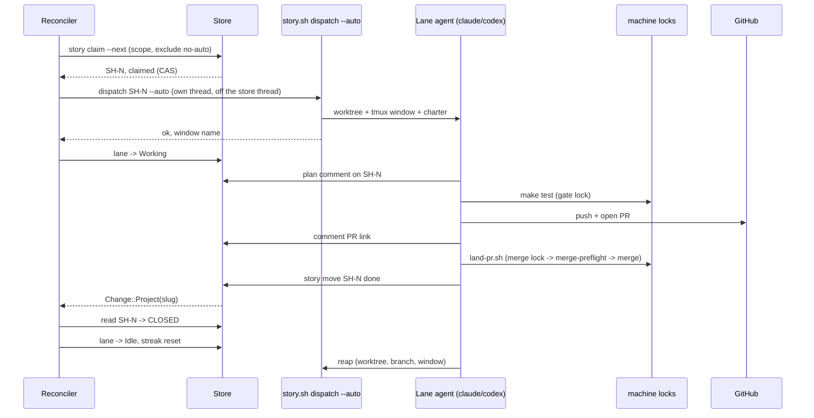

# Full Auto: the storyhook work engine

Design of record for the **Full Auto** epic. Storyhook gains an *engine*: a
daemon-owned supervisor that claims ready stories, dispatches each into its own
worktree + tmux window under the existing autonomous charter, watches them land,
and claims the next — one lane at a time by default, `--lanes <n>` in parallel.

Two entry points, one engine:

- **Project scope** — a control in the dashboard's project header, or
  `story engine start [--lanes <n>]`. Works the project's ready backlog.
- **Epic scope** — `story dispatch <epic-id> --auto` (equivalently `/story do
  <epic> --auto`), or a control in the epic's drawer. Works that epic's
  descendant subtree.

Nothing here reimplements dispatch. `plugins/story/bin/story.sh dispatch
<id> --auto` remains the whole of the worktree/tmux/charter mechanics, exactly
as `api::dispatch` already invokes it (`docs/spec/dashboard-dispatch.md`). The
engine decides *which story, when, and what to do about the result*.

## Vocabulary

| Term | Meaning |
|---|---|
| **Run** | One engine execution, scoped to a project and optionally narrowed to an epic subtree. At most one live run per project. |
| **Lane** | A concurrency slot inside a run. Holds at most one story at a time. `--lanes <n>` sets how many a run has; default 1. |
| **Dispatch** | The existing `story.sh dispatch <id> --auto` side effects: CAS claim, fresh-base worktree, tmux window, agent launch, charter delivery. |
| **Hard stop** | A lane whose story did not reach a CLOSED superstate: blocked by the agent, stalled, or interrupted. |
| **Quarantine** | The engine's response to a hard stop: the story is blocked with a reason, and its worktree, branch, PR and window are left intact for forensics. |
| **Breaker** | The circuit breaker: three consecutive hard stops with no completion between them halts the run. |

## Decisions of record

Settled in interrogation on 2026-08-24, before any code. Where a decision had a
defensible alternative, the reason it lost is recorded — this project's standing
rule that a ceiling, a mechanism, or a scope derives from something rather than
being picked.

| # | Decision | Why, and what lost |
|---|---|---|
| D1 | **The daemon owns the engine.** Run and lane state live in the store; the reconcile loop runs in the daemon. | A shell poller in the `merge-watch.sh` mould was the cheaper build, but run state that dies with a terminal window cannot answer the dashboard, cannot survive a daemon restart, and gives the CLI and the web UI two different notions of "is a run live". |
| D2 | **A lane is a window + worktree per story**, created and reaped per story exactly as `--auto` does today. | Context reset is free: each story gets a new process. The alternative — one long-lived lane session freshen-cleared between stories — buys faster startup at the cost of switching a live session's worktree and cwd, and a wedged pane then strands the lane rather than one story. |
| D3 | **Completion is a store fact, not a rendered one.** A lane frees when its story leaves the OPEN superstate. Window liveness and a stall timeout detect a *dead* lane; they never declare success. | SH-226: a frame rule and a prompt glyph were read as "the agent is ready" and the charter was executed by zsh. A tmux window closing is evidence about a window. |
| D4 | **`make test` serializes behind a machine-wide lock**, taken inside `scripts/run-tests.sh`, applying to every caller including interactive ones. `STORYHOOK_GATE_LOCK=0` bypasses it and says so on stderr. | `make test` is 36.4s median warm and idle (`docs/rearch/baseline/timings.md`) but has been measured at 873s under 3–4 concurrent worktree suites, and that contention is the documented cause of an open class of load-sensitive failures (SH-347, SH-349, SH-375, SH-378, SH-401, SH-419). Lanes multiply exactly that. An interactive suite contends identically, so exempting it would leave the hole open in the case where a human is present to be confused by it. The bypass is explicit and reported, never silent — SH-306. |
| D5 | **Lane agents merge their own PRs, through `scripts/land-pr.sh`, under a machine-wide merge lock.** The script certifies the merge tree with `merge-preflight.sh` inside the lock, then merges. | Merge authority stays where the charter already puts it, but a bare `gh pr merge --merge` is replaced by a deterministic script, so the lock is taken by the tool rather than remembered by the agent. Certifying inside the same lock is what makes lane PRs land promptly instead of waiting on `merge-watch.sh`'s 1–3 minute poll, which becomes the throughput ceiling at N lanes (SH-396). |
| D6 | **Unattendedness is enforced by provider-scoped approval gates**, inert unless the lane's marker environment variable is set. `PreToolUse` allows Claude's plan tool and denies question tools; Claude's subsequent `PermissionRequest(ExitPlanMode)` starts a bounded exact-pane helper. Codex, which exposes no plan event, gets a pane-lifetime exact watcher after Plan mode is confirmed. Each sends one Return to its provider's selected approval option. | Live probes proved neither Claude's `PreToolUse allow` nor Codex's `--approve-for-me` accepts the separate plan-review UI. Provider-specific exact strings and pane identity guard the only keystroke. A changed UI fails closed instead of receiving input. |
| D7 | **Both agents. Codex was verified first.** SH-459 measured Codex CLI 0.149.0 denying `request_user_input` through `PreToolUse`, returning the denial reason to the model, and failing open at the configured timeout. | A Codex lane that silently stalls on a question nobody will answer is the exact failure Full Auto exists to remove. The native denial surface exists, so both provider arms ship; the measured timeout hole remains covered by the stall ceiling and quarantine. |
| D8 | **Epic semantics from SH-446 are absorbed into this program**, not merely depended on: epic state becomes computed from children, epic priority stays stored, and `story next` breaks priority ties on epic priority. | The epic entry point is meaningless without it, and "an epic with all finished children is finished" is the run's own termination condition. |
| D9 | **The queue is live and unbounded.** `story next` is re-asked every time a lane frees; a run ends when nothing is claimable. | An epic's children unblock each other as the run's own merges land; a snapshot taken at start would miss most of them. |
| D10 | **Quarantine and continue; halt on three consecutive hard stops**, reset by any completion. | One hard story never halts a run; a broken tree halts within three attempts. |
| D11 | **On daemon restart or reboot, interrupted lanes are quarantined and reported, never resumed.** Worktree and branch are preserved. | A fresh agent inheriting uncommitted work it did not write is a hazard with no upside; the story is still there to be re-dispatched deliberately. Re-confirmed against a live alternative once `story reset` existed: the engine must never destroy a crashed agent's work unattended, so a human runs `reset` deliberately if they want the clean restart. |
| D12 | **Two reserved labels.** `no-auto`: still returned by `story next` and claimable by hand, but never dispatched by the engine — human-in-the-loop work. `human-only`: never returned by `story next` at all. Both render with an orange tint in the dashboard. | The engine skips `no-auto` rather than holding a lane open waiting for a person who is asleep; `human-only` is removed from the ready queue entirely because no agent should be offered it. |
| D13 | **Halt, drain and lane-failure fire an event hook and raise a dashboard banner that persists until acknowledged.** | A gate that goes silent must read as stale rather than as an all-clear (SH-306, SH-418). A push you might miss plus a banner you cannot is the pair that survives a missed notification. |
| D14 | **Multiple runs, one per project, with a machine-wide lane budget.** | Two projects can progress at once; total concurrent lanes stay bounded, which is what the locks in D4/D5 are sized against. |

## Assumptions recorded rather than asked

| # | Assumption |
|---|---|
| A1 | `human-only` is filtered in `ready_queue` — the `story next` path — and does **not** make a story `!is_ready`. A human can still progress it, so it must not read as blocked, and must not make its parent epic compute as blocked. |
| A2 | Run and lane state are **operational tables**, not story events. The append-only event log stays the fold `story doctor`'s `diff_rebuilt` compares against, and heartbeat-rate writes have no business in a log nothing compacts. What the run *did* to stories is already event-sourced on the stories themselves. |
| A3 | The engine invokes `story.sh dispatch`; the worktree/tmux/charter mechanics are not reimplemented in Rust. |
| A4 | Claims stay serial even at N lanes. `story claim --next` is the arbiter; a claim is milliseconds and the store is the only thing that can adjudicate a race. |
| A5 | A project with no `projects.checkout_path` is refused, with the same message the dashboard's Dispatch button already gives. |
| A6 | Lane charters keep the standing no-version-bump / no-deploy prohibition. Nothing about Full Auto relaxes it. |

## Architecture



The load-bearing shape: **the agent never reports to the engine.** It writes to
the store the same way any `story` caller does, and the engine reads the store.
There is no lane-to-engine channel to go stale, and no agent assertion of
completion to be wrong (D3).

## Type-system proposal



`Dispatcher` is the seam that makes the engine testable without tmux, in the
same spirit as the `Invoker` seam W0b introduced. `ShellDispatcher` shells out
to `story.sh`; `FakeDispatcher` lets `tests/engine_reconcile.rs` script a
completion, a block, a stall and a refusal without spawning anything. The rule
that end-to-end tests may mock data but never behavior still holds: the browser
and shell suites exercise `ShellDispatcher`.

## Lane lifecycle



`Completed` resets the run's `consecutive_hard_stops` to zero. Every
`Quarantined` transition increments it; reaching three halts the run (D10).

## One story through a lane



## The store

Two new tables, one migration. Neither is event-sourced (A2).

```sql
CREATE TABLE engine_runs (
  id                     TEXT PRIMARY KEY,
  project_slug           TEXT NOT NULL,
  scope_kind             TEXT NOT NULL CHECK (scope_kind IN ('project','epic')),
  scope_story_id         TEXT,
  lanes                  INTEGER NOT NULL CHECK (lanes >= 1),
  agent                  TEXT NOT NULL CHECK (agent IN ('claude','codex')),
  state                  TEXT NOT NULL CHECK (state IN ('running','paused','draining','halted','finished')),
  consecutive_hard_stops INTEGER NOT NULL DEFAULT 0,
  stop_reason            TEXT,
  acknowledged_at        TEXT,
  created_at             TEXT NOT NULL,
  updated_at             TEXT NOT NULL,
  CHECK ((scope_kind = 'epic') = (scope_story_id IS NOT NULL))
);

-- One live run per project, enforced by the schema rather than by a read.
CREATE UNIQUE INDEX engine_runs_one_live_per_project
  ON engine_runs (project_slug)
  WHERE state IN ('running','paused','draining');

CREATE TABLE engine_lanes (
  run_id            TEXT NOT NULL REFERENCES engine_runs(id) ON DELETE CASCADE,
  lane_index        INTEGER NOT NULL,
  state             TEXT NOT NULL CHECK (state IN ('idle','dispatching','working','quarantined')),
  story_id          TEXT,
  window_name       TEXT,
  worktree_path     TEXT,
  dispatched_at     TEXT,
  last_observed_at  TEXT NOT NULL,
  outcome           TEXT,
  outcome_detail    TEXT,
  PRIMARY KEY (run_id, lane_index),
  CHECK ((state = 'idle') = (story_id IS NULL))
);
```

Three things the CHECKs buy, in this project's own idiom (SH-364: a column a
fixture can lie about needs a test; a column with a CHECK does not):

- A run's scope cannot be half-stated — epic scope without an epic id is
  unrepresentable.
- "One live run per project" (D14) is a partial unique index, so a race between
  two `start` calls is settled by SQLite, not by a read-then-write.
- A lane cannot be idle while holding a story, which is precisely the leak a
  reconcile bug would otherwise produce silently.

## The reconcile loop

The engine has no busy loop. `reconcile` runs when woken by:

- `Change::Project(slug)` on the daemon's bus, for a slug some live run names —
  which is how a lane's own `story move` reaches the engine;
- a coarse liveness tick, whose period derives from the stall ceiling rather
  than being picked (SH-394's rule, one axis over from wall clocks);
- any control command (`start`, `pause`, `resume`, `stop`, `ack`).

One pass, per live run:

1. **Observe.** For each non-idle lane, read its story's superstate and state,
   and probe its window with the same `pane_runs`-style identity check dispatch
   already uses (SH-239: ask what a process *is*, not what it is spelled).
2. **Classify** each lane per the lifecycle diagram above.
3. **Quarantine** each hard stop: `story block <id> "<reason>"` naming the kind,
   the lane, the run, the window and the worktree; leave worktree, branch, PR
   and window intact. The reason is free text, not a `--on` edge, because the
   blocker is not a story — SH-398's rule is about blockers that *are* stories.
4. **Breaker.** Three consecutive hard stops → `state = halted`, `stop_reason =
   BreakerTripped`, fire the hook, raise the banner. A completion zeroes the
   streak.
5. **Fill** idle lanes while the run is `running` and the machine lane budget
   allows: `story claim --next` scoped and label-filtered, then dispatch.
6. **Terminate.** Nothing claimable and every lane idle → `finished`,
   `stop_reason = QueueDrained`, hook + banner.

`paused` is what `pause` produces: no new claims, existing lanes run to their
natural end, and `resume` returns the run to `running`. `draining` is the
irreversible state graceful and immediate stop produce; graceful stop becomes
`finished` when the last lane frees. `stop --now`
additionally kills lane windows and returns each claimed story to its prior
state, preserving worktrees and branches — plain `story unclaim`, which touches
no on-disk state by construction rather than by opting out of doing so.

### Where the dispatch subprocess runs

Exactly where `api::dispatch` already puts it: **not on a store-pool thread**.
`story.sh` makes its own `story` calls back into this daemon over
`/api/v1/invoke`, so answering from a pool thread risks the deadlock
`docs/spec/dashboard-dispatch.md` documents. The engine reuses that module's
detached-thread pattern and its `MAX_RUNNING` accounting rather than opening a
second, differently-behaved door onto the same script.

## Enforcing unattendedness

`plugins/story/hooks/full-auto.sh`, wired as `PreToolUse` and Claude's
`PermissionRequest` in the plugin's existing `hooks.json` — the same file both Claude Code and Codex already
discover for `SessionStart`, `PostToolUse(Bash)` and `Stop`.

**Inert by default.** With both `STORYHOOK_AUTO` and `STORYHOOK_FULL_AUTO`
unset, the hook emits no decision and exits 0. An ordinary autonomous dispatch
sets the first marker; only an engine lane sets the second. This inertness is a
tested property, in the shape
`test-charter-inert.sh` already tests the charter's.

When active:

| Tool | Decision | Feedback to the agent |
|---|---|---|
| Plan tool (`PreToolUse: ExitPlanMode`) | allow | — |
| Claude plan review (`PermissionRequest: ExitPlanMode`) | one exact-gated tmux Return | Selects the already-highlighted “Yes, and use auto mode” only in the hook's own pane. |
| Codex plan review (watcher armed after confirmed Plan mode) | one exact-gated tmux Return | Selects the already-highlighted “Yes, implement this plan” only in the dispatched pane. |
| Question-asking (Claude's `AskUserQuestion`; Codex's `request_user_input`) | **deny** | "This is an unattended Storyhook session; nobody can answer. If the question has one clear best answer, research and decide it. If two or more are defensible, convene `/council-vote`. Record the decision as a comment on `<story>` the moment you make it." |
| Everything else | no decision | — |

The permission *posture* is not the hook's job: the engine launches the lane
with the provider's built-in Auto command, or the dedicated
`STORY_FULL_AUTO_LAUNCH_CMD` override (Claude: plan mode plus an accept-edits
posture after approval). The daemon's general `STORY_LAUNCH_CMD` is never used
for an engine lane. The hook decides two things and annotates nothing else. A
hook that annotates must never decide, and one that decides must decide only
what it was built to (SH-355).

### Codex `PreToolUse` contract (SH-459)

Measured against the installed Codex CLI 0.149.0, then checked against OpenAI's
matching `rust-v0.149.0` source tag. A `PreToolUse` matcher named
`request_user_input` runs before the question UI opens. Its JSON stdin carries:

- `hook_event_name: "PreToolUse"`, `tool_name: "request_user_input"`, the
  complete `tool_input`, and `tool_use_id`;
- `session_id`, `turn_id`, `transcript_path`, `cwd`, `model`, and
  `permission_mode` (plus agent identity fields for a subagent).

The supported denial and feedback fields are nested under
`hookSpecificOutput`:

```json
{
  "hookSpecificOutput": {
    "hookEventName": "PreToolUse",
    "permissionDecision": "deny",
    "permissionDecisionReason": "This is an unattended lane; decide instead of asking."
  }
}
```

`permissionDecisionReason` is both the blocking reason and model feedback. In
the live probe Codex showed `PreToolUse hook (blocked)`, did not open the
question UI, and returned `Tool call blocked by PreToolUse hook: ... Tool:
request_user_input` to the model. This is a minimal standalone fixture:

```json
{
  "hooks": {
    "PreToolUse": [
      {
        "matcher": "request_user_input",
        "hooks": [
          {
            "type": "command",
            "command": "bash \".codex/deny-question.sh\"",
            "timeout": 3
          }
        ]
      }
    ]
  }
}
```

```bash
#!/usr/bin/env bash
printf '%s\n' '{"hookSpecificOutput":{"hookEventName":"PreToolUse","permissionDecision":"deny","permissionDecisionReason":"This is an unattended lane; decide instead of asking."}}'
exit 0
```

The source-of-truth schemas are
`codex-rs/hooks/schema/generated/pre-tool-use.command.input.schema.json` and
`pre-tool-use.command.output.schema.json`; execution is in
`hooks/src/events/pre_tool_use.rs`, `core/src/hook_runtime.rs`, and
`core/src/tools/registry.rs` at OpenAI Codex tag `rust-v0.149.0` (commit
`758ef40`).

**The known hole, stated rather than papered over.** `PreToolUse` fails *open*
at its timeout on both hosts. Claude's harness behavior was already measured in
SH-306. SH-459 configured the Codex matcher above with `timeout: 1` and made the
hook sleep for three seconds: Codex reported `hook timed out after 1s` and then
opened the question UI. If the question-deny hook times out, the agent asks a
question, nobody answers, and the lane stalls. That is caught by the stall
ceiling and quarantined with a reason naming it. Detected and reported, not
silent — which is the bar.

## The machine locks

`scripts/machine-lock.sh <name> -- <command...>`: a pid-checked, stale-tolerant
machine-wide lock, in the shape `browser-watch.sh`'s own lock already uses.
Two names are reserved.

- **`gate`** — taken inside `scripts/run-tests.sh`, so every `make test` on the
  machine serializes (D4). `STORYHOOK_GATE_LOCK=0` bypasses and prints a line
  naming the bypass; a bypass nobody can see is the SH-306 shape.
- **`merge`** — taken by `scripts/land-pr.sh <pr>`, which runs
  `merge-preflight.sh` for the PR, merges with `gh pr merge --merge`, verifies
  the merge landed, and deletes the branch. The autonomous charter's merge step
  becomes this script instead of a bare `gh pr merge`, so the lock is taken by
  the tool the agent runs rather than remembered by the agent.

Waiting is reported, and every wait ceiling derives from the suite's own
measured budget rather than a bare literal (SH-394).

## Epics (SH-446, absorbed)

Epic-ness is structural: a story with at least one `parent-of` edge is an epic.

**State is computed, never stored.** Turning a story into an epic deletes its
stored state; losing its last child stamps it with the state it computed to at
that moment, as an explicit event, so nothing is invented and the transition is
auditable.

| Children | Epic computes to |
|---|---|
| All in the project's neutral open state | that state (`todo`) |
| Any child active (in-progress, verifying, or any `role: active` state) | the active state (`in-progress`) |
| Every incomplete child is blocked — reserved `blocked` state, `awaiting` set, an open `blocked-by`, or `obviated-by` | `blocked` |
| Every child CLOSED | `done`, unless every child shares one non-`done` CLOSED state, in which case that state |
| — | An epic is **never** `verifying` |

Edge cases the story asked to have filled in:

| Case | Resolution |
|---|---|
| Epic of epics | Recursive: a child epic's own computed state feeds its parent. |
| Draft children | A draft is incomplete but **not** blocked — a human can publish it — so it holds the epic at `todo` rather than making it `blocked`. |
| A child with `awaiting` set | Blocked, for the epic's purposes: nothing can proceed on it. |
| Mixed CLOSED states | See the table: unanimous non-`done` wins, otherwise `done`. |
| A story with several parents | Each parent computes independently from its own children. |
| Epic with no children | Not an epic. It keeps stored state. |

**Priority stays stored and independent** of children (SH-446's own words), and
`priority_assessed` semantics are unchanged.

**`story next` gains an epic-priority tie-break**, at the highest precedence
among tiebreakers: among ready stories of equal priority, the priority of the
nearest ancestor epic decides, then story number. A story with **no** parent
epic is ordered as if its parent's priority equalled its own — neither lifted
nor demoted, because its own priority is the only honest statement about it.
`ready_order` remains total: the story number still ends it.

**Epics are not actionable.** They already never surface in `story next`
(`!has_children`). Additionally: `story move` on an epic is refused (its state
is computed), `story dispatch <epic>` without `--auto` is refused with a pointer
to the engine, and the scaffolded guidance says an epic tracks children and
carries no steps of its own.

## The reserved labels

| Label | `story next` returns it | Engine dispatches it | Rendering |
|---|---|---|---|
| `no-auto` | yes | **no** — skipped, listed as needing a human | orange tint |
| `human-only` | **no** — filtered in `ready_queue` | no | orange tint |

`human-only` filters at the `next` path only (A1). It does not make a story
`!is_ready`, so the board's ready count is unchanged and an epic whose only
incomplete child is `human-only` is **not** blocked — a human can progress it.

The tint is `var(--warn)` on `var(--warn-soft)`, declared in all four of the
dashboard's palette blocks and applied by the single `.chip-reserved` rule
(SH-454). It is deliberately *not* red: red is already spoken for by the
blocked and danger signals, and a reserved label is not a fault.

The engine's claim is `story claim --next` narrowed by two new filters:
`--epic <id>` (the descendant subtree) and `--exclude-label <csv>`. Both are
ordinary query flags accepted on **both** doors onto the ready queue — `story
next`, which reads, and `story claim --next`, which reads and takes — rather
than engine-private behavior hidden inside a service. Filtering what the engine
*looks at* without filtering what it *takes* would leave the half that matters
unguarded.

Claiming is one verb, `story claim <id> | --next` (epic SH-475): both forms
mutating, exactly one required, so a dropped argument can never silently claim
whatever happened to be top-priority. SH-477 removed the claiming mode SH-344
had bolted onto `story next`, so `story next` is a pure read again. Releasing a claim is its inverse,
`story unclaim <id>` (SH-483, with its plugin half in SH-484) — the primitive
`stop --now` routes through rather than composing its own `story move`.
`unclaim` restores the claim's state and closes the lane's window; it does not
touch on-disk state at all. Its destructive sibling `story reset <id>` deletes
the worktree and branch for a clean restart, and **the engine never calls it**
— see the restart policy below.

As built (SH-484), both are `story.sh` verbs — `story.sh unclaim <id>` and
`story.sh reset <id> [--force]` — because the window and the worktree are tmux
and git mechanics, which is also why neither is reachable over MCP. Two details
of the plugin half bear on the engine. First, `story.sh unclaim` refuses when
the story is not in the active-role state (`unclaim-conflict`) and leaves the
window alone, so a lane whose story somebody else has already moved is reported
rather than torn down on a claim the engine no longer holds. Second, when the
caller's own pane is the lane's window, `unclaim` performs the release and
leaves that window open, naming the skip — it never refuses on that ground,
which is what lets a lane release itself. `reset` refuses that case instead
(`self-window`), and `--force` does not override it; since the engine never
calls `reset`, that refusal is a guard for a human, not a constraint on the
engine.

**`unclaim` restores the state a story was claimed from**, derived from the
story's own event log inside its own transaction — `StoryStateChanged` records
only the destination, so it is a short replay rather than a field read. The
engine therefore needs no `claimed_from` column, no explicit `story move`, and
no second release path: it calls `unclaim` and the store answers the question.
Where the replay cannot answer it falls back to `todo` and **says so** — in the
result and in the default comment. A silent substitution there would store a
wrong answer about where the work came from. As built (SH-483) there are three
such cases, each reported under its own `restore_fallback` code: a story created
directly into the active state (`no-prior-state`), a prior state since removed
from the vocabulary (`prior-state-removed`), and a prior state since
reclassified CLOSED (`prior-state-closed`) — the third was found during
implementation and matters most, because restoring a story to it would *close*
the story rather than release it.

## Control surfaces

### CLI

```
story engine start [--epic <id>] [--lanes <n>] [--agent claude|codex]
story engine status [--run <id>] [--json]
story engine pause  [--run <id>]
story engine resume [--run <id>]
story engine stop   [--run <id>] [--now]
story engine ack    [--run <id>]
```

Every arm ends in `expect_no_more` — a word that lands nowhere is refused, not
dropped (SH-357).

### HTTP

| Method | Path | Answers |
|---|---|---|
| POST | `/api/repos/{project}/engine` | start a run; 409 if one is live |
| GET | `/api/repos/{project}/engine` | the run view: state, lanes, streak, stop reason |
| POST | `/api/repos/{project}/engine/{action}` | `pause`, `resume`, `stop`, `ack` |

Answered off the store thread where a dispatch is spawned, per
`docs/spec/dashboard-dispatch.md`'s deadlock argument.

### Web UI

- **Project header**: a Full Auto control with a lanes stepper. Live runs show
  state, lane count, and the current story per lane with elapsed time.
- **Epic drawer**: "Run Full Auto on this epic", scoping a run to the subtree.
- **Banner**: on halt or drain, a banner persists until acknowledged (D13).
- **Labels**: `no-auto` and `human-only` render with an orange tint everywhere
  labels render — card, drawer, list.

Every mutating control obeys the in-flight guard and the ambiguity rule
`docs/spec/render-under-a-press.md` and SH-312 already established: a timeout is
reported as ambiguous, never as failure.

### `story dispatch <epic> --auto`

The entry point named in the request. Dispatching an epic with `--auto` starts
an engine run scoped to that epic rather than dispatching the epic itself.
Without `--auto`, it is refused with a message naming the engine.

## Notification

Run lifecycle raises event hooks through the existing `event_hooks` mechanism —
a new `HookEventType` for engine events, subject to the same
`HOOK_TIMEOUT_CEILING_SECS` ceiling as every other hook. Events: run started,
run halted (with the streak and the last three quarantine reasons), run drained,
lane quarantined. The transport is whatever the operator configures; storyhook
ships no notification stack of its own.

## Failure taxonomy

| Observation | Classification | Engine action |
|---|---|---|
| Story reaches a CLOSED superstate | Completed | free lane, zero the streak |
| Story `blocked` or `awaiting` set | HardStop(AgentBlocked) | quarantine, increment streak |
| Window gone, story still OPEN | HardStop(WindowGone) | quarantine, increment streak |
| No observable change past the stall ceiling | HardStop(Stalled) | quarantine, increment streak |
| `story.sh` answered `ok:false` | HardStop(DispatchRefused) | quarantine; relay the script's own refusal verbatim (SH-120's verdict) |
| Daemon restart with a live lane | HardStop(Interrupted) | quarantine, report; never resume, never `reset` (D11) |
| Story carries `no-auto` | Skipped | never claimed; listed as needing a human |

## Testing

Each invariant gets a named home, in this project's own idiom — derived fences
over `git ls-files` rather than hand-kept lists, and mutation checks in both
directions.

| File | Pins |
|---|---|
| `tests/engine_run_model.rs` | run/lane state transitions, breaker arithmetic, the schema CHECKs |
| `tests/engine_reconcile.rs` | every row of the failure taxonomy, through `FakeDispatcher` |
| `tests/engine_restart.rs` | interrupted lanes quarantine on restart, worktrees preserved |
| `tests/engine_labels.rs` | `human-only` never in `next` or `claim --next`; `no-auto` still in `next` and never dispatched |
| `tests/epic_computed_state.rs` | every rule and edge case above, table-driven |
| `tests/epic_priority_tiebreak.rs` | `ready_order` with epic priority, including the no-parent rule; totality preserved |
| `tests/machine_lock.rs` | real processes, stale-pid recovery, mutation-checked (precedent: `tests/orphan_check.rs`) |
| `tests/land_pr.rs` | certification happens inside the lock and before the merge; a refusal blocks the merge |
| `plugins/story/tests/test-full-auto-hook.sh` | hook decisions against real payloads |
| `plugins/story/tests/test-full-auto-inert.sh` | the hook is inert with the marker unset |
| `e2e/specs/engine.spec.ts` | header control, lanes stepper, live lane panel, banner + ack |

The engine's own subprocess spawning stays outside the Rust suite the way
`merge-watch.sh`'s `gh` orchestration does: mocking `gh` or `tmux` validates the
mock. `ShellDispatcher` is exercised by the shell suite against the real script.

## Non-goals

- Cross-project runs. A run is one project's.
- Resuming a story whose lane died. Quarantine, then a deliberate re-dispatch.
- Replacing `merge-watch.sh` or `browser-watch.sh`. The engine certifies its own
  lanes' PRs promptly; those pollers keep every other PR and the release tier.
- Any relaxation of the version-bump or deploy prohibitions.

## Waves

| Wave | Scope | Depends on |
|---|---|---|
| W1 | Epic semantics (SH-446 absorbed): computed state, stored priority, `next` tie-break, epics-not-actionable, the Show-Epics filter | — |
| W2 | Reserved labels: `human-only` filtering, `no-auto` reservation, orange tint | W1 (shares the `next` path) |
| W3 | `--epic` and `--exclude-label` on `story next` and `story claim --next` | W1, W2, SH-476 |
| W4 | `machine-lock.sh`, the gate lock in `run-tests.sh`, `land-pr.sh`, charter change | — |
| W5 | Codex hook-surface spike; the `PreToolUse` full-auto hook; lane launch posture | — |
| W6 | Store migration, `EngineService`, the `Dispatcher` seam, the reconcile loop, breaker, restart reconciliation | W3 |
| W7 | CLI verbs, HTTP API, `story dispatch <epic> --auto` entry point | W6 |
| W8 | Web UI: header control, lane panel, banner + ack, epic drawer control | W7 |
| W9 | Engine event hooks, docs, the e2e leg | W8 |

W1–W5 are independent of each other and can run in parallel; W6 is the join.

## Stories

Epic **SH-452**. Children in wave order — story numbers encode the dependency
order, so `ready_order` hands them out in a workable sequence at equal priority.

| Wave | Story | Scope |
|---|---|---|
| W1 | SH-446 | Epic semantics, absorbed whole: computed state, stored priority, `next` tie-break, epics-not-actionable, the Show-Epics filter. Also carries a required correction to the shipped priority rubric (see below). |
| W2 | SH-453 | Reserve `no-auto` / `human-only`; filter `human-only` out of `story next` |
| W2 | SH-454 | Orange tint for both reserved labels in the dashboard |
| W3 | SH-455 | `--epic <id>` and `--exclude-label <csv>` on both `story next` and `story claim --next` |
| W4 | SH-456 | `scripts/machine-lock.sh` |
| W4 | SH-457 | Gate lock inside `scripts/run-tests.sh` |
| W4 | SH-458 | `scripts/land-pr.sh` — certify and merge under the merge lock |
| W5 | SH-459 | Spike: can a Codex hook deny a tool call with feedback? |
| W5 | SH-460 | The full-auto `PreToolUse` hook |
| W5 | SH-461 | Lane launch posture and the `STORYHOOK_FULL_AUTO` marker |
| W6 | SH-462 | Store: `engine_runs`, `engine_lanes`, migration, CHECKs |
| W6 | SH-463 | The `Dispatcher` seam |
| W6 | SH-464 | `EngineService` lifecycle |
| W6 | SH-465 | The reconcile loop |
| W6 | SH-466 | Restart reconciliation |
| W7 | SH-467 | CLI `story engine …` |
| W7 | SH-468 | HTTP `/api/repos/{project}/engine` |
| W7 | SH-469 | `story dispatch <epic> --auto` |
| W8 | SH-470 | Dashboard header + epic drawer control |
| W8 | SH-471 | Persistent halt/drain banner |
| W9 | SH-472 | Engine event hooks |
| W9 | SH-473 | Browser leg, operator docs, the As-built record |

Claiming and releasing are epic **SH-475**'s, not this one's: SH-476 (the claim
verb), SH-483/SH-484 (`story unclaim` and its teardown). SH-455, SH-464 and
SH-465 are `blocked-by` them.

### The claim primitive this engine depends on

Epic **SH-475** collapses claiming onto one verb, `story claim <id> | --next`,
and removes the claiming mode `story next` used to carry (SH-477). SH-455 and SH-465 are both
`blocked-by` SH-476, the verb itself. Nothing about the engine's design changes
— the claim is still atomic, still serial across lanes, and the store is still
the arbiter of a race. Only the spelling of the primitive moves.

### A correction SH-446 forces on the shipped priority rubric

`story help priority-rubric` currently states, under *Relationships never
inherit priority*: "parent-of: an epic's priority is the MAX of its children,
never the sum, and is reporting-only — story next never surfaces a story that
has children."

SH-446 contradicts that twice: epic priority becomes **stored and independent**
of children, and it stops being reporting-only because it becomes the
highest-precedence tie-breaker between equal-priority children. The rubric ships
in the binary and `tests/priority_rubric.rs` fails if `CLAUDE.md` starts
restating it, so the correction belongs in the rubric text itself and lands in
the same commit as the behavior — otherwise the tool documents the opposite of
what it does.

## As built

Deviations from this document get recorded here rather than in a second file.

### SH-453 — the reserved labels

**The `ready_queue` this document names is `service::query::execution_queue`.**
The filter is one line in that function's candidate gate, and that is the whole
of it, because `story next` and `story claim --next` are already one
implementation: `StoryService::claim_next` selects through
`QueryService::next` inside its own write transaction. The spec asks for both
doors to be filtered; no second edit was needed to get it.

Three consequences of that siting, none of them a deviation but all of them
worth having written down before somebody rediscovers one:

- **`report_data`'s `next_ids` loses the story too**, since it is the same
  function. That is the intended reading: `next_ids` is documented as the
  order `story next` would return, so leaving a `human-only` story in it would
  have made the dashboard disagree with the command. The card still renders
  and is still in `ready_ids` — it just ranks last under the board's "Next"
  sort (`nextRank`'s `Infinity`), the same place a claimed or cyclic story
  already sits.
- **A story `blocked-by` a `human-only` story stays unranked.** A predecessor
  outside the candidate set is never popped, which is `execution_queue`'s
  existing, deliberate behaviour for a claimed, epic or manually-blocked
  blocker. It is the right answer here rather than an accident: that work
  genuinely cannot start until a person does the human-only half.
- **`session::highest_priority` was filtered as well**, and its ready *count*
  was not. That function's own docstring promises it names "the story `story
  next` would offer first", so leaving it alone would have made the promise
  false at the one surface an agent reads before it runs any command. The
  exclusion sits inside the function so it cannot reach the caller's count,
  which A1 requires to keep counting the story.

`no-auto` ships as `domain::LABEL_NO_AUTO` plus documentation and no
behaviour, as the story specified. The constant exists now so `--exclude-label`
(SH-455) and the reconciler (SH-465) cannot disagree with this wave about the
spelling; `tests/engine_labels.rs` asserts it is still offered by `story next`,
which is what fails if the `human-only` filter is ever widened to cover both.

### SH-454 — the orange tint

**The tint reaches four render sites, not the three the story named.** The
dashboard builds a label chip on the board card, in List view, in the detail
drawer, and in the create/edit label combobox. The fourth is a chip a person
looks at while choosing labels, so it is exactly where the reservation is most
worth seeing; all four read one `labelChipClass()`.

**Cards reorder rather than only recolour.** A card shows three labels and
collapses the rest into `+N`, so a reserved label in that overflow would be
tinted nowhere and the card would read as ordinary work. Reserved names sort
to the front of the visible three (a stable sort, so ordinary labels keep
their given order). The card is the only site that elides; the other three
show every label and reorder nothing. Decided by the operator when the gap was
found mid-implementation, over tinting the `+N` chip itself, which signals that
something is hidden without saying what.

**`--warn-soft` is a new token, defined in four blocks rather than the three
the theme rule names.** The sheet restates the entire light palette under
`:root[data-theme="light"]` so that it beats the `prefers-color-scheme` block
on specificity, so bare `:root` plus the two dark blocks leaves the token
undefined for a reader who has explicitly chosen light. An undefined custom
property paints as nothing rather than erroring, so that gap is invisible
except to a measurement — which is why the browser leg asserts the reserved
chip paints *differently from an ordinary one*, not merely that it is
readable: a fully transparent chip inherits the card behind it and would pass
a contrast check on its own.

Measured contrast of `--warn` on `--warn-soft` is 4.54:1 light and 5.12:1
dark. The story asked for the bar the rest of the dashboard's chips meet;
that bar is 4.16:1 (`--fg-muted` on `--bg-sunken`, light), so WCAG AA's 4.5:1
is asserted instead as the stronger of the two claims.

### SH-456 — `scripts/machine-lock.sh`

**The lock root derives from `$HOME`, deliberately not from `$XDG_STATE_HOME`,
and that is the one decision in this story with a way to be silently wrong.**
`src/env/mod.rs` already resolves this project's state home as
`$XDG_STATE_HOME/storyhook`, else `~/.local/state/storyhook`, so reading the
variable is the obvious implementation and the path below matches the
convention either way. But `scripts/run-tests.sh` **exports `XDG_STATE_HOME`**
into a fresh per-run `mktemp -d` directory, and SH-457 takes the `gate` lock
*inside that script* — so a root read from the variable would be unique to
every run, every concurrent suite on the machine would take a different lock,
nothing would serialize, and the gate would pass having proved nothing. That is
the SH-364 shape: a harness that lies to the gate running under it.
`tests/machine_lock.rs` constructs the straddle rather than waiting for it
(SH-420's posture) — with no `STORYHOOK_LOCK_DIR` and a decoy `XDG_STATE_HOME`,
`--plan` must still resolve under `$HOME`.

**Holder identity is a pid *and* a start time**, where the story asked only for
"a pid that is actually checked". A bare pid is the SH-239 trap one axis over:
pids are reused, a `$HOME`-rooted lock survives a reboot, and a reused pid is
exactly how a live holder's lock gets stolen. `ps -o lstart=` is whole-second
granular, which is also where `LOCK_POLL_SECS = 1` comes from — the poll period
is the resolution of the observation, not a guess about speed.

**Three things the design of record did not name, added because the primitive
is unusable without them:**

- **`--max-wait <seconds>`, and no default ceiling.** Waiting is bounded by a
  fact — whether the recorded holder is alive — the way `browser-watch.sh`'s
  lock already decides staleness. A caller with a real budget passes the flag
  and states its own derivation at its own call site. `--max-wait 0` is a
  try-lock. Giving up is `75` (`EX_TEMPFAIL`) with a line saying the command did
  not run, because a timeout is not a failure of the command (SH-312).
- **Signal traps, which no other script in this repo carries.** `trap … EXIT`
  alone is not enough and looks like it is: bash defers a trap until the current
  *foreground* command returns, so a SIGTERM arriving during a fourteen-minute
  `make test` would not release the lock until that suite finished — the exact
  wedge this script exists to prevent. The command therefore runs in the
  background under an explicit `wait`. The signal is **forwarded, never
  escalated**: the command owns its own teardown, and `make test`'s legs each
  carry their own EXIT traps.
- **Reentrancy, via `STORYHOOK_MACHINE_LOCKS` in the command's environment.**
  A caller who wraps a whole `make test` in `machine-lock.sh gate --` would
  otherwise wait forever on a lock its own process tree holds — provably alive,
  so no staleness check can ever free it.

**The identity files are written `started`, `meta`, then `pid` — pid last.**
`mkdir` is the atomic primitive (macOS ships no `flock(1)`), so a window exists
between taking the directory and describing it; writing the pid last means a
reader that sees a pid is guaranteed to see the start time beside it. A
directory with no pid is tolerated for `IDENTITY_GRACE_POLLS` and then
reclaimed, with the reclamation reported.

**Limits stated rather than glossed:** waiters are unordered (a `mkdir` lock has
no queue, and the reported wait duration is what would make starvation visible);
a pid reused *within the same second* across a reboot still defeats the identity
check; and forgery is not the threat model, the position `gate-receipt.sh`
already takes.

Mutation-checked in both directions, six mutations, **exactly one red each** —
`tests/machine_lock.rs`'s module doc carries the table. One of them is a finding
in its own right: with the start-time comparison deleted, an unbounded
reclamation case hangs `cargo test` forever instead of turning a test red, which
is why both reclamation cases pass a derived `--max-wait`.

### SH-457 — the `gate` lock is taken

`scripts/run-tests.sh` re-execs itself under
`machine-lock.sh gate --`, above its own isolated data root, so every caller
queues: both Rust batteries, `run-changed.sh`, and a bare
`bash scripts/run-tests.sh`. `STORYHOOK_GATE_LOCK=0` bypasses and says so on
stderr. Full detail — including what the lock does *not* cover — is in
`docs/spec/test-tiers.md`'s "One suite at a time on this machine (SH-457)"
section, next to the tiers it constrains; only the deviations from D4 are
recorded here.

**D4 says "`make test` serializes"; what ships is one `cargo test` at a time,
which is not the same claim.** `make test` reaches `run-tests.sh` **twice**,
once per disjoint Rust battery, so two concurrent runs interleave at the
battery boundary and their fmt/clippy/build/plugin legs still overlap. Wrapping
the whole recipe instead was considered and declined at plan time by operator
decision: it needs a recursive `$(MAKE)`, an `export E2E` so `test-full` keeps
working, and it moves the "postlude is the last recipe line" structure that
`tests/push_gate.rs` and `tests/selective_gate.rs` both pin into an inner
target — a large blast radius on the gate's own plumbing for a window the
existing primitive already closes on demand. Whole-run exclusivity is
`machine-lock.sh gate -- make test`, which is precisely the case SH-456's
reentrancy branch was built for and which the engine's lanes take.

**`scripts/run-e2e.sh` does not take this lock**, and the browser leg is the
single heaviest thing on this machine (1454s measured, SH-418). Outside D4's
wording; named here rather than left to be discovered.

**A second reentrancy guard was written in `run-tests.sh` and then deleted.**
It read `STORYHOOK_MACHINE_LOCKS` itself, which would have put that variable's
format in a second place (SH-136). Mutating it away changed **no observable at
all** — `machine-lock.sh` was answering anyway — which is the tell, and is why
it is gone rather than merely unused.

**What replaced it is not the same check twice.** The re-exec carries a
handshake variable, and the `else` branch carries a depth guard that refuses
by name on arriving a second time. The failure mode it prevents is not a hang:
`machine-lock.sh` runs its command in a background child, so a re-exec that
keeps coming back leaves a live process waiting on the next — measured at
roughly two hundred processes a second before the guard existed, on a machine
that routinely runs three or four other suites. The two halves sit at two
sites so breaking either is caught by the other (SH-365's shape), and
`tests/gate_lock.rs` provokes both.

`tests/gate_lock.rs` (9 tests) provokes the tracked script rather than
inspecting it — real contention, real signals, the script reached by symlink
from a disposable fixture root with `tracked-tree.sh` stubbed so no ledger
reaches the developer's `.git`. Mutation-checked six ways; that file's header
carries the table, including the one mutation that has no test and why.
### SH-458 — `scripts/land-pr.sh`

**The tested seam is certification followed by a command, not a fake
GitHub.** The public `land-pr.sh <pr>` path takes `machine-lock.sh merge` and
re-enters a private locked phase. That phase refreshes the PR refs, then calls
the private `--certified-run <base> <head> -- <command>` seam. The seam refuses
to run unless `STORYHOOK_MACHINE_LOCKS` proves the `merge` lock belongs to this
process tree; it runs the production `merge-preflight.sh`, exports the exact
certified tree, and only then executes the command. `tests/land_pr.rs` can
therefore use real repositories, real locks, and receipts from the production
writer while using a filesystem witness for "the merge command ran". It never
pretends a local `gh` double says anything about GitHub.

**The live path guards the head and verifies the result.** Metadata and refs
are refreshed inside the lock and must agree byte-for-byte before
certification. `gh pr merge --merge --match-head-commit` refuses a head that
changed after that point. A zero exit from `gh` is not accepted as proof: the
script asks for the PR again, requires state `MERGED`, fetches the reported
merge commit from the base, and compares its tree with the tree preflight
certified. Only that exact match permits deletion of the remote source branch;
the local branch remains for Storyhook's final worktree reap, because a linked
worktree cannot delete the branch it has checked out.

**The known base race remains SH-474.** GitHub's merge interface exposes an
expected-head guard but no expected-base guard. The machine lock serializes
Full Auto lanes on this machine; it cannot serialize a web merge or a merger
on another machine. If one advances the base after certification, the landed
tree comparison reports a hard failure instead of claiming success, but the
remote mutation has already happened. Preventing that platform-wide race is
the separately filed SH-474 rather than a hidden overclaim in this wrapper.

Mutation-checked in the two load-bearing directions: moving the command before
preflight makes the uncertified/conflict witnesses run, and deleting the lock
proof makes the direct private-mode refusal test fail. The module document in
`tests/land_pr.rs` carries the measured table.

### SH-460 / SH-511 — autonomous approval hooks

`plugins/story/hooks/full-auto.sh`, wired as three `PreToolUse` entries and one
Claude `PermissionRequest` entry in the plugin's existing `hooks.json`. It allows
the `ExitPlanMode` tool, accepts Claude's separate plan-review pane with one
exact-gated Return, denies `AskUserQuestion` and `request_user_input` with the
feedback D6 specifies, and answers nothing else.

**`STORYHOOK_FULL_AUTO` carries an engine lane's story id, and any non-empty
value activates.** SH-511 later added `STORYHOOK_AUTO` for an ordinary
autonomous dispatch without weakening this engine-only identity. The hook
selects the Full Auto marker first when both are present, then the ordinary
Auto marker. Unset *and* set-but-empty markers are inert — a launcher that
computed the id and got nothing must not activate a session that does not
exist. A value that is not shaped like a story id still enforces; it just falls
back to generic wording rather than echoing a bogus id at the model, which is
`STORYHOOK_FULL_AUTO=1`'s case and is pinned as one.

**Four exact matchers across two events, not a regex alternation and not `*`.** SH-459 measured
Codex against a plain tool name; its matcher's regex semantics are *unmeasured*,
and this project does not ship on documentation where it can ship on a
measurement (SH-226, SH-306). Exact names are demonstrated on both hosts —
`hooks.json`'s existing `PostToolUse` → `Bash`. A wildcard would also pay a hook
process on every tool call a lane makes. The hook re-reads `tool_name` from the
payload anyway, so it stays correct under any matcher, and
`test-full-auto-hook.sh` fires a `Bash` payload through the `ExitPlanMode` door
to prove it decides on the payload rather than on having been invoked.

**No `set -e`, deliberately.** For hook events the exit status *is* a decision
channel — the host acts on a nonzero exit, and `2` blocks the call outright — so
a stray failing command must never get to decide one. Every path ends in an
explicit `exit 0` and the decision travels in the JSON. This is SH-355's rule one
host over: there it was git obeying `prepare-commit-msg`'s status, here it is the
agent host obeying this one.

**The `[plugin] enabled = false` kill switch is not consulted.** It turns off the
session hooks, which inject context and write handoffs; both are conveniences.
Unattendedness is not, and a second switch that could silently turn a lane back
into an attended one would re-open the exact failure this hook exists to close,
in the one configuration nobody would think to check. Pinned as a test, not left
as a comment.

**An unreadable payload decides nothing.** A hook that cannot tell which tool it
is must not decide. The consequence is the already-documented fail-open hole: the
lane asks, nobody answers, the stall ceiling quarantines it. Guessing `deny` at a
plan exit would be worse, and guessing `allow` would be worse still.

**The `--deadline` obligation was narrowed, not exempted.** Wiring a fourth hook
turned all four tests in `tests/hook_budgets.rs` red, three of them because
SH-182's rule is written as *every* declared hook must declare a `--deadline`
inside its manifest timeout. That rule is really "a hook that waits on the daemon
must bound that wait", and it was written when every hook did; `full-auto.sh`
makes no `story` call and has no wait to bound. The exemption is **derived**
(`invokes_story`, asking at a command position rather than searching for the
word, because the denial text names a story in English on a functional line) and
runs in both directions — a script that calls `story` must declare a deadline,
one that does not must declare none. A hand-listed exemption was rejected
outright: it is the shape SH-136/SH-198/SH-258/SH-260/276/SH-360/SH-364 have
already cost this project, and SH-343 had to un-hand-list this very file once
before. The predicate ships with a positive control over the three scripts that
really do call `story`, a negative over `full-auto.sh` itself, and one test
pinning its own known over-approximation (a `;` inside a quoted string starts a
new segment) — stated rather than claimed away, because the direction of that
error is safe: it demands a deadline nobody needs, loudly, where the opposite
would silently exempt a hook that really does wait.

**The Claude arm is measured against the live host.** SH-511's first Claude Code
2.1.251 TUI probe falsified the original assumption: `PreToolUse(ExitPlanMode)`
received `permissionDecision=allow`, yet Claude still stopped at a separate
“Ready to code?” review pane. A second probe showed that pane emits
`PermissionRequest(ExitPlanMode)`. The final isolated probe used that event to
schedule the bounded helper on its own `$TMUX_PANE`; after a 500ms provider-input
handoff, all three exact strings matched, one Return selected “Yes, and use auto
mode,” Claude switched to Auto, and the requested proof file was written without
a driver keystroke. `claude -p` is not a valid substitute for this measurement:
the same version explicitly disables `ExitPlanMode` in print mode.

### SH-511 — ordinary Auto plan approval

SH-511 makes the existing `dispatch --auto` contract fully unattended without
making it an engine lane. Every Auto child receives
`STORYHOOK_AUTO=<story-id>` through `tmux new-window -e`; attended children
receive no marker. The shared hook therefore allows Claude's `ExitPlanMode`,
accepts its separate plan review at `PermissionRequest(ExitPlanMode)`, and denies
both providers' question tools for ordinary Auto as well as Full Auto, while the
distinct variable keeps engine identity available to the reconcile loop.

The provider launch posture supplies what the hook does not. Claude keeps
`--permission-mode plan` and sets `permissions.defaultMode` to `acceptEdits`.
Codex keeps Storyhook's confirmed Shift+Tab transition into Plan mode and adds
`--approve-for-me` plus `--dangerously-bypass-hook-trust`. A pane-lifetime
watcher, armed after Plan confirmation, checks once per second for the exact
three-option “Implement this plan?” UI and sends one Return to its selected first
option. Codex 0.149.0 proved `--approve-for-me` does not accept that separate UI;
it handles later workspace-write requests, while the trust flag prevents the
packaged unattendedness hook from stalling on its own prompt.

`STORY_LAUNCH_CMD` remains a wholesale compatibility escape hatch. An Auto
result with that override reports `launch_source: "STORY_LAUNCH_CMD"`,
`launch_overridden: true`, and a display warning that unattendedness may be
weakened. Built-in Auto reports `launch_source: "builtin"`; attended JSON and
commands remain unchanged. The dashboard and operator docs describe Auto as
zero-interaction rather than asking a person to approve the plan.

### SH-461 — engine dispatch identity and override isolation

`ShellDispatcher` is the only caller that adds `--full-auto`, and its exact
helper argv ends in `--auto --full-auto`. The modifier is accepted only once,
with `--auto` and a named story. In particular, `dispatch --next --auto
--full-auto` is invalid: the reconcile loop has already selected the story, so
an id-less helper claim would erase the identity the engine is responsible for
tracking. Validation happens before the story, tmux, checkout, or claim gates.
Dashboard dispatch, plugin adapters, skills, and direct ordinary Auto callers
continue to supply only `--auto`.

The tmux boundary exports a complete marker matrix on every new window:

| Dispatch kind | `STORYHOOK_AUTO` | `STORYHOOK_FULL_AUTO` |
|---|---|---|
| attended | empty | empty |
| ordinary `--auto` | story id | empty |
| engine `--auto --full-auto` | empty | story id |

Both values are `tmux new-window -e` arguments. A non-empty lane marker is
never installed into the tmux session environment, and explicit empties contain
a stale value inherited by a later non-lane window. Claude inherits the chosen
pair in its hook process. The Codex exact-pane watcher receives the same pair in
its `tmux run-shell` environment; SH-461 changes neither provider's approval
predicate nor its timing.

Full Auto deliberately reuses `DEFAULT_AUTO_LAUNCH_TPL`, the provider posture
landed and live-proven by SH-511. `STORY_FULL_AUTO_LAUNCH_CMD` is its only
override. A non-empty inherited `STORY_LAUNCH_CMD` is ignored and reported as
`ignored_general_override: "STORY_LAUNCH_CMD"`; Full Auto still reports its
selected `launch_source`, `launch_overridden`, and `full_auto: true`. Non-Full-
Auto JSON is unchanged except that both empty marker values now appear at the
tmux window boundary.

The blast radius is one edit-capable agent in one disposable worktree. Its
autonomous charter still prohibits version, release, and deployment actions,
and it may merge only through the certified path. The dedicated override can
widen that provider posture, so it is reported in JSON and display; a daemon's
general expert override cannot widen it accidentally.
