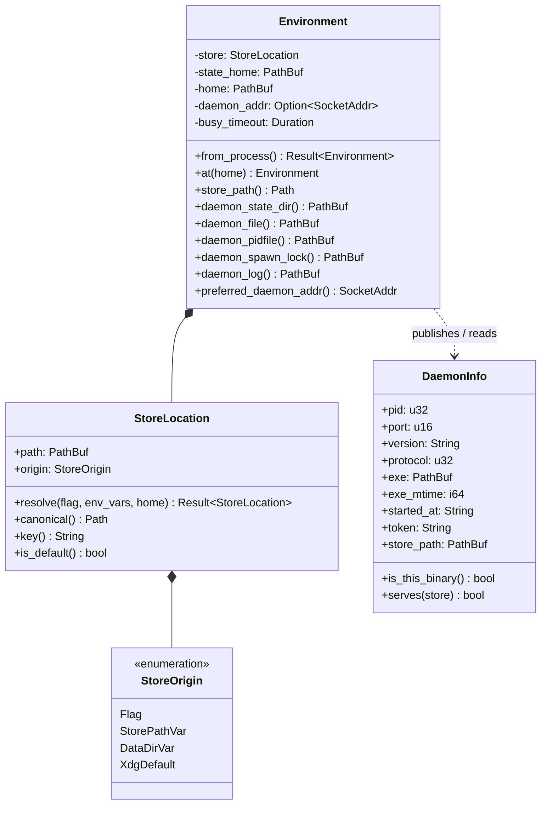

# Store isolation: one daemon per store, keyed by the store path

Design of record for **SH-113** (child C1 of epic SH-112), and the origin-fix for
**SH-123**. Written for approval before implementation.

## The problem, demonstrated

Daemon runtime state is keyed on `state_home`. The store is keyed on `data_home`. The
two move independently, and nothing reconciles them — so a client can be pointed at one
store and served by a daemon holding another.

Verified against the installed `story 1.0.0` on 2026-08-01:

```sh
P=/private/tmp/sh-probe2; mkdir -p $P/state $P/repoA
export HOME=$P XDG_STATE_HOME=$P/state STORYHOOK_DAEMON_ADDR=127.0.0.1:0 STORYHOOK_PARENT_PID=$$

export STORYHOOK_DATA_DIR=$P/A
cd $P/repoA && git init -q && story init --prefix AAA
story new "CANARY belongs to store A"

export STORYHOOK_DATA_DIR=$P/B     # a different store
story list                          # -> AAA-1  CANARY belongs to store A
```

`$P/B/store.db` is never created. The client became an RPC client of store A's daemon,
for reads *and* writes, with no diagnostic and exit 0.

Two consequences worth stating plainly:

- **`STORYHOOK_DATA_DIR` is not an isolation mechanism today.** It works only when
  paired with `XDG_STATE_HOME`, which four shell harnesses do by hand
  (`scripts/run-tests.sh:29-30` and the plugin equivalents). Nothing in the binary
  requires the pairing, and `TEST_BUILD_REFUSAL` (`src/env.rs:285`) recommends the
  unpaired half.
- **A binary mismatch already escalates this to a hijack.** `ensure`
  (`src/daemon/lifecycle.rs:300`) sends any unusable daemon to `spawn_locked`, which
  shuts the incumbent down and takes its place (`:338-343`). A differently-built binary
  run with a stray `STORYHOOK_DATA_DIR` therefore kills the daemon serving the real
  store and republishes the shared portfile pointing at a temp store.

## The rule

> **A store's identity determines its daemon's identity.** Daemon runtime state is
> derived from the canonical store path, so one store has exactly one daemon by
> construction, and "client and daemon disagree about the store" is unrepresentable
> rather than detected.

This is deliberately not a check. A check leaves the shared state home in place and
fixes the encounter point; per the defect tenets, the origin is the sharing itself.

## Types



**`StoreLocation`** is the new type and carries the whole decision. It holds the
canonicalized path, remembers *how* it was chosen (`StoreOrigin`, which the refusal
messages and `story store new` need), and derives the `key()` that names the daemon's
state directory.

`Environment` loses `data_home` as the store's source of truth. `store_path()` becomes a
field read rather than `data_home.join("store.db")`, and the four daemon-file accessors
move under `daemon_state_dir()`.

`DaemonInfo` gains `store_path` — not as the enforcement mechanism, which is the keyed
directory, but so a portfile is self-describing when a human reads it, and so a
collision on the key digest is detectable rather than silent.

## Resolution order

The store file is named by, in order:

1. `--store-path <path>` — a **file**, not a directory
2. `STORYHOOK_STORE_PATH`
3. `STORYHOOK_DATA_DIR` + `/store.db` — retained, and now sufficient on its own
4. `$XDG_DATA_HOME/storyhook/store.db`, else `~/.local/share/storyhook/store.db`

`is_test_build()` still refuses 4 outright, unchanged.

**Canonicalization is load-bearing.** Two spellings of one path must not produce two
daemons on one SQLite file. `std::fs::canonicalize` needs the file to exist, which it
does not before `store new`, so: canonicalize the deepest existing ancestor and rejoin
the remainder, then reject any residual `..`.

**The key** is the first 16 hex of the SHA-256 of the canonical path. Digest rather than
an escaped path because state directory names must not depend on path length or on
characters a filesystem may refuse.

```
$XDG_STATE_HOME/storyhook/
  daemons/
    <key>/
      daemon.json        # portfile, 0600, now carrying store_path
      daemon.pid         # the liveness lock
      daemon.spawn.lock
      daemon.log
```

## Ports

- The **default** store keeps `DEFAULT_DAEMON_PORT` (3456), so the dashboard URL is
  stable and the launchd agent needs no change.
- Any **non-default** store binds port 0 and publishes the assigned port in its own
  portfile. Two isolated stores can therefore never collide on a port, which is what
  makes a parallel test suite safe without the harness choosing ports.
- `STORYHOOK_DAEMON_ADDR` still overrides explicitly and still wins.

## What this fixes for free

Once state is derived from the store path, `STORYHOOK_DATA_DIR` alone isolates
completely. The four harnesses that pair it with `XDG_STATE_HOME` by hand become correct
by construction; the pairing stays valid but stops being load-bearing. SH-123 closes
with the repro above as its regression test.

## Migration

The one real transition hazard: after upgrading, a client looks under `daemons/<key>/`,
finds nothing, and spawns a second daemon while the **old** daemon still holds the
legacy `state_home/daemon.json` and serves the same default store.

Handled explicitly: when resolving the *default* store and the new keyed portfile is
absent, check the legacy path; if a live daemon is there, shut it down before spawning,
exactly as `spawn_locked` does today. Bounded to one upgrade, and gets its own test.

## Test plan (red first)

1. **SH-123 regression** — two data dirs, one state home, no cross-talk. Fails today.
2. Two spellings of one store path (symlink, `..`, trailing slash) resolve to one key.
3. Concurrent spawn for the same store yields exactly one daemon; for two stores, two.
4. A `--store-path` run leaves the default store byte-identical (`ProjectBuilder::local()`
   — a daemon would answer from its page cache and not see the file).
5. `story store new` refuses the default path; creates an empty store elsewhere.
6. Upgrade path: a live legacy daemon on the default store is stood down, not duplicated.

## Deliberately out of scope

- **Idle reaping for non-default stores.** `STORYHOOK_PARENT_PID` already reaps
  test-spawned daemons. A general idle timeout is a follow-on, filed rather than built.
- **Multiplexing several stores in one daemon.** Rejected: it would put the cross-store
  hazard back inside one process, and the daemon's change token, id counter and page
  cache are all per-store.
