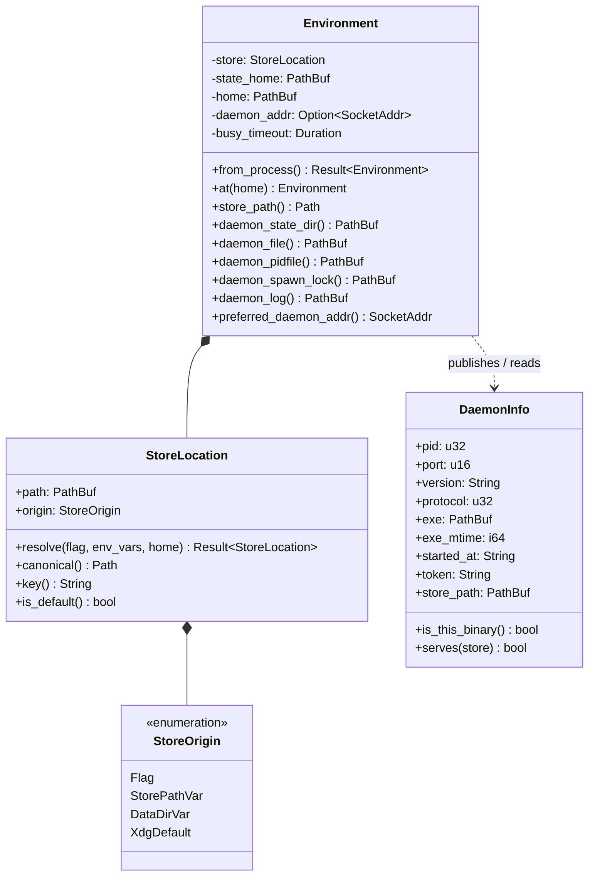

# Store isolation: one daemon per store, keyed by the store path

Design of record for **SH-113** (child C1 of epic SH-112), and the origin-fix for
**SH-123**. Written for approval before implementation.

## The problem, demonstrated

Daemon runtime state is keyed on `state_home`. The store is keyed on `data_home`. The
two move independently, and nothing reconciles them — so a client can be pointed at one
store and served by a daemon holding another.

Verified against the installed `story 1.0.0` on 2026-08-01:

```sh
P=/private/tmp/sh-probe2; mkdir -p $P/state $P/repoA
export HOME=$P XDG_STATE_HOME=$P/state STORYHOOK_DAEMON_ADDR=127.0.0.1:0 STORYHOOK_PARENT_PID=$$

export STORYHOOK_DATA_DIR=$P/A
cd $P/repoA && git init -q && story project new --prefix AAA
story new "CANARY belongs to store A"

export STORYHOOK_DATA_DIR=$P/B     # a different store
story list                          # -> AAA-1  CANARY belongs to store A
```

`$P/B/store.db` is never created. The client became an RPC client of store A's daemon,
for reads *and* writes, with no diagnostic and exit 0.

Two consequences worth stating plainly:

- **`STORYHOOK_DATA_DIR` is not an isolation mechanism today.** It works only when
  paired with `XDG_STATE_HOME`, which four shell harnesses do by hand
  (`scripts/run-tests.sh:29-30` and the plugin equivalents). Nothing in the binary
  requires the pairing, and `TEST_BUILD_REFUSAL` (`src/env.rs:285`) recommends the
  unpaired half.
- **A binary mismatch already escalates this to a hijack.** `ensure`
  (`src/daemon/lifecycle.rs:300`) sends any unusable daemon to `spawn_locked`, which
  shuts the incumbent down and takes its place (`:338-343`). A differently-built binary
  run with a stray `STORYHOOK_DATA_DIR` therefore kills the daemon serving the real
  store and republishes the shared portfile pointing at a temp store.

## The rule

> **A store's identity determines its daemon's identity.** Daemon runtime state is
> derived from the canonical store path, so one store has exactly one daemon by
> construction, and "client and daemon disagree about the store" is unrepresentable
> rather than detected.

This is deliberately not a check. A check leaves the shared state home in place and
fixes the encounter point; per the defect tenets, the origin is the sharing itself.

## Types



**`StoreLocation`** is the new type and carries the whole decision. It holds the
canonicalized path, remembers *how* it was chosen (`StoreOrigin`, which the refusal
messages and `story store new` need), and derives the `key()` that names the daemon's
state directory.

`Environment` loses `data_home` as the store's source of truth. `store_path()` becomes a
field read rather than `data_home.join("store.db")`, and the four daemon-file accessors
move under `daemon_state_dir()`.

`DaemonInfo` gains `store_path` — not as the enforcement mechanism, which is the keyed
directory, but so a portfile is self-describing when a human reads it, and so a
collision on the key digest is detectable rather than silent.

## Resolution order

The store file is named by, in order:

1. `--store-path <path>` — a **file**, not a directory
2. `STORYHOOK_STORE_PATH`
3. `STORYHOOK_DATA_DIR` + `/store.db` — retained, and now sufficient on its own
4. `$XDG_DATA_HOME/storyhook/store.db`, else `~/.local/share/storyhook/store.db`

`is_test_build()` still refuses 4 outright, unchanged.

**Canonicalization is load-bearing.** Two spellings of one path must not produce two
daemons on one SQLite file. `std::fs::canonicalize` needs the file to exist, which it
does not before `store new`, so: canonicalize the deepest existing ancestor and rejoin
the remainder, then reject any residual `..`.

**The key** is the first 16 hex of the SHA-256 of the canonical path. Digest rather than
an escaped path because state directory names must not depend on path length or on
characters a filesystem may refuse.

```
$XDG_STATE_HOME/storyhook/
  daemons/
    <key>/
      daemon.json        # portfile, 0600, now carrying store_path
      daemon.pid         # the liveness lock
      daemon.spawn.lock
      daemon.log
```

## Ports

- The **default** store keeps `DEFAULT_DAEMON_PORT` (3456), so the dashboard URL is
  stable and the launchd agent needs no change.
- Any **non-default** store binds port 0 and publishes the assigned port in its own
  portfile. Two isolated stores can therefore never collide on a port, which is what
  makes a parallel test suite safe without the harness choosing ports.
- `STORYHOOK_DAEMON_ADDR` still overrides explicitly and still wins.

## What this fixes for free

Once state is derived from the store path, `STORYHOOK_DATA_DIR` alone isolates
completely. The four harnesses that pair it with `XDG_STATE_HOME` by hand become correct
by construction; the pairing stays valid but stops being load-bearing. SH-123 closes
with the repro above as its regression test.

## Migration

The one real transition hazard: after upgrading, a client looks under `daemons/<key>/`,
finds nothing, and spawns a second daemon while the **old** daemon still holds the
legacy `state_home/daemon.json` and serves the same default store.

Handled explicitly: when resolving the *default* store and the new keyed portfile is
absent, check the legacy path; if a live daemon is there, shut it down before spawning,
exactly as `spawn_locked` does today. Bounded to one upgrade, and gets its own test.

## Test plan (red first)

1. **SH-123 regression** — two data dirs, one state home, no cross-talk. Fails today.
2. Two spellings of one store path (symlink, `..`, trailing slash) resolve to one key.
3. Concurrent spawn for the same store yields exactly one daemon; for two stores, two.
4. A `--store-path` run leaves the default store byte-identical (`ProjectBuilder::local()`
   — a daemon would answer from its page cache and not see the file).
5. `story store new` refuses the default path; creates an empty store elsewhere.
6. Upgrade path: a live legacy daemon on the default store is stood down, not duplicated.

## Deliberately out of scope

- **Idle reaping for non-default stores.** `STORYHOOK_PARENT_PID` already reaps
  test-spawned daemons. A general idle timeout is a follow-on, filed rather than built.
- **Multiplexing several stores in one daemon.** Rejected: it would put the cross-store
  hazard back inside one process, and the daemon's change token, id counter and page
  cache are all per-store.

## As built

Six things the design above did not say, each decided during implementation. The rule,
the key, the layout, the ports and the migration all landed as written.

**1. The flag is published into the environment, not threaded.** `main` canonicalizes
`--store-path` and exports it as `$STORYHOOK_STORE_PATH` before anything resolves
anything. Threading an `Environment` would have reached the dispatch arms and missed
everything else: `story daemon status` and `story web status` re-resolve, the TUI is
dispatched before the parser, and a git hook that runs `story` is a different process
entirely. `--store-path` means *this invocation and everything it starts*, and the only
way to say that to a child is a variable it inherits. `Environment::from_process` still
takes the flag, so the *origin* stays accurate where the choice was made.

The spawned daemon gets `--store-path` on its argv as well as inheriting the variable.
Redundant on purpose: a daemon published in one store's directory while holding another
file is the exact state this design exists to make unrepresentable, and the argv is what
makes it independent of what the parent's environment happened to contain.

Pinned by `a_child_process_of_a_store_path_run_lands_in_the_same_store` (SH-131), which
fires an event hook that runs `story` again with no flag and no variable of its own. It
observes a *child* rather than the assignment, because the promise is "this invocation
and everything it starts" and a test of the promise survives a redesign that keeps it by
other means. It also observes the one consumer whose breakage is silent: `daemon status`
was already covered, and the TUI and `story web` at least run in front of somebody.

**2. Backups are keyed too, for a non-default store only.** `run_if_due` prunes to seven
snapshots, so a scratch store's daemon sharing `state_home/backups` would *delete the
real store's backup history* — a second store must have its own. The default store keeps
the unkeyed path its snapshots are already at, because moving them would be a migration
whose only reward is symmetry. `github_backups_dir` follows the same rule.

**3. The legacy daemon is stood down on "does it still answer", not on the pidfile
lock.** The daemon being retired is by definition one whose runtime files are not where
this build looks, so asking it directly is both simpler and the question that matters —
and it is what makes the upgrade testable without simulating a lock held by a process
that does not exist.

**4. `story store new` is answered in `main`, before any store is opened.** Every other
command resolves the ambient store first. Doing that here would create the real store as
a side effect of asking for a different one, and would refuse outright in a test build —
which is the one build that most needs to make a scratch store. It joins `daemon --serve`
as a command `main` handles rather than dispatches.

**5. Canonicalization must be stable across the store file appearing.** Found by the
suite, not by review: `Path::join("")` appends a separator, so once the file existed the
"deepest existing ancestor" walk returned `…/store.db/` — a different string, a different
key, a second daemon, and an `exists()` of `false`. The invariant is now pinned directly
(`the_same_path_resolves_the_same_before_and_after_it_exists`). It is the same defect
class the whole design is against, arriving through the mechanism itself.

**6. `$STORYHOOK_STORE_PATH` outranks `$STORYHOOK_DATA_DIR`, so every harness must
neutralize it.** A developer debugging a second store has one exported; without this,
their next `make test` runs the whole suite against it and the data-dir guard does not
notice, because it inspects the variable that lost. `TestEnv` sets it (a sixth
`ISOLATED_VARS` entry) and the four shell harnesses unset it.

Pinned by `every_harness_that_isolates_the_data_dir_neutralizes_the_store_path` (SH-131),
which is derived rather than enumerated: it takes the tracked shell scripts that export
`STORYHOOK_DATA_DIR` and requires the neutralization beside it. The enumeration is what
failed. Those `unset` lines landed together in this design's own commit and
`scripts/capture-baseline.sh` was missed — a fourth harness, exporting the same
variables, whose comment claimed it provided "the same contract `scripts/run-tests.sh`
provides". It stayed missed until SH-131 measured what a leaked variable costs: one
9-test file passes 9/9, never creates the isolated store, and puts 9 projects and 7
stories into the developer's own.

Two consequences worth naming: `scripts/check-no-orphan-servers.sh` matches the daemon's
argv, and a flag now sits between the binary and the verb — a guard that matches nothing
passes, so its pattern was widened. And a launchd agent for a non-default store carries
`--store-path`, because its log path is already that store's.

**7. `refuse_temp_project_in_real_store` (SH-95) was not retired, and a "state the fact"
version of it was tried and reverted.** This design's stated premise for retiring it —
"projects are no longer created *at a path*" — does not hold: `--attach` still defaults to
the client's cwd, and `import-project` and a non-dry-run `migrate` still create at a path
(`project_creation_target`, `src/invoke.rs`). The guard is also the only thing that fires
on the caller SH-122 names as the residual gap — a foreign suite that never opts into
`--store-path` at all — so nothing here replaces its detection.

Its store-side check — `is_under_temp(store_path)`, a path guess — looked improvable by
`store.is_default()`, a fact: "is this the store every other command reaches for" rather
than "does this path look temporary". Tried, and reverted after running the suite rather
than after review: `is_default()` is relative to whatever `HOME` a process has, and
`TestEnv` (this design's own primary test harness, `storyhook-test-support`) deliberately
builds a fake `HOME` and points every store-naming variable at *that* home's own
default-shaped subdirectory, so a fixture's layout mirrors a real one while staying
disposable. That makes `is_default()` true for essentially every correctly isolated
fixture in the suite — indistinguishable by path alone from the real hazard, because both
answers come from the same two inputs (`HOME`, and whether anything overrides it). The
same substitution was tried on `is_test_build()`'s own refusal (`origin() == XdgDefault` →
`is_default()`) for the identical reason and reverted for the identical one: it refused
`the_harness_always_names_a_data_directory`, `TestEnv`'s own conformance test, and with it
every fixture built the same way.

What shipped instead: the refusal message now offers `story store new` and `--store-path`
first, with `$STORYHOOK_DATA_DIR` named as the environment-only route that loses if a
higher lever is also set — the same defect class as As-built item 6, one level up, in
prose a human reads rather than in a harness a script runs.

**8. SH-122 shipped a guardrail rather than remaining a measurement.** The story's
acceptance criterion asked for evidence before reopening — a second incident, or a count
of junk projects in the real store. The census came back clean (14 projects, 0 junk,
2026-08-05), but the epic's own argument for accepting the gap did not survive checking:
it held that `story project new` "is explicit and interactive unless given switches", so
the drive-by path SH-95 exploited no longer exists. The neighbouring repository whose
suite caused SH-95's incident ported all 164 of its fixture sites from `story init` to
`story project new --prefix XX --no-attach` — switches, no questions asked, mechanically
following the rename. Its own isolation wrapper additionally names `STORYHOOK_INVOKER=local`
"the load-bearing one"; SH-114 deleted the local invoker, so that wrapper isolates today
only by accident of item 6 above, and it does not neutralize `$STORYHOOK_STORE_PATH` the
way item 6 requires every harness to.

`refuse_temp_project_in_real_store` judges a path, so it has two blind spots: `--no-attach`
creates nothing at a path to judge, and a fixture directory that is not itself under a temp
root (a CI workspace outside `$TMPDIR`) is not temporary by that guard's rule even though it
is exactly as throwaway. `refuse_project_burst_in_real_store` (`src/service/project.rs`)
asks a question neither blind spot changes: how many projects, how fast. A person or a
script that means to create a project creates one; the suite that caused SH-95 ran at
roughly 15 a minute. The gate refuses the 5th project created in a store that is not
throwaway within a ten-minute window, named by `STORYHOOK_ALLOW_PROJECT_BURST` when the
volume is deliberate. It reads `ReadOps::projects()` and is gated behind
`invoke::creates_a_project`, so `import-project` and a non-dry-run `migrate` — bulk verbs a
person or a script chose deliberately by typing that command — stay under the path-based
guard alone, matching the same carve-out `project_creation_target` already draws.

No schema migration, no wire change: `ProjectRecord::created_at` already carried what the
gate needs.
