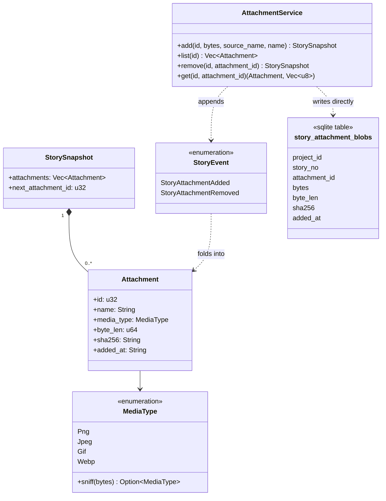

# Story attachments: the storage and CLI foundation

Design of record for **SH-315** (the epic) and its foundation child **SH-387**. Written
after implementation, for the reason [`dashboard-dispatch.md`](dashboard-dispatch.md) and
[`responsive-dashboard.md`](responsive-dashboard.md) give: sharper against the actual code
than against a proposal for it.

## Context

SH-315 asks for image attachments on stories: bytes stored with the store, thumbnails in
the dashboard's story detail, a modal viewer, pasting an image into the new-story
description, dragging one onto an existing story's description or comment field,
URL-referenced remote images, and a `story attachment` CLI family. The story files itself
as an epic that "will need to be decomposed into child stories," and this session
decomposed it into seven — SH-387 through SH-393, filed and wired (`parent-of` from
SH-315, `blocks` edges between them) as this story's own first comment records.

SH-387 is the foundation: storage, the event log, doctor coverage, export/import carry,
and the CLI. No dashboard work — three hard walls in `src/api/http.rs` (no binary
response path, no binary request path, no `img-src` in the CSP) make a browser-facing
slice a separate, deliberate piece of work, named as children SH-388 through SH-393
below.

## The rule

> An attachment's **identity and metadata are events**; its **bytes are a row keyed by
> the story that owns them**. Nothing about an attachment lives outside the store file,
> so `story store backup`, `VACUUM INTO`, `delete_project` and `purge_story` all keep
> working by construction rather than by a second cleanup path anyone has to remember.

Two alternatives were rejected, and why:

- **Bytes in the event payload.** Correct on paper — export, import and rebuild would
  carry them for free — but `append_and_fold` re-reads and re-parses a story's *entire*
  log on every subsequent write (`events_for` → `fold_story`, called from all 29
  `append_and_fold` call sites), so one multi-megabyte attachment would tax every later
  comment and move on that story.
- **Bytes in a directory beside `store.db`.** No precedent anywhere in the repo — nothing
  under `src/` writes user bytes to disk — and it would need its own answers for
  `Store::snapshot`, the backup schedule, and `verify_project_is_gone`/
  `verify_story_is_gone`, four guarantees traded for nothing.

## Types



Decisions carried by that diagram:

- **`Attachment.id` never reuses.** `StorySnapshot.next_attachment_id` is a monotonic
  counter, folded as `max(current, id + 1)` on every `StoryAttachmentAdded` — **not**
  `max(current attachments) + 1`, which was the first implementation and reused id 1 the
  moment attachment 1 was removed (`tests/story_attachments.rs::
  ids_never_reuse_once_an_attachment_is_removed` is the regression test). Mirrors
  `projects.next_story_no`'s own relationship to story numbers.
- **Media type is sniffed from magic bytes, never the extension** (`src/domain/
  media_type.rs`), and only PNG/JPEG/GIF/WebP are accepted. **SVG is refused**: it is
  script-bearing markup, and a same-origin route serving it back to a browser (child
  SH-388) would be a stored-XSS sink the moment it exists.
- **`sha256` and `byte_len` are recorded in both the event/snapshot and the blob row**,
  deliberately redundant — `story doctor` compares the two independently, so bytes
  corrupted or truncated on disk are caught even though the snapshot's own copy is
  untouched by that corruption.
- **Removal deletes the bytes.** `StoryAttachmentRemoved` is not a tombstone: an
  attachment removed by mistake is genuinely gone, not merely hidden. The event log still
  records that it existed and was removed.
- **The blob table is a projection written directly by the service**, not by
  `write::append`'s per-kind loop the way `story_pr_links`/`story_commit_links` are:
  those projections read the field they need straight out of the event's own JSON
  payload, and an attachment's bytes are never in that payload to read.

## Grammar

```
story attachment add <id> <path> [--name <text>]
story attachment list <id>
story attachment remove <id> <n>
story attachment save <id> <n> <path>
```

`save`, not `export`, so it never reads as a sibling of `story export`. `add`/`save`'s
`<path>` is resolved by the daemon against the request's own `cwd` (`invoke::
resolve_against`), the same mechanism `story import-project <file>` already uses — no
bytes cross the wire in either direction, so the 64 KiB UTF-8-only request body cap
(`src/api/http.rs::MAX_BODY_BYTES`) is never in play. `add`/`remove` refuse a closed
story (`Intent::Edit`, joining `resolve_open_story`'s existing set — not
`Intent::Append`, whose pinned set `tests/invoker_seam.rs::
only_comment_commit_link_and_progress_publish_append_to_a_closed_story` names explicitly
and which this does not join): an attachment is part of what a story *is*, not an
observation recorded about it after the fact. `list`/`save` are read-only and work on a closed story exactly as
`story show` does.

`story attachment list <id>` renders the whole story (`ctx.story_view`) rather than a
bespoke response: `StorySnapshot.attachments` is already part of it, `story show`'s
human and `--json` renderings already surface it, and a dedicated `Response` variant
would touch every arm of `render_json`/`render_human` for a reader this foundation has
no use for yet.

## `story doctor` coverage

Three new `FindingCode` variants (`src/domain/finding.rs`), none auto-repairable — see
`plan_repair`'s own comment for why guessing at either is worse than reporting it:

- `MissingAttachmentBlob` — the snapshot names an attachment with no backing blob row.
- `OrphanedAttachmentBlob` — a blob row no snapshot names.
- `AttachmentBlobMismatch` — the snapshot's recorded byte length/sha256 disagrees with
  the blob row's own.

`ReadOps::attachment_blobs(project)` is one project-wide query — every blob's metadata,
paired with its story number — read once per `story doctor` run and compared against
every story's folded attachment list, rather than one query per story (the same shape
`ReadOps::pr_links` already uses for the same reason).

## Export and restore

`story export` reads every attachment blob a story's snapshot names into
`ExportedStory.attachment_blobs` — a plain JSON byte array, not base64: this is the
backup-and-rollback document, not a wire-optimized format, and a hand-rolled base64
codec is complexity this session's evidence gave no reason to add. A missing blob is
skipped rather than failing the whole export, matching `ExportedEvent`'s own rule that
export must never fail on account of already-known damage. `story import-project`
writes the bytes back, **recomputing sha256 from the restored bytes** rather than
carrying a second copy of it in the document — a restore that recomputes is self-healing
against any mismatch the backup captured. The legacy `.storyhook` tree reader
(`src/storage.rs`) carries no attachments: that rollback path predates this feature
entirely.

## Test plan

| Fence | What it covers |
|---|---|
| `src/domain/media_type.rs`'s own unit tests | sniffing every accepted format, refusing SVG/HTML/truncated/empty input |
| `tests/story_attachments.rs` | the CLI end to end: add/list/save/remove, `--name`, id non-reuse, every refusal (bad format, oversized, missing source, closed story, nonexistent story, bad grammar), `story doctor` on a healthy attachment, export → import-project round trip |
| `tests/service_integrity.rs` | all three `FindingCode`s provoked against a real damaged store (a deleted blob row, an orphaned insert, an altered sha256) |
| `tests/service_transfer.rs`, `tests/migrate_round_trip.rs` | unaffected — run to prove the new `ExportedStory` field does not disturb the existing golden byte-for-byte comparisons |
| `tests/golden_cli.rs` | `show_human`/`show_json`/`doctor_human`/`doctor_json` are pinned **unchanged** — the golden fixture has no attachments, and both renderings are empty-gated |
| `tests/wire_envelope.rs`, `tests/trailing_arguments.rs`, `tests/readme_command_reference.rs`, `tests/unknown_flag_sweep.rs`, `tests/help_flag_sweep.rs`, `tests/dead_public_surface.rs`, `tests/event_kind_vocabulary.rs`, `tests/read_model_column_coverage.rs` | the standing CLI/store fences every new `Invocation` variant, event kind and read-model field must satisfy |

## Deliberately out of scope, named rather than assumed

Content-addressed **deduplication** across stories (a duplicate upload costs duplicate
bytes, which is what keeps `purge_story` a plain delete with no refcount to maintain);
non-image attachments; any per-story or per-project size budget beyond the flat 10 MiB
cap (`AttachmentService::MAX_ATTACHMENT_BYTES`); and everything the six sibling children
below carry.

## The decomposition

| Child | Scope | Depends on |
|---|---|---|
| **SH-387** | this document's scope: storage, events, CLI, doctor, export carry | — |
| **SH-388** | authenticated byte-serving route + `StoryView` exposure — must settle the cookie-borne-read hazard first: an `` request cannot set the `X-Storyhook` header `same_origin_read` checks first (`src/api/admission.rs`) | SH-387 |
| **SH-389** | browser upload transport: raise or bypass the 64 KiB UTF-8-only request body cap | SH-387 |
| **SH-390** | drawer thumbnail strip + modal viewer, on the existing `data-overlay` registry, plus Playwright coverage on both desktop engines | SH-388 |
| **SH-391** | paste an image into the new-story description | SH-389, SH-390 |
| **SH-392** | drag an image onto an existing story's description or comment field | SH-389, SH-390 |
| **SH-393** | remote image URLs: CSP `img-src` relaxation, SSRF/privacy analysis, thumbnail strategy — deliberately reopens [`markdown-in-the-dashboard.md`](markdown-in-the-dashboard.md)'s "no images" rule | SH-390 |

## As built

Matches this document as written — SH-387 shipped exactly the storage-and-CLI scope
above, with the `next_attachment_id` counter added during implementation once
`tests/story_attachments.rs` demonstrated the id-reuse defect a first draft would have
shipped. SH-388 through SH-393 remain open; SH-315 itself stays open until they land.
