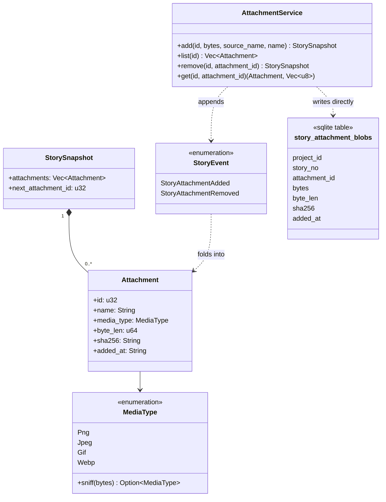

# Story attachments: storage, transport, and dashboard viewer

Design of record for **SH-315** (the epic), foundation child **SH-387**,
byte-serving child **SH-388**, upload transport child **SH-389**, drawer/viewer
child **SH-390**, create-modal paste child **SH-391**, existing-story drop child
**SH-392**, and remote-image child **SH-393**. Written
after implementation, for the reason [`dashboard-dispatch.md`](dashboard-dispatch.md) and
[`responsive-dashboard.md`](responsive-dashboard.md) give: sharper against the actual code
than against a proposal for it.

## Context

SH-315 asks for image attachments on stories: bytes stored with the store, thumbnails in
the dashboard's story detail, a modal viewer, pasting an image into the new-story
description, dragging one onto an existing story's description or comment field,
URL-referenced remote images, and a `story attachment` CLI family. The story files itself
as an epic that "will need to be decomposed into child stories," and this session
decomposed it into seven — SH-387 through SH-393, filed and wired (`parent-of` from
SH-315, `blocks` edges between them) as this story's own first comment records.

SH-387 is the foundation: storage, the event log, doctor coverage, export/import carry,
and the CLI. No dashboard work — three hard walls in `src/api/http.rs` (no binary
response path, no binary request path, no `img-src` in the CSP) make a browser-facing
slice a separate, deliberate piece of work, named as children SH-388 through SH-393
below.

## The rule

> An attachment's **identity and metadata are events**; its **bytes are a row keyed by
> the story that owns them**. Nothing about an attachment lives outside the store file,
> so `story store backup`, `VACUUM INTO`, `delete_project` and `purge_story` all keep
> working by construction rather than by a second cleanup path anyone has to remember.

Two alternatives were rejected, and why:

- **Bytes in the event payload.** Correct on paper — export, import and rebuild would
  carry them for free — but `append_and_fold` re-reads and re-parses a story's *entire*
  log on every subsequent write (`events_for` → `fold_story`, called from all 29
  `append_and_fold` call sites), so one multi-megabyte attachment would tax every later
  comment and move on that story.
- **Bytes in a directory beside `store.db`.** No precedent anywhere in the repo — nothing
  under `src/` writes user bytes to disk — and it would need its own answers for
  `Store::snapshot`, the backup schedule, and `verify_project_is_gone`/
  `verify_story_is_gone`, four guarantees traded for nothing.

## Types



Decisions carried by that diagram:

- **`Attachment.id` never reuses.** `StorySnapshot.next_attachment_id` is a monotonic
  counter, folded as `max(current, id + 1)` on every `StoryAttachmentAdded` — **not**
  `max(current attachments) + 1`, which was the first implementation and reused id 1 the
  moment attachment 1 was removed (`tests/story_attachments.rs::
  ids_never_reuse_once_an_attachment_is_removed` is the regression test). Mirrors
  `projects.next_story_no`'s own relationship to story numbers.
- **Media type is sniffed from magic bytes, never the extension** (`src/domain/
  media_type.rs`), and only PNG/JPEG/GIF/WebP are accepted. **SVG is refused**: it is
  script-bearing markup, and a same-origin route serving it back to a browser (child
  SH-388) would be a stored-XSS sink the moment it exists.
- **`sha256` and `byte_len` are recorded in both the event/snapshot and the blob row**,
  deliberately redundant — `story doctor` compares the two independently, so bytes
  corrupted or truncated on disk are caught even though the snapshot's own copy is
  untouched by that corruption.
- **Removal deletes the bytes.** `StoryAttachmentRemoved` is not a tombstone: an
  attachment removed by mistake is genuinely gone, not merely hidden. The event log still
  records that it existed and was removed.
- **The blob table is a projection written directly by the service**, not by
  `write::append`'s per-kind loop the way `story_pr_links`/`story_commit_links` are:
  those projections read the field they need straight out of the event's own JSON
  payload, and an attachment's bytes are never in that payload to read.

## Grammar

```
story attachment add <id> <path> [--name <text>]
story attachment list <id>
story attachment remove <id> <n>
story attachment save <id> <n> <path>
```

`save`, not `export`, so it never reads as a sibling of `story export`. `add`/`save`'s
`<path>` is resolved by the daemon against the request's own `cwd` (`invoke::
resolve_against`), the same mechanism `story import-project <file>` already uses — no
bytes cross the wire in either direction, so the 64 KiB UTF-8-only request body cap
(`src/api/http.rs::MAX_BODY_BYTES`) is never in play. `add`/`remove` refuse a closed
story (`Intent::Edit`, joining `resolve_open_story`'s existing set — not
`Intent::Append`, whose pinned set `tests/invoker_seam.rs::
only_comment_commit_link_and_progress_publish_append_to_a_closed_story` names explicitly
and which this does not join): an attachment is part of what a story *is*, not an
observation recorded about it after the fact. `list`/`save` are read-only and work on a closed story exactly as
`story show` does.

`story attachment list <id>` renders the whole story (`ctx.story_view`) rather than a
bespoke response: `StorySnapshot.attachments` is already part of it, `story show`'s
human and `--json` renderings already surface it, and a dedicated `Response` variant
would touch every arm of `render_json`/`render_human` for a reader this foundation has
no use for yet.

## `story doctor` coverage

Three new `FindingCode` variants (`src/domain/finding.rs`), none auto-repairable — see
`plan_repair`'s own comment for why guessing at either is worse than reporting it:

- `MissingAttachmentBlob` — the snapshot names an attachment with no backing blob row.
- `OrphanedAttachmentBlob` — a blob row no snapshot names.
- `AttachmentBlobMismatch` — the snapshot's recorded byte length/sha256 disagrees with
  the blob row's own.

`ReadOps::attachment_blobs(project)` is one project-wide query — every blob's metadata,
paired with its story number — read once per `story doctor` run and compared against
every story's folded attachment list, rather than one query per story (the same shape
`ReadOps::pr_links` already uses for the same reason).

## Export and restore

`story export` reads every attachment blob a story's snapshot names into
`ExportedStory.attachment_blobs` — a plain JSON byte array, not base64: this is the
backup-and-rollback document, not a wire-optimized format, and a hand-rolled base64
codec is complexity this session's evidence gave no reason to add. A missing blob is
skipped rather than failing the whole export, matching `ExportedEvent`'s own rule that
export must never fail on account of already-known damage. `story import-project`
writes the bytes back, **recomputing sha256 from the restored bytes** rather than
carrying a second copy of it in the document — a restore that recomputes is self-healing
against any mismatch the backup captured. The legacy `.storyhook` tree reader
(`src/storage.rs`) carries no attachments: that rollback path predates this feature
entirely.

## Test plan

| Fence | What it covers |
|---|---|
| `src/domain/media_type.rs`'s own unit tests | sniffing every accepted format, refusing SVG/HTML/truncated/empty input |
| `tests/story_attachments.rs` | the CLI end to end: add/list/save/remove, `--name`, id non-reuse, every refusal (bad format, oversized, missing source, closed story, nonexistent story, bad grammar), `story doctor` on a healthy attachment, export → import-project round trip |
| `tests/service_integrity.rs` | all three `FindingCode`s provoked against a real damaged store (a deleted blob row, an orphaned insert, an altered sha256) |
| `tests/service_transfer.rs`, `tests/migrate_round_trip.rs` | unaffected — run to prove the new `ExportedStory` field does not disturb the existing golden byte-for-byte comparisons |
| `tests/golden_cli.rs` | `show_human`/`show_json`/`doctor_human`/`doctor_json` are pinned **unchanged** — the golden fixture has no attachments, and both renderings are empty-gated |
| `tests/wire_envelope.rs`, `tests/trailing_arguments.rs`, `tests/readme_command_reference.rs`, `tests/unknown_flag_sweep.rs`, `tests/help_flag_sweep.rs`, `tests/dead_public_surface.rs`, `tests/event_kind_vocabulary.rs`, `tests/read_model_column_coverage.rs` | the standing CLI/store fences every new `Invocation` variant, event kind and read-model field must satisfy |

## Deliberately out of scope, named rather than assumed

Content-addressed **deduplication** across stories (a duplicate upload costs duplicate
bytes, which is what keeps `purge_story` a plain delete with no refcount to maintain);
non-image attachments; any per-story or per-project size budget beyond the flat 10 MiB
cap (`AttachmentService::MAX_ATTACHMENT_BYTES`); and everything the six sibling children
below carry.

## The decomposition

| Child | Scope | Depends on |
|---|---|---|
| **SH-387** | this document's scope: storage, events, CLI, doctor, export carry | — |
| **SH-388** | authenticated byte-serving route + `StoryView` exposure — must settle the cookie-borne-read hazard first: an `` request cannot set the `X-Storyhook` header `same_origin_read` checks first (`src/api/admission.rs`) | SH-387 |
| **SH-389** | browser upload transport: raise or bypass the 64 KiB UTF-8-only request body cap | SH-387 |
| **SH-390** | drawer thumbnail strip + modal viewer, on the existing `data-overlay` registry, plus Playwright coverage on both desktop engines | SH-388 |
| **SH-391** | paste an image into the new-story description | SH-389, SH-390 |
| **SH-392** | drag an image onto an existing story's description or comment field | SH-389, SH-390 |
| **SH-393** | remote image URLs: CSP `img-src` relaxation, SSRF/privacy analysis, thumbnail strategy — deliberately reopens [`markdown-in-the-dashboard.md`](markdown-in-the-dashboard.md)'s "no images" rule | SH-390 |

## Browser upload transport (SH-389)

The browser submits one image to
`POST /api/repos/{repo}/story/{story}/attachments`. The request body is raw
bytes: Fetch supports `Blob` directly, so neither multipart framing nor base64
is needed. This endpoint attaches to an existing story; story creation, paste,
drag/drop and viewing remain separate children of SH-315.

| Contract | Behavior |
|---|---|
| Authentication | Existing API admission: master/named header token or same-origin named-token cookie, plus `X-Storyhook` and trusted Host |
| Content-Type | Exactly one of `application/octet-stream`, `image/png`, `image/jpeg`, `image/gif`, `image/webp`; case-insensitive, parameters ignored |
| Image format | Existing service sniffs magic bytes; the declared MIME type and filename never decide the stored format |
| Size | At most `MAX_ATTACHMENT_BYTES` (10 MiB), including the boundary; ordinary requests retain the 64 KiB UTF-8 cap |
| Filename | Optional `X-Storyhook-Attachment-Name`, encoded with `encodeURIComponent`; absence defaults to `attachment` |
| Filename validation | Strict percent/UTF-8 decoding, once; `+` stays literal; duplicate, empty, malformed, and control-bearing values return 400 |
| Filename normalization | Existing source-name basename rule; the name never causes filesystem access |
| Success | 201 and the existing story JSON envelope (`result: "ok"`, `story.story.attachments`); project change published after commit |
| Refusals | Admission 401/403; request media type 415; body over cap 413; body framing/read failure 400; unsupported image bytes 422; existing project/story errors unchanged |
| Story restrictions | Canonical/numeric IDs use existing canonicalization; foreign prefixes are refused; closed stories and projects without a checkout remain uneditable |
| Provenance | `command: "web:attachment"`, `actor: "web:user"` |

```javascript
// Run on the authenticated dashboard origin; `image` is a Blob or File.
const response = await fetch(
  `/api/repos/${encodeURIComponent(repo)}/story/${encodeURIComponent(story)}/attachments`,
  {
    method: "POST",
    headers: {
      "X-Storyhook": "1",
      "Content-Type": "application/octet-stream",
      "X-Storyhook-Attachment-Name": encodeURIComponent(filename),
    },
    body: image,
  },
);
if (!response.ok) throw new Error(await response.text());
const updated = await response.json();
```

The worker classifies the route after admission and acquires a `Text(String)`
or `Binary(Vec<u8>)` body. Only the upload route receives the larger allowance;
engine and RPC handlers only consume text. Reads use the existing HTTP framing
decoder and absolute peer deadline. Declared oversize is refused before reading;
chunked and fixed-length bodies are bounded to the cap plus one byte. Rejected
bodies are never drained, preserving the transport's protection against stalled
peers. A complete refusal response can therefore precede a TCP reset when
unread request bytes remain; clients must respect HTTP response framing.

The REST route uses the common project-resolution and change-publication path,
then calls `AttachmentService::add`. Blob and event writes remain one transaction.
There is no temporary-file, migration, or separate CLI invocation variant.

| Verification | Coverage |
|---|---|
| Upload module unit/property tests | Filename decoding, Unicode round trips, duplicate media-type refusal |
| `tests/attachment_upload.rs` | Real HTTP byte/hash round trip; all formats; 64 KiB and 10 MiB boundaries; chunked, incomplete and stalled bodies; admission, revocation, project/story rules, provenance and change signal |
| `e2e/specs/attachment-upload.spec.ts` | Browser-generated PNG Blob, cookie admission, Unicode filename, SHA-256, and byte-for-byte authenticated download through real Fetch in Chromium and WebKit |
| Existing targeted suites | REST routing/classification, CLI attachments, daemon RPC and deadline regressions |

## As built

Matches this document as written — SH-387 shipped exactly the storage-and-CLI scope
above, with the `next_attachment_id` counter added during implementation once
`tests/story_attachments.rs` demonstrated the id-reuse defect a first draft would have
shipped.

SH-389 adds the raw binary upload contract above without widening the ordinary
JSON request limit. Display, paste, drag/drop and remote URL work remain with
the sibling stories; SH-315 stays open until its children land.

Targeted verification for SH-389: 10 upload integration tests, 121 relevant unit
tests, 50 existing integration regressions, and 21 repository-fence tests passed.
The real Blob test passed in Chromium and WebKit. Formatting and targeted Clippy
checks passed with warnings treated as errors. Full-suite verification belongs
to the centralized verifier.

## As built — SH-388: authenticated bytes

`GET /api/repos/{project}/story/{story}/attachments/{attachment}` resolves the
project slug through the existing REST router and calls `AttachmentService::get`
with that project's context. Attachment IDs are positive decimal `u32` values
(leading zeroes are accepted); invalid syntax, signs, zero, and overflow return
400. Missing resources return 404, missing backing blobs retain the service's
contextual integrity error (500), and closed stories remain readable. Other
methods follow the existing method/admission rules (405 after admission).

`Reply` now stores `Vec<u8>` and feeds the HTTP response's byte constructor.
Text constructors retain their UTF-8 behavior; `body()` exposes bytes and
`text_body()` reports invalid UTF-8 explicitly. The finalizer still owns all
security headers. Successful attachment responses add `Cache-Control: no-store`
and `Cross-Origin-Resource-Policy: same-origin`, with the allowlisted stored MIME
type and Content-Length computed from the actual bytes. The supplied filename
never enters a header. Responses are complete: Range and conditional headers
do not select partial or cached responses. The existing 10 MiB attachment limit
bounds ordinary blob reads; no schema or upload change is involved.

### The cookie decision

No URL credential or new authentication path is needed. SH-319 already supplied
the mechanism the original SH-388 description called out as unresolved:
`same_origin_read` accepts a named cookie with `Sec-Fetch-Site: same-origin`,
or, only when that header is absent, a Referer whose authority matches Host.
The latter is needed on plain HTTP LAN/tailnet origins, where browsers do not
send Fetch Metadata. The dashboard's existing `Referrer-Policy: same-origin`
keeps that proof available for a same-origin image. Explicit master/named token
headers continue to work. Missing or rejected proof fails closed, and query
parameters cannot authenticate.

This reuses the existing gate rather than weakening it. The browser restriction
in the response adds defense against cross-origin embedding. References:
[Fetch Metadata](https://www.w3.org/TR/fetch-metadata/) and
[Fetch's Cross-Origin-Resource-Policy](https://fetch.spec.whatwg.org/#cross-origin-resource-policy-header).
The explicit `img-src 'self' blob:` policy allows both these same-origin images
and SH-391's browser-local staged previews without relaxing any other resource
type or admitting remote or `data:` image sources.

### Metadata and consumers

Both story-detail and board responses already serialize
`StoryView.story.attachments`. Consumers build the relative route from the
project slug, story ID, and attachment ID; metadata gains no duplicate fields,
URLs, tokens, or byte payloads. Empty attachment lists remain omitted. Drawer
markup and the viewer belong to SH-390, uploads to SH-389, and remote URLs to
SH-393.

### Verification

`tests/attachment_http.rs` exercises the real socket/daemon path: each supported
MIME type, arbitrary binary bytes and maximum size, shared security headers,
origin-proof and token refusals (including expiry/revocation), project isolation,
resource and method errors, closed stories, missing blobs, metadata parity,
and no change-feed publication. HTTP unit tests also cover byte access, strict
UTF-8 access, framing, and HEAD suppression. The original missing route was
reproduced as four failing regressions before implementation; metadata tests
already passed.

The browser tests seed a real PNG through the CLI, sign in through the dashboard
modal, then decode a plain image in the dashboard shell. They assert that no
custom auth header accompanies the image request. The desktop spec covers
Chromium/WebKit; the untrusted-origin cookie spec covers the Referer fallback.
Only new and directly impacted tests are run here; the centralized verifier owns
the full suite.

Verification completed: 121 selected Rust integration tests, seven existing web
response checks, the affected HTTP/admission/routes/handoff/token/framing unit
tests and dispatch-log response test, and 34 source/fixture fences passed.
Chromium and WebKit image tests passed; both tests in the plain-HTTP Chromium
cookie spec passed. `cargo fmt --all -- --check`, `git diff --check`, and
`cargo clippy --all-targets -- -D warnings` passed. The initial plain-HTTP browser
fixture used Node's API client, which could not resolve Chromium's test-only
hostname; it now reads the project slug from the dashboard's actual catalog
response, keeping the test wholly on the browser's configured origin.


## Drawer and modal viewer (SH-390)

Attachments appear below the description, in addition order, as a horizontally
scrollable strip of native buttons with contained lazy-loaded thumbnails and
text filenames. An empty list has no section. The existing same-origin byte
route supplies thumbnails and the viewer; no URL, token, thumbnail blob, schema,
or CSP additions are required.

The viewer shows one contained image, its filename, loading/error status, and
Close. Long filenames use an ellipsis, with the full text retained in the dialog
label and hover tooltip. It participates in the existing backdrop/overlay registry. Close,
backdrop, and topmost Escape restore focus to the invoking thumbnail (its current
replacement if a refresh replaced the section), or to the drawer if it vanished.
Escape leaves story detail open. Existing notice-layer keyboard behavior remains.
A fresh image node per opening owns its callbacks; closing invalidates them and
removes the source, so delayed events cannot overwrite a later selection.
Opening is synchronous, and shared backdrop helpers cancel obsolete fade timers.

The board's live story metadata owns attachments. An absent board story has no
attachments; retained detail metadata cannot resurrect deleted content. Attachment-only board changes
trigger drawer reconciliation independently of card-animation fields. Unrelated
refreshes preserve thumbnail nodes and an open viewer. Removing the selected
attachment, closing detail, or leaving its story/project closes the viewer.

Acceptance: real stored images decode on Chromium and WebKit; filenames remain
text; keyboard activation, modal focus, all dismissal paths, live addition and
removal, section replacement, errors/retry, delayed responses, rapid reopening,
and viewport containment work through production UI. Rust structural checks pin
the named dialog and shared overlay lifecycle. Only new and directly impacted
tests run in this lane; the centralized verifier runs the full suite.

Upload controls, paste, drag/drop, remote URLs, zoom, and gallery navigation are
outside SH-390. SH-391, SH-392, and SH-393 retain their planned scope.

## Existing-story file drops (SH-392)

The open drawer's whole description section (rendered or editing) and comment
textarea accept local file drops. A drop attaches bytes only: it never inserts
text, changes the description, or submits the comment. The dashboard sends the
existing raw upload request with the file's percent-encoded name; storage limits
and magic-byte image validation remain server-authoritative.

The handler claims a drag only when `DataTransfer.items` contains a file or the
transfer advertises the `Files` type. It cancels `dragover`, shows a copy target,
then reads `DataTransfer.files` during `drop`, when browser security permits it.
Only that file branch prevents the default and stops propagation. The board's
text/plain card payload therefore remains wholly owned by `bindColumnDrop`, and
ordinary text/link drags retain native behavior. Closed stories consume file
drops without uploading or allowing browser navigation and direct the user to
reopen the story.

Multiple files upload sequentially in selection order, one active batch per
project/story. A definite file-specific refusal is reported with its filename
and the batch continues. A transport failure with no response stops the batch
without replay because the write may have landed; cancelling token exchange
also stops because cancellation applies to the user's whole action. Successful
responses update the current project only when it still matches the project
captured at drop time. Navigation cannot apply a late response to another
project, while the server still completes the upload against its original URL.

`api()` keeps JSON serialization as its default and exposes raw-body delivery as
an explicit internal option. It shares the existing CSRF marker, cookie/token
authentication, mutation deadline, one safe retry after pre-handler 401, and
error shape; there is no second transport implementation for dropped files.

Acceptance is covered by `tests/web_test.rs` and the Chromium/WebKit
`attachment-drop.spec.ts`: both field modes, ordered images, preserved value,
selection and focus, validation continuation, ambiguous failure, project
identity, closed stories, and file-only isolation from card drag/drop.

## Create-modal paste (SH-391)

The create description textarea reads image `File` entries from the synchronous
`ClipboardEvent.clipboardData.items` interface. PNG, JPEG, GIF, and WebP are
accepted; an image representation wins when the clipboard also exposes HTML or
plain text, while a text-only paste keeps the browser's native textarea behavior.
Multiple images retain clipboard order. Clipboard filenames are preserved;
unnamed entries receive `pasted-image.<canonical extension>`.

Pasted bytes remain browser-local until the user saves or publishes. The modal
shows contained object-URL thumbnails with text filenames and Remove controls,
and revokes every object URL when its item leaves the pending list or the modal
session ends. Existing attachments on an edited draft render in the same strip
as persisted, non-removable facts. The server remains authoritative for the
10 MiB limit and magic-byte validation. CSP admits `blob:` only through
`img-src`; scripts, connections, frames, remote images, and `data:` images keep
their existing restrictions.

The upload endpoint requires an existing story id, so a new submission with
pending images is created as a draft first. The client then uploads one raw Blob
at a time through the shared authenticated request helper, preserving attachment
id order, and publishes only after every upload succeeds. A Save Draft action
stops after upload. Existing drafts follow the same PATCH, label-diff, ordered
upload sequence before an optional publish. Submissions without pending images
keep their original one-request path.

Each confirmed upload replaces its local preview with the returned attachment
metadata. A definite refusal leaves the failed image and every later image
pending in the now-persisted draft editor, so retry cannot create another story.
An unconfirmed network outcome is never replayed automatically: the modal says
the image may already be attached and directs the user to reload and inspect the
persisted draft before retrying. Discarding that draft uses ordinary story
deletion, whose store transaction removes its attachment blobs.

The project selector is pinned only for this multi-request sequence. Every
request uses the project base captured before the draft write; once the draft
exists, the existing draft-editor rule keeps its owner immutable. This prevents
one paste submission from creating a draft in one project and uploading its
images to another.

Acceptance: Chromium and WebKit exercise pre-create previews, mixed clipboard
representations, all accepted MIME declarations, filename fallback, removal,
ordered persistence, draft save/reopen/publish, partial refusal and retry,
ambiguous failure, and cross-project ownership through production UI and API
paths. SH-392 still owns drag-and-drop onto existing stories; SH-393 owns remote
image URLs.

## Remote description images (SH-393)

A story description projects supported remote image URLs into the existing
attachment strip without changing the description or storing attachment metadata.
Stored attachments remain first in addition order; remote images follow in their
first textual order. The markdown parser reports bare URLs, autolinks, link
destinations and image-syntax destinations through an optional collector, so code
spans and blocks stay non-operative and there is no second, drifting URL grammar.
The image syntax itself remains literal in rendered prose rather than becoming an
inline image.

A candidate must be an absolute HTTPS URL with no URL credentials and a decoded
path ending case-insensitively in `.png`, `.jpg`, `.jpeg`, `.gif`, or `.webp`.
Queries remain part of identity; fragments are discarded before first-occurrence
deduplication because they never reach the server. The decoded final path segment
is the display name, falling back to the hostname. HTTP, SVG, malformed and
credential-bearing URLs remain ordinary text or links and create no media control.

Remote controls initially contain an unloaded placeholder, filename and hostname.
Opening the drawer therefore sends no third-party image request. Activating the
control is the consent boundary: it assigns the URL to a fresh modal image with
`referrerPolicy="no-referrer"`; successful decoding then hydrates the strip preview
for that browser session. Error and retry, obsolete callbacks, modal containment
and focus restoration share SH-390's existing viewer lifecycle. Media identity is
compared as dataset text, never interpolated into selector syntax. Accepted board
snapshots compare the complete derived media list, so an external description edit
can add, replace or remove the optional section and closes a viewer whose URL
vanished without trusting retained detail data.

The CSP adds `https:` to the existing `img-src 'self' blob:` policy. The daemon
never resolves or fetches the URL, so this creates no server-side SSRF surface
and no backup/export/schema work.
The browser still reveals its IP and request time to the selected host and may send
that host's own cookies; explicit activation makes that request intentional, and
the per-image policy removes the dashboard/story URL from `Referer`. Using
`crossorigin="anonymous"` would omit cross-origin credentials but require the image
host to opt into CORS, rejecting ordinary image URLs; the viewer therefore uses the
normal image request mode and states that residual privacy boundary explicitly.
HTTP is excluded rather than relying on browser-dependent mixed-content upgrading.

Acceptance is covered structurally in `tests/web_test.rs` and behaviorally in
`remote-image-viewer.spec.ts` on Chromium and WebKit: consent-before-request,
referrer omission, grammar and exclusions, stable ordering/deduplication, real
decoding, retry, delayed-response invalidation, live description replacement,
removal and focus fallback.
