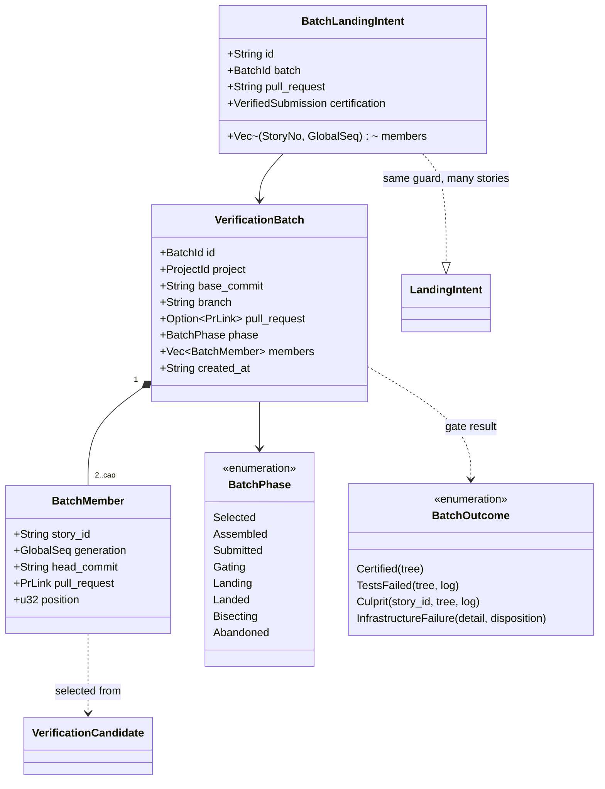

# Verification batching — SH-822 design of record

The design for verifying several submitted stories with one gate run. SH-822
delivers this document and the child stories that build it; no batching code
ships with SH-822 (council decision D1, recorded on SH-822). Read
`verification-workflow.md` first: it is the design of record for the
single-story verifier that this document extends, and nothing here changes it
until a child story lands and records what it built under "As built".

## The request

Stated by the operator on SH-822 (2026-09-26):

> When the verifier is ready to dequeue a story to run the merge gates, it
> should look at the next story to be verified and then sweep the entire
> verification queue for other stories whose code changes do not conflict
> with it. The verifier should then claim all of those stories simultaneously
> (web ui should indicate that a verification batch is running, and indicate
> which stories are involved) and merge their changes to a temporary
> merge-gate branch, smoothing over any non-code conflicts on its own (it may
> use a Verification Agent for help). This multi-story merge-gate branch is
> then subjected to the verification suite all at once, so that when it
> passes, that entire branch gets merged to dev and all associated stories
> move to Done together. If that branch's verification is red, it should use
> a script to backtrack and see which related story's code is the cause, use
> that story's agent to resolve the red, and then proceed.

Why: one gate is about 50 minutes here and the verifier is serial per
project, so it is the throughput ceiling (about 1.2 stories per hour). SH-826
and SH-827 were manual batches: they worked, but each needed an operator
session, semantic-conflict repairs (clean text merges that broke tests) and
read-only reviews by each member's agent, and SH-827 took about 38 hours from
merge to landing.

## What the single-story verifier assumes

Every one of these is a single-story invariant a batch must replace or wrap,
not bypass:

| Assumption | Where |
|---|---|
| One attempt owns one story | `ActiveVerification.story_id` (`src/daemon/verification.rs`); `VerificationActivity` asserts one slot per project |
| Landing is per story | `LandingIntent` (`src/store/landing.rs`), validated before every store commit; `landing_pending` on the candidate |
| One PR lands, and its landed tree must equal the certified tree | `scripts/land-pr.sh` (`gh pr merge --merge --match-head-commit`, then `actual_tree == STORYHOOK_CERTIFIED_MERGE_TREE`) |
| Completion writes one story | `VerificationQueue::complete_landing_guarded` (`src/service/landing.rs`): GREEN comment, `StoryPrMerged`, `done`, intent removed, one transaction |
| A PR merged outside the verifier is suspect | `pr_check` writes `CENTRAL VERIFICATION UNCERTIFIED MERGE —` for a verifying story whose PR GitHub marks merged (`src/service/pr_check.rs`) |
| Workspace locks, progress journals and repair admission are per story | `WorkspaceLock::acquire(checkout, story_id)`; `journal_path(env, candidate)`; `STORYHOOK_REPAIR_*` |
| Conflict detection is candidate against base only | `git merge-tree --write-tree` in `scripts/merge-preflight.sh`; `src/service/gate_snapshot.rs` repeats it in private object storage |

## Design positions

Each row is settled here or marked open for the child story that owns it; an
open row is decided by that child (council when two answers stay defensible).

| # | Position | Status |
|---|---|---|
| B1 | **Selection.** The head is the first runnable candidate in the existing order (`sort_candidates`). The rest of the runnable queue is swept in the same order. A candidate joins only when its trial merge onto base plus the members already accepted is clean. Trial merges run in private object storage (the `gate_snapshot.rs` pattern) and never touch a checkout. | settled; built as a shadow preview — see "SH-830" under As built |
| B2 | **Batch size cap = the project's live engine run `lanes`** (at least 1), the same bound as the verifying backlog (council D3): a deeper batch raises bisection cost faster than it raises throughput while the queue is bounded by that number anyway. | settled for child 1; child 1's measurements are under As built ("SH-830") |
| B3 | **A candidate that cannot batch stays single.** A head that conflicts with base keeps today's conflict hold; a held, blocked, landing-pending, human-only or unsubmitted candidate is never a member. A batch of one is today's single-story path, unchanged. | settled; built in the preview (SH-830) |
| B4 | **The branch is assembled by merge commits.** `storyhook/verify-batch/<batch-id>` starts at the base the trial merges used; each member head is merged with `--no-ff` in queue order. No history is rewritten; each member's own commits stay reachable. | settled |
| B5 | **The batch lands through a batch PR.** `land-pr.sh` lands one PR and requires tree equality, so the certified tree must be the batch tree and the batch branch must be what lands. Member PRs stay open; GitHub marks each merged when the batch merge makes its head an ancestor of the base. | settled |
| B6 | **Members complete together, and first.** A durable `BatchLandingIntent` names every member before the merge. Completion writes, in one transaction, each member's GREEN comment (naming the batch and its PR), `StoryPrMerged` and `done`. `pr_check` treats a member of a landing batch as certified, never as UNCERTIFIED MERGE. Each member is then reaped by today's per-story reap. | settled |
| B7 | **Red is bisected.** On a red batch, split the members in queue order and gate the first half's merge tree (a tree already certified by a receipt needs no run). Recurse into the red half until one member remains; return it through today's `return_for_repair` with its own tree and log. The other members re-enter the queue at their existing age, or land as a smaller batch if bisection already certified their tree. Cost: at most `ceil(log2 k)` gates per culprit. | open (child 4): whether failing-test attribution may skip steps, and how two culprits are handled |
| B8 | **Non-code conflicts may be smoothed by the Verifier Agent.** v1 admits only clean trial merges (B1). Letting an agent author a resolution commit puts AI-authored changes in the certification path. | open (child 5, council) |
| B9 | **Status and dashboard.** `VerifierStatus.active` gains `batch: { id, head, members, phase }`; each member's per-story status is `running` with the batch id; the banner reads "Verification batch B running: SH-1, SH-2, SH-3". | settled |
| B10 | **Restart.** A batch record is durable. A daemon that restarts before landing abandons the batch (members keep their generations and re-enter the queue); with a `BatchLandingIntent` present it recovers the landing exactly as today's intent does. | settled |
| B11 | **Locks.** Member workspace locks are taken in story-id order, so two batches (in two projects' verifiers, or a batch and a manual action) cannot deadlock. | settled |

## Type proposal



`VerificationCandidate` stays single-story: every existing store write is per
story and guarded by its generation, and a member is still exactly one
candidate. A batch of one never creates a `VerificationBatch`.

```mermaid
stateDiagram-v2
    [*] --> Selected: head + clean trial merges
    Selected --> Assembled: merge commits on the batch branch
    Assembled --> Submitted: push, open the batch PR
    Submitted --> Gating: exact merge tree, gate
    Gating --> Landing: certified; BatchLandingIntent
    Landing --> Landed: land-pr.sh; members done together
    Gating --> Bisecting: red
    Bisecting --> Gating: a certified subset lands as a smaller batch
    Bisecting --> [*]: culprit returned; others re-queued
    Selected --> Abandoned: restart or a member changed
    Assembled --> Abandoned
    Submitted --> Abandoned
    Landed --> [*]
    Abandoned --> [*]
```

## Child stories

Filed as children of SH-822, ordered by `blocked-by`, each landing on its own:

1. **Shadow preview** (SH-830) — compute and publish the batch the verifier *would*
   form at each dequeue (B1, B2), with trial-merge conflicts, would-be sizes,
   gate duration, red rate and queue depth, without changing what the
   verifier does. It measures the throughput premise before any landing code
   changes (council D1).
2. **Assembly, submission and gate** (SH-831) — the durable `VerificationBatch`, the
   member locks (B11), the batch branch (B4), the batch PR (B5) and one gate
   on its tree; landing still refused.
3. **Landing and completion** (SH-832) — `BatchLandingIntent`, landing through
   `land-pr.sh`, members done together, `pr_check` reconciliation, per-member
   reap, restart recovery (B6, B10), status and dashboard (B9).
4. **Red bisection** (SH-833) — the bisection script and culprit return (B7).
5. **Non-code conflict smoothing** (SH-834) — the Verifier Agent resolves a batch's
   non-code conflicts, if its council admits AI-authored commits in the
   certification path (B8).

Related, separate: reclaiming a handed-off worktree's build products at
handoff (SH-835, a project hook; council D3), which bounds the disk each held story
costs whether or not batching lands.

## As built

Deviations from this document are recorded here, one entry per child.

### SH-830 — a shadow preview of the batch, and its first measurements

**What runs.** Just before each gate, the verifier computes the batch it would
form around the story it dequeued and shows it while the gate runs; when the
gate returns it records the preview with the gate's duration and verdict. It
verifies, lands and completes exactly as before: the preview reads the store,
writes nothing to it, and keeps every failure (store, Git, a panic) inside
itself as an `unavailable` preview. A test runs the same certified, red and
conflict gates with the preview off, on, unopenable and panicking, and demands
the same verified story, tick result and store writes (change feed, incident,
landing intents, recovery).

- **Selection** (`service::batch_preview::select`, B1–B3). The head is the
  story the verifier actually dequeued, which is the first runnable story
  except on an incident retry or a reconcile transfer. The head merges onto
  `origin/<base>`; a conflict there ends the preview as `head-conflict` with
  no sweep. Every other queued story is tried in queue order onto the batch so
  far: clean joins while the batch is below the cap; clean at the cap is still
  tried and excluded as `cap`; a conflict is retried onto the base alone to
  tell `conflict-with-base` from `conflict-with-member`. Blocked,
  landing-pending and unsubmitted stories, and the stories the queue itself
  holds out (`held`: human-only, awaiting, reset pending, recovery-owned, by
  the queue's own `queue_hold` predicate), are listed without a merge.
- **Trial merges** (`service::trial_merge`). `merge-tree --write-tree` and,
  for an accepted member only, `commit-tree --no-gpg-sign` with a fixed
  identity, so the batch so far is the merge commit B4 would make. All objects
  go to private object storage (`service::private_objects`, shared with gate
  inspection); no ref, index, HEAD or repository object changes. Commands run
  through `process::run_captured_query`: a conflict's exit 1 is an answer, not
  an ERROR journal record; the attempt's stop cancels it.
- **Inputs.** The base is `origin/<base>` as the head's own submission fetched
  it moments earlier (its receipt names the branch); the head is tried at the
  commit that submission pushed, queued stories at their leased branches, in
  the head's lease repository. No network. The cap is the live Full Auto
  run's `lanes` (running, paused or draining), else 1.
- **Bounds.** At most 15 s (`PREVIEW_BUDGET`, a quarter of the progress
  interval), after the pre-gate cancellation check, so a stop during the
  preview reaches the gate as a stop during the gate does.
- **Surfaces.** `VerifierStatus.batch_preview` (without conflicted paths;
  omitted when absent) and a `Batch preview:` line in `story verifier status`
  while the gate runs. On the dashboard, the verifying column's status line
  reads "Batch preview · SH-1 + SH-2 would verify together · N excluded (cap
  K)". B9's "banner" is not used: the alert banner is an assertive live region
  for attention, and `verifier-observability.md` already puts ordinary
  verifier activity on that line (decision D8 on SH-830; SH-832 should read
  B9 the same way).
- **Record.** One JSON line per previewed gate in
  `<daemon state>/verification-batch-preview/<project>.ndjson` (rotated to
  `.1` at 4 MiB): attempt, story, generation, verdict (the gate's own outcome,
  or `withdrawn`, `interrupted`, `error`), gate seconds, the gated tree, and
  the whole preview. The preview's `head_tree` equals the gated tree exactly
  when the preview and the gate used the same base.

Decisions D1–D14 and the adopted fix A1 (gate inspection read a committed
`.storyhook.toml` from a 64 KiB prefix) are recorded on SH-830.

**First measurements.** Every recorded dequeue from 2026-09-12 to 2026-09-28
(170; each `CENTRAL VERIFICATION SUBMITTED` comment names the exact head the
verifier pushed) was replayed through the shipped `select` and trial merger,
uncapped. The queue at each dequeue is every other story in `verifying`, tried
at the commit its own submission in that verifying stint named; the base is
the first-parent `dev` commit at that moment, in the history the head forked
from (the repository was rewritten on 2026-09-20; pre-rewrite heads use
`recovery/pre-scrub-dev-20260920`). Of the 137 dequeues whose GREEN or RED
comment names the gated tree, 130 reproduce that exact tree. The table,
per dequeue, is `data/sh-830-batch-replay.tsv`.

| Measure | Value |
|---|---|
| Dequeues | 170 |
| Head conflicts with its base (no batch) | 21 — includes all 18 real CONFLICT verdicts |
| Dequeues with at least one other queued story (known head) | 81 (other queued stories per dequeue: 0 ×89, 1 ×30, 2 ×15, 3 ×16, 4 ×17, 5 ×3) |
| Of those that form a batch, batch of 2 or more (uncapped) | 63 of 70 |
| Would-be batch size, all 149 batch dequeues: cap 1 / 2 / 3 / none | mean 1.00 / 1.42 / 1.65 / 1.85 (largest 6) |
| Same, only dequeues with a queue: cap 2 / 3 / none | mean 1.90 / 2.39 / 2.80 |
| Swept stories excluded by conflict (of 166) | 17 conflict-with-base, 23 conflict-with-member |
| Head verdicts | 63 green, 74 red, 18 conflict, 10 infrastructure, 1 withdrawn, 4 none |
| Submission to verdict, green or red | median 35.5 min, p90 66 min |
| Preview cost (trial merges only) | median 58 ms, p90 235 ms, largest 388 ms |

**What this says for B2 and B7.** When anything is queued, a clean partner
almost always exists (63 of 70), and a cap of 2 already takes most of the
gain; a cap of 3 adds about half a story per gate. The red rate is the
constraint: 74 of the 137 judged heads were red (54%). If members fail
independently at that rate, a batch of two is green about one time in five
and a batch of three about one in ten, so most batches would bisect (B7).
Batching's throughput therefore depends on the red rate of stories at
submission more than on the cap, and SH-831 to SH-833 should read these
numbers before choosing a cap above 2. The live record log measures the same
things going forward, including semantic conflicts, which a replay of
single-story gates cannot show.

**Limits.** 93 queued entries had no submission in their verifying stint
(stories never dequeued or completed by hand) and are left out, so queue
depth is understated. Blocked, held and landing-pending state at each moment
is not replayed, so a few replayed members could not have joined. The live
cap at each moment is unknown, so sizes are given for each cap.

Tests: `tests/batch_preview.rs` (real Git: clean pair, conflicting pair,
member with member, base conflict, cap reached, held / blocked /
landing-pending / unsubmitted, empty queue, head conflict, unavailable base,
exact pushed head, passed deadline, merge parents, repository unchanged);
`tests/verification_queue/batch_preview.rs` (on/off identity, status during
the gate only, the record, unavailable previews); unit tests for failure
paths, the wire form and the query runner's journaling;
`e2e/specs/verification-control.spec.ts` for the status line.
