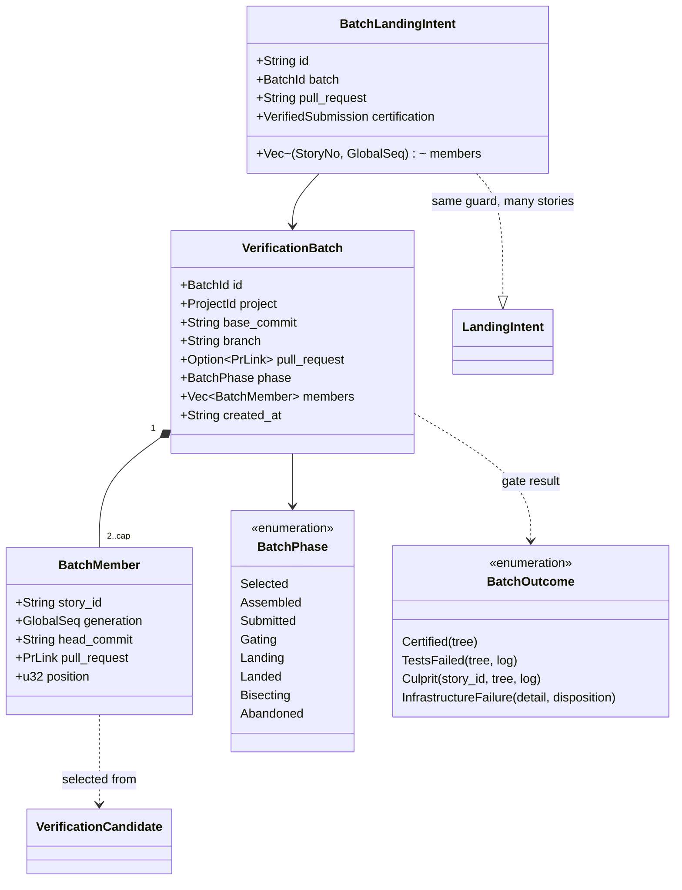

# Verification batching — SH-822 design of record

The design for verifying several submitted stories with one gate run. SH-822
delivers this document and the child stories that build it; no batching code
ships with SH-822 (council decision D1, recorded on SH-822). Read
`verification-workflow.md` first: it is the design of record for the
single-story verifier that this document extends, and nothing here changes it
until a child story lands and records what it built under "As built".

## The request

Stated by the operator on SH-822 (2026-09-26):

> When the verifier is ready to dequeue a story to run the merge gates, it
> should look at the next story to be verified and then sweep the entire
> verification queue for other stories whose code changes do not conflict
> with it. The verifier should then claim all of those stories simultaneously
> (web ui should indicate that a verification batch is running, and indicate
> which stories are involved) and merge their changes to a temporary
> merge-gate branch, smoothing over any non-code conflicts on its own (it may
> use a Verification Agent for help). This multi-story merge-gate branch is
> then subjected to the verification suite all at once, so that when it
> passes, that entire branch gets merged to dev and all associated stories
> move to Done together. If that branch's verification is red, it should use
> a script to backtrack and see which related story's code is the cause, use
> that story's agent to resolve the red, and then proceed.

Why: one gate is about 50 minutes here and the verifier is serial per
project, so it is the throughput ceiling (about 1.2 stories per hour). SH-826
and SH-827 were manual batches: they worked, but each needed an operator
session, semantic-conflict repairs (clean text merges that broke tests) and
read-only reviews by each member's agent, and SH-827 took about 38 hours from
merge to landing.

## What the single-story verifier assumes

Every one of these is a single-story invariant a batch must replace or wrap,
not bypass:

| Assumption | Where |
|---|---|
| One attempt owns one story | `ActiveVerification.story_id` (`src/daemon/verification.rs`); `VerificationActivity` asserts one slot per project |
| Landing is per story | `LandingIntent` (`src/store/landing.rs`), validated before every store commit; `landing_pending` on the candidate |
| One PR lands, and its landed tree must equal the certified tree | `scripts/land-pr.sh` (`gh pr merge --merge --match-head-commit`, then `actual_tree == STORYHOOK_CERTIFIED_MERGE_TREE`) |
| Completion writes one story | `VerificationQueue::complete_landing_guarded` (`src/service/landing.rs`): GREEN comment, `StoryPrMerged`, `done`, intent removed, one transaction |
| A PR merged outside the verifier is suspect | `pr_check` writes `CENTRAL VERIFICATION UNCERTIFIED MERGE —` for a verifying story whose PR GitHub marks merged (`src/service/pr_check.rs`) |
| Workspace locks, progress journals and repair admission are per story | `WorkspaceLock::acquire(checkout, story_id)`; `journal_path(env, candidate)`; `STORYHOOK_REPAIR_*` |
| Conflict detection is candidate against base only | `git merge-tree --write-tree` in `scripts/merge-preflight.sh`; `src/service/gate_snapshot.rs` repeats it in private object storage |

## Design positions

Each row is settled here or marked open for the child story that owns it; an
open row is decided by that child (council when two answers stay defensible).

| # | Position | Status |
|---|---|---|
| B1 | **Selection.** The head is the first runnable candidate in the existing order (`sort_candidates`). The rest of the runnable queue is swept in the same order. A candidate joins only when its trial merge onto base plus the members already accepted is clean. Trial merges run in private object storage (the `gate_snapshot.rs` pattern) and never touch a checkout. | settled; built as a shadow preview — see "SH-830" under As built |
| B2 | **Batch size cap = the project's live engine run `lanes`** (at least 1), the same bound as the verifying backlog (council D3): a deeper batch raises bisection cost faster than it raises throughput while the queue is bounded by that number anyway. | settled for child 1; child 1's measurements are under As built ("SH-830") |
| B3 | **A candidate that cannot batch stays single.** A head that conflicts with base keeps today's conflict hold; a held, blocked, landing-pending, human-only or unsubmitted candidate is never a member. A batch of one is today's single-story path, unchanged. | settled; built in the preview (SH-830) |
| B4 | **The branch is assembled by merge commits.** `storyhook/verify-batch/<batch-id>` starts at the base the trial merges used; each member head is merged with `--no-ff` in queue order. No history is rewritten; each member's own commits stay reachable. | settled; built, dormant — see "SH-831" under As built |
| B5 | **The batch lands through a batch PR.** `land-pr.sh` lands one PR and requires tree equality, so the certified tree must be the batch tree and the batch branch must be what lands. Member PRs stay open; GitHub marks each merged when the batch merge makes its head an ancestor of the base. | settled; built (SH-831 PR and gate, SH-832 landing) — see "SH-832" under As built |
| B6 | **Members complete together, and first.** A durable `BatchLandingIntent` names every member before the merge. Completion writes, in one transaction, each member's GREEN comment (naming the batch and its PR), `StoryPrMerged` and `done`. `pr_check` treats a member of a landing batch as certified, never as UNCERTIFIED MERGE. Each member is then reaped by today's per-story reap. | settled; built with per-member intents (SH-832) |
| B7 | **Red is bisected.** On a red batch, split the members in queue order and gate the first half's merge tree (a tree already certified by a receipt needs no run). Recurse into the red half until one member remains; return it through today's `return_for_repair` with its own tree and log. The other members re-enter the queue at their existing age, or land as a smaller batch if bisection already certified their tree. Cost: at most `ceil(log2 k)` gates per culprit. | settled; built as prefix bisection with no attribution shortcut, first culprit returned (SH-833) — see "SH-833" under As built |
| B8 | **Non-code conflicts are smoothed by rule, never by a model.** Council decision D1 on SH-834 rejected an agent-authored resolution: the gate certifies nothing about text in files no test reads. A story whose conflict with a member is insertion-only (both sides added lines at one place, neither changed a base line) on paths the base's `[batch] smooth` admits may join last; its merge commit keeps both additions. | settled; built — see "SH-834" under As built |
| B9 | **Status and dashboard.** `VerifierStatus.active` gains `batch: { id, head, members, phase }`; each member's per-story status is `running` with the batch id; the banner reads "Verification batch B running: SH-1, SH-2, SH-3". | settled; built as a status-line and a sibling `batch` field (SH-832) |
| B10 | **Restart.** A batch record is durable. A daemon that restarts before landing abandons the batch (members keep their generations and re-enter the queue); with a `BatchLandingIntent` present it recovers the landing exactly as today's intent does. | settled; built (SH-831 abandonment, SH-832 intent recovery) |
| B11 | **Locks.** Member workspace locks are taken in story-id order, so two batches (in two projects' verifiers, or a batch and a manual action) cannot deadlock. | settled; built with a recorded deviation (SH-831) |

## Type proposal



`VerificationCandidate` stays single-story: every existing store write is per
story and guarded by its generation, and a member is still exactly one
candidate. A batch of one never creates a `VerificationBatch`.

```mermaid
stateDiagram-v2
    [*] --> Selected: head + clean trial merges
    Selected --> Assembled: merge commits on the batch branch
    Assembled --> Submitted: push, open the batch PR
    Submitted --> Gating: exact merge tree, gate
    Gating --> Landing: certified; BatchLandingIntent
    Landing --> Landed: land-pr.sh; members done together
    Gating --> Bisecting: red
    Bisecting --> Gating: a certified subset lands as a smaller batch
    Bisecting --> [*]: culprit returned; others re-queued
    Selected --> Abandoned: restart or a member changed
    Assembled --> Abandoned
    Submitted --> Abandoned
    Landed --> [*]
    Abandoned --> [*]
```

## Child stories

Filed as children of SH-822, ordered by `blocked-by`, each landing on its own:

1. **Shadow preview** (SH-830) — compute and publish the batch the verifier *would*
   form at each dequeue (B1, B2), with trial-merge conflicts, would-be sizes,
   gate duration, red rate and queue depth, without changing what the
   verifier does. It measures the throughput premise before any landing code
   changes (council D1).
2. **Assembly, submission and gate** (SH-831) — the durable `VerificationBatch`, the
   member locks (B11), the batch branch (B4), the batch PR (B5) and one gate
   on its tree; landing still refused.
3. **Landing and completion** (SH-832) — `BatchLandingIntent`, landing through
   `land-pr.sh`, members done together, `pr_check` reconciliation, per-member
   reap, restart recovery (B6, B10), status and dashboard (B9).
4. **Red bisection** (SH-833) — the bisection script and culprit return (B7).
5. **Non-code conflict smoothing** (SH-834) — the Verifier Agent resolves a batch's
   non-code conflicts, if its council admits AI-authored commits in the
   certification path (B8). Its council did not admit them; a deterministic
   union of insertion-only conflicts was built instead.

Related, separate: reclaiming a handed-off worktree's build products at
handoff (SH-835, a project hook; council D3), which bounds the disk each held story
costs whether or not batching lands.

## As built

Deviations from this document are recorded here, one entry per child.

### SH-830 — a shadow preview of the batch, and its first measurements

**What runs.** Just before each gate, the verifier computes the batch it would
form around the story it dequeued and shows it while the gate runs; when the
gate returns it records the preview with the gate's duration and verdict. It
verifies, lands and completes exactly as before: the preview reads the store,
writes nothing to it, and keeps every failure (store, Git, a panic) inside
itself as an `unavailable` preview. A test runs the same certified, red and
conflict gates with the preview off, on, unopenable and panicking, and demands
the same verified story, tick result and store writes (change feed, incident,
landing intents, recovery).

- **Selection** (`service::batch_preview::select`, B1–B3). The head is the
  story the verifier actually dequeued, which is the first runnable story
  except on an incident retry or a reconcile transfer. The head merges onto
  `origin/<base>`; a conflict there ends the preview as `head-conflict` with
  no sweep. Every other queued story is tried in queue order onto the batch so
  far: clean joins while the batch is below the cap; clean at the cap is still
  tried and excluded as `cap`; a conflict is retried onto the base alone to
  tell `conflict-with-base` from `conflict-with-member`. Blocked,
  landing-pending and unsubmitted stories, and the stories the queue itself
  holds out (`held`: human-only, awaiting, reset pending, recovery-owned, by
  the queue's own `queue_hold` predicate), are listed without a merge.
- **Trial merges** (`service::trial_merge`). `merge-tree --write-tree` and,
  for an accepted member only, `commit-tree --no-gpg-sign` with a fixed
  identity, so the batch so far is the merge commit B4 would make. All objects
  go to private object storage (`service::private_objects`, shared with gate
  inspection); no ref, index, HEAD or repository object changes. Commands run
  through `process::run_captured_query`: a conflict's exit 1 is an answer, not
  an ERROR journal record; the attempt's stop cancels it.
- **Inputs.** The base is `origin/<base>` as the head's own submission fetched
  it moments earlier (its receipt names the branch); the head is tried at the
  commit that submission pushed, queued stories at their leased branches, in
  the head's lease repository. No network. The cap is the live Full Auto
  run's `lanes` (running, paused or draining), else 1.
- **Bounds.** At most 15 s (`PREVIEW_BUDGET`, a quarter of the progress
  interval), after the pre-gate cancellation check, so a stop during the
  preview reaches the gate as a stop during the gate does.
- **Surfaces.** `VerifierStatus.batch_preview` (without conflicted paths;
  omitted when absent) and a `Batch preview:` line in `story verifier status`
  while the gate runs. On the dashboard, the verifying column's status line
  reads "Batch preview · SH-1 + SH-2 would verify together · N excluded (cap
  K)". B9's "banner" is not used: the alert banner is an assertive live region
  for attention, and `verifier-observability.md` already puts ordinary
  verifier activity on that line (decision D8 on SH-830; SH-832 should read
  B9 the same way).
- **Record.** One JSON line per previewed gate in
  `<daemon state>/verification-batch-preview/<project>.ndjson` (rotated to
  `.1` at 4 MiB): attempt, story, generation, verdict (the gate's own outcome,
  or `withdrawn`, `interrupted`, `error`), gate seconds, the gated tree, and
  the whole preview. The preview's `head_tree` equals the gated tree exactly
  when the preview and the gate used the same base.

Decisions D1–D14 and the adopted fix A1 (gate inspection read a committed
`.storyhook.toml` from a 64 KiB prefix) are recorded on SH-830.

**First measurements.** Every recorded dequeue from 2026-09-12 to 2026-09-28
(170; each `CENTRAL VERIFICATION SUBMITTED` comment names the exact head the
verifier pushed) was replayed through the shipped `select` and trial merger,
uncapped. The queue at each dequeue is every other story in `verifying`, tried
at the commit its own submission in that verifying stint named; the base is
the first-parent `dev` commit at that moment, in the history the head forked
from (the repository was rewritten on 2026-09-20; pre-rewrite heads use
`recovery/pre-scrub-dev-20260920`). Of the 137 dequeues whose GREEN or RED
comment names the gated tree, 130 reproduce that exact tree. The table,
per dequeue, is `data/sh-830-batch-replay.tsv`.

| Measure | Value |
|---|---|
| Dequeues | 170 |
| Head conflicts with its base (no batch) | 21 — includes all 18 real CONFLICT verdicts |
| Dequeues with at least one other queued story (known head) | 81 (other queued stories per dequeue: 0 ×89, 1 ×30, 2 ×15, 3 ×16, 4 ×17, 5 ×3) |
| Of those that form a batch, batch of 2 or more (uncapped) | 63 of 70 |
| Would-be batch size, all 149 batch dequeues: cap 1 / 2 / 3 / none | mean 1.00 / 1.42 / 1.65 / 1.85 (largest 6) |
| Same, only dequeues with a queue: cap 2 / 3 / none | mean 1.90 / 2.39 / 2.80 |
| Swept stories excluded by conflict (of 166) | 17 conflict-with-base, 23 conflict-with-member |
| Head verdicts | 63 green, 74 red, 18 conflict, 10 infrastructure, 1 withdrawn, 4 none |
| Submission to verdict, green or red | median 35.5 min, p90 66 min |
| Preview cost (trial merges only) | median 58 ms, p90 235 ms, largest 388 ms |

**What this says for B2 and B7.** When anything is queued, a clean partner
almost always exists (63 of 70), and a cap of 2 already takes most of the
gain; a cap of 3 adds about half a story per gate. The red rate is the
constraint: 74 of the 137 judged heads were red (54%). If members fail
independently at that rate, a batch of two is green about one time in five
and a batch of three about one in ten, so most batches would bisect (B7).
Batching's throughput therefore depends on the red rate of stories at
submission more than on the cap, and SH-831 to SH-833 should read these
numbers before choosing a cap above 2. The live record log measures the same
things going forward, including semantic conflicts, which a replay of
single-story gates cannot show.

**Limits.** 93 queued entries had no submission in their verifying stint
(stories never dequeued or completed by hand) and are left out, so queue
depth is understated. Blocked, held and landing-pending state at each moment
is not replayed, so a few replayed members could not have joined. The live
cap at each moment is unknown, so sizes are given for each cap.

Tests: `tests/batch_preview.rs` (real Git: clean pair, conflicting pair,
member with member, base conflict, cap reached, held / blocked /
landing-pending / unsubmitted, empty queue, head conflict, unavailable base,
exact pushed head, passed deadline, merge parents, repository unchanged);
`tests/verification_queue/batch_preview.rs` (on/off identity, status during
the gate only, the record, unavailable previews); unit tests for failure
paths, the wire form and the query runner's journaling;
`e2e/specs/verification-control.spec.ts` for the status line.

### SH-831 — assemble, submit and gate a batch (dormant until SH-832)

**Off in production.** `ShellVerificationActuator::with_batching()` turns
batching on (it implies the SH-830 preview, which selects the members);
the daemon's own verifier does not call it, because a batch that cannot
land only adds a 35–50 minute gate in front of its head's own gate on the
serial bottleneck. SH-832 adds the call together with landing (decision
D1 on SH-831). The trait seam is `VerificationActuator::batch()`, whose
default offers nothing, so every actuator that predates batching verifies
exactly as before.

**What a batch step does** (`src/daemon/verification/batch.rs`), after the
preview and before the head's own gate, at most once per tick:

1. Takes the preview's members when the queue is in ordinary operation:
   no verification incident, no active project recovery, a submission
   receipt for the head's generation and a preview base. Anything else is
   no batch and no side effect.
2. Locks each non-head member's workspace with a non-blocking try, in
   ascending story number (`batch/locks.rs`); a busy lock leaves the
   member out. The head's lock was taken at admission, before the batch
   existed, so strict story-id order over every member is impossible
   without releasing it; the property B11 wants still holds, because every
   workspace-lock acquisition in the system is non-blocking and nothing
   waits while it holds one.
3. Submits each member through the story helper under that member's own
   lock and records the submission (`record_generation_submitted`). A
   member is left out when its submission is refused or fails, is
   superseded, links another pull request, targets another base, or
   pushed a head other than the commit the preview merged.
4. Merges every member onto the preview's base as merge commits
   (`service::batch_assembly`): `merge-tree --write-tree`, then
   `commit-tree --no-gpg-sign` with the repository's configured identity,
   in the repository's own object store; no ref, index or HEAD changes.
5. Records the `VerificationBatch` only now, with two or more members, so
   a batch of one never has a record (the spec's `Selected` phase is
   therefore never stored; the first stored phase is `assembled`).
6. Publishes through `scripts/verify-batch.sh publish` (bundled): pushes
   the tip to `storyhook/verify-batch/<id>` without force, adopts or opens
   the batch pull request, lists each member as `#N` (no closing
   keywords), and answers once GitHub reports the new head.
7. Gates the batch pull request through `verify-pr.sh`, certify-only, with
   no repair admission (`RepairAdmission::Withheld`): admission binds a
   gate to one story's project-recovery lineage.

The whole step runs under one authority observer over the head and every
current member, with its own cancellation (decision D12): a member that
changes, or an operator stop, cancels it wherever it is. The verdict and
judged tree go on the record, which ends `released` (gated; landing
refused; every member back in the single-story queue) or `abandoned`
(a member changed, an operator stopped, a step failed, a restart), and
is then retired: `verify-batch.sh retire` closes the pull request and
deletes the branch, and a retirement that fails is retried at the next
batch. The head is then gated alone in the same tick. A batch failure
never fails the tick.

**Story writes.** Member submissions record their link and SUBMITTED
comment as the member's own dequeue would. Beyond that, only a batch
cleanup failure (a permanent incident on the head, so the queue halts as
it would for a single gate), an operator stop during the batch gate (the
head's interruption comment) and a head that lost authority (today's
withdrawal, at its own gate) write story state. A RED, conflict or
project-fault verdict is recorded on the batch only: attributing it to a
member is SH-833's.

**Restart (B10).** A batch lives only inside one tick of its project's
single worker. The worker abandons every batch still live when it starts
(`abandon_interrupted_batches`), and a new batch's insert abandons a
stale live one in the same transaction. Members are never written by
abandonment: they keep their generations and stay queued. A reset of a
member does not fail as busy while a batch holds the member's lock: the
slot lists the batch's members, and `cancel_story_and_wait` ends the
batch, not the head's attempt.

**Record.** Migration 51, `verification_batches`: the whole record as a
JSON payload, `revision` and `live` tied to it by CHECK, one live batch per
project by partial unique index, compare-and-swap updates, and an ended
batch never changes phase again. It names no story key and is not an
ownership-fence owner; SH-832's batch landing intent is the record that
needs authority. The newest 100 retired, ended batches per project are
kept. The SH-830 per-dequeue record gains the batch's summary (id,
members, phase, verdict, tree, seconds, detail).

**Stated limits.** Member submissions write SUBMITTED comments at the
batch, so the SH-830 replay's assumption that a SUBMITTED comment marks a
dequeue no longer holds once batching is on. Pushing the batch branch
leaves a remote-tracking ref until retirement deletes the branch. A
repository whose base requires signed commits would refuse to land a
batch of unsigned merge commits; that is SH-832's to meet.

Decisions D1–D12 are recorded on SH-831. Tests: `tests/verification_batches.rs`
(the record), `tests/batch_assembly.rs` (merge commits over real Git),
`tests/verify_batch.rs` (publish and retire against a local origin and a
stateful fake `gh`), `tests/verification_queue/batching.rs` (the tick:
green, red, no partner, batching off, members left out, a member that
leaves, an operator stop, a cleanup failure, restart abandonment by the
helper and by a real worker), and unit tests in
`src/daemon/verification/batch/tests.rs` (lock order, the member-aware
reset, the shell boundary).

### SH-832 — land a batch and complete its members together (dormant)

**Off in production.** Council decision D10 on SH-832 (replacing SH-831 D1)
keeps `poll_verification` on the preview alone: on the SH-830 replay both
members of a would-be pair were green in 12 of 53 pairs (23%), so batching
would land about 0.69 stories per gate against 1.0 single, and even SH-833
bisection breaks even only at about 62% of stories green. SH-841 turns it
on when live preview records show pair-green of at least 50% over at least
30 batch-eligible dequeues (or 62% per-story green once SH-833 ships),
capped at two members with a supervised first batch. The real throughput
levers today are the gate-flake stories and the first-submission green
rate (31%).

**The intent (B6).** Not a table of its own: each member gets an ordinary
`LandingIntent` row — its own story, generation and pull request — with
the batch certification (tip, batch tree, gate) and a `batch` binding
(`BatchLanding{id, landing, pull_request}`). Every per-story guard (the
ownership fence, the story foreign key, `landing_pending`, the
project-recovery checks, `validate_intent`) covers members unchanged.
`BatchLandingIntent` is the Rust aggregate. `validate_pending` also ties a
batch's rows to each other and to the record before every commit: same
binding, certification and checkout; tip, batch PR and member generations
and PRs as recorded; exactly the members while the record is `landing`
(no commit resolves one member before the merge is confirmed), a subset
once it is `landed` (a member a person holds keeps its row, as a single
human-only landing does). Retention never prunes a record an intent names.

**Phases.** `landing` (live, never abandoned) and `landed` (end); gating →
landing → landed or released. Migration 52 rebuilds the leaf table with the
wider CHECKs, keeping rowid order and the live index. One predicate,
`is_abandonable`, drives the worker-start read and the abandonment write,
so a start with only a landing batch writes nothing (SH-693).

**Landing (B5).** After the batch observer ends (a landing-pending member
would read as changed), a certified gate of the batch tip with every member
unchanged is admitted in one transaction; a refusal or error releases the
batch with its reason, and the head goes on to its own gate. The tick lands
through the head's actuator: `run_landing` uses the intent's landing target
(the batch PR, one shared attempt marker). Merged: one transaction completes
every member the verifier may complete (GREEN naming the batch, the batch
PR and the member's PR; `StoryPrMerged`; `done`) and records the batch
`landed`; the tick drops its in-flight record, reaps the head with the
slot's lock and each member under its own lock (`reap_member`), each with
a fresh cleanup reservation, then prunes the completed members' branches on
origin (`verify-batch.sh prune-members`: only a merged PR's own head at its
recorded commit). NotAttempted: every intent and the batch are released;
the head is gated alone. Uncertain: every member stays fenced with CENTRAL
LANDING PENDING.

**Recovery (B10).** The tick-start loop recovers each batch once per tick
through one queued member; a confirmed merge completes the queued,
permitted members and reaps them. Nothing completable is RetryLater, never
Returned, so a member a person holds cannot spin the worker. No new batch
forms while one is landing. Recovery needs no batching actuator; without
one, members other than the one the slot owns are reaped by the cleanup
retry.

**`pr_check`.** A merged or closed link of a story with a pending landing
intent (single or batch) writes nothing and reads "landing in progress";
before SH-832 its write was refused before commit and aborted the whole
poll (fixed and tested on its own, D7).

**Status (B9).** `VerifierStatus.batch: {id, head, members, phase}` is a
sibling of `batch_preview`, not `active.batch` as B9 words it:
`ActiveVerification` is an identity that ownership compares with `==`.
The phase is `selected` before the record exists. Each non-head member
reads `running` with the batch; queue positions leave members out. The
dashboard's verifying-column status line reads "Verification batch <id>
running: SH-1, SH-2, SH-3 · <phase>" (not the alert banner, SH-830 D8), and
member chips name the batch.

**Stated limits.** `verify-batch.sh base-policy` refuses to batch onto a
base whose rulesets, or readable classic protection, require signed
commits (the batch's merge commits are unsigned); classic protection is
readable only by admins and a 404 reads as no requirement. A merge GitHub
refuses after the attempt marker reads as uncertain forever, and no
operator command releases a landing intent; that class predates batching
and is filed separately. Member branch pruning runs once; a member PR
GitHub has not yet marked merged keeps its branch, named in the record.

Decisions D1–D11 and the council verdict D10 are recorded on SH-832. Tests:
`tests/batch_landing.rs` (admission, all-or-none completion, fault, held
member, release, retention, pr_check), `tests/verification_queue/batching.rs`
(land, uncertain + restart recovery, never requested, held member, signed
base, another head, status at gate and landing),
`tests/verification_batches.rs` (phases, migration 52),
`tests/verify_batch.rs` (prune, base policy), `tests/service_pr_check.rs`,
batch unit tests (worker start with a landing batch, member reap lock,
left-out member), and `e2e/specs/verification-control.spec.ts` /
`verification-status.spec.ts`.

### SH-833 — bisect a red batch to its culprit (dormant)

**Off in production**, as SH-832 left it: only `with_batching()` forms
batches (council D10 on SH-832; SH-841 turns it on).

**When.** A batch gate that judged the batch tip's own tree red, with no
member change and no stop, is bisected. A red verdict on another tree (the
base moved) is released as before and blames nobody. A record written before
SH-833 has no merge chain and is not bisected.

**The search (decision D1).** The batch branch is a first-parent chain of
merge commits `P1..Pk`; each member now records its merge commit and tree
(`merge_commit`, `merge_tree`). `domain::prefix_bisection::PrefixBisection`
keeps the longest prefix known green (the base is green) and the shortest
known red (the batch), gates the prefix halfway between rounding down, and
stops when they are adjacent: that member turns a green prefix red, and the
members before it are certified together. It finds a real green-to-red
transition whatever the verdicts, the first culprit when culprits are
independent, in at most `ceil(log2 k)` gate runs. This is the spec's "first
half" read as prefixes: a half gated alone would miss a semantic conflict
between members in different halves.

**Receipts (D4).** Before the search, the bundled `merge-preflight.sh
--json` runs in the head's checkout (whose receipt store `verify-pr.sh`
reads) for each shorter prefix, longest first; the first qualifying receipt
raises the green prefix with no gate. An unreadable receipt is journaled and
costs only a gate.

**Probes (D5).** Prefix 1 is a certify-only gate of the head's own pull
request, whose merge tree is `P1`'s. A longer prefix is a *probe batch*: a
batch record of its own (members `1..j`, tip `Pj`, `bisects: {parent,
prefix}`), published and gated by SH-831's code, retired when it ends.
A verdict counts only for the exact prefix tree and head (D9): a conflict, an
invalid submission, a project fault, an infrastructure failure, a moved base,
a member change, a stop or a step error ends the search *inconclusive*, and
no story is blamed; the head then takes its own gate as after any released
batch (SH-831 D2). A probe's cleanup failure halts the queue as a batch
gate's does. Members above a red prefix leave the search at once: no longer
observed, listed in status or locked, back in the queue at their age.

**No `bisecting` phase is stored (D6).** The red batch ends `released`
before the first probe exists (one live batch per project) and keeps a
`bisection` record: every probe (prefix, kind `search`/`receipt`/`landing`,
probe batch, tree, verdict, log, seconds) and the outcome (`culprit`,
`inconclusive` or `interrupted`). Status shows the display phase
`bisecting` with the red batch's id and the members still in the search.
Worker start, and a new batch's backstop, settle a bisection that never
recorded its end as interrupted, with one `needs_finalization` predicate for
the read and the write (SH-693).

**The culprit.** The outcome is recorded first; the culprit is then frozen
(no longer observed). A head culprit goes to the tick as `BatchEnd::HeadRed`:
its red probe is the head's own gate outcome through the unchanged
TestsFailed path, so no second suite runs (D7); if a project recovery started
meanwhile, the head takes its own admitted gate instead. Any other culprit
is returned after the observer with its own RED comment and delivered under
its own workspace lock (`notify_member`, `redispatch_member`), with no slot
reservation (D8). Its RED names the red tree and log, the batch, the members
merged before it and the tree they passed as (or the receipt that certifies
them); when only the batch gate is red evidence, it says so, because a flaky
test can blame the last member (the flake class is SH-839's). A culprit a
person holds is not returned.

**The certified members (D10).** Two or more land together in the same tick
through SH-832's landing: the probe batch that ended the search stays live
for it, or else (a receipt, or an earlier green probe) a fresh probe of that
prefix is gated first, which its receipt makes a reuse. The head alone
lands through its own gate, which reuses its receipt. The members after the
culprit stay queued at their generation (D3: a second culprit meets its own
next gate). Stated limit: if the base moved during the tick, that landing
gate is a real run on the new base.

**Open questions, decided** (decisions on SH-833): failing-test attribution
never skips steps (D2: the gate's output has no standard format, a wrong
attribution blames an innocent story, and at the cap it saves at most one
gate); two culprits return the first and re-queue the rest (D3, as merge
trains, Zuul, Mergify and bors do); the bound is `ceil(log2 k)` search runs
per red batch (D4).

**Records and text.** The per-dequeue preview record's batch summary gains
`bisection`. Probe pull requests say which batch and prefix they probe, and
retirement comments state what the bisection found. The batch pull request
body no longer says landing is not built (adopted fix).

Decisions D1–D10 are recorded on SH-833. Tests:
`src/domain/prefix_bisection.rs` (every position, independent culprits,
every non-monotone verdict set, receipts, the bound),
`src/store/verification_batch.rs` (merge chain, links, `needs_finalization`,
old records), `tests/verification_queue/bisection.rs` (a culprit at every
position of batches of 2, 3 and 4, receipts, two culprits, an
infrastructure failure, a moved base, a stop, member changes inside and
outside the search, a cleanup failure, a held culprit, an absent agent, a
recovery, status and the record, restart), `tests/verification_batches.rs`,
`tests/batch_assembly.rs`, and unit tests in
`src/daemon/verification/batch/tests.rs` (member locks for delivery, the
receipt check against a real repository, the verdict rules).

### SH-834 — smooth insertion-only conflicts by rule (dormant)

**The decision (council D1 on SH-834, unanimous in its runoff).** No model
writes a resolution. Three replays of the SH-830 data found every non-code
member conflict (4x `docs/spec/verification-workflow.md`, once
`docs/spec/block-interruption.md`, once `.gitignore`) to be one
insertion-only hunk, where a union writes no new text. A model would add the
daemon's first headless model call. That call would read untrusted text from
two branches, and the gate would certify nothing about what it wrote, because
the admitted paths are the ones no test reads. SH-827 found defects in 3 of 5
resolutions that nobody reviewed. At the planned cap of 2, smoothing adds a
member in 0 of 170 replayed dequeues, so the code is built dormant and
storyhook's own list stays empty (SH-845 holds the trigger). The same council
found SH-844: every merge-tree call follows local git attributes, so a local
`merge=union` can make a code conflict clean. SH-844 blocks SH-841.

**What decides (`domain::conflict_smoothing`, `service::batch_smoothing`).**
- `[batch] smooth` in `.storyhook.toml` is read from the batch's base commit
  only, never from a member. Each entry is an exact path or a directory
  ending in `/`; globs are refused by name. Absent means empty, which means
  off. The table is its own, not a `[verify]` key: an older verifier refuses
  unknown `[verify]` keys in every merge tree it inspects, but ignores
  unknown tables.
- A deny floor that no entry can override holds agent instructions
  (`CLAUDE.md`, `AGENTS.md`, `GEMINI.md`, `SKILL.md`, `.claude/`, `.codex/`,
  `.cursor/`), `.storyhook.toml`, and what a checkout or CI runs
  (`.gitattributes`, `.gitmodules`, `.envrc`, `.github/`, `.githooks/`,
  `.husky/`, `.cargo/`). It matches at any depth, case-folded. A path that is
  not printable ASCII, or that holds a backtick, is refused. This is stricter
  than D1's NFC matching (D2): nothing is left to normalize.
- A merge is union-smoothable only when all of these hold:
  - every Git record is `Auto-merging` or `CONFLICT (contents)`; any other
    type, including one a later Git adds, is refused;
  - every conflicted path has exactly stages 1 to 3 at mode `100644` (so
    add/add is refused);
  - every side is UTF-8 text of at most 1 MiB with no NUL and no line that
    reads as a conflict marker;
  - at most 20 paths conflict;
  - every diff3 hunk has an empty base section.
- Every trial and assembly merge runs `git -c merge.conflictStyle=diff3
  merge-tree --write-tree -z` (D4). The conflict style changes only the text
  of conflicted files, never whether a merge conflicts.
- The union is the conflicted blob with its marker lines removed: the side
  merged onto first, then the side merged in.

**Where it acts.**
- Preview (Measure, every verifier): each conflict-with-member exclusion
  records `smoothing: {class, allowlisted}` (`union-smoothable` or
  `agent-candidate`), whatever the allowlist says, so SH-845 can apply a
  proposed list offline (D3). The preview also records the base's list
  (`smooth`), or why none could be read (`smoothing_unavailable`).
- Preview (Admit, a verifier that forms batches): after the clean sweep,
  while the batch is below its cap, the first member conflict that is still
  union-smoothable on the final batch, and whose paths are all allowlisted,
  joins last, with its `smoothed` paths. Clean members are never displaced,
  and a conflict with the base is never smoothed (D5).
- Batch step (`batch_assembly::merge_smoothed`): Git classifies the
  conflict again on the exact tip, with the allowlist from the base.
  - A refusal leaves the member out as `conflict-not-smoothable`; a failure
    leaves it out as `resolution-failed`. The batch goes on with two or more
    members, or else it dissolves.
  - Otherwise the union blobs are written, the tree is Git's conflicted tree
    with only those blobs replaced (through a private index), and diff-tree
    checks that the two trees differ at exactly the smoothed paths.
  - The two-parent merge commit is the batch tip. It carries the repository
    identity and no signature.

**The record.**
- The merge commit's trailers: `Storyhook-Batch`, `Storyhook-Resolution:
  union-insertions/1`, one `Storyhook-Conflicted-With` per earlier member
  whose merge changed a smoothed path (found by comparing prefix trees, D8),
  and one C-quoted `Storyhook-Resolved-File` per path.
- The last member's `resolution` holds the strategy, `conflicted_with`,
  `auto_merge_tree` and each path's base, ours, theirs and resolved blob.
  `validate()` allows one only on the last member, never on a bisection
  probe.
- The batch PR body gains an "Automated conflict resolution" section that
  gives `git show --remerge-diff` as the audit.
- The GREEN of the smoothed member and of each member it conflicted with
  names the resolution.
- A smoothed bisection culprit's RED says that the red may come from the
  resolution, and tells the agent to merge the base after the certified
  members land and resolve the files itself (D7).

**Deviations.**
- B4's "in queue order" holds for every member but the smoothed one, which
  merges last. That is what keeps every bisection prefix free of a
  resolution.
- Neither a `resolving` phase nor a heartbeat was built (D6), because the
  union takes a few plumbing calls.

**Stated limits.**
- Two insertion-only sections in a doc no test reads can still contradict
  each other. The GREEN notes ask both agents to check.
- A record with a new exclusion reason cannot be read by an older binary.
  That is accepted while batching is dormant.
- An older binary that rewrites the pointer (prefix repair) drops an unknown
  `[batch]` table.
- Until SH-844, a local attribute can hide a conflict before this
  classifier ever sees it.

Decisions D1 (council) and D2 to D8 are recorded on SH-834. Tests:
- `src/domain/conflict_smoothing.rs`: the policy grammar, the deny floor,
  path names, the text checks and the hunk parser.
- `src/service/batch_smoothing.rs`: the pointer reader and every
  classification rule.
- `src/service/trial_merge.rs`: the conflict-shape parser.
- `src/store/verification_batch.rs`: the validation rules and the wire form.
- `tests/batch_preview.rs` (real Git): admitted, clean-first and cap, code,
  code plus docs, modification, deny floor, add/add, a member that widens
  its own list, no table, an invalid table, a conflict with the base, and
  the user's conflict style.
- `tests/batch_assembly.rs` (real Git): the union commit, its trailers and
  identity, each refusal, the clean fallback; cancellation in its unit
  tests.
- `tests/gate_command.rs`: `[batch]` beside `[verify]`.
- `tests/verification_queue/smoothing.rs`: it lands and is named
  everywhere; a code conflict stays out; a preview that misreads a code
  conflict is refused at assembly; the smoothed culprit's RED.
