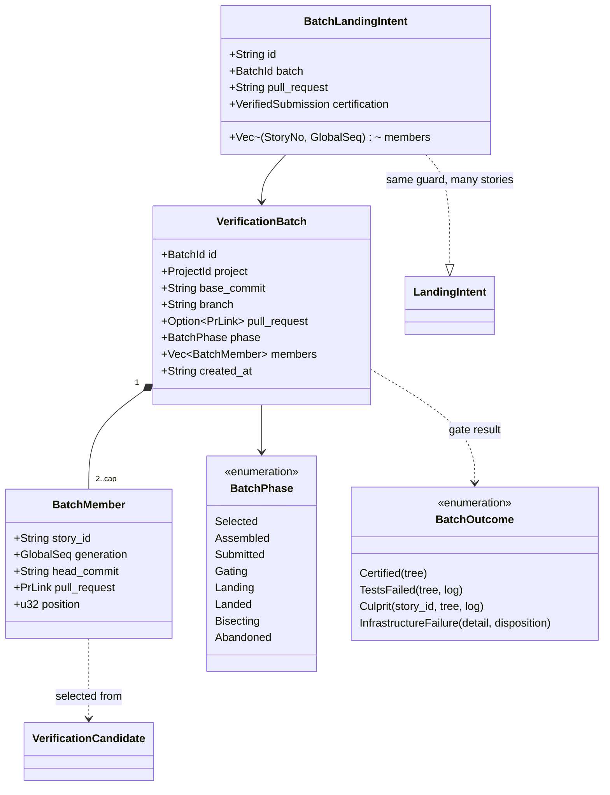

# Verification batching — SH-822 design of record

The design for verifying several submitted stories with one gate run. SH-822
delivers this document and the child stories that build it; no batching code
ships with SH-822 (council decision D1, recorded on SH-822). Read
`verification-workflow.md` first: it is the design of record for the
single-story verifier that this document extends, and nothing here changes it
until a child story lands and records what it built under "As built".

## The request

Stated by the operator on SH-822 (2026-09-26):

> When the verifier is ready to dequeue a story to run the merge gates, it
> should look at the next story to be verified and then sweep the entire
> verification queue for other stories whose code changes do not conflict
> with it. The verifier should then claim all of those stories simultaneously
> (web ui should indicate that a verification batch is running, and indicate
> which stories are involved) and merge their changes to a temporary
> merge-gate branch, smoothing over any non-code conflicts on its own (it may
> use a Verification Agent for help). This multi-story merge-gate branch is
> then subjected to the verification suite all at once, so that when it
> passes, that entire branch gets merged to dev and all associated stories
> move to Done together. If that branch's verification is red, it should use
> a script to backtrack and see which related story's code is the cause, use
> that story's agent to resolve the red, and then proceed.

Why: one gate is about 50 minutes here and the verifier is serial per
project, so it is the throughput ceiling (about 1.2 stories per hour). SH-826
and SH-827 were manual batches: they worked, but each needed an operator
session, semantic-conflict repairs (clean text merges that broke tests) and
read-only reviews by each member's agent, and SH-827 took about 38 hours from
merge to landing.

## What the single-story verifier assumes

Every one of these is a single-story invariant a batch must replace or wrap,
not bypass:

| Assumption | Where |
|---|---|
| One attempt owns one story | `ActiveVerification.story_id` (`src/daemon/verification.rs`); `VerificationActivity` asserts one slot per project |
| Landing is per story | `LandingIntent` (`src/store/landing.rs`), validated before every store commit; `landing_pending` on the candidate |
| One PR lands, and its landed tree must equal the certified tree | `scripts/land-pr.sh` (`gh pr merge --merge --match-head-commit`, then `actual_tree == STORYHOOK_CERTIFIED_MERGE_TREE`) |
| Completion writes one story | `VerificationQueue::complete_landing_guarded` (`src/service/landing.rs`): GREEN comment, `StoryPrMerged`, `done`, intent removed, one transaction |
| A PR merged outside the verifier is suspect | `pr_check` writes `CENTRAL VERIFICATION UNCERTIFIED MERGE —` for a verifying story whose PR GitHub marks merged (`src/service/pr_check.rs`) |
| Workspace locks, progress journals and repair admission are per story | `WorkspaceLock::acquire(checkout, story_id)`; `journal_path(env, candidate)`; `STORYHOOK_REPAIR_*` |
| Conflict detection is candidate against base only | `git merge-tree --write-tree` in `scripts/merge-preflight.sh`; `src/service/gate_snapshot.rs` repeats it in private object storage |

## Design positions

Each row is settled here or marked open for the child story that owns it; an
open row is decided by that child (council when two answers stay defensible).

| # | Position | Status |
|---|---|---|
| B1 | **Selection.** The head is the first runnable candidate in the existing order (`sort_candidates`). The rest of the runnable queue is swept in the same order. A candidate joins only when its trial merge onto base plus the members already accepted is clean. Trial merges run in private object storage (the `gate_snapshot.rs` pattern) and never touch a checkout. | settled |
| B2 | **Batch size cap = the project's live engine run `lanes`** (at least 1), the same bound as the verifying backlog (council D3): a deeper batch raises bisection cost faster than it raises throughput while the queue is bounded by that number anyway. | settled for child 1; revisit with child 1's measurements |
| B3 | **A candidate that cannot batch stays single.** A head that conflicts with base keeps today's conflict hold; a held, blocked, landing-pending, human-only or unsubmitted candidate is never a member. A batch of one is today's single-story path, unchanged. | settled |
| B4 | **The branch is assembled by merge commits.** `storyhook/verify-batch/<batch-id>` starts at the base the trial merges used; each member head is merged with `--no-ff` in queue order. No history is rewritten; each member's own commits stay reachable. | settled |
| B5 | **The batch lands through a batch PR.** `land-pr.sh` lands one PR and requires tree equality, so the certified tree must be the batch tree and the batch branch must be what lands. Member PRs stay open; GitHub marks each merged when the batch merge makes its head an ancestor of the base. | settled |
| B6 | **Members complete together, and first.** A durable `BatchLandingIntent` names every member before the merge. Completion writes, in one transaction, each member's GREEN comment (naming the batch and its PR), `StoryPrMerged` and `done`. `pr_check` treats a member of a landing batch as certified, never as UNCERTIFIED MERGE. Each member is then reaped by today's per-story reap. | settled |
| B7 | **Red is bisected.** On a red batch, split the members in queue order and gate the first half's merge tree (a tree already certified by a receipt needs no run). Recurse into the red half until one member remains; return it through today's `return_for_repair` with its own tree and log. The other members re-enter the queue at their existing age, or land as a smaller batch if bisection already certified their tree. Cost: at most `ceil(log2 k)` gates per culprit. | open (child 4): whether failing-test attribution may skip steps, and how two culprits are handled |
| B8 | **Non-code conflicts may be smoothed by the Verifier Agent.** v1 admits only clean trial merges (B1). Letting an agent author a resolution commit puts AI-authored changes in the certification path. | open (child 5, council) |
| B9 | **Status and dashboard.** `VerifierStatus.active` gains `batch: { id, head, members, phase }`; each member's per-story status is `running` with the batch id; the banner reads "Verification batch B running: SH-1, SH-2, SH-3". | settled |
| B10 | **Restart.** A batch record is durable. A daemon that restarts before landing abandons the batch (members keep their generations and re-enter the queue); with a `BatchLandingIntent` present it recovers the landing exactly as today's intent does. | settled |
| B11 | **Locks.** Member workspace locks are taken in story-id order, so two batches (in two projects' verifiers, or a batch and a manual action) cannot deadlock. | settled |

## Type proposal



`VerificationCandidate` stays single-story: every existing store write is per
story and guarded by its generation, and a member is still exactly one
candidate. A batch of one never creates a `VerificationBatch`.

```mermaid
stateDiagram-v2
    [*] --> Selected: head + clean trial merges
    Selected --> Assembled: merge commits on the batch branch
    Assembled --> Submitted: push, open the batch PR
    Submitted --> Gating: exact merge tree, gate
    Gating --> Landing: certified; BatchLandingIntent
    Landing --> Landed: land-pr.sh; members done together
    Gating --> Bisecting: red
    Bisecting --> Gating: a certified subset lands as a smaller batch
    Bisecting --> [*]: culprit returned; others re-queued
    Selected --> Abandoned: restart or a member changed
    Assembled --> Abandoned
    Submitted --> Abandoned
    Landed --> [*]
    Abandoned --> [*]
```

## Child stories

Filed as children of SH-822, ordered by `blocked-by`, each landing on its own:

1. **Shadow preview** (SH-830) — compute and publish the batch the verifier *would*
   form at each dequeue (B1, B2), with trial-merge conflicts, would-be sizes,
   gate duration, red rate and queue depth, without changing what the
   verifier does. It measures the throughput premise before any landing code
   changes (council D1).
2. **Assembly, submission and gate** (SH-831) — the durable `VerificationBatch`, the
   member locks (B11), the batch branch (B4), the batch PR (B5) and one gate
   on its tree; landing still refused.
3. **Landing and completion** (SH-832) — `BatchLandingIntent`, landing through
   `land-pr.sh`, members done together, `pr_check` reconciliation, per-member
   reap, restart recovery (B6, B10), status and dashboard (B9).
4. **Red bisection** (SH-833) — the bisection script and culprit return (B7).
5. **Non-code conflict smoothing** (SH-834) — the Verifier Agent resolves a batch's
   non-code conflicts, if its council admits AI-authored commits in the
   certification path (B8).

Related, separate: reclaiming a handed-off worktree's build products at
handoff (SH-835, a project hook; council D3), which bounds the disk each held story
costs whether or not batching lands.
